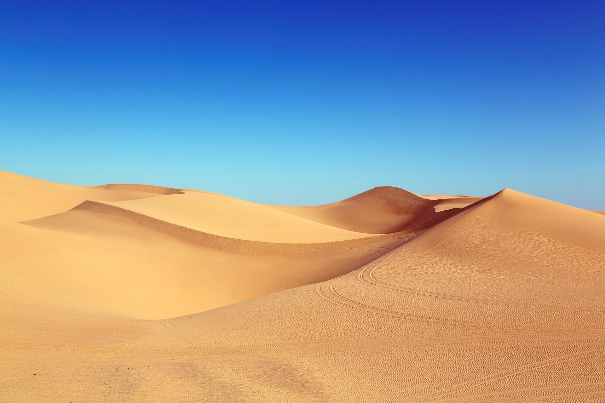

# 黄砂ってなんだろう　黄砂の正体と対策方法を解説

ニュースで、「黄砂が～」と聞くことがありますね。では、黄砂とは一体何者なのでしょうか。

下の画像がヒントです。

分かりましたか？正解は黄砂という名前にもあるとおり「砂」です。

中国などにある砂漠の砂が風で吹き上げられて飛んできたものです。日本では条件が揃えばいつでも観測されますが、とくに春に多く観測されます。

風で飛んできているので、当然日本に来る黄砂の量は風の状況に左右されます。また、砂漠で吹き上げられた砂のうち比較的大きな粒子のものはすぐに落ちてしまうため、日本に来るのは細かい粒子です。

粒子が細かいため、黄砂が太平洋を横断して北米まで飛んでいったこともあるそうです。

ここまで聞くと、黄砂について「ただの砂ならあまり騒ぐ必要もないのでは」と考えるかもしれません。しかし、黄砂には空気中の有害物質がくっついていることがあります。

そもそも日本まで飛んでくるのは細かい粒子ですから、できるだけ吸う量は少ないほうがいいですね。

## 対策

黄砂の対策は、やはり花粉と同じく家へ持ち込まないようにするのがいいでしょう。他には、マスクをするとか空気清浄機を回すとかでしょうか。

また、黄砂の飛来状況は[気象庁の「黄砂情報」](https://www.data.jma.go.jp/gmd/env/kosa/fcst/)で見ることができるので、ヤバそうな日はあまり窓を開けないようにするのがいいのではないでしょうか。

ということで、以上、黄砂の正体と対策方法についてでした。最後までお読みいただき、ありがとうございました。

## 参考

- [気象庁ホームページ「黄砂に関する基礎知識」 (https://www.data.jma.go.jp/gmd/env/kosahp/4-4kosa.html)](https://www.data.jma.go.jp/gmd/env/kosahp/4-4kosa.html)・[「黄砂・酸性雨について」(https://www.jma.go.jp/jma/kishou/know/faq/faq20.html)](https://www.jma.go.jp/jma/kishou/know/faq/faq20.html)をもとに作成しました
