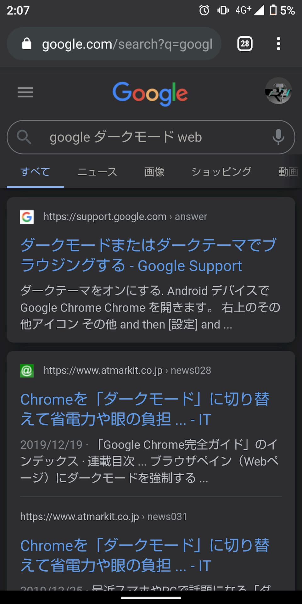
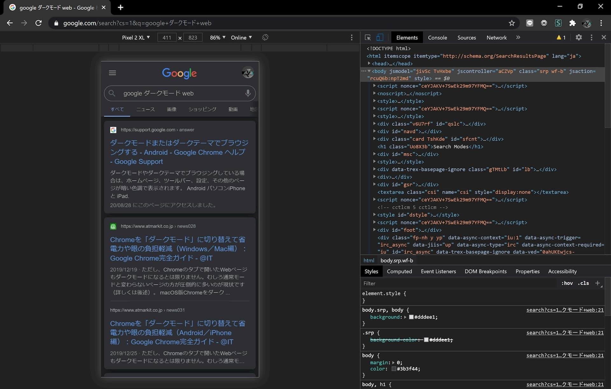

# 「Web版」のGoogleがダークモードに対応！

<info-block>
    記事の投稿後、詳細を調査したところダークモードは以前から一部のユーザーに試験的に展開されており、それが私のところまでロールアウトされただけだということが判明しました。
</info-block>

今日の午前2時すぎ、Android10のスマホでGoogle Chromeを使用してWeb版のGoogleで検索をしていたところ、ダークモード対応したことに気が付きました。

以前からスマホのアプリ版ではダークモードに対応していましたが、今回対応したのはWeb版です。また、Web版でも、PC用サイトではダークモードにはなりません。

PCでURLの末尾に「&cs=1」を追加し、かつデベロッパーツールでスマホ用表示にするとPCでもダークモードになります。

また、スマホの場合でもGoogle Chromeの設定がダークモードでなければ通常の配色で表示されます。これらのことから、Web版のGoogleがダークモードになる条件は

- スマホ用表示であること
- URLパラメーターでcs=1が指定されていること
- ブラウザーがダークモードに設定されていること

だと思われます。

なお、日本時間の2020年8月29日午前3時現在、Twitterではこのことについて報告しているユーザーは日本国内外で私のみでした。そのため、ダークモードに正式に対応したのか、それともテスト中なのかは不明です。

## 2020年8月29日13:20　追記

ブラウザーをシークレットモードに設定してもダークモードになることが確認できました。

複数のデバイスで検証しているわけではないので断定はできませんが、報告しているユーザーがいないのはテストだからではなく、スマホでWeb版Googleを使用しているユーザーが少ないからの可能性が高いです。
