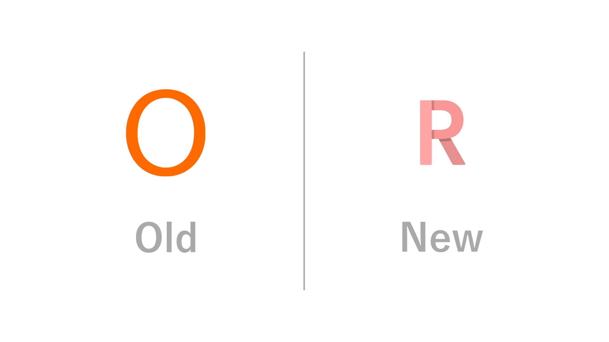
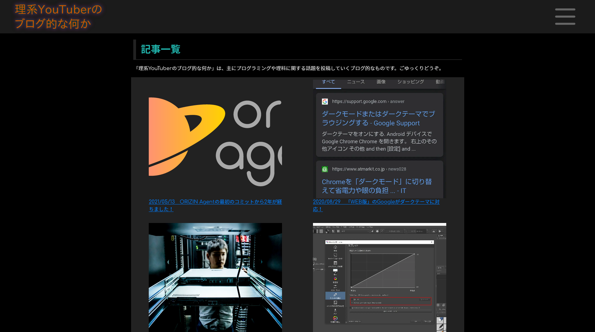
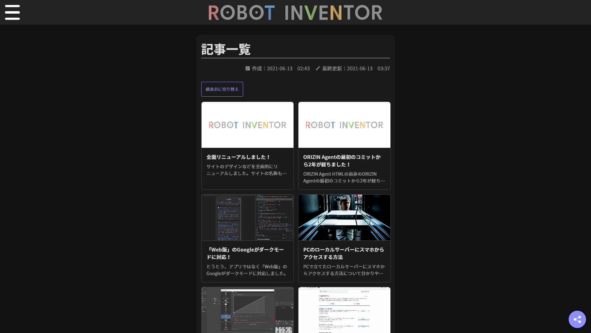
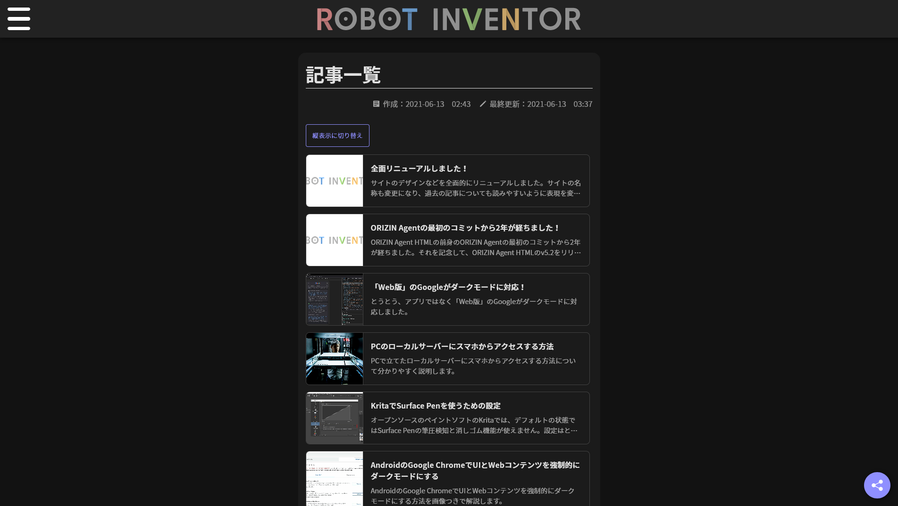
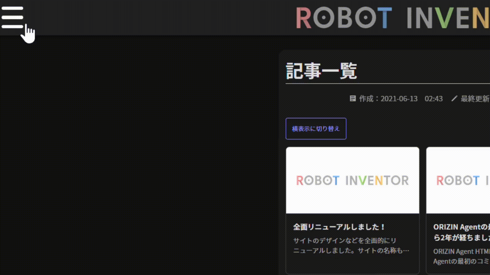
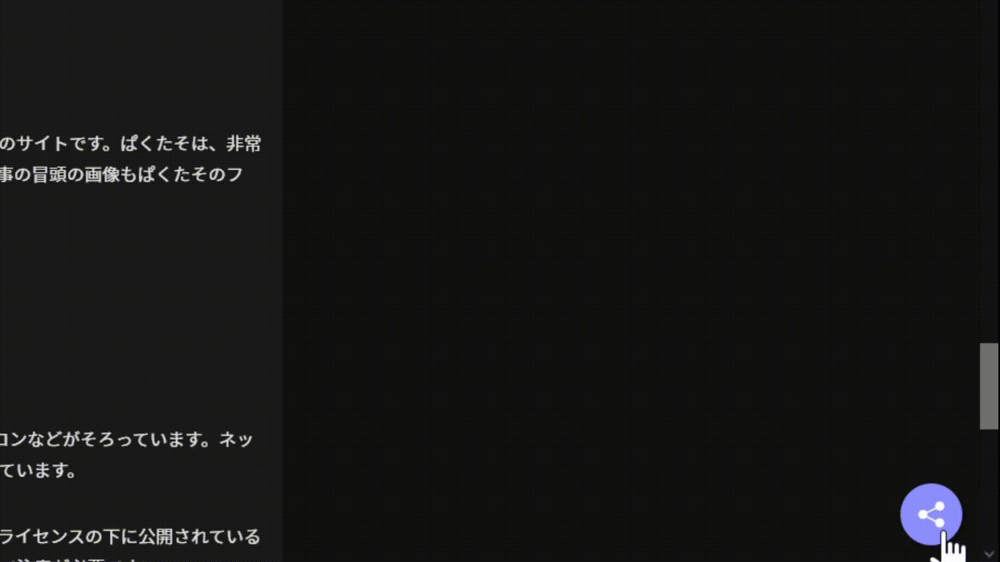
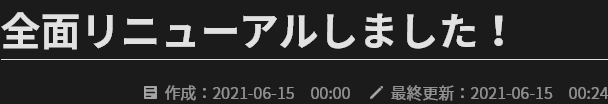

# 全面リニューアルしました！

本日より、当サイトのリニューアル版が利用可能になりました。どのような点が変わったのか、説明します。

## サイト名を変更

今まで、サイト名は「理系YouTuberのブログ的な何か」でした。今回のリニューアルに伴い、サイト名は「Robot Inventor　ブログ」に変更されました。

今までのサイト名は「ロボット INVENTOR」が運営しているということが分かりにくかったため、変更することとなりました。

また、これに伴い、サイトのロゴとfaviconもリニューアルされました。

## デザインを変更

今回のリニューアルの中で、一番分かりやすいのはこれでしょう。サイトのデザインが全面的に変更されました。

次の画像は、記事一覧ページの新旧デザインのスクリーンショットです。

スッキリして見やすくなっています。

また、記事一覧ページは2つの表示をボタンで切り替えられるようになっています。

さらに、新たに追加されたメニューボタンにはアニメーションを追加しました。

画面右下には共有ボタンを追加し、気軽にページを共有できるようにしました。ブラウザーがWeb Share APIに対応している場合は、共有メニューに項目が追加され、ネイティブの共有メカニズムを利用できます。

## 記事の投稿日、更新日が表示されるように

今まではタイトル内に投稿日を記述していましたが、これからは画像のように、タイトルの下に投稿日と更新日が表示されるようになりました。

## 読み込み速度を高速化

さまざまな方法で全体的なファイルサイズを削減し、読み込みが今まで以上に高速化されました。

たとえば、画像は次の4種類を用意し、その中から最適な画像をブラウザーが判断して読み込む仕組みになっています。

- WebP形式の1920p
- WebP形式の960p
- WebP形式の480p
- AVIF形式の1920p
- AVIF形式の960p
- AVIF形式の480p

また、比較的ファイルサイズの大きい、サイトのロゴと共有ボタンはある程度画面をスクロールすることで読み込まれるようにし読み込み時間がさらに短縮されています。

実際にページを読み込む際に転送されるファイルサイズを比較してみましょう。当サイトで人気ベスト2の記事で比較してみます。

比較の際は、キャッシュを無効化し、一切スクロールをしない状態で読み込みが完了するまでに転送されたファイルサイズを調べます。小数点以下は四捨五入しています。

また、ブラウザーはGoogle Chrome 91とFirefox 89を使用しました。

1つ目はこちらの記事。

<article-card link="/article/2020/05/14" thumbnail="/article/2020/05/14/flags_page.jpg" article-title="AndroidのGoogle ChromeでUIとWebコンテンツを強制的にダークモードにする" description="AndroidのGoogle ChromeでUIとWebコンテンツを強制的にダークモードにする方法を画像つきで解説します。" card-type="landscape"></article-card>

|ブラウザー|リニューアル前|リニューアル後|リニューアル後 / リニューアル前|
|--:|--:|--:|--:|
|Google Chrome|213KB|91KB|0.43|
|Firefox|398KB|40KB|0.10|

続いて、2つ目の記事です。

<article-card link="/article/2019-07-30-YouTubeにオススメのフリー素材・フォント/" thumbnail="/article/2019-07-30-YouTubeにオススメのフリー素材・フォント/KENTA039_jidoricamera_TP_V.jpg" article-title="YouTubeにオススメのフリーの画像・音楽・フォント" description="動画はもちろん、発表のスライドやポスターなどでは、フリー素材が重宝します。今回は、フリーの画像・音楽・効果音・フォントでオススメのものを紹介します。" card-type="landscape"></article-card>

|ブラウザー|リニューアル前|リニューアル後|リニューアル後 / リニューアル前|
|--:|--:|--:|--:|
|Google Chrome|351KB|65KB|0.19|
|Firefox|622KB|107KB|0.17|

このように、非常にファイルサイズが小さくなっていることが分かります。

AVIFサポートの有無や遅延読み込みをブラウザーがどう扱うかによって転送量に差が出るため、リニューアル後の転送量はGoogle Chromeの方が少なかったりFirefoxの方が少なかったりします。

ファイルサイズが削減されたことで、読み込み時間が改善されました。

複数の画像を用意するほか、記事中にコードブロックがある場合のみ、ハイライト用のCSSとWebフォントを読み込むようにしたり、CSSを遅延読み込みするようにしたりしています。

また、更新作業の効率化のために一部の要素に導入したWeb Componentは必要な場合のみ必要な定義ファイルを読み込むことで、転送量を削減しています。

AMPサポートについては、リニューアルに伴い終了することとなりました。今まではAMP HTMLを使用して読み込みを高速化していました。しかし、ファイルサイズを削減していく過程でAMPのスクリプトのファイルサイズが比較的大きいということが判明したため、AMPサポートを終了しました。

## Markdownベースに変更

今までは記事を作成する際、HTMLを手作業で書いていました。しかしながら、この方法は効率が悪いだけでなく、管理しにくいという欠点がありました。

そこで、記事をMarkdownベースに変更しました。これにより、記事を書く際の効率が上がり、更新頻度を上げやすくなりました。

管理のしやすさの観点から、今まではHTMLファイルをMinify化できませんでした。しかし、Markdownベースになったことで人間が直接HTMLファイルを触る必要がなくなり、Minify化できるようになりました。この点でも、ファイルサイズが削減されています。

## 作業の自動化

MarkdownからHTMLに変換する作業をコマンド1つで行えるようになりました。

前述のように複数の画像を用意していますが、それらの画像も自動で用意されるため、人間が1枚1枚用意する必要はありません。

## その他

- 一部の誤解を招く可能性のある記事を削除しました
- 多くの記事で文章を見直し、より読みやすく分かりやすい文章にしました
- [利用規約](/tos/)と[プライバシーポリシー](/privacy/)を更新しました。必ずご確認ください

<!-- TODO:最終更新日を書き換える必要がある -->

<!-- TODO:公開前に、todo.txtの内容を消化する -->
