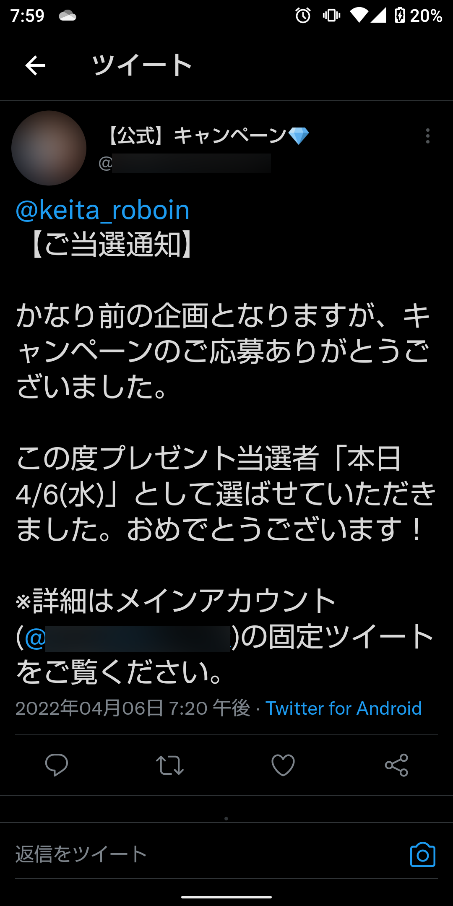
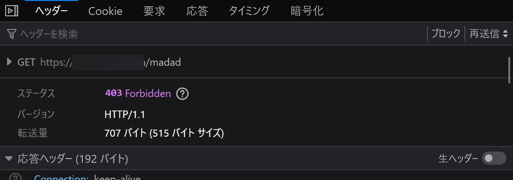

# 応募した記憶のない謎のキャンペーンに当選した話

始まりはこのツイート。何かのキャンペーンに当選したらしい。

※怖い人が家に来たら困るので、一部にぼかしをかけています。アイコンはギフトカードの束の画像。



さて、この画像には、いくつかの不審な点があります。

1. 「【公式】キャンペーン」と書いてあるが、何のキャンペーンか書かれておらず、具体性がない
2. 別のアカウントに誘導している

1については、企業がキャンペーンを実施する場合、その企業のアカウントで実施することが多い印象を受けます。わざわざキャンペーンのためにアカウントを作ったのでしょうか。

2については、垢BAN対策と考えられます。しかも、そもそも私は「キャンペーン」に応募した記憶がありません。

しかし、もしかしたら無意識に応募したのかもしれません。指定されたアカウントの固定ツイートを見てみます。


ギフトコード1万円分または豪華特賞がもらえるアンケートへのリンクが貼られています。

さて、ここで疑問が増えました。ここまで、すべて誰でも見られるツイートです。つまり、「当選」した人でなくてもアンケートにたどり着けるということです。当選って何でしたっけ？

ツイートの詳細を見てみると、150件の引用リツイートがあります。また、リプライが制限されています。なぜ制限しているのでしょう？


不思議ですが、いったん引用リツイートを見てみましょう。


どうしてでしょう。引用リツイートが150件あるはずなのに、1件も表示されません。これはつまり、引用リツイートしたアカウントが鍵垢だったか、「キャンペーン」のアカウントにブロックされていることを示唆しています。

まさか150個もの鍵垢に引用リツイートされるなんてことはありませんよね？ますます怪しい。

でも、まだ分かりません。うっかりしてしまっただけで、本当にギフトがもらえるかもしれません。アンケートを開いてみます。

と、その前に、念のためウイルススキャンをかけます。

Twitterでは、ツイートに含まれるリンクがTwitterの独自の短縮URLに置き換えられています。ブラウザーのアドレスバーに次のような形式で入力することで、転送先を調べられます。

```
view-source:短縮URL
```

ごちゃごちゃとした文字列が表示されます。``URL=``のあとの部分（モザイクがかかっている部分）が転送先のURLです。「″」は含めません。


この転送先のURLを[VirusTotal](https://www.virustotal.com/gui/home/url)で調べてみます。


既知のマルウェア（コンピューターウイルス）は検出されませんでした。

次に、[Googleセーフブラウジング](https://transparencyreport.google.com/safe-browsing/search?hl=ja)でも調べてみます。


データがないそうです。既知の詐欺サイトでもなさそう。

ということで、アンケートのURLを開いてみます。アクセス元が分からないようにVPNを使用し、念のためJavaScriptをオフにしてアクセスしてみます。


最近のサイトにしてはシンプルなつくり。

フッターを見ると「Copyright 2022 キャンペーン運営事務局」となっています。相変わらず具体性がなく、何のキャンペーンか分かりませんね。

「まもなく締め切り」だそうです。急がなきゃ！！！とここで残念なお知らせ。アンケートに答えるにはLINEで友達追加しなければならないようです。

でも、私は知り合いしかLINEに追加しないんですよね。

ちなみに、トップページは[404 Not Found](https://developer.mozilla.org/ja/docs/Web/HTTP/Status/404)を返します。


では、サイトの運営者に直接連絡を試みてみましょう！

whoisコマンドでドメインを調べます。


うーん、Whois情報公開代行を使っていますね。登録者が誰なのか分かりません。これでは連絡を取れませんね。

## 詐欺サイトとして報告する

ここまで読んだ皆さんは分かると思いますが、これは明らかな詐欺です。Firefoxのメニュー→［ヘルプ］→［詐欺サイトを報告(<u>D</u>)...］から、詐欺サイトとして報告しました。


また、先ほどwhoisで調べた際に「Registrar URL」が「お名前.com」のものになっていたので、[不正利用の報告](https://www.onamae.com/abuse/)から報告しておきます。問題のツイートについては、[魚拓](https://megalodon.jp/)のURLも添付しておきました。

さて、この詐欺サイトはどうなるのか。進展があれば、記事を更新する予定です。

## 更新（2022/04/07）

記事を書いていたら、当選を知らせてくれたアカウントが消えていました。「凍結」とは表示されていないので、アカウントの所有者が自ら消したのでしょう。


また、アンケートサイトへのリンクがあったアカウントは、名前を変えて鍵垢になっていました。


そして、アンケートサイトも閲覧できなくなっています。


[403 Forbidden](https://developer.mozilla.org/ja/docs/Web/HTTP/Status/403)を返しています。



ドメイン登録業者に停止されたか、詐欺師が逃げた（あるいは目立ちすぎないように「休暇」に入った）のでしょう。関連するアカウントに変化があり、トップページの404表示はそのまま。さらに、[favicon](https://developer.mozilla.org/ja/docs/Glossary/Favicon)も生きていることから、おそらく後者の可能性が高そうです。

## 更新（2022/04/07 17:09）

リンクを貼っていたアカウントと、アンケートサイトが復活していました。周期的に「休暇」「復活」を繰り返している可能性があります。

なお、当選通知をツイートしていたアカウントは削除されたままです。

## 更新（2022/04/07 17:25）

フィッシング対策協議会の[報告フォーム](https://www.antiphishing.jp/registration.html)にも送信しました。また、問題のTwitterアカウントをTwitterに[報告](https://help.twitter.com/ja/rules-and-policies/financial-scam#:~:text=%E3%81%93%E3%81%AE%E3%83%9B%E3%82%9A%E3%83%AA%E3%82%B7%E3%83%BC%E3%81%AE%E9%81%95%E5%8F%8D%E3%82%92%E5%A0%B1%E5%91%8A%E3%81%99%E3%82%8B%E3%81%AB%E3%81%AF%E3%81%A8%E3%82%99%E3%81%86%E3%81%99%E3%82%8C%E3%81%AF%E3%82%99%E3%82%88%E3%81%84%E3%81%A6%E3%82%99%E3%81%99%E3%81%8B%3F)しました。

## まとめ

次のような「当選通知」には注意しましょう。

- 応募した記憶がない
- 「かなり前の企画」と書かれている（応募した記憶がないことを誤魔化すため）
- キャンペーンについて、具体性がない
- 別のアカウントに誘導される（垢BAN対策）
- 「キャンペーン」に当選したと書かれているのに、誰でも閲覧できる場所にURLが貼られている（「当選」の意味がない）
- リプライが制限されている（詐欺だと指摘できないようにするため）
- 大量の引用リツイートが存在しているはずなのに、表示できない（詐欺だと指摘したカウントをブロックしている可能性がある）
- 「まもなく締め切り」「お急ぎください！」など、焦らせるような文章がある（判断を誤らせるため）
- サイトのフッターやアカウント名から、運営者が誰なのか分からない。または具体性がない
  - 運営者が書かれている場合でも、その運営者について十分に調査しましょう
- LINEの友達追加を求められる

----------

以上、「応募した記憶のない謎のキャンペーンに当選した話」でした。応募した記憶のないキャンペーンに当選したと連絡が来たら、詐欺ではないかと疑うようにしましょう。
