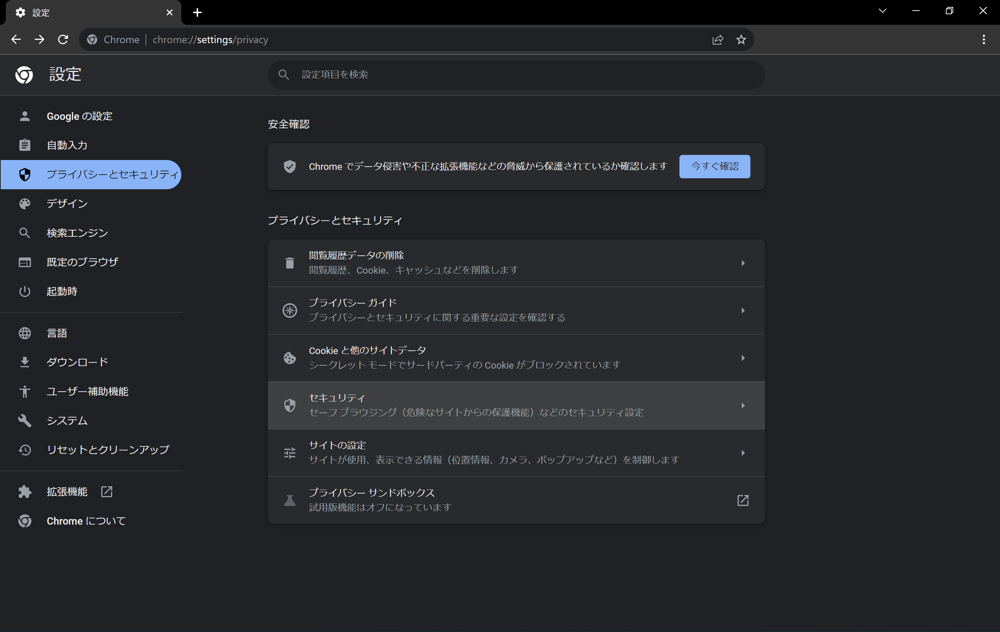
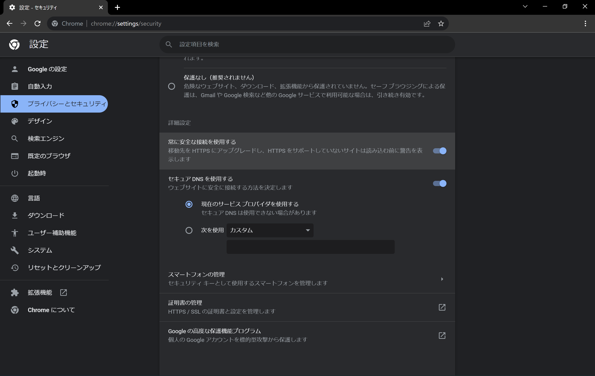
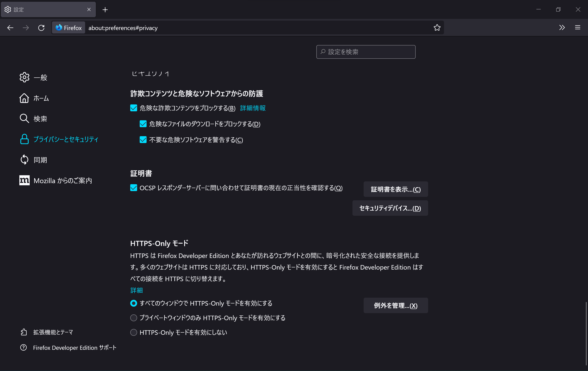

# HTTPS Everywhereが2023年に廃止　ブラウザー標準の機能に移行しよう

[https://www.eff.org/https-everywhere](https://www.eff.org/https-everywhere)

## この記事の要約

- 通信を暗号化してセキュリティーを高めてくれる人気のブラウザー拡張機能「HTTPS Everywhere」が2023年1月に廃止されます
- HTTPS Everywhereは2021年末からすでに「メンテナンスモード」に移行しており、積極的な更新はされていません
- 今後、HTTPS Everywhereは非推奨となり、ブラウザーの標準機能を使うことが推奨されます

## HTTPS Everywhereとは何か

[HTTPS Everywhere](https://www.eff.org/https-everywhere)は、[電子フロンティア財団](https://www.eff.org/)（EFF）が提供しているブラウザー拡張機能で、次のように主要なほぼすべてのブラウザーに対応しています。

- Google Chrome
- Microsoft Edge
- Mozilla Firefox
- Safari
- Brave
- Opera
- Tor Browser

普段使っているWebブラウザーにHTTPS Everywhereをインストールすることで、多くの通信をHTTPから暗号化された安全な[HTTPS](https://developer.mozilla.org/ja/docs/Glossary/https)に自動変換（転送）できます。これにより、セキュリティーが高まり、Webサイトとの通信を第三者に盗み見られる可能性を減らせます。

通信を第三者に盗み見られないようにすることは、セキュリティーだけでなくプライバシーの保護にも貢献します。そのため、多くの記事でHTTPS Everywhereはブラウザーにインストールするべき拡張機能として紹介されています。

## HTTPS Everywhereの現状と今後

HTTPS Everywhereは非常に人気な拡張機能ですが、2021年末からすでに「メンテナンスモード」に[移行しています](https://www.eff.org/deeplinks/2021/09/https-actually-everywhere)。これはつまり、バグや脆弱性が修正されることはあっても今後新機能が追加されることはなく、積極的な開発が行われていないことを示しています。

また、HTTPS Everywhereは2023年1月をもって廃止されることが[発表](https://www.eff.org/ja/https-everywhere/set-https-default-your-browser#:~:text=HTTPS%20Everywhere%20will%20sunset%20in%20January%202023)されています。今後、HTTPS Everywhereをインストールすることは**推奨されません**。

この動きは、主要なすべてのWebブラウザーが、通信をHTTPSにアップグレードする機能を標準搭載したことが理由です。HTTPS Everywhereと同様の機能がブラウザーに標準搭載された今、もはやHTTPS Everywhereの存在意義は失われました。

EFFはHTTPS Everywhereのメンテナンスモードへの移行の発表の中で、次のように述べています。

> HTTPS Everywhereの提供を開始して以来、Webを暗号化するための戦いは飛躍的な進歩を遂げました。かつては挑戦的な技術的議論であったものが、現在ではほとんどのWebページで提供される主流の標準となっています。 現在、HTTPSは、Let’s Encryptのような組織の取り組みのおかげで、本当にどこにでもあります。
>
> — [HTTPS Is Actually Everywhere | Electronic Frontier Foundation](https://www.eff.org/deeplinks/2021/09/https-actually-everywhere)

## これからどうすればよいか

HTTPS Everywhereの代わりに、今後はブラウザーに標準搭載されている機能を使いましょう。

ここからは、各ブラウザーでの設定方法について説明します。

:::note info
設定方法や画面は、OSやブラウザーのバージョンによって異なる可能性があります。ここでは、Windows 11とChrome 104.0.5112.81、Firefox 104.0b9を使用しています。
:::

### Google ChromeとMicrosoft Edge

1. 設定を開く
2. ［プライバシーとセキュリティ］セクションに移動
3. ［セキュリティ］をクリック
4. 一番下までスクロールして［常に安全な接続を使用する］を有効化

詳細：[Chrome の安全性とセキュリティを管理する - パソコン - Google Chrome ヘルプ](https://support.google.com/chrome/answer/10468685?hl=ja&co=GENIE.Platform%3DDesktop)

### Mozilla Firefox

1. 設定を開く
2. ［プライバシーとセキュリティ］セクションに移動
3. 1番下までスクロールして［HTTPS-Only モード］を有効化

※［すべてのウィンドウで HTTPS-Only モードを有効にする］［プライベートウィンドウのみ HTTPS-Only モードを有効にする］の2つがありますが、前者がオススメです。

詳細：[Firefox の HTTPS-Only モード | Firefox ヘルプ](https://support.mozilla.org/ja/kb/https-only-prefs)

### Safari

デフォルトで有効なため、設定は必要ありません。

## まとめ

この記事では、HTTPS Everywhereが廃止されること、そして現在では同様の機能がブラウザーに標準で搭載されていることについて説明しました。

HTTPS Everywhereが非常に人気な拡張機能であるにもかかわらず、廃止や非推奨化についての日本語記事がほとんど見つからなかったためこの記事を書きました。

HTTPS Everywhereの現在のメンテナンスモードは、ユーザーのための「移行期間」です。正式に廃止される2023年1月以降は、重大なバグや脆弱性が見つかっても**修正されない可能性があります**。セキュリティーの向上のためにインストールしていた拡張機能が、セキュリティー上の弱点になってしまうかもしれません。

2023年1月よりも前に**必ず**HTTPS Everywhereをアンインストールし、ブラウザー標準搭載の機能に乗り換えるようにしてください。
