# Android 13であまり注目されていない13個の新機能・変更点

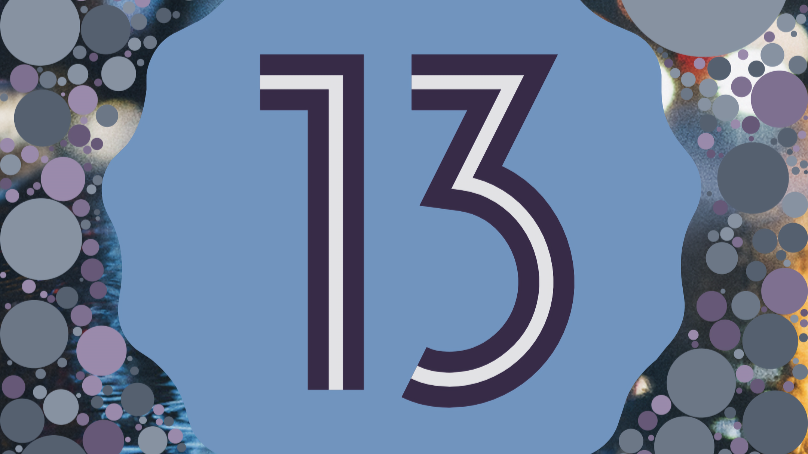

日本時間の2022年8月16日、Android 13が正式リリースされました。この記事では、他の記事であまり注目されていないAndroid 13の新機能や変更点を13個紹介します。

この記事は、次の環境で検証しています。

- 機種：Google Pixel 6
- OS：Android 13
- ビルド番号：TP1A.220624.021

## 目次

- [Android 13であまり注目されていない13個の新機能・変更点](#android-13であまり注目されていない13個の新機能変更点)
  - [目次](#目次)
  - [1. ナビゲーションバーのデザイン変更](#1-ナビゲーションバーのデザイン変更)
  - [2. スクリーンショットの無音化](#2-スクリーンショットの無音化)
  - [3. 通知ドロワーの配置変更](#3-通知ドロワーの配置変更)
  - [4. 予測型「戻る」ジェスチャーナビゲーション](#4-予測型戻るジェスチャーナビゲーション)
  - [5. ダイナミックカラーの強化](#5-ダイナミックカラーの強化)
  - [6. アプリが許可を求めるダイアログのデザインが変更](#6-アプリが許可を求めるダイアログのデザインが変更)
  - [7. Pixel標準のランチャーでアプリの検索性が向上](#7-pixel標準のランチャーでアプリの検索性が向上)
  - [8. 画面変遷のアニメーションの改善](#8-画面変遷のアニメーションの改善)
  - [9. タスクバーの追加](#9-タスクバーの追加)
  - [10. バックグラウンド実行中のアプリの表示と停止](#10-バックグラウンド実行中のアプリの表示と停止)
  - [11. スクリーンレコードにタップの記録が復活](#11-スクリーンレコードにタップの記録が復活)
  - [12. クイック設定パネルに［QRコードのスキャン］を追加可能に](#12-クイック設定パネルにqrコードのスキャンを追加可能に)
  - [13. 通知を長押しで画面分割できるように](#13-通知を長押しで画面分割できるように)
  - [まとめ](#まとめ)
  - [おまけ（Androidベータプログラムについて）](#おまけandroidベータプログラムについて)

## 1. ナビゲーションバーのデザイン変更

Androidでは、Android 10からジェスチャーナビゲーションと呼ばれる機能が搭載されています。この機能は従来の3つのボタンでスマホを操作するのではなく、画面下部に表示されるナビゲーションバーといくつかのジェスチャーでスマホを操作します。

Android 13では、このナビゲーションバーがAndroid 12と比べて太く長くなっています。機能的には一切変わっていませんが、見た目がよりiPhoneに近くなりました。

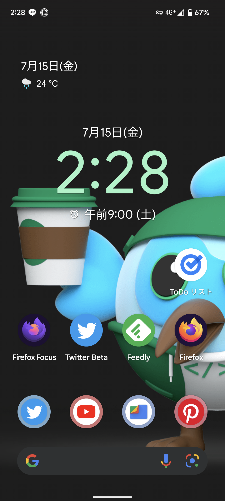
*Android 12のナビゲーションバー*

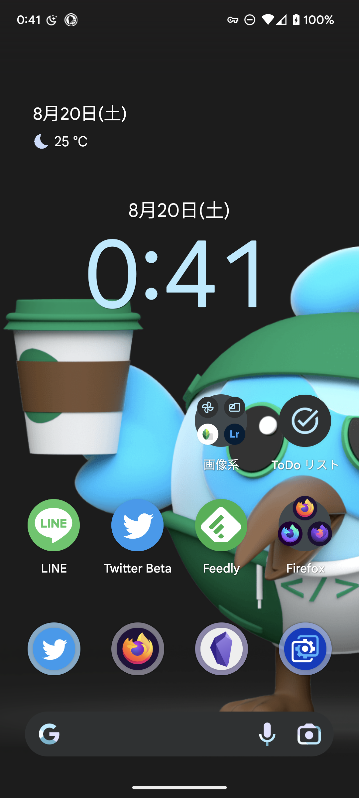
*Android 13のナビゲーションバー。Android 12と比べて太く長くなっている。*

## 2. スクリーンショットの無音化

今まで一部の国で発売されている一部の機種では、スクリーンショットを撮影する際の[音を消せませんでした](https://www.reddit.com/r/android_beta/comments/pfefo2/no_option_to_disable_screenshot_sound/)。

しかし、Android 13ではサイレントモードの場合に、スクリーンショットの音が鳴らなくなりました。また、サイレントモードではない場合も、スクリーンショットの音が以前と比べて小さくなっています。

## 3. 通知ドロワーの配置変更

通知ドロワーにおいて、設定ボタンや電源ボタンが画面下部に移動しました。これにより、指を上まで伸ばさなくても設定を開いたり、シャットダウンしたりできるようになります。

ただし、Android 12と比べてボタンの幅が狭くなっているため誤操作の可能性は上がっています。

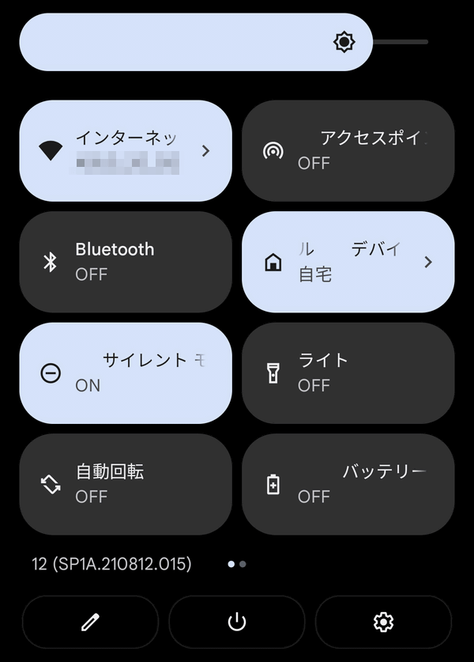
*Android 12の通知ドロワーのスクリーンショット。クイック設定パネルのすぐ下に電源ボタンや設定ボタンが配置されている。 
出典：[Android 12をPixelにインストールして触ってみたレビュー - GIGAZINE](https://gigazine.net/news/20211020-android-12-pixel-review/)より*

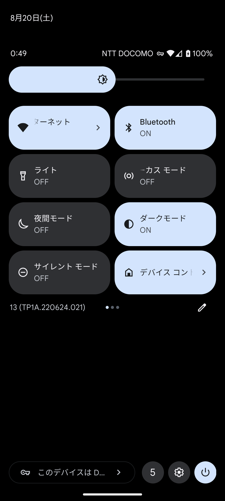
*Android 13では一部のボタンが画面下部に移動している。*

## 4. 予測型「戻る」ジェスチャーナビゲーション

これは、開発者向けオプションに追加された設定項目です。開発者向けオプションは初期状態では表示されず、いくつかの手順を踏むことで設定アプリに表示されるようになる、特殊な設定です。主に実装中の機能やアプリ開発者などが利用するための設定なので、動作が安定しなかったり、深刻なバグが発生したりする可能性があります。

さて、そんな開発者向けオプションに「予測型『戻る』ジェスチャーナビゲーション」が追加されました。この設定を有効にすると、「戻る」ジェスチャーをした際にどんな画面に戻るのか、うしろにプレビューが表示されるようになります。

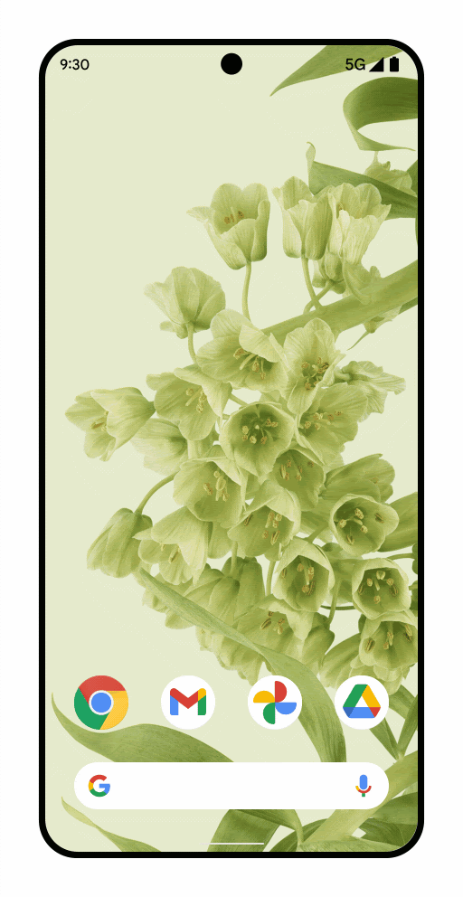
*「予測型『戻る』ジェスチャーナビゲーション」のイメージ。 
出典：[将来の予測型「戻る」ジェスチャー ナビゲーションをサポートするようにアプリを更新します](https://codelabs.developers.google.com/handling-gesture-back-navigation?hl=ja)より*

ただし、この機能はアプリ側での対応が必要です。私は現時点で対応しているアプリを見つけられませんでした。

「予測型『戻る』ジェスチャーナビゲーション」をサポートするために、Android 13では新たなAPIが[実装](https://codelabs.developers.google.com/handling-gesture-back-navigation?hl=ja#:~:text=android%2013%20%E3%81%A6%E3%82%99%E3%81%AF%E3%80%81%E4%BA%88%E6%B8%AC%E5%9E%8B%E3%80%8C%E6%88%BB%E3%82%8B%E3%80%8D%E3%82%B7%E3%82%99%E3%82%A7%E3%82%B9%E3%83%81%E3%83%A3%E3%83%BC%E3%82%92%E3%82%B5%E3%83%9B%E3%82%9A%E3%83%BC%E3%83%88%E3%81%99%E3%82%8B%E3%81%9F%E3%82%81%E3%81%AB%E3%80%81%E6%96%B0%E3%81%97%E3%81%84%E3%82%A6%E3%82%A3%E3%83%B3%E3%83%88%E3%82%99%E3%82%A6%20%E3%83%AC%E3%83%98%E3%82%99%E3%83%AB%E3%81%AE%20onbackinvokedcallback%20%E3%83%95%E3%82%9A%E3%83%A9%E3%83%83%E3%83%88%E3%83%95%E3%82%A9%E3%83%BC%E3%83%A0%20api%20%E3%81%8B%E3%82%99%E8%BF%BD%E5%8A%A0%E3%81%95%E3%82%8C%E3%81%BE%E3%81%97%E3%81%9F%E3%80%82%E3%81%93%E3%81%AE%20api%20%E3%81%AF%E3%80%81keyevent.keycode_back%20api%20%E3%81%A8%E3%80%81onbackpressed%20%E3%82%92%E4%BD%BF%E7%94%A8%E3%81%99%E3%82%8B%E3%81%99%E3%81%B8%E3%82%99%E3%81%A6%E3%81%AE%E3%83%95%E3%82%9A%E3%83%A9%E3%83%83%E3%83%88%E3%83%95%E3%82%A9%E3%83%BC%E3%83%A0%20%E3%82%AF%E3%83%A9%E3%82%B9(%E3%81%93%E3%82%8C%E3%82%89%E3%81%AF%E9%9D%9E%E6%8E%A8%E5%A5%A8%E3%81%AB%E3%81%AA%E3%82%8B%E4%BA%88%E5%AE%9A%E3%81%A6%E3%82%99%E3%80%81android%2013%20%E3%81%AE%E6%AC%A1%E3%81%AE%E3%83%A1%E3%82%B7%E3%82%99%E3%83%A3%E3%83%BC%20%E3%83%AA%E3%83%AA%E3%83%BC%E3%82%B9%E3%81%A6%E3%82%99%E7%A7%BB%E8%A1%8C%E3%81%8B%E3%82%99%E5%BF%85%E8%A6%81%E3%81%AB%E3%81%AA%E3%82%8A%E3%81%BE%E3%81%99)%E3%81%AB%E4%BB%A3%E3%82%8F%E3%82%8B%E3%82%82%E3%81%AE%E3%81%A6%E3%82%99%E3%81%99%E3%80%82%E8%A9%B3%E3%81%97%E3%81%8F%E3%81%AF%E3%80%81google%20%E3%81%AE%E3%83%88%E3%82%99%E3%82%AD%E3%83%A5%E3%83%A1%E3%83%B3%E3%83%88%E3%82%92%E3%81%93%E3%82%99%E8%A6%A7%E3%81%8F%E3%81%9F%E3%82%99%E3%81%95%E3%81%84%E3%80%82)されています。このAPIは従来のAPIを置き換えるものです。

Android 14までに新しいAPIに対応しないとアプリの「戻る」ナビゲーションを[正常に実行できなくなる](https://developer.android.com/about/versions/13/features/predictive-back-gesture?&hl=ja#:~:text=android%2013%20%E3%81%AE%E6%AC%A1%E3%81%AE%E3%83%A1%E3%82%B7%E3%82%99%E3%83%A3%E3%83%BC%20%E3%83%8F%E3%82%99%E3%83%BC%E3%82%B7%E3%82%99%E3%83%A7%E3%83%B3%E3%81%BE%E3%81%A6%E3%82%99%E3%81%AB%E3%82%A2%E3%83%95%E3%82%9A%E3%83%AA%E3%82%92%E6%9B%B4%E6%96%B0%E3%81%97%E3%81%AA%E3%81%84%E3%81%A8%E3%80%81%E3%83%A6%E3%83%BC%E3%82%B5%E3%82%99%E3%83%BC%E3%81%8B%E3%82%99%E3%82%A2%E3%83%95%E3%82%9A%E3%83%AA%E3%81%A6%E3%82%99%E3%80%8C%E6%88%BB%E3%82%8B%E3%80%8D%E3%83%8A%E3%83%92%E3%82%99%E3%82%B1%E3%82%99%E3%83%BC%E3%82%B7%E3%83%A7%E3%83%B3%E3%82%92%E6%AD%A3%E5%B8%B8%E3%81%AB%E5%AE%9F%E8%A1%8C%E3%81%A6%E3%82%99%E3%81%8D%E3%81%AA%E3%81%8F%E3%81%AA%E3%82%8A%E3%81%BE%E3%81%99%E3%80%82)ことから、今後徐々に「予測型『戻る』ジェスチャーナビゲーション」に対応するアプリが増えていくと思われます。

## 5. ダイナミックカラーの強化

壁紙から色を抽出して作成したカラーパレットの色をUIに適用できる機能が「ダイナミックカラー」です。この機能はAndroid 12から搭載されていましたが、Android 13では選べる色が4色から16色に増えました。

## 6. アプリが許可を求めるダイアログのデザインが変更

アプリが権限の許可を求める際に表示されるダイアログのデザインが変更されました。

ボタンのデザインが、より他のUIと馴染むものに変更されています。

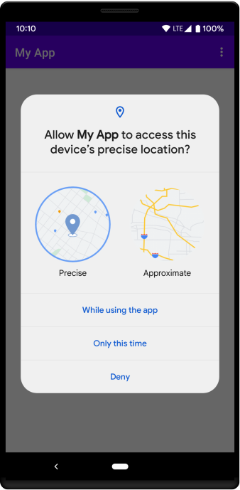
*Android 12のダイアログ。 
出典：[動作の変更点: すべてのアプリ  |  Android 12  |  Android Developers](https://developer.android.com/about/versions/12/behavior-changes-all?hl=ja)より*

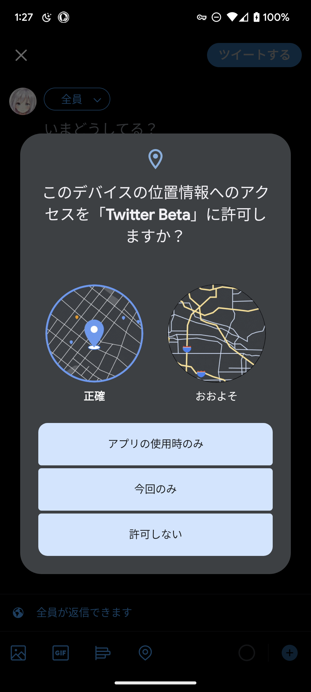
*Android 13のダイアログ。ボタンのデザインが変更されている。*

## 7. Pixel標準のランチャーでアプリの検索性が向上

※この項目は記憶が曖昧なので、もしかしたらAndroid 12から利用できていたかもしれません。

Google Pixel標準のランチャーは、ホーム画面を上にスワイプすることでアプリ一覧画面を表示できます。このアプリ一覧画面の上部には、検索ボックスが表示されています。

従来の検索ボックスは、ひらがなで入力するとひらがなで一致するアプリしか表示されませんでした。しかし、Android 13からは、ひらがなで入力した場合にカタカナのアプリ名も検索結果に含まれるようになりました。

この機能は、以前から一部の日本メーカーのAndroidスマホには搭載されていました。カタカナに変換しなくてもアプリを検索できるのは地味に便利です。

## 8. 画面変遷のアニメーションの改善

Android 13では、画面変遷時のアニメーションが変更されました。分かりやすいのが、設定アプリのアニメーションです。

具体的にどのようにアニメーションが変更されたのかは、[9to5Google](https://9to5google.com/)による動画が分かりやすいです。

<yt-video video-id="0IuyzVqKM-0?start=1165"></yt-video>

また、画面ロックを解除した際のアニメーションは、ホーム画面のアイコンが奥から浮かび上がってくるようなアニメーションに変更されています。

## 9. タスクバーの追加

開発者向けオプションで最小幅を600dp以上にすると、画面下部にタスクバーが表示されるようになります。また、タスクバーの1番右のアイコンをタップすると、Windowsのスタートメニューのようにアプリ一覧が表示されます。

これは大画面のデバイス向けの機能なので、普通のスマホでタスクバーを見かけることはないと言っていいでしょう。

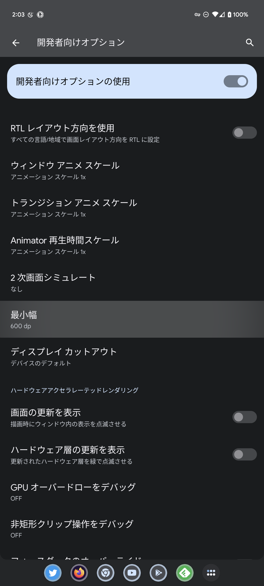

## 10. バックグラウンド実行中のアプリの表示と停止

通知ドロワーの下部に、設定ボタンや電源ボタンと並んでバックグラウンド実行中のアプリを表示できるボタンが追加されました。

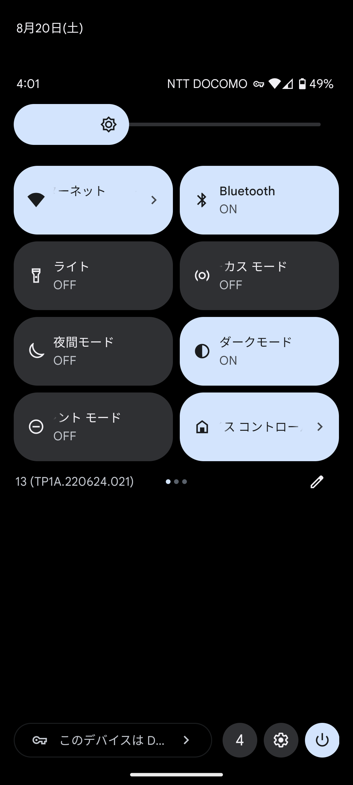
*画面下部の［4］と書かれたボタンを押すと、バックグラウンド実行中のアプリを表示できる。*

このボタンをタップすると、バックグラウンド実行中のアプリを表示するとともに、各アプリを停止できます。

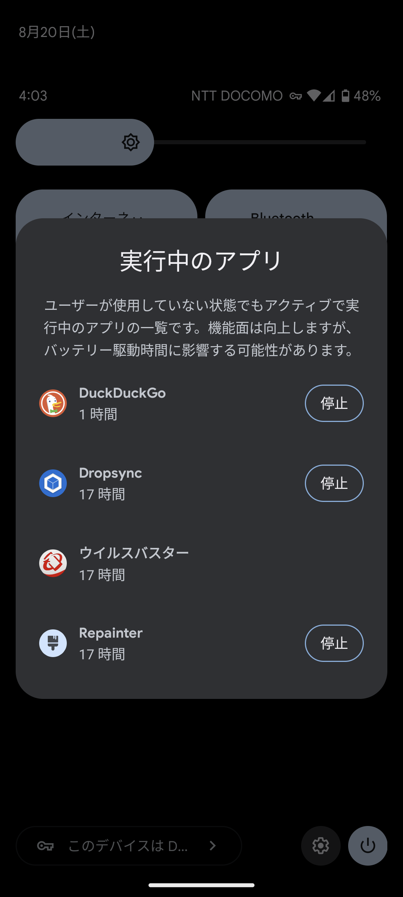

## 11. スクリーンレコードにタップの記録が復活

Android 11からスクリーンレコード機能が標準搭載されています。このスクリーンレコード機能には［画面上のタップも記録する］というオプションがあります。

しかし、このタップを記録するオプションはAndroid 12Lで[削除されました](https://9to5google.com/2022/03/08/android-12l-screen-recorder-show-touches/)。これは、カーソルの描画方法が変更されたことによりタップを[記録できなくなった](https://android.googlesource.com/platform/frameworks/base/+/19c76901bb6470739f937dbfcbfd5e6390a475ac)ためです。

そんな［画面上のタップも記録する］がAndroid 13で帰ってきました。画面録画する際にどこをタップしていたのかが分かりやすくなります。

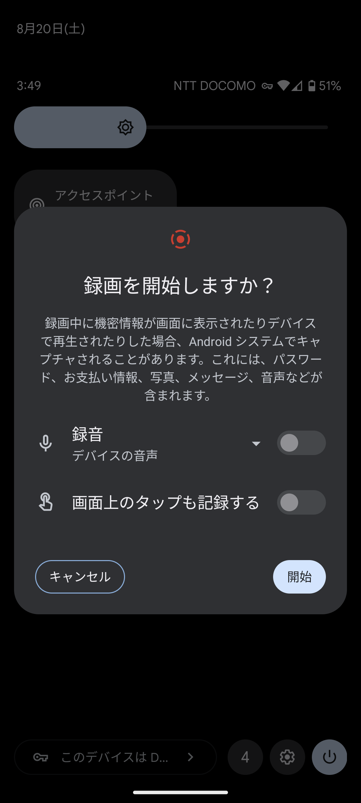

## 12. クイック設定パネルに［QRコードのスキャン］を追加可能に

クイック設定パネルに［QRコードのスキャン］を追加できるようになりました。［QRコードのスキャン］を追加しておけば、このボタンをタップすることで、素早くQRコードをスキャンできるようになります。

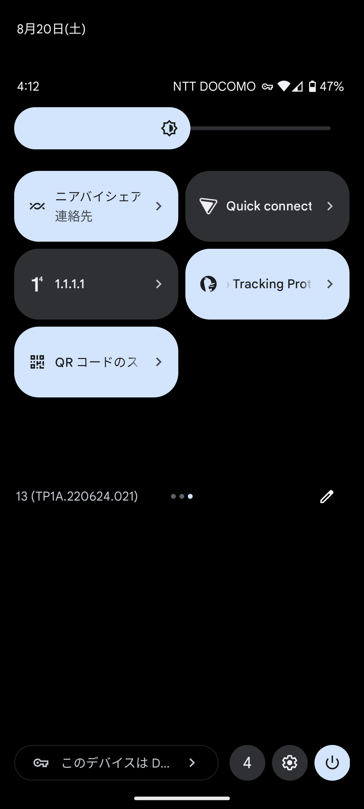

実際に起動してみると、［QRコードのスキャン］の正体は「Google Play開発者サービス」でした。そのため、今後のアップデートでAndroid 13よりも前のバージョンのスマホでも使えるようになる可能性があります。

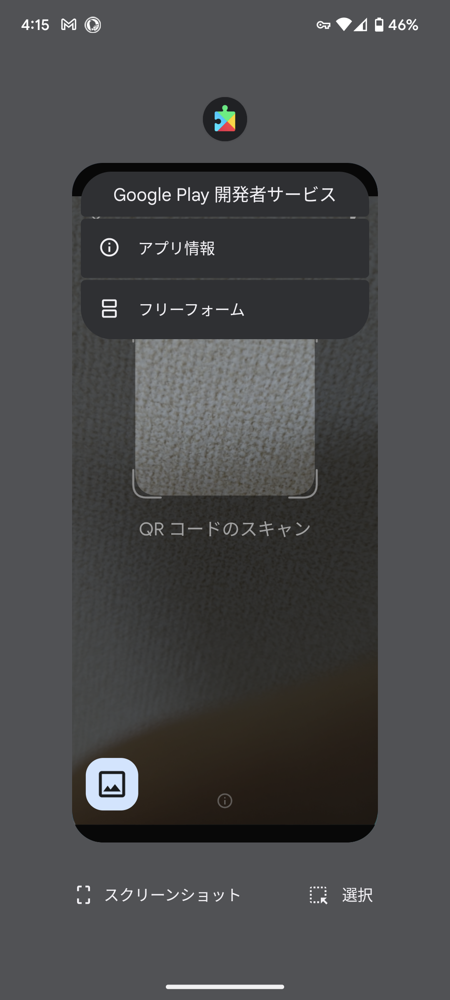

## 13. 通知を長押しで画面分割できるように

新しい通知が来た際に長押しをしてドラッグすることで画面分割できるようになったようなのですが...残念ながら私の環境では再現できませんでした。

<blockquote class="twitter-tweet" data-conversation="none" data-dnt="true" data-theme="dark">
In Android 13 DP2, you can now long press a notification and drag it to enter split-screen mode.  This was actually added to Android 12L and was hidden behind a feature flag: <a href="https://t.co/M7Cre8ZEon">https://t.co/M7Cre8ZEon</a>  It&#39;s still pretty buggy, though. <a href="https://t.co/9qY0zMcwm2">pic.twitter.com/9qY0zMcwm2</a>
&mdash; Mishaal Rahman (@MishaalRahman) <a href="https://twitter.com/MishaalRahman/status/1504562584871133201?ref_src=twsrc%5Etfw">March 17, 2022</a></blockquote> 

## まとめ

Android 13のあまり注目されていない新機能や変更点を13個紹介しました。この記事で紹介したもの以外にも、Android 13では多くの改善が行われています。

Android 13にアップデートできたら、みなさんもどこが変わったのか探してみてください！

## おまけ（Androidベータプログラムについて）

AndroidのBetaテストに参加することで、強制的にAndroid 13をインストールする方法が一部のサイトで紹介されています。その手順に従えば、自分のスマホに配信されるよりも前にAndroid 13を使えます。

この方法は正規のアップデート方法ではないので自己責任になりますが、試す場合は9月に始まるAndroid 13 QPR1よりも前にベータ登録を解除することをオススメします。

「[Android ベータプログラム](https://www.google.com/android/beta)」には次のように書かれています。

> ベータ プログラムを終了する
>
> このプログラムはいつでも登録の解除が可能です。必要に応じて、動作が安定している正式版の Android に戻すことができます。登録を解除すると、デバイス上のすべてのユーザーデータが消去されます。
>
> ベータ版プログラムのリリース サイクル期間中に、動作が安定しているリリースの一般公開を 4 回予定しています（Quarterly Platform Releases (QPRs) の後の公式プラットフォーム リリースとなります）。ベータ版テスト中のバージョンに対して動作が安定しているリリースのアップデートを適用した場合は、次回のベータ版のアップデートを適用するまで期間限定でデータのワイプを発生させずに登録を解除できます

9月からAndroid 13の新しいBetaテスト（QPR1）が始まります。Betaテストが始まると、バグがあったり動作が不安定になったりする可能性があります。また、Beta登録を解除するとスマホのデータがすべて削除され、バックアップの復元に失敗する場合があります。

しかし、QPR1よりも前にベータ登録を解除すれば、データを削除されずに済みます。つまり、このタイミングを逃すと不安定なAndroidを使うか、データが削除されるかの2択を強いられることになります。解除するならQPR1よりも前にしましょう。

詳細は、9to5Googleの記事をご確認ください。

- [You can unenroll from Android 13 Beta without wiping after stable update, QPR1 preview in Sept. - 9to5Google](https://9to5google.com/2022/08/15/android-13-beta-unenroll/)
