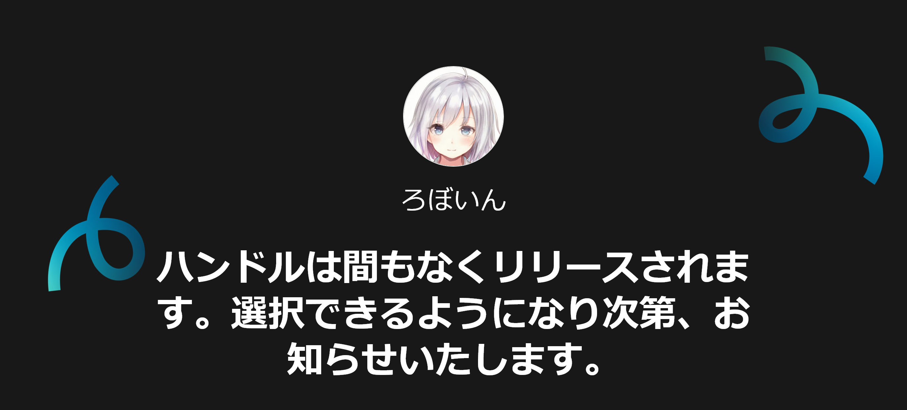
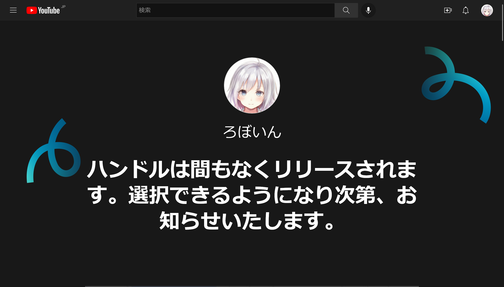
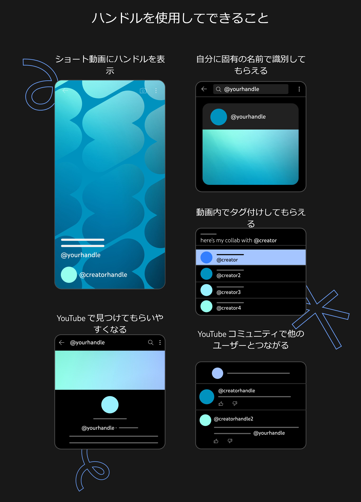

# YouTubeにハンドル機能実装　設定しないと、なりすまされる可能性も

## この記事の概要

- Twitterのユーザー名（スクリーンネーム）のように@から始まる一意のIDの「ハンドル」がYouTubeに実装される
- 11月14日までに徐々に展開され、手動で設定しない場合はYouTube側で自動的に付与される
- ハンドルは早い者勝ちで他人と同じ文字列を設定できないため、早めに設定しないとなりすましに悪用されるリスクがある

## ハンドル機能について

日本時間の2022年10月11日、YouTubeが「ハンドル」機能の実装を[発表](https://support.google.com/youtube/thread/183284252)しました。

<blockquote class="twitter-tweet" data-dnt="true" data-theme="dark">
📣YouTube にハンドルが導入されます✨  ハンドルとは、YouTube で視聴者がクリエイターを見つけて繋がったり、クリエイター同士が繋がったりするための新しい方法です。  既存のチャンネルの URL や名前などは引き続きご利用いただけます。 <a href="https://t.co/Ix6pEAPbdI">pic.twitter.com/Ix6pEAPbdI</a>
&mdash; YouTube クリエイター (@ytcreatorsjapan) <a href="https://twitter.com/ytcreatorsjapan/status/1579615661864628224?ref_src=twsrc%5Etfw">October 10, 2022</a></blockquote> 

ハンドルは、Twitterのユーザー名（スクリーンネーム）のように、@から始まる一意のIDです。つまり、他人と同じ文字列は設定できません。

この機能は、11月14日までに徐々に展開されます。利用できるようになるタイミングは、「YouTube全体のプレゼンス、チャンネル登録者数、チャンネルがアクティブか非アクティブかなどのさまざまな要因」によって決まります。このことから、おそらく人気で活発なチャンネルから利用可能になると思われます。

また、ハンドルを利用可能になると、メールとYouTube Studioに通知が送信されます。通知が来たら、[https://www.youtube.com/handle](https://www.youtube.com/handle)でハンドルを設定できるようになります。私のチャンネルでは、記事執筆時点でまだ利用できませんでした。

ハンドルを11月14日までに手動で設定しなかった場合は、YouTube側で自動的に設定されます。すでにカスタムURLを利用しているチャンネルでは、カスタムURLを元に設定される仕組みです。このように自動設定されたハンドルは、あとからでも変更できます。

ハンドルを設定したり変更したりしても、認証バッジ（公式マーク）は削除されません。ただし、チャンネル名を変更した場合は再申請が必要になります。

ハンドルについての詳細は、[ハンドルの設定ページ](https://www.youtube.com/handle)、[YouTube公式ブログ（英語）](https://blog.youtube/news-and-events/introducing-handles-a-new-way-to-identify-your-youtube-channel/)、[YouTubeコミュニティー（英語）](https://support.google.com/youtube/thread/183284252)から確認できます。また、英語ですがYouTube公式の解説動画も分かりやすいです。

<yt-video video-id="mVVp37YGwyQ"></yt-video>

## ハンドルの役割

ハンドルは、YouTube上でチャンネルを識別するのに役立ちます。チャンネル名は他人と同じ設定にできるため、これまでYouTubeでは同名のチャンネルはチャンネルIDをもとに見分ける必要がありました。しかし、チャンネルIDはランダムな文字列で、決して覚えやすいとはいえません。

そこで、ハンドルの出番です。@から始まる覚えやすいIDを設定することで、同名のチャンネルやなりすましを見分けやすくなります。また、ハンドルを使ったメンションもできるようになるそうです。

つまり、YouTubeのハンドルはTwitterのユーザー名と同じような機能だと考えて問題ないでしょう。

[https://www.youtube.com/handle](https://www.youtube.com/handle)より

## 早く設定しないと なりすまされる可能性も

私は、TwitterやInstagramのユーザー名と同じ文字列で、できるだけ早く登録することを推奨します。

前述のように、YouTubeのハンドルは早い者勝ちで、他人と同じ文字列は設定できません。この特徴のおかげで、長期的にはなりすましを見分けやすくなります。しかし、次のような場合はどうでしょうか？

1. あなたはYouTubeチャンネルの運営者で、ハンドルを手動で設定しなかった
2. 悪意のある第三者があなたのTwitterのユーザー名と同じ文字列で、YouTubeのハンドルを取得した
3. あなたのTwitterと同じハンドルを取得したユーザーが、チャンネル名やアイコンをあなたのYouTubeチャンネルと同じ設定にした

この場合、YouTubeのチャンネル登録者数は誤魔化せないものの、全体的にはあなたのチャンネルと酷似したチャンネルを作成し、なりすませてしまいます。

まるで本物のようになりすませるだけでも問題ですが、なりすましたチャンネルで詐欺やデマの動画を流されたらどうでしょう？まるであなたが詐欺やデマに加担しているように見えてしまいます。こうなってしまったらあなたがなりすましに気づいて関与を否定し、なりすましが凍結されるまで、あなたのイメージは悪くなる一方です。

あなたが詐欺やデマの拡散に加担していると勘違いしたすべての人に、関与を否定するメッセージが届くとは限りません。なりすましで一度悪くなったイメージは、完全には元に戻らないかもしれません。

このようにYouTubeのハンドルは長期的には偽物を見分けやすくなる一方で、短期的にはむしろ、なりすましに利用される可能性があります。

YouTubeのハンドルを悪用したなりすましを防ぐ方法はただ1つです。ハンドル機能を利用可能になり次第、他のSNSと同じID（Twitterのユーザー名など）でできるだけ早く設定しましょう。
