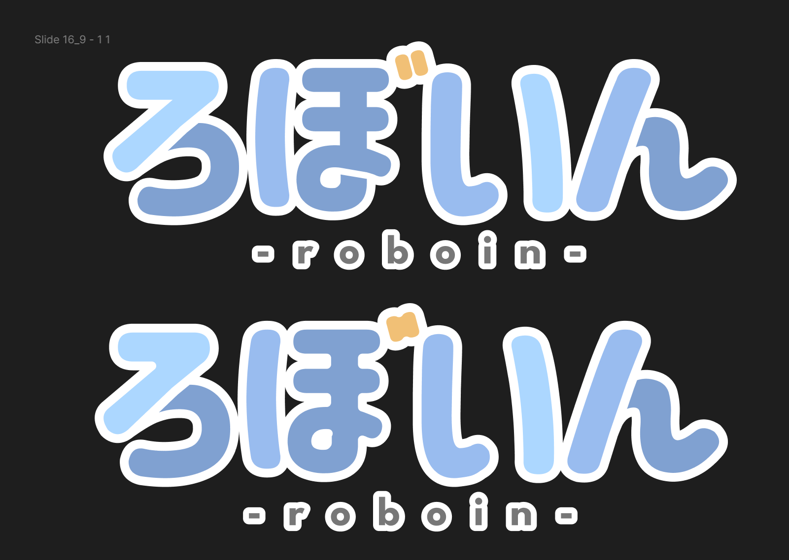
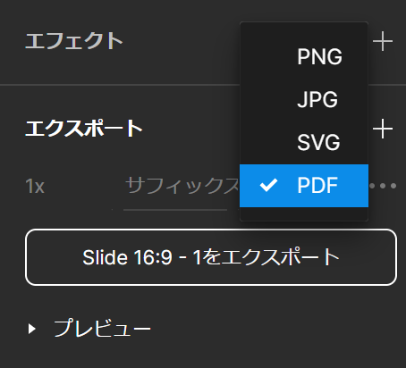
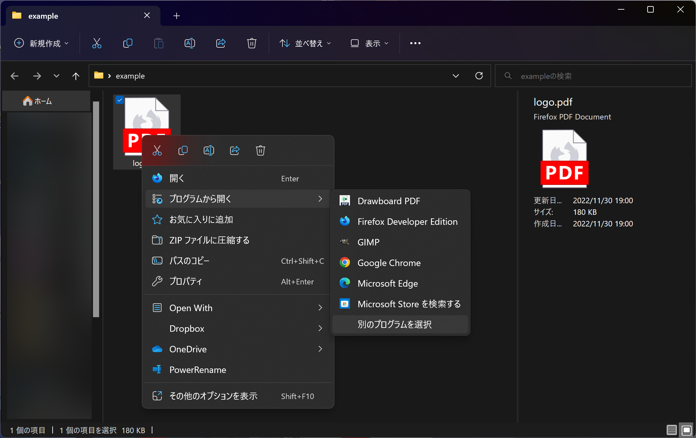
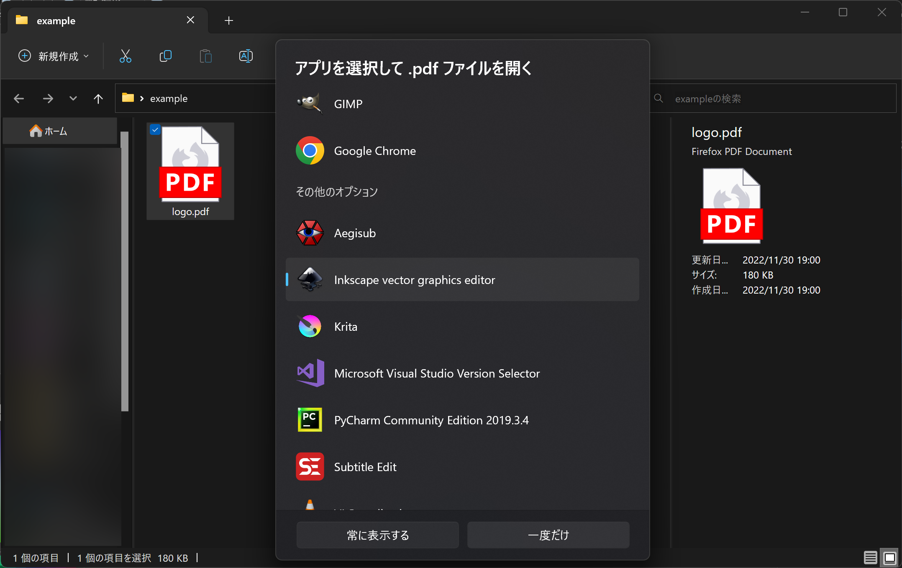
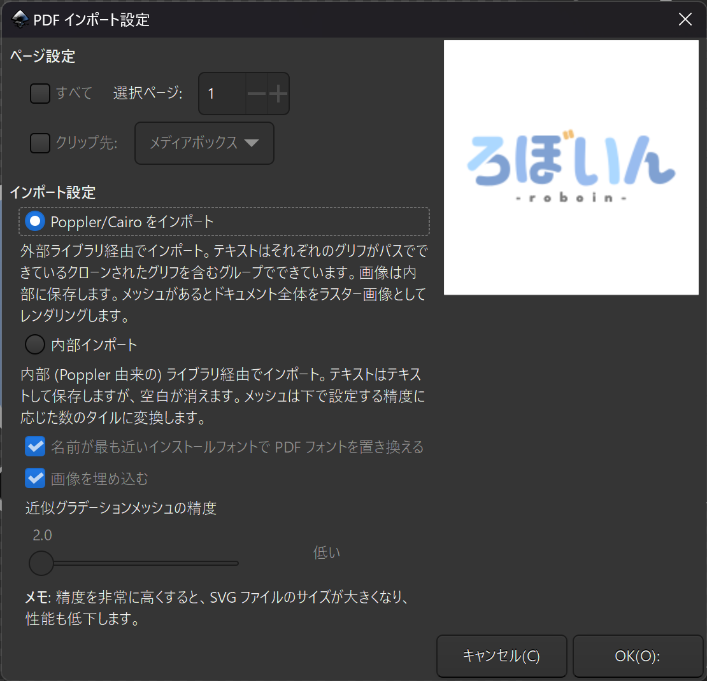
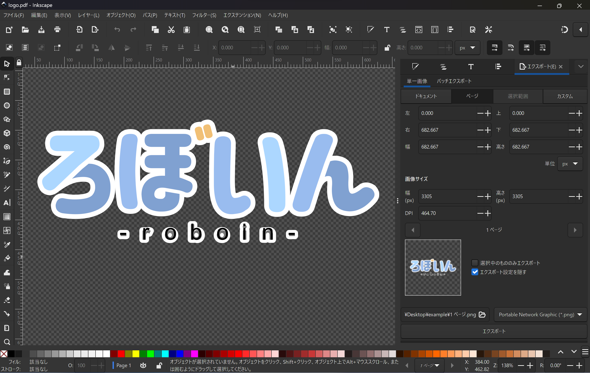
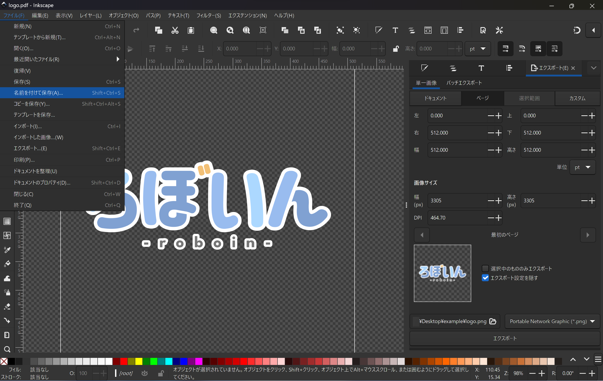
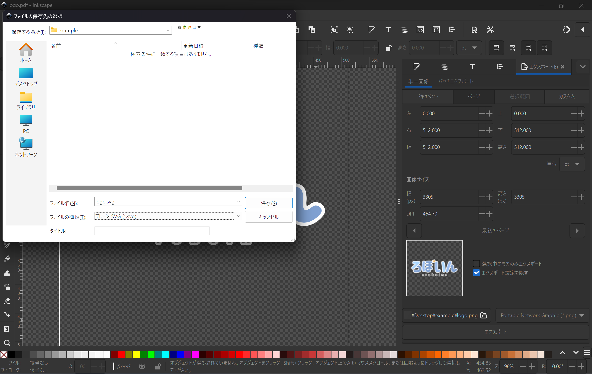
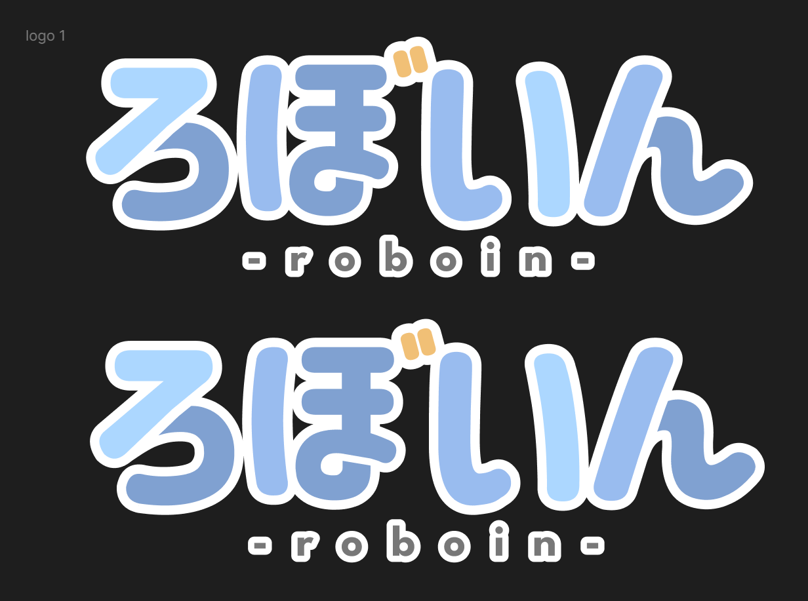
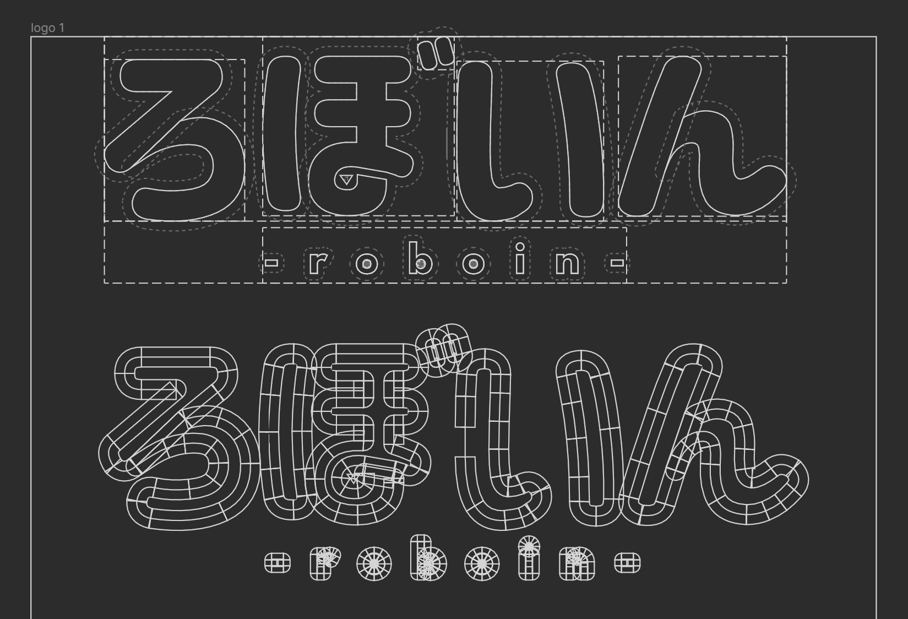

# Figmaで書き出したSVGの形が崩れるときの対処法

:::note info
この記事の内容は、次の環境で動作確認しています。

- OS：Windows 11 Home 22H2（22621.819）
- Figma：2022年11月29日のリリース
- Inkscape：v1.2.1 (9c6d41e410, 2022-07-14)
:::

## どういう状況か

FigmaでエクスポートしたSVGは、ときどき形が崩れてしまっていることがあります。

たとえば、この画像。上がFigmaで作った元のデザインで、下がSVGにエクスポートしたものです。濁点のオレンジの部分が繋がってしまっていたり、「ろ」や「ぼ」の線の角が丸まってしまったりしています。

Figmaで作成したデザインをSVGにエクスポートすると、たびたびこういった問題が起こります。

## 対策

FigmaのデザインデータをSVGにエクスポートすると形が崩れてしまう問題は、PDFを経由することで回避できます。

FigmaからPDFにエクスポート→PDFをSVGに変換、という流れです。

ここからは、詳細な手順を説明します。

### 1. PDFにエクスポート

まず、Figmaで作成したデザインをPDFにエクスポートします。通常のエクスポートの設定で、ファイル形式としてSVGの代わりにPDFを指定します。

### 2. PDFからSVGに変換

エクスポートしたPDFをSVGに変換します。変換に使うソフトは何でもいいのですが、ここでは例としてInkscapeを使います。

WindowsでPDFをInkscapeを使って開く方法は2つあります。1つ目は、右クリックから［プログラムから開く］を使う方法です。［別のプログラムを選択］からInkscapeを選択します。

［常に表示する］を選択すると、今後PDFを開くときは自動的にInkscapeが開くようになります。たいていの場合はPDFビューワーで開いた方がいいと思うので、［一度だけ］を選択します。

InkscapeでPDFを開くもう1つの方法は、Inkscapeを起動してメニューの［ファイル］から［開く］をクリックし、PDFファイルを選択する方法です。この2つのどちらの方法を使っても構いません。

どちらの方法を使った場合でも、［PDFインポート設定］という画面が出てきます。この設定画面では、［Poppler/Cairoをインポート］を選択してください。

［Poppler/Cairoをインポート］の代わりに［内部インポート］を選択すると、画像のように文字が2重になる場合があります。そのため、必ず前者を選択してください。

InkscapeでPDFを開けたら、あとは［名前を付けて保存］から［Inkscape SVG］か［プレーンSVG］を選択して保存するだけです。

プレーンSVGを選択した場合、変換後にInkscapeを閉じようとすると、「データの破損を起こす可能性があるためInkscape SVGで保存しますか」みたいなことを聞かれます。今回は変換に使っただけなので、Inkscape SVGにせずにそのまま閉じてしまって大丈夫です。

### 完成

画像のとおり、元のデザインに忠実なままSVGへ変換できました。

## 注意点

Figmaをアウトライン表示にすると分かりやすいのですが、この記事で紹介した方法を使って変換したSVGのデータは、とても汚いです。上が元のデザインデータ、下が変換後のSVGをFigmaにインポートしたものです。

見た目に支障はありませんが、パスがぐちゃぐちゃしているということは頭の片隅に入れておいた方がいいかもしれません。

