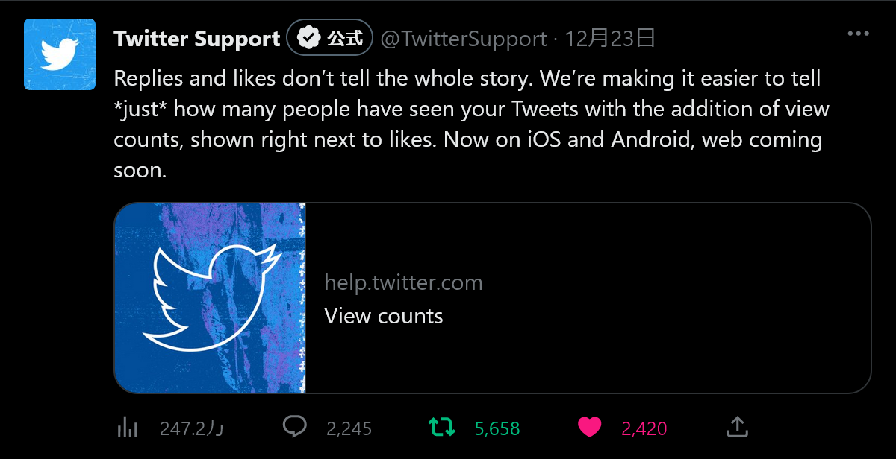
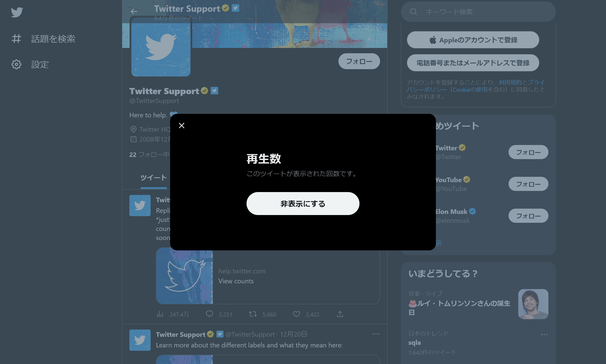
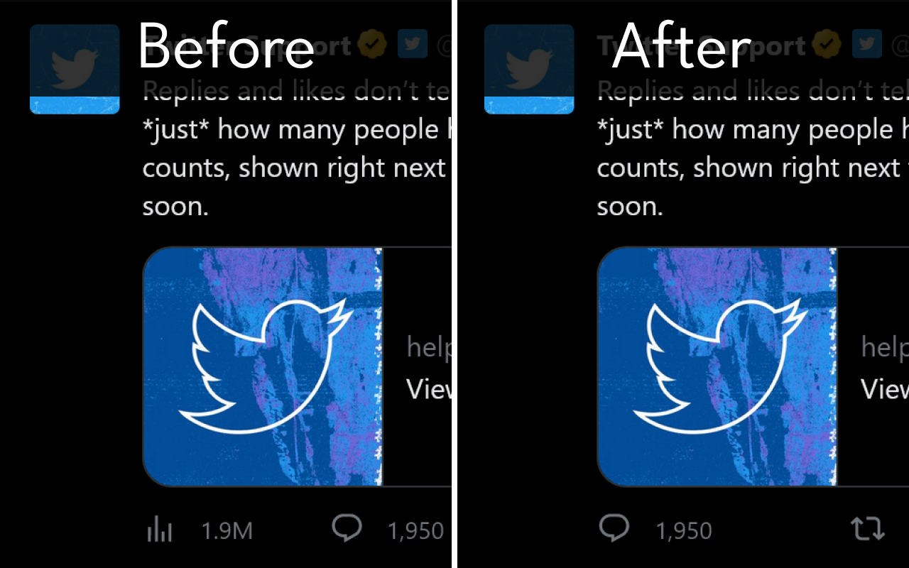

# Twitterのインプレッション数を非表示にする拡張機能を公開しました

Twitterのインプレッション数を非表示にする拡張機能「Hide View Count」を作成・公開しました。

この拡張機能をストアからインストールするだけで、ツイートに表示されるインプレッション数を非表示にできます。この拡張機能はインプレッション数の表示を一瞬たりとも許さないため、承認欲求モンスターが生まれてしまうのを防げます。

- Chrome版：[https://chrome.google.com/webstore/detail/hide-view-count/mmefeobjcchickbjelledfhagoddcklp](https://chrome.google.com/webstore/detail/hide-view-count/mmefeobjcchickbjelledfhagoddcklp)
- Firefox版：[https://addons.mozilla.org/ja/firefox/addon/hide-view-count/](https://addons.mozilla.org/ja/firefox/addon/hide-view-count/)

## はじめに

2022年12月23日、Twitterはツイートのインプレッション数（閲覧数）を表示する機能を実装したと[発表](https://help.twitter.com/en/using-twitter/view-counts)しました。

<blockquote class="twitter-tweet" data-dnt="true" data-theme="dark">
Replies and likes don’t tell the whole story. We’re making it easier to tell *just* how many people have seen your Tweets with the addition of view counts, shown right next to likes. Now on iOS and Android, web coming soon.<a href="https://t.co/hrlMQyXJfx">https://t.co/hrlMQyXJfx</a>
&mdash; Twitter Support (@TwitterSupport) <a href="https://twitter.com/TwitterSupport/status/1606055187348688896?ref_src=twsrc%5Etfw">December 22, 2022</a></blockquote> 

この機能により、画像のようにツイートの左下にインプレッション数が表示されるようになりました。

このインプレッション数は、自分のツイートだけでなく他人のツイートにも表示されます。また、同じツイートを複数回表示した場合は、それぞれカウントされる場合があります。

## 何が問題か

しかし、このインプレッション数の表示について、否定的な[意見](https://www.itmedia.co.jp/news/articles/2212/23/news124.html)もあります。

インプレッション数の表示に対する否定的な意見には、おもに次のようなものがあります。

- リプライ・リツイート・いいね の位置が変わって使いにくい
- 他人のツイートのインプレッション数と比較してしまう

前者については慣れれば問題ありませんが、後者についてはとくにTwitterで作品を公開しているクリエイターにとっては新たな悩みの種となります。

## 非表示にする機能は公式には存在しない

インプレッション数のアイコンをクリックすると、画像のように［非表示にする］というボタンが現れます。しかし、このボタンは「インプレッション数の説明を非表示にする」という意味で、クリックしてもインプレッション数自体は非表示になりません。

## なら作ってしまおう

「インプレッション数を非表示にする公式の機能が存在しないなら作ってしまおう」ということで、インプレッション数を非表示にする拡張機能「Hide View Count」を作りました。

使い方は簡単。リンクからストアのページに飛んで、拡張機能をインストールするだけです。

- Chrome版：[https://chrome.google.com/webstore/detail/hide-view-count/mmefeobjcchickbjelledfhagoddcklp](https://chrome.google.com/webstore/detail/hide-view-count/mmefeobjcchickbjelledfhagoddcklp)
- Firefox版：[https://addons.mozilla.org/ja/firefox/addon/hide-view-count/](https://addons.mozilla.org/ja/firefox/addon/hide-view-count/)

一度インストールしてしまえば、とくに設定などは必要ありません。スクリーンショットのように、インプレッション数が表示されない静かなTwitterをお楽しみください。

この拡張機能をインストールすることでインプレッション数を見る必要がなくなり、承認欲求モンスターが生まれてしまうのを防げます。また、拡張機能のソースコードはGitHubで[公開](https://github.com/Robot-Inventor/hide-view-count)しています。

## 類似の拡張機能との違い

インターネット上ではさっそく、インプレッション数を非表示にする拡張機能がいくつか公開されています。こうした類似の拡張機能と比べた、Hide View Countのメリットには次のようなものがあります。

- インストールが簡単
- 余計な機能が付いていない
- Twitterの仕様変更に強い
- インプレッション数の表示を一瞬たりとも許さない

まず、「インストールが簡単」についてです。類似の他の拡張機能はストアで公開されておらず、ブラウザーの設定を変更して特殊な方法でインストールしなければいけません。

しかし、Hide View Countはストアで公開されているため、インストールボタンをクリックするだけで使い始められます。また、ストアの審査を通過しているため、相対的に安全性が高いことも特徴です。

「余計な機能が付いていない」は文字どおりの意味です。インプレッション数を非表示にすること以外の余計な機能は一切ありません。

次に、「Twitterの仕様変更に強い」についてです。類似の他の拡張機能は、Twitterの仕様変更に弱い作りになっています。Twitterは日々アップデートされていますが、少しでもアップデートされると、動作しなくなる可能性があります。一方でHide View Countは、できるだけTwitterの仕様変更に強い作りになっています。

最後に、「インプレッション数の表示を一瞬たりとも許さない」についてです。類似の他の拡張機能では、タイムラインのスクロールの速度によってはインプレッション数が一瞬表示されてしまうものもあります。Hide View Countでは、タイムラインを常にスキャンし、インプレッション数が一瞬たりとも表示されないようにしています。

また、インプレッション数表示の存在を根こそぎ消し去るため、インプレッション数が表示されていた場所に謎の空白が表示されることもありません。

## 注意点

最後に、Hide View Countの注意点についてです。

- 自分のブラウザー上でのみ非表示にできます。他の人のブラウザーやアプリには影響しません
- 「インプレッション数を**見たくない**」という用途に利用できます。「インプレッション数を**見せたくない**」という用途には利用できません
- Twitterの公式Webサイトでのみ動作します。スマートフォンのアプリ版Twitterを含め、他のクライアントでは動作しません
- Twitterの仕様変更に強い作りにはなっていますが、将来的に動作しなくなる可能性があります

## まとめ

ツイートのインプレッション数を非表示にする拡張機能「Hide View Count」を紹介しました。ぜひHide View Countをインストールして穏やかなTwitterを取り戻すことで、承認欲求モンスターが生まれてしまうのを防いでください！
