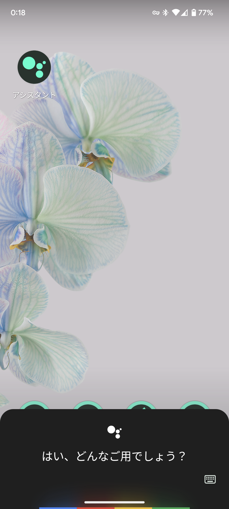
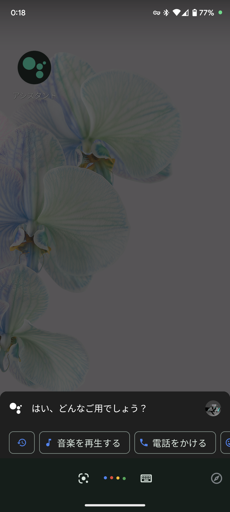

# Googleアシスタントのデザインが古くなってしまった場合の対処法

:::note info
この記事の内容は、次の環境で検証しています。

- 機種：Google Pixel 6
- OS：Android 13（ビルドTQ1A.230105.002）
- Googleアシスト：バージョン0.1.474378801
:::

## はじめに

ある日、Googleアシスタントを使っていたところ、UIのデザインが古くなっていることに気がつきました。

*Googleアシスタントの新しいデザイン。本来はこの画面が表示されるはずだが...*

*なぜかこっちの古い画面が表示されるようになってしまった。*

この問題を調査したところ、いくつかの原因が分かりました。この記事では、Googleアシスタントが古いデザインに戻ってしまう原因と対処法について解説します。

### 原因と対処法

Googleアシスタントが古いデザインに戻ってしまう問題は、次のような原因が考えられます。これらの原因について、それぞれの詳細と対策を紹介します。

- Google Workspaceアカウントを使用している
- Googleアシスタントで複数の言語を利用するように設定している
- スマートフォンにユーザー補助アプリがインストールされている

### Google Workspaceアカウントを使用している

1つ目の原因として考えられるのが、[Google Workspace](https://workspace.google.co.jp/)アカウントです。

学校や会社といった組織で配られるGoogleアカウントが、Google Workspaceアカウントだったりします。このGoogle Workspaceアカウントは組織によって管理されており、管理者によって一部の機能に制限がかけられています。

私の場合、今回はこれが原因ではありませんでしたが、以前に同様の事象が発生した際にはこれが原因でした。

スマートフォンでGoogle Workspaceアカウントにログインしている場合、Googleアシスタントのデザインが古くなります。また、スマートフォンのGoogleアシスタント以外の機能も制限されている可能性があります。

この現象は、Google Workspaceアカウントを使っていなくても、**スマートフォンに追加しているだけで発生**します。

アカウントのログイン状態を確認するには、まず、Google系のアプリを開きます。次に、右上に表示されるアカウントのアイコンをタップします。

アカウント名とメールアドレスが表示されるので、タップするとログインしているアカウントの一覧が表示されます。この一覧の中に、Google Workspaceアカウントが1つでもあると、Googleアシスタントのデザインが古くなる可能性があります。

<!-- アカウント切り替え画面のスクショ -->

このケースは、前述のとおり管理者による制限が原因と思われます。そのため、Google Workspaceのアカウントでログインしていても、設定によっては影響を受けないかもしれません。

### Googleアシスタントで複数の言語を利用するように設定している

2つ目に考えられる原因は、Googleアシスタントの言語設定です。私の場合はこれが原因でした。

Googleアシスタントの言語設定を確認するにはまず、Googleアプリを開きます。次に、検索ボックスの左に表示されるGマークをタップします。

そして、右上に表示されるアカウントのアイコンをタップしてメニューを開き、［設定］をタップします。設定が開いたら［Googleアシスタント］を選択し、［言語］を開きます。

ここで複数の言語が設定されていると、UIが古いデザインに戻ってしまうことがあります。すでに追加されている言語を削除するには、削除したい言語をタップし、一番上の［なし］を選択します。

### スマートフォンにユーザー補助アプリがインストールされている

Redditで調べたときに、一番多く出てきた原因がこれです。ユーザー補助（アクセシビリティー）権限をもつアプリがインストールされていると、Googleアシスタントのデザインが古くなるときがあります。

ただし、すべてのユーザー補助アプリが影響するわけではないようです。私はいくつかのユーザー補助アプリをインストールしていますが、影響はありませんでした。

ユーザー補助アプリが原因の場合は、設定からユーザー補助権限を取り消すか、アプリをアンインストールすれば解決します。ただし権限を取り消した場合、アプリは正しく機能しなくなる可能性があります。

ユーザー補助権限をもつアプリを確認するには、スマートフォンの設定を開きます。少しスクロールして、［ユーザー補助］という項目を開くと、ユーザー補助権限をもつアプリを確認できます。

<!-- 設定でユーザー補助アプリを確認する方法を書く -->

## まとめ

今回は、GoogleアシスタントのUIが古いデザインに戻ってしまう原因と対処法について説明しました。

Google Workspaceアカウントの制限が原因で古いデザインに戻ってしまうのはなんとなく理解できますが、言語設定とユーザー補助アプリについては謎ですね。どうして言語設定やユーザー補助アプリが影響するのでしょうか？

また、Google Workspaceアカウントについても、追加されているだけでスマートフォンの一部の機能が制限される仕様は疑問です。何か理由があるはずですが、少しだけ不便に感じます。

ちなみにGoogle Pixelを使用している場合は、Google Workspaceアカウントによって、Pixelの売りの音声入力の一部機能が制限を受けたりします。
