# Google検索にAIが搭載　Search Labs日本最速レビュー

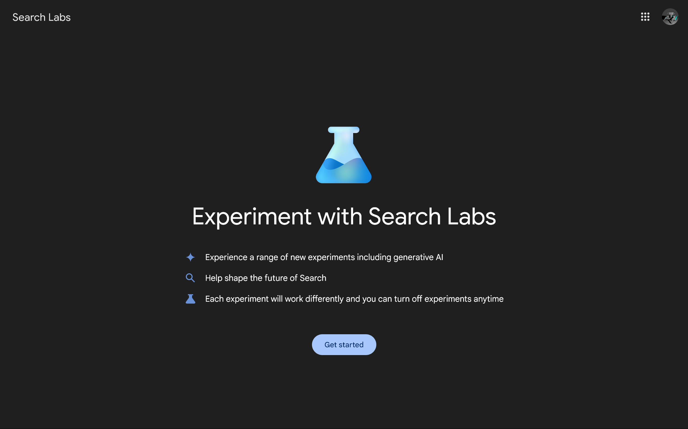

## Search Labsとは

Search Labsは、Googleの最新の機能の初期段階の実験に参加できるプログラムです。Googleが開発中のAI関連のさまざまな機能にアクセスできます。

この記事では、Search Labsを日本最速（※）でレビューします！

※日本人による日本語での最速のレビュー記事。筆者調べ。

## 使い方

Search Labsは現在、順番待ちリストに登録した少数のユーザーにのみ提供されています。まずは、[登録ページ](https://labs.google.com/search/)にアクセスして順番待ちリストに登録してください。

順番待ちリストは現在、次のすべての条件を満たすユーザーのみ登録できます。日本での展開時期は記事執筆時点では発表されていません。

- アメリカからアクセスしていること
- Googleの[言語設定](https://myaccount.google.com/language)が英語になっていること
- PC版のGoogle Chromeか、スマホのGoogleアプリからアクセスしていること

数日から数週間ほど待つと、Search Labsにアクセスできるようになったことを伝える通知が届きます。私の場合はスマホにGoogleアプリの通知として届きました。

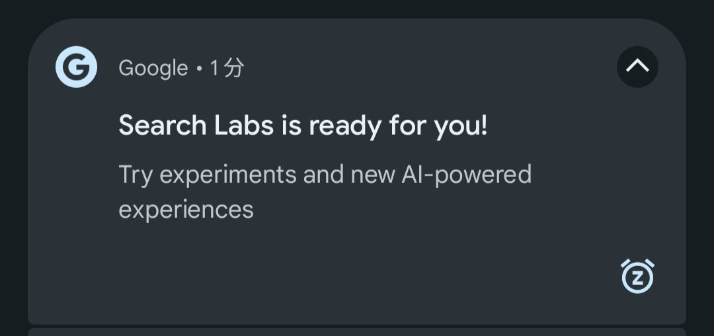

通知をタップするか、Search Labsの[設定ページ](https://labs.google.com/search/onboarding)を開くと、このような画面が表示されます。

［Get started］をタップすると、Search Labsで利用可能な機能を個別にオンオフできる[ページ](https://labs.google.com/search/experiments)が表示されます。

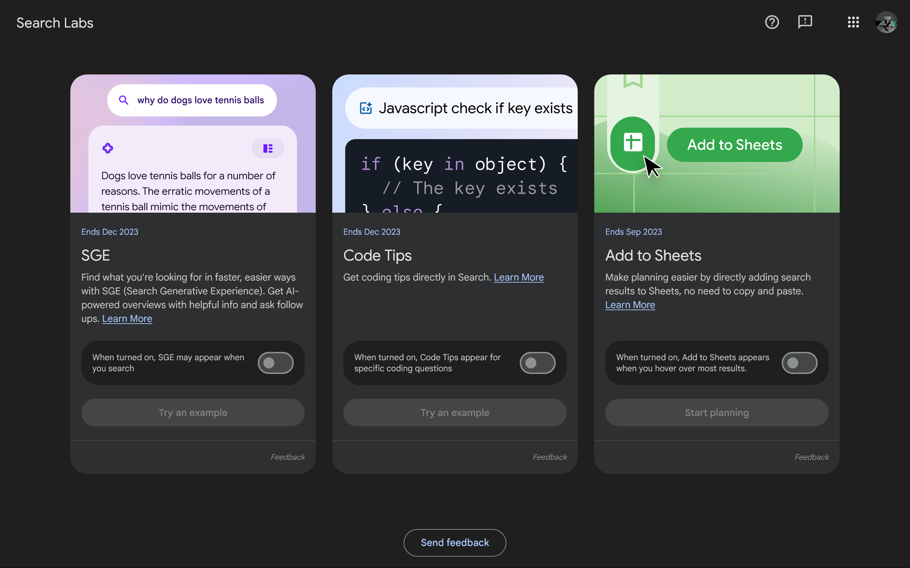

SGEとCode Tipsは「Ends Dec 2023」、Add to Sheetsは「Ends Sep 2023」と表示されていることから、それぞれのテストは今年の12月と9月に終了することが分かります。ベータ扱いが解除され、一般提供されるのがその時期なのかもしれません。

## SGEを使ってみる

SGE（*Search Generative Experience*）は、Google検索とチャットAIを統合した新機能です。有効にすると、検索結果の上部に結果のまとめが表示され、個別のWebページを開かなくても情報を得られるようになります。

SGEを有効にするには、前述のページでトグルスイッチをオンにします。プライバシーポリシーと利用規約が表示されるので、同意して続行する場合は［I agree］をクリックします。

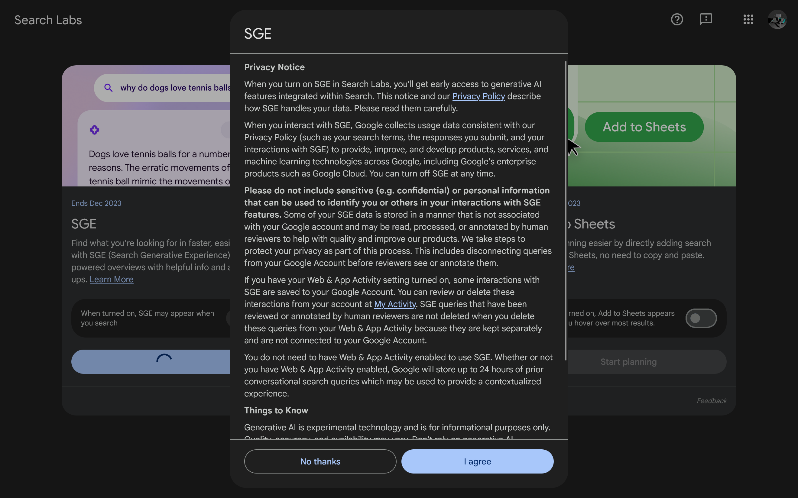

同意すると［Try an example］というボタンが有効になるので、これをクリックします。

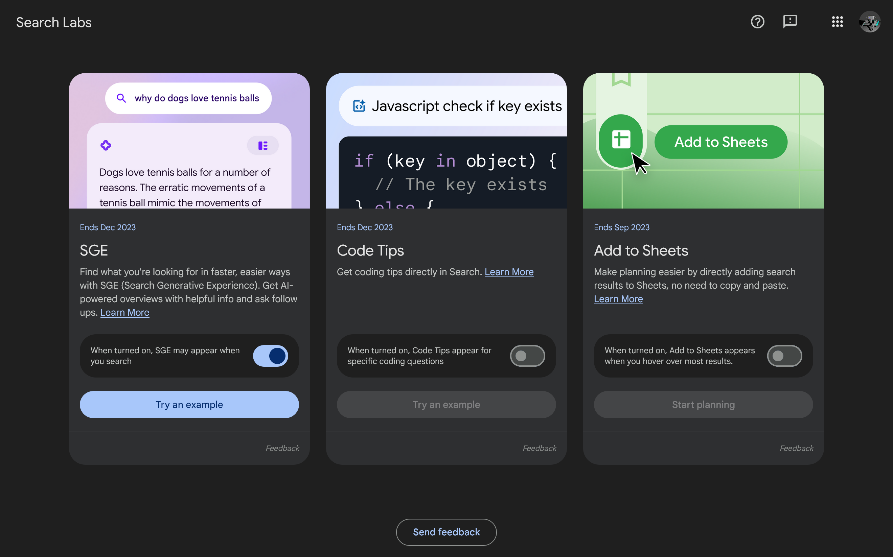

すると、Google検索の画面が開き、検索ボックスの下に［Generating…］というメッセージが表示されます。また、検索結果の各ページのリンクが水色から白に変更されています。これは人によって好みが別れそうです。

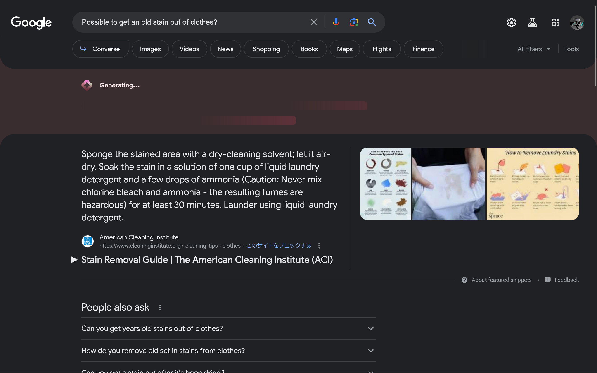

少し待つと、画像のように検索ボックスの下に検索結果の概要が表示されました。また、概要の文章の右隣にはいくつかの画像付きリンクがカルーセル形式で表示され、下部には［Ask a follow up］というボタンと、追加の質問の候補が表示されます。

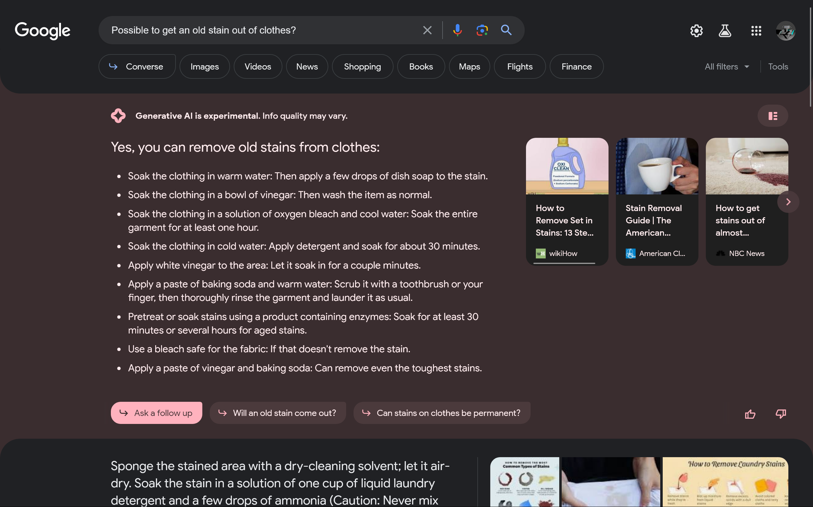

もし、概要が表示されずに画像のように「Can't generate an AI overview right now. Try again later.」と表示された場合は、拡張機能を無効にしてみてください。私の場合は[ClearURLs](https://chrome.google.com/webstore/detail/clearurls/lckanjgmijmafbedllaakclkaicjfmnk)が原因でした。

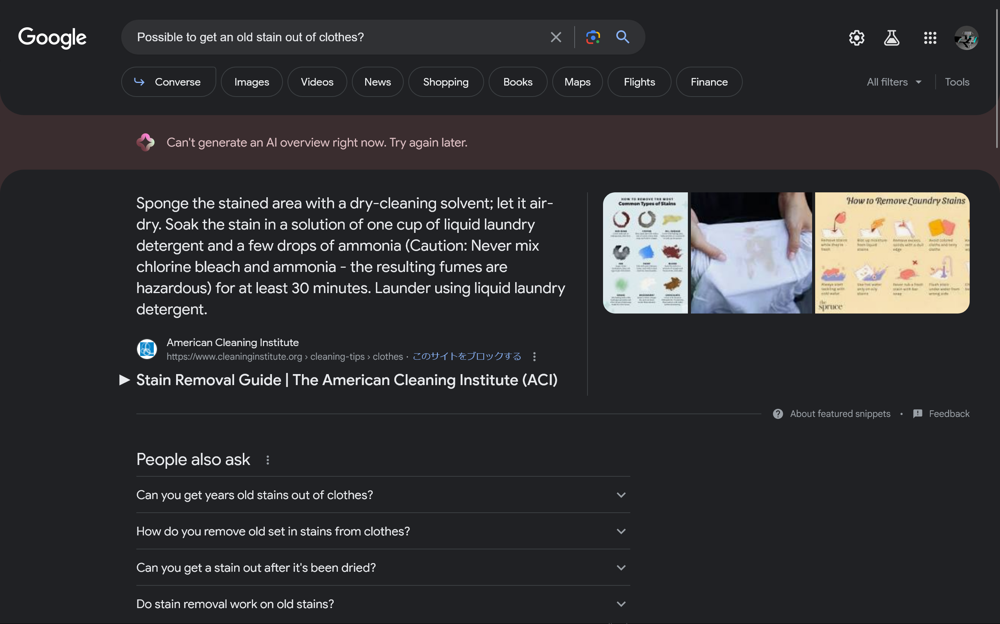

では、今度は別のキーワードで検索してみます。「Major news in Japan today」と入力すると、今日の主要なニュースのまとめが表示されました。まとめ部分の背景色は毎回変わるようです。

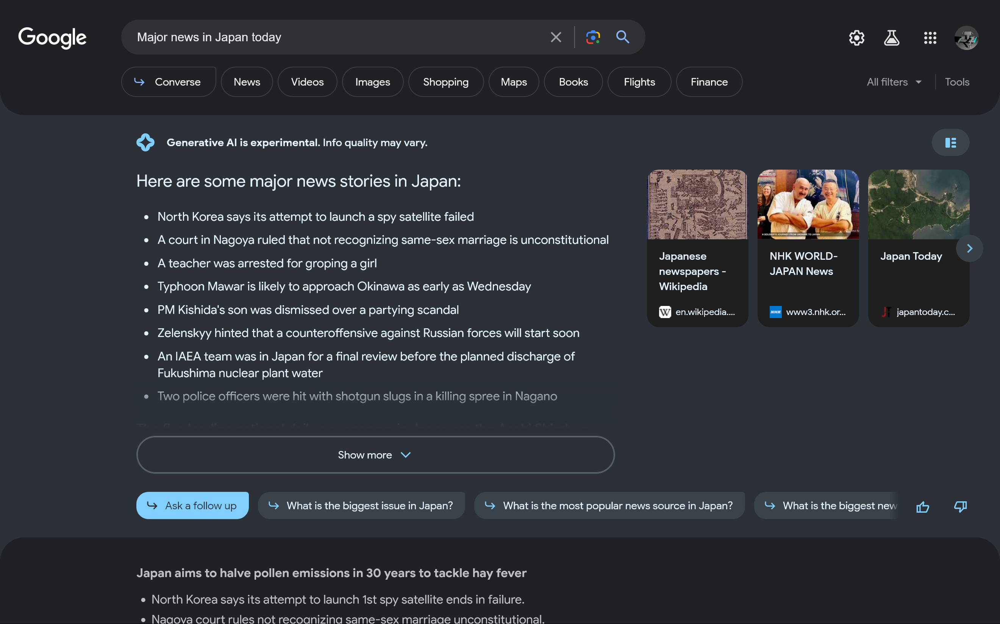

［Ask a follow up］をクリックしてみます。するとチャット画面が表示され、AIに追加の質問をできるようになります。

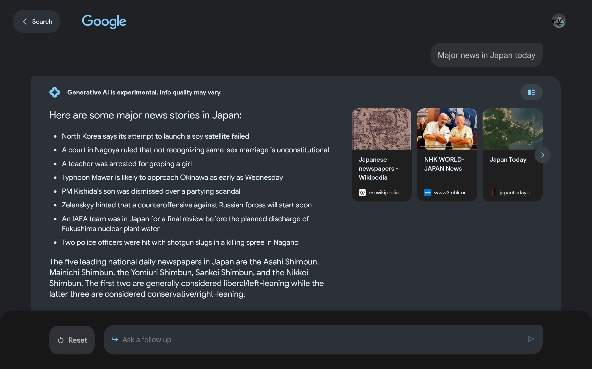

では、台風のニュースについて詳しく聞いてみます。「Please tell me more about the typhoon approaching Okinawa.」と入力し送信すると、沖縄に接近中の台風について詳しく教えてくれました。

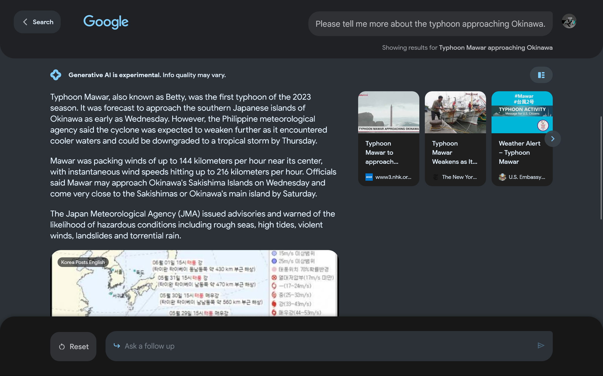

スクロールすると、追加の質問の候補といくつかのWebページへのリンクが表示されます。

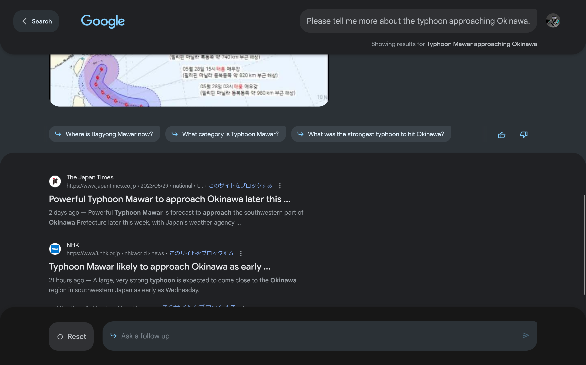

また、回答を日本語に翻訳できるか尋ねたところ「Here are some results」とだけ表示され、翻訳はしてくれませんでした。その他にも日本語で質問をしてみましたが、同様の挙動でした。やはり、現在はまだ英語のみの対応のようです。

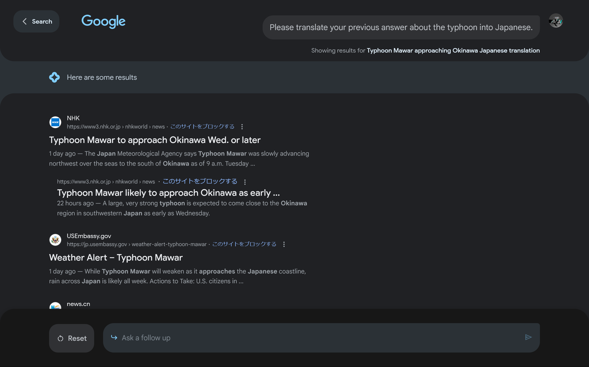

## Code Tipsを使ってみる

今度は、Code Tipsを使ってみます。Code TipsはJavaScript、Pythonなどのトピックを検索するだけで、検索結果にコードのヒントが直接表示される機能です。SGEのときと同様の手順で有効化します。

［Try an example］をクリックすると、JavaScriptのコードが表示されました。内容を確認すると、正しくコードを書けていることが分かります。

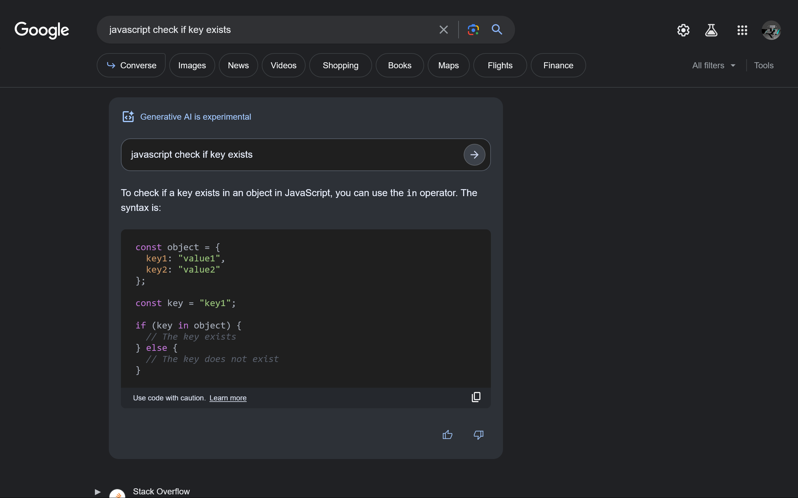

指定した場所の天気を取得するツールのコードをJavaScriptで書くように依頼したところ、［No AI response to that search］と表示され、コードは生成されませんでした。どうやら、簡単なコードしか生成できないようです。

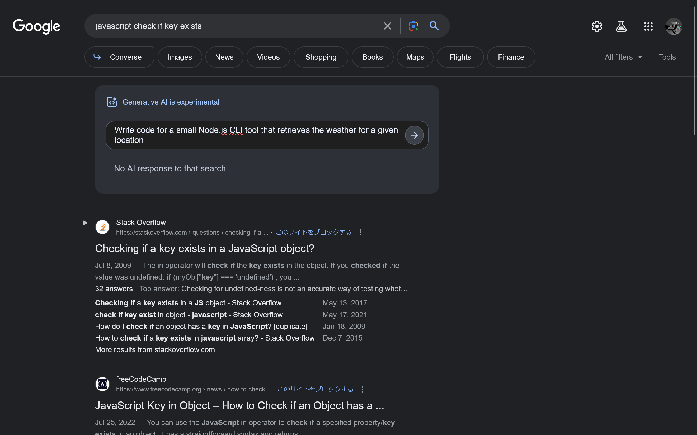
