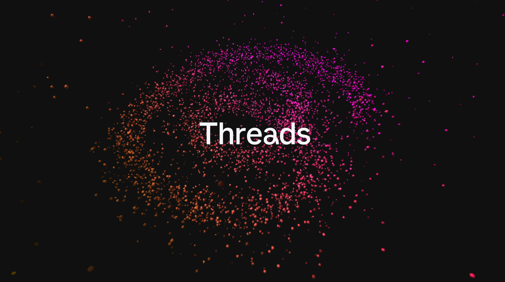
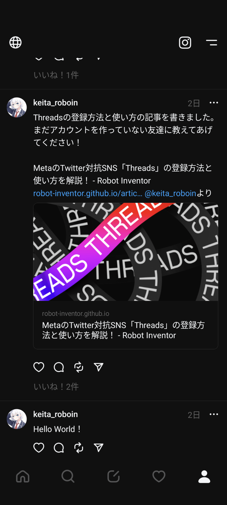
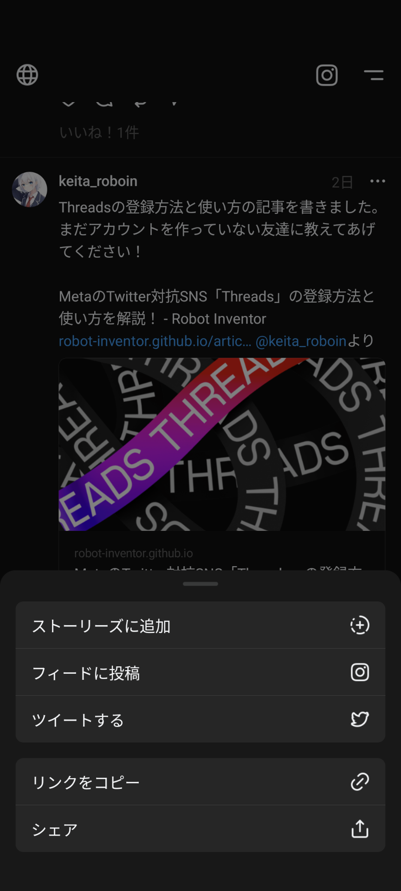
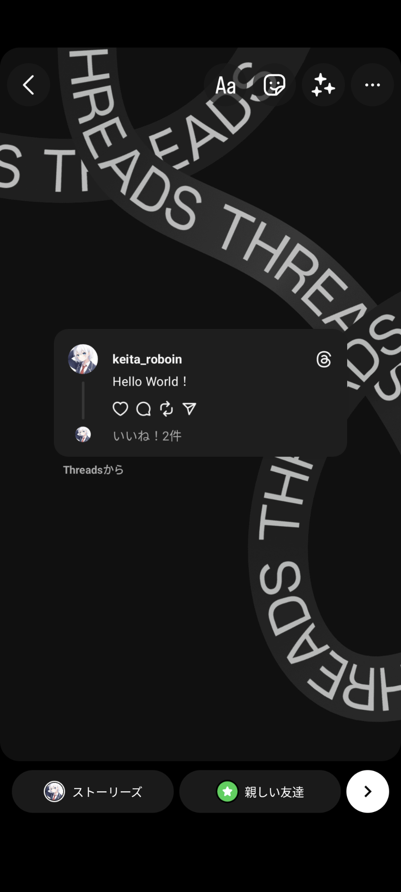
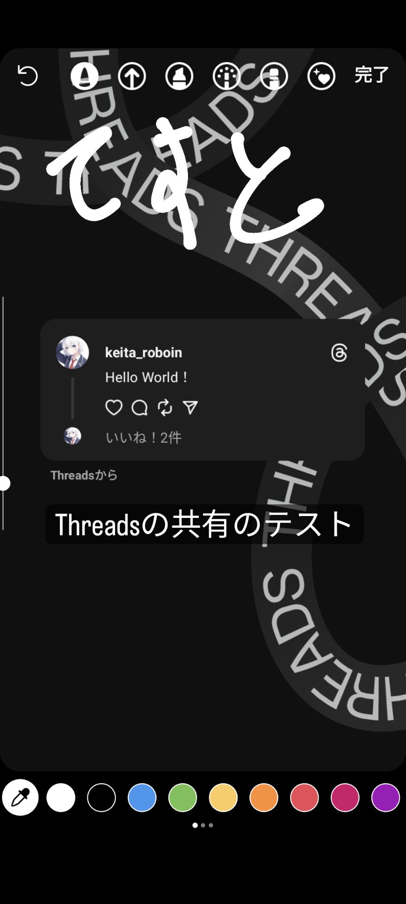
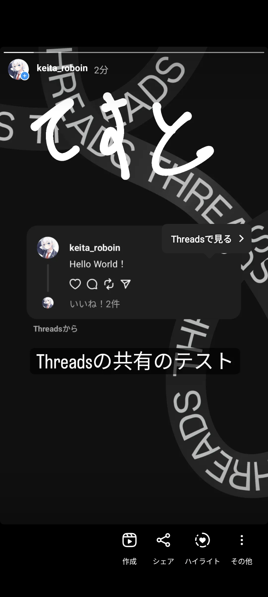
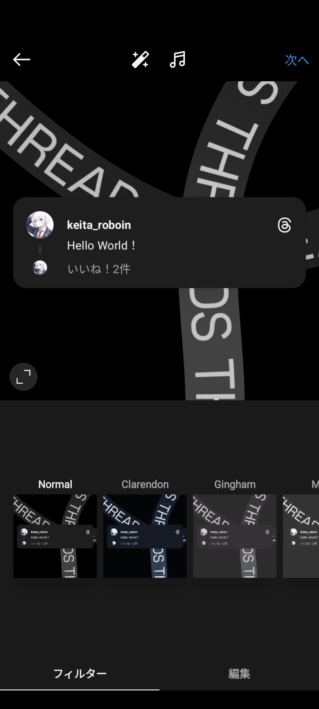
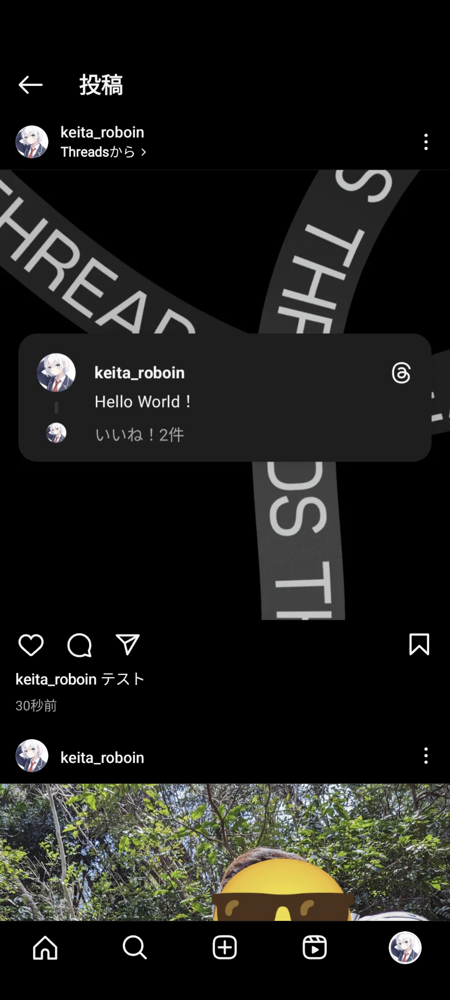

# Threadsの投稿をInstagramのストーリーやフィードにシェアする方法

ThreadsはInstagramの運営元のMetaが最近公開した、テキストベースのSNSです。利用するにはInstagramのアカウントが必要ですが、Threadsの投稿はInstagramには表示されません。この記事では、Threadsの投稿をInstagramのストーリーやフィードにシェアする方法を、画像付きで分かりやすく解説します。

## Threadsとは

ThreadsはInstagramの運営元のMetaが最近公開した、テキストベースの新しいSNSです。Twitterがログインしていないと閲覧できなくなったり、1日の閲覧数に制限がかかったりした直後に発表され、話題になりました。ThreadsはTwitterの対抗のSNSとして注目されています。

Threadsのユーザー数はわずか[16時間で3,000万人に到達](https://xtrend.nikkei.com/atcl/contents/casestudy/00012/01240/)しました。ユーザー数が[史上最速で1億人に到達](https://japan.zdnet.com/article/35199601/)したChatGPTですら[100万ユーザーの獲得に6日](https://www.itmedia.co.jp/news/articles/2212/06/news110.html)かかっており、Threadsのユーザー数が驚異的なスピードで増えていることが分かります。

また、Threadsは将来的にActivityPubに対応し、MisskeyやMastodonのアカウントをフォローしたり、それらのアカウントとやり取りしたりできるようになる予定です。

Threadsの登録方法や基本的な使い方は、こちらの記事で詳しく解説しています。

<article-card article-title="MetaのTwitter対抗SNS「Threads」の登録方法と使い方を解説！" description="日本時間2023年7月6日、Instagramの運営のMetaによるTwitter対抗SNS「Threads」がリリースされました。この記事では、Threadsの登録方法や使い方を画像付きで分かりやすく解説します。" link="/article/2023/07/06/meta-twitter-competing-app-threads/" thumbnail="/article/2023/07/06/meta-twitter-competing-app-threads/Screenshot_20230706-091527.png"></article-card>

## Threadsの投稿をInstagramにシェアする方法

Threadsでは、投稿をInstagramのストーリーやフィードにシェアできます。この機能を使うと、Threadsの投稿を手軽にInstagramのフォローと共有できます。

まずは、InstagramでシェアしたいThreadsの投稿を開きましょう。投稿の下に表示されている紙飛行機のアイコンをタップします。

すると、共有のメニューが表示されます。Instagramのストーリーでシェアしたい場合は［ストーリーズに追加］、フィード（ストーリーではない通常の投稿）でシェアしたい場合は［フィードに投稿］をタップします。

Instagramアプリが開き、ストーリーやフィードの投稿画面が表示されます。ここからは、ストーリーの場合とフィードの場合で少し異なります。

### ストーリーの場合

ストーリーの場合は［Threadsから］という言葉とともに、Threadsの投稿のスクリーンショットが表示されます。この画面では、通常のストーリーと同じように編集や加工ができます。

また、他のサイトなどでは背景の画像を変更できないという情報もありますが、**実際には変更可能**です。背景を2本の指でピンチインすると、背景画像の大きさや位置を変更できます。左右にスワイプすれば背景色をプリセットから選択できます。他にも、落書きツールを選択して長押しすれば、背景を単色で塗りつぶせます。

詳細な手順は、次の動画をご覧ください。

<yt-video video-id="w703Zdm4KRs"></yt-video>

ストーリーでは、ストーリーに埋め込まれたThreadsの投稿をタップすると［Threadsで見る］というボタンが現れます。このボタンをタップするとThreadsのアプリが開き、投稿を表示できます。

### フィードの場合

フィードの場合もストーリーの場合と同様で、通常の投稿と同じように加工できます。

フィードでは、ユーザーネームの下に表示される［Threadsから］というボタンをタップすると、投稿をThreadsアプリで表示できます。このとき、間違えてユーザーネームをタップすると、Instagramのプロフィールが表示されてしまうので注意してください。

## まとめ

この記事では、Threadsの投稿をInstagramのストーリーやフィードにシェアする方法を解説しました。Threadsの投稿をInstagramにシェアすると、Instagramのフォローと共有できるので、より多くの人に投稿を見てもらえます。ぜひ、この機能を使って、Threadsの投稿をInstagramにシェアしてみてください！

最後に、TwitterやThreads、Misskeyもやっているので、ぜひフォローしてください！！

- [Twitter](https://twitter.com/keita_roboin)
- [Threads](https://www.threads.net/@keita_roboin)
- [Misskey](https://misskey.io/@roboin)
