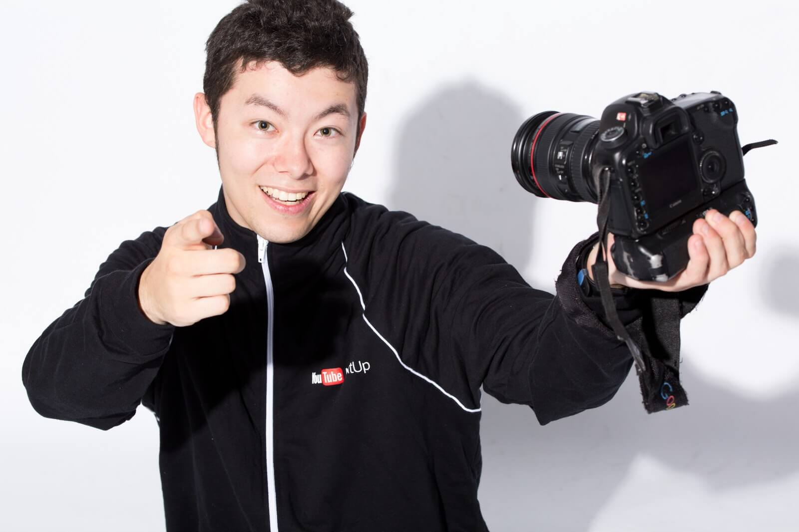

import { YouTube } from "@astro-community/astro-embed-youtube";

YouTube などの動画はもちろん、発表のスライドやポスターなどではフリー素材が重宝します。今回は、フリーの画像・音楽・効果音・フォントでオススメのものを紹介します。

## 音楽

動画では BGM が重要な要素です。

### DOVA-SYNDROME

[DOVA-SYNDROME](https://dova-s.jp/_mobile/)は、YouTube で広く利用されているフリー BGM のサイトです。

たとえば、「水溜りボンド」さんのオープニングの音楽、[Cat life](https://dova-s.jp/_mobile/bgm/play2558.html)も DOVA-SYNDROME の BGM です。基本的に著作権表示の必要もなく、使いやすいです。

- 商用利用：可（作曲した人によっては商用利用不可の場合があります）
- 帰属表示：不要（作曲した人によっては帰属表示必須な場合があります）

### YouTube Audio Library

[YouTube Audio Library](https://www.youtube.com/audiolibrary/music)は、YouTube 公式のフリー音源のサイトです。

Audio Library の BGM は、YouTube Studio（YouTube チャンネルの管理ツール）から動画に挿入でき、動画編集ソフトを持っていない人にもオススメです。もちろん、ダウンロードして動画編集ソフトで使用することもできます。

「フェルミ研究所」さんのオープニングの「Jazz In Paris」やエンディングの「Sophomore Makeout」のも YouTube Audio Library の BGM です。

著作権表示が必要なものと不要なものがあります。また、YouTube 用の BGM なので YouTube 以外の動画での使用は控えたほうがよいでしょう。

↓Jazz In Paris

<YouTube id="mNLJMTRvyj8" />

↓Sophomore Makeout

<YouTube id="g2HzEvU1roY" />

- 商用利用：可
- 帰属表示：必須と不要が混在

### 効果音ラボ

[効果音ラボ](https://soundeffect-lab.info/)は、YouTube で広く利用されているフリーの効果音のサイトです。基本的に著作権表示の必要もなく、多くの動画で使われています。

- 商用利用：可
- 帰属表示：不要

## フォント

さまざまなフォントがあり、それぞれ見た目やライセンスが違います。ライセンスに関しては、印刷物は問題なくても画像や動画は不可だったり、商用利用不可だったりする場合があります。

### IPA フォント

[IPA](https://www.ipa.go.jp/)（独立行政法人　情報処理推進機構）が公開している[IPA フォント](https://www.ipa.go.jp/osc/ipafont)は、ライセンスに動画や画像で使用できる旨が書かれており、安心して利用できます。

- 商用利用：可
- 帰属表示：不要

### Noto Sans・Noto Serif

[Noto Sans](https://fonts.google.com/specimen/Noto+Sans+JP)と[Noto Serif](https://fonts.google.com/specimen/Noto+Serif+JP)は Adobe と Google が共同で開発したフリーフォントです。中国語・日本語・韓国語に対応しています。

Noto Sans と Noto Serif は Google 側での呼び名で、Adobe 側では[源ノ角ゴシック](https://github.com/adobe-fonts/source-han-sans/tree/release)（英名：Source Han Sans）、[源ノ明朝](https://github.com/adobe-fonts/source-han-serif/tree/release)（英名：Source Han Serif）と呼ばれています。

Google の Noto ファミリーと Adobe の Source Han ファミリーは呼び名が違うだけでほぼ同じです。ただし、2021 年 6 月 12 日現在、Adobe の源ノ角ゴシックのみが太さを無段階で調整できるバリアブルフォントに対応しています。

- 商用利用：可
- 帰属表示：不要

### League Spartan Variable

[League Spartan Variable](https://github.com/theleagueof/league-spartan)は、幾何学的なデザインのバリアブルフォントです。

細いときは円と直線のみで構成されたオシャレなデザイン、太いときはしっかりとした頼もしいデザインです。太さによって印象が変わるので、とても重宝します。

- 商用利用：可
- 帰属表示：不要

### PixelMplus

[PixelMplus](http://itouhiro.hatenablog.com/entry/20130602/font)は、ゲーム風のフォントで漢字にも対応しています。また、ライセンスも非常にゆるいため使いやすいフォントです。「自由に使用できる」とのことです。

- 商用利用：可
- 帰属表示：不要

## 画像

資料や動画はイメージ画像があったほうが分かりやすくなります。

### いらすとや

[いらすとや](https://www.irasutoya.com/)のイラストはさまざまなところで利用されています。あなたもきっと一度は見たことがあるはずです。

- 商用利用：可
- 帰属表示：不要

### ぱくたそ

[ぱくたそ](https://www.pakutaso.com/)は、いらすとやと違って写真のフリー素材のサイトです。ぱくたそは、非常に多くの写真がそろっています。ちなみに、この記事の冒頭の画像もぱくたそのフリー素材です。

- 商用利用：可
- 帰属表示：不要

### Pixabay

[Pixabay](https://pixabay.com/ja/)には、大量の写真や動画、イラスト、アイコンなどがそろっています。ネットのニュース記事や YouTube の動画でよく使用されています。

商用利用可で、帰属表示も不要です。ただし、別のライセンスの下に公開されている素材が勝手にアップロードされている場合もあるので注意が必要です。

- 商用利用：可
- 帰属表示：不要

### Adobe Stock

[Adobe Stock](https://stock.adobe.com/jp/free)は本来有料ですが、一部の素材は無料で使用できます。

画像や動画、イラストなどがそろっています。

- 商用利用：可
- 帰属表示：不要

## 最後に

各フリー素材は、それぞれのライセンスを参照し、ご自身の責任のもとでご利用ください。また、本記事内でのライセンスに関する記述はあくまで私個人の解釈で、法的助言ではありません。ご了承ください。(.\_.)
