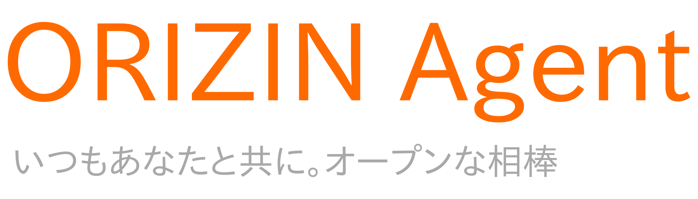
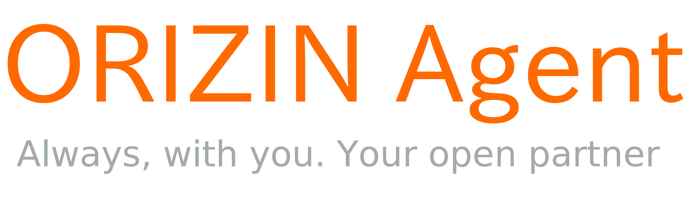
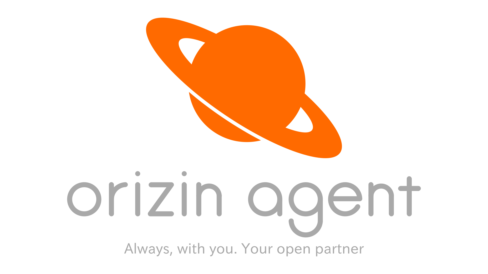

私が制作している会話を目的としたルールベースのオープンソースのAIアシスタント「ORIZIN Agent」。実は今まで、ちゃんとしたロゴというロゴがなかったので、しっかり作ることにしました。

## いままで

これが、今までのロゴ（？）です。

英語版

非常にシンプルなデザインで、もはやロゴというより名前とキャッチコピーを書いただけです...。

## 新しいロゴ

これが、新しいロゴです。

「ORIZIN Agent」という文字がすべて小文字になりました。また、今までは文字だけだったのに対し、土星のマークが入りました。土星のマークは、orizin agentのバージョンの開発コードが惑星の名前になっていることに由来しています。

「orizin agent」という文字にとてもこだわっています。今までは既存のフォント（IPA Pゴシック）を使用していましたが、新しいロゴではInkscapeを使用して端の丸い直線と円を組み合わせて文字を1からデザインしました。キャッチコピーについては、今まで通りIPA Pゴシックを使用しています。

## さいごに

一応今回紹介したロゴはまだ製作途中で、これから色々なバージョンを作ったり改善したりしていきますが、今までと比べ物にならないくらいのクオリティに仕上がっていると思います。
