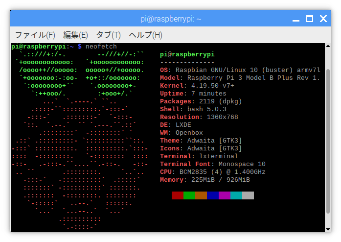
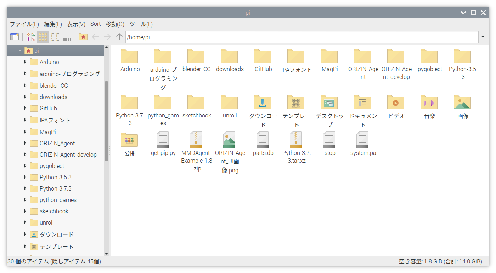

:::note
この記事は、私がQiitaに投稿したものに少し変更を加えたものです。[この記事をQiitaで読む](https://qiita.com/Robot-Inventor/items/b565e323b94fc2985ec0)
:::

## Raspberry Pi 4 Model B発売

2019年6月24日、「$35 PC」として有名なRaspberry Piの最新モデル「Raspberry Pi 4 Model B」の販売が海外で開始されました。また、2019年11月26日に日本での販売も始まりました。

Raspberry Pi 4 Model Bの大まかな仕様は、次のような感じです。

<!-- 引用ブロックはMarkdownに変換したときに改行が入らなかったためHTMLを使用 -->

<blockquote>
    <p>
        <b>Raspberry Pi 4 Model B</b><br>
        Here are the highlights:
    </p>
    <p>
        -A 1.5GHz quad-core 64-bit ARM Cortex-A72 CPU (~3× performance)<br>
        -1GB, 2GB, or 4GB of LPDDR4 SDRAM<br>
        -Full-throughput Gigabit Ethernet<br>
        -Dual-band 802.11ac wireless networking<br>
        -Bluetooth 5.0<br>
        -Two USB 3.0 and two USB 2.0 ports<br>
        -Dual monitor support, at resolutions up to 4K<br>
        -VideoCore VI graphics, supporting OpenGL ES 3.x<br>
        -4Kp60 hardware decode of HEVC video<br>
        -Complete compatibility with earlier Raspberry Pi products
    </p>
    <p>
        <a href="https://www.raspberrypi.org/blog/raspberry-pi-4-on-sale-now-from-35/">公式サイトのブログ</a>より引用
    </p>
</blockquote>

日本語に翻訳すると、大体こんな感じです。

<blockquote>
    <p>
        <b>Raspberry Pi 4 Model B</b><br>
        Raspberry Pi 4 Model Bの主要な情報：
    </p>
    <p>
        -最大でパフォーマンスが3倍の 1.5GHz 64-bitのクアッドコア ARM Cortex-A72 CPU<br>
        -1GB、2GBまたは4GB の LPDDR4 SDRAMメモリ<br>
        -フルスループットのギガビットイーサネット<br>
        -デュアルバンドの 802.11ac ワイヤレス LAN<br>
        -Bluetooth5.0<br>
        -USB2.0 ポートと USB3.0 ポートそれぞれ2つずつ<br>
        -解像度が 4K にアップし、デュアルモニターをサポート<br>
        -ビデオコア VI グラフィックスと OpenGL ES 3.x のサポート<br>
        -4K の 60fps での HEVCビデオのハードウェアデコード<br>
        -完璧な後方互換
    </p>
</blockquote>

## Raspbian StretchからBusterへ

そして、いつもどおり最新のRaspberry Piに対応した新しいRaspbian（Raspberry Pi用のOS）がリリースされました。

今まではRaspbian Stretchでしたが、新しいOSはRaspbian Busterです。ちなみに、Raspbianが元にしているLinuxディストリビューションのDebianのBusterは2019年7月7日リリースです。

DebianよりもRaspbianのBusterの方が先にリリースされたことについては、公式サイトのブログの[Raspbian Busterについての記事](https://www.raspberrypi.org/blog/buster-the-new-version-of-raspbian/)に詳しく書かれています。

新OSでは、UIデザインが変わったりするようです。

## OSを更新しよう

公式ではStretchからBusterに更新するのではなくBusterをクリーンインストールすることを推奨していますが、面倒なので更新します。しかし、あくまで自己責任でお願いします。

また、バックアップを取っておいた方がいいでしょう。

最初に注意しておきます。先ほど紹介した記事には30分から数時間かかると書いてありますが、確実に数時間かかります。まとまった時間が取れるときに更新するべきです。

では、更新していきましょう。ターミナルで

```
$ sudo nano /etc/apt/sources.list
```

を実行し、ファイル内の"stretch"をすべて"buster"に書き換えます。私の環境では2か所でした。

次に

```
$ sudo nano /etc/apt/sources.list.d/raspi.list
```

を実行し、同じ作業をします。

そして、お決まりの

```
$ sudo apt dist-upgrade
または
$ sudo apt-get dist-upgrade
```

私の環境では、新たにインストールしたりアップグレードしたりするパッケージが1300個くらいありました。

測っていなかったので正確には分かりませんが、3時間〜4時間くらいかかります。しかし、それでも有線LANだったのでWi-F（無線LAN）だと場合によってはもっとかかる可能性があります。

また、何回か「この設定って、どうする？」的なことを聞かれたので、更新を始めたら放置しておくというやり方はオススメできません。放置だと、何か聞かれたら最後、そこから先に進みません。定期的に何か聞かれていないか確認しましょう。

何か聞かれた場合、基本的には、回答の選択肢にY（Yes）があればy 、ターミナルの画面1つ分以上を埋め尽くす良く分からないメッセージが出たら「q」と答えれば大丈夫です（たぶん。保証はできません）。

その後、念のため、以下も実行します。

```
$ sudo apt-get upgrade
$ sudo apt-get autoremove
$ sudo apt-get autoclean
```

2つ目のコマンドを実行すると、「Stretchで必要だったけどBusterで不要になったもの」が削除されます。

サポートされていないパッケージもあるようなので

```
$ sudo apt purge timidity lxmusic gnome-disk-utility deluge-gtk evince wicd wicd-gtk clipit usermode gucharmap gnome-system-tools pavucontrol
```

で削除します。

これで、Raspbian Busterを導入できました。
証拠↓（neofetchは、システムの情報とOSのロゴのアスキーアートを表示してくれます。興味があったらインストールしてみてください）



OSの欄に"buster"と表示されています。

## UIをBuster化

上記の長い更新をしても、UIはおそらく何も変わらないはずです。StretchのUIではなくBusterのUIにするには、再起動したあと

```
メインメニュー > Appearance Settings > Defaults タブ
```

のいくつかあるSet Defaultsボタンの内、自分の使っている画面にあったものを押します。ただし、これを押すと、デスクトップの壁紙やウィンドウ上部の色なども自動的に変更されるため、カスタマイズしていた場合は再度設定が必要になります。また、ボタンを間違えた場合はそのまま正しいボタンを押せば問題ありません。ちなみに、メインメニューは、Raspberry Piの画面上部のタスクバーの1番左にあるRaspberry Piのロゴです。

## 新しいUIは、「平ら」であります

新しいUIは、StretchのUIのボタンにあったような立体感がなくなり、全体的に平べったくなっています。また、ウィンドウ右上の「閉じる」「ウィンドウの最大化」「ウィンドウを隠す」ボタンの内、「閉じる」以外の2つのボタンのデザインが変わりました。デザインは、[Raspbian Busterについての記事](https://www.raspberrypi.org/blog/buster-the-new-version-of-raspbian/)の画像を見るのが分かりやすいです。

## Stretchからの変更点

Raspbian Stretchから変更された点を気付き次第追記します。

| 変更点                           | Stretch    | Buster                                                                                 |
| :------------------------------- | :--------- | :------------------------------------------------------------------------------------- |
| ボタンのデザイン                 | 影あり     | 影（ほぼ）なし                                                                         |
| ウィンドウ上部のボタンのデザイン | _ □ ✕      | [公式サイト](https://www.raspberrypi.org/blog/buster-the-new-version-of-raspbian/)参照 |
| ウィンドウの色                   | 水色       | グレー                                                                                 |
| デフォルトのデスクトップの壁紙   | 道路の写真 | どこかの寺院（？）の写真                                                               |
| 起動中の画面                     | -          | Stretchのときと同じ一連の画面 + Debianのロゴ画面                                       |

## 2019/07/14　追記

2019年7月10日にRaspbian Busterの新しいバージョンが公開され、Linuxカーネルが4.19.50から4.19.57に更新されました。その他の変更点は、[リリースノート](http://downloads.raspberrypi.org/raspbian/release_notes.txt)に書かれています。

## 2019/10/09　追記

久しぶりにsudo apt updateとsudo apt upgradeをしてみたらカーネルが4.19.66に更新され、ファイルマネージャーのアイコンのデザインが変わりました。また、それに伴い、デスクトップに置いているファイルのアイコンも変わりました。さらに、起動時にDebianロゴが表示されなくなりました。新デザインは、画像のような感じです。


