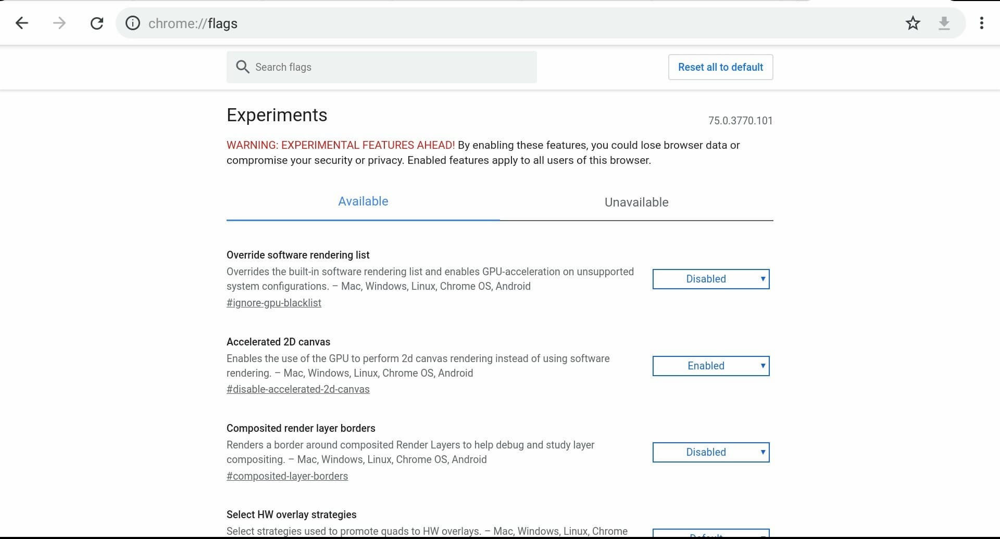
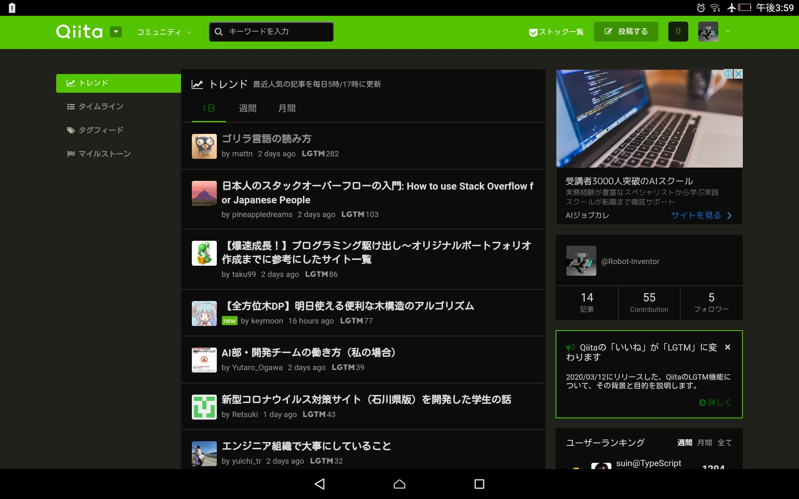
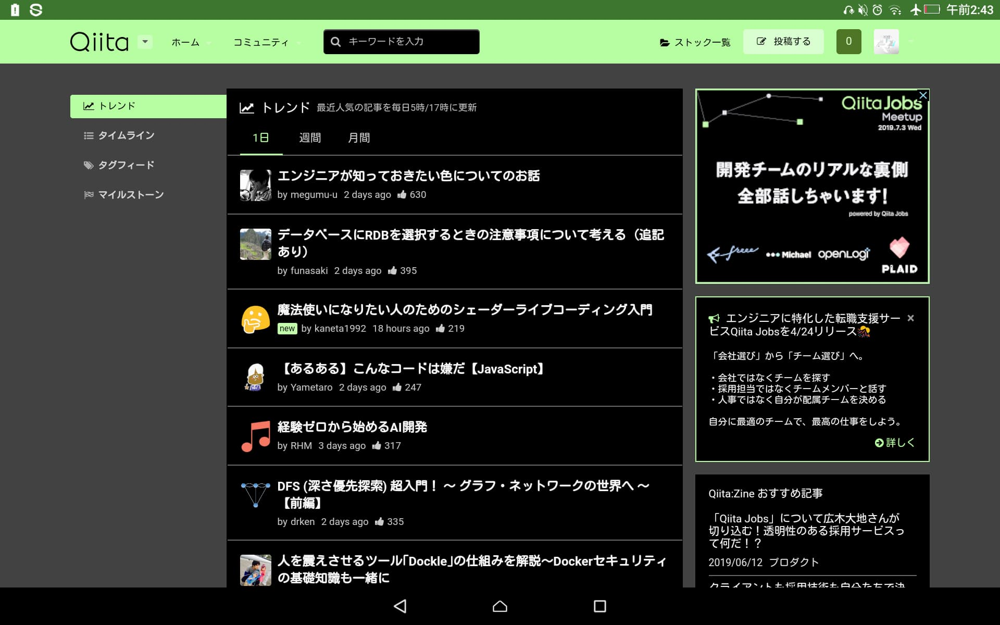

:::note warn
この記事で紹介する方法は開発途中の機能を有効にするものを含みます。ただし、UIのダークモードは正式な機能になっています。また、画像はAndroidタブレットのものであり、スマートフォンでは画面やボタンの配置等が異なる可能性があります。
:::

:::note info
この記事はGoogle Chrome 88向けです。また、この記事と同じ内容を[Qiita](https://qiita.com/Robot-Inventor/items/1d522c5858898ce63366)にも投稿してあります。
:::

## UIをダークモードにする

簡単です。

```
Chromeのメニュー（画面右上の丸が縦に3つ並んだマーク）> 設定 >
基本設定 > テーマ > 暗
```

を選択すればUIをダークモードにできます。

## Webコンテンツを強制的にダークモードにする

ダークモードに対応しているサイト（見た目を設定するCSSでprefers-color-schemeを使用しているサイト）なら、上記のUIの変更だけでコンテンツもダークモードになります。

ところが、現時点で対応しているサイトはほとんどありません。そこで、コンテンツを強制的にダークモードにするため、Chromeの試験機能を使います。

まず、Chromeを開き、検索窓に

```
chrome://flags
```

と入力します。

すると、開発途中の機能の有効・無効を切り替えるメニューが表示されます。



ページ内検索か、画面上部のSearch flagsに

```
dark
```

と入力し、[Darken websites checkbox in themes setting]という項目を[Enabled]にします。

すると、画面下部に

> Your changes will take effect the next time you relaunch Google Chrome.
> 訳：変更は、次回Google Chromeを再起動したときに有効になります。

と表示されるので[Relaunch]を押して再起動します。

再起動したら、設定の基本設定のテーマで、[システムのデフォルト]か[暗]を選びます。[ウェブサイトを暗くする]というチェックボックスが表示されるので、チェックを入れます。

すると、あらゆるWebページがダークモードで表示されるようになります。上手くダークにならない場合は1度Chromeを閉じてもう1度起動してみてください。

## 結果

ChromeのUIとWebサイトの表示の両方をダークモードにすると、下の画像のようになります（画像はQiitaのトップページ）。以前試験機能の別の項目しか方法がなかったときはコンテンツをダークモードにすると画像の色が反転していましたが、今は問題ありません。



ただし、サイトによっては配色が不自然になることがあります。また、背景が透過に設定されている画像が見にくくなったり、文字が読みにくくなったりする可能性もあります。気になる場合、ダークモードにするのはUIのみにしましょう。

下の画像は、以前試験機能の別の項目しか方法がなかったときにコンテンツをダークモードにした際のスクリーンショットです。配色や画像の色が不自然でしたが、現在は改善されているのが分かります。



## 設定の解除

UIのダークモードを解除したい場合は、ダークモードにしたときの設定画面で[明]を選んでください。

コンテンツをダークモードにする試験機能を解除するには、**設定の基本設定のテーマで、[ウェブサイトを暗くする]チェックボックスのチェックを外してから**

```
chrome://flags
```

で[Darken websites checkbox in themes setting]を[Default]に戻します。

すると、画面下部に

> Your changes will take effect the next time you relaunch Google Chrome.
> 訳：変更は、次回Google Chromeを再起動したときに有効になります。

と表示されるので[Relaunch]を押して再起動します。
