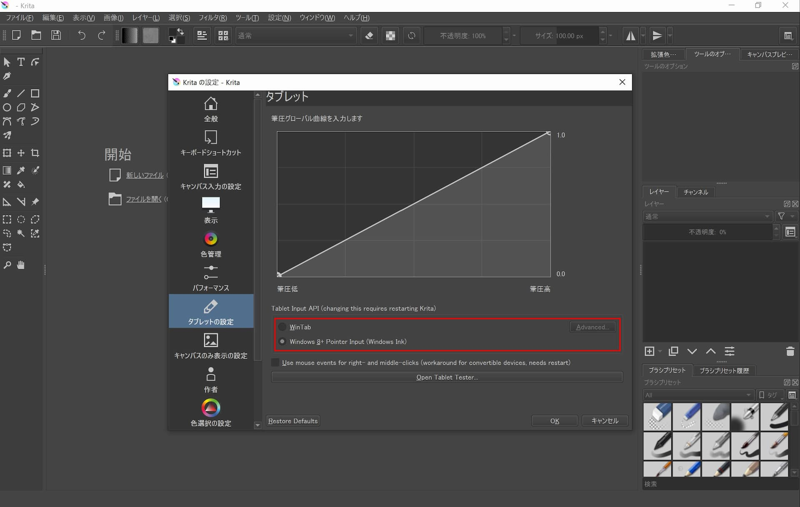

オープンソースのペイントソフトの[Krita](https://krita.org/)では、デフォルトの状態ではSurface Penの筆圧検知と消しゴム機能が使えません。

それらを使えるようにする方法はとても簡単です。

```
設定→Kritaの設定を変更→タブレットの設定
```

の「Win Tab」を画像の赤い枠線部を参考に「Windows 8+ Pointer Input (Windows Ink)」に変更するだけです。変更後は一応Kritaを再起動しましょう。


