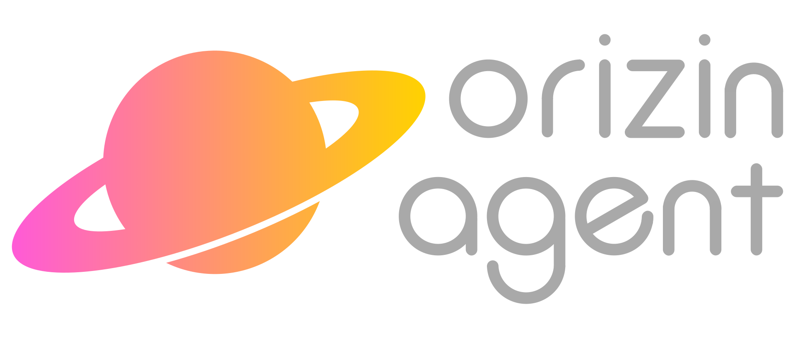

Pythonを始めてすぐの2年前の今日、[ORIZIN Agent HTML](https://github.com/Robot-Inventor/ORIZIN-Agent-HTML)の前身の[ORIZIN Agent](https://github.com/Robot-Inventor/ORIZIN_Agent)の最初のコミットが行われました。正直当時は開発が2年も続くとは思っていませんでした。

そこで今日、2周年を記念してORIZIN Agent HTMLの[v5.2](https://github.com/Robot-Inventor/ORIZIN-Agent-HTML/releases)をリリースします！！

本当は記念アップデートは大規模なアップデートにしたかったのですが、忙しくてリファクタリングと小規模なデザイン改善がメインになってしまいました。

この記事も時間がないので短めで申し訳ないです。

ORIZIN Agent HTMLの最初のコミットから2年になる今年の12月26日には大規模なアップデートをリリースしたいですね。
