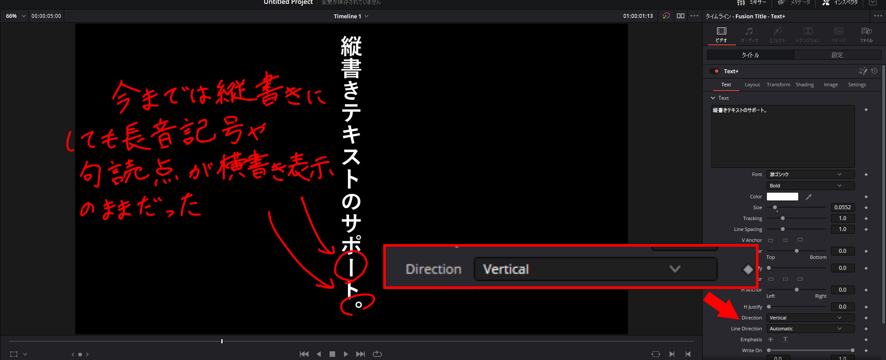

10月22日、DaVinci Resolveの最新版、バージョン17.4がリリースされました。今回のアップデートでは提供元のBlackmagic Designが新機能に関する動画を出していたり、変更点の一覧も体感でいつもの5倍くらいあったりと、大きなアップデートとなっています。

さまざまなメディアでも取り上げられているわけですが、ほとんど注目されていないものの日本語ユーザーにとってとても便利な機能が追加されています。[公式発表の日本語版](https://www.blackmagicdesign.com/jp/media/release/20211022-01)にはこんなことが書かれています。

> Fusionに関しては、言語のサポートが強化され、結合グリフや、アラビア語やヘブライ語などの右から左へのレイアウトがサポートされた。テキスト+ツールで、改善された縦書きレイアウト、回転、ラインの方向と組み合わせて使用することで、より幅広い言語およびレイアウトに対応可能。

> ・縦書きのテキスト+レイアウト、縦書きのグリフ、回転、線の方向を改善。

そう、「縦書きテキスト」が改善されたのです。確かに、今までも縦書きテキストを利用できました。しかし、今までは縦書きにしても長音記号や句読点が横書き表示のままで、いわば「縦書きを無理やり横書きにしている状態」でした。今回のアップデートにより、「ちゃんとした」縦書きができるようになりました。

今までは句読点をできるだけ使わないようにして、使う場合はその文字だけ向きを変えたり、長音記号は「|」（バーティカルライン）で代用したりしていました。今回のアップデートはとてもありがたいです。

