import ArticleCard from "@components/ArticleCard.astro";

Webブラウザーは[拡張機能](https://developer.mozilla.org/ja/docs/Mozilla/Add-ons/WebExtensions/What_are_WebExtensions)をインストールすることで機能を増やせます。この記事では、オススメの拡張機能20選を紹介します。すべて無料で使えますので、ぜひインストールしてみてください。

この記事は便利な拡張機能の紹介を目的としています。使い方については扱いません。また、拡張機能をインストールしすぎるとブラウザーが重くなる場合もあります。必要な拡張機能のみインストールしましょう。

※この記事の内容は執筆時点（2022年2月18日）のものです。この記事で紹介する拡張機能はすべて、筆者が実際に利用しているものですが、その安全性や効果について保証するものではありません。ご自身で判断の上、自己責任で利用してください。

便利ツール、プライバシー保護系、セキュリティー向上、Web開発者向けの4つに分けて紹介します。

- [便利ツール](#便利ツール)
- [プライバシー保護系](#プライバシー保護系)
- [セキュリティー向上](#セキュリティー向上)
- [Web開発者向け](#web開発者向け)

----------

## 便利ツール

### Audio Equalizer


イコライザーです。ブラウザーで音楽を聴く人にオススメです。20個ほどのプリセットが登録されており、プリセットの追加もできます。

#### 詳細

- 日本語：✖非対応
- アドオンバッジ：[おすすめ](https://support.mozilla.org/ja/kb/add-on-badges#w_osusumenokuo-zhang-ji-neng)
- ライセンス：[Mozilla Public License 2.0](http://www.mozilla.org/MPL/2.0/)
- ダークモード：✖非対応

#### リンク

- [公式サイト](https://mybrowseraddon.com/audio-equalizer.html)
- [Chrome版](https://chrome.google.com/webstore/detail/audio-equalizer/cjadmgobonfhilogbdgkkhnoojpgenfg)
- [Firefox版](https://addons.mozilla.org/ja/firefox/addon/audio-equalizer-wext/)

### Auto Tab Discard

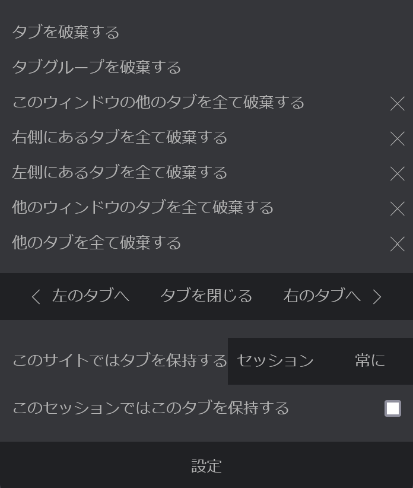

使っていないタブをスリープ（[*discard*](https://developer.mozilla.org/en-US/docs/Mozilla/Add-ons/WebExtensions/API/tabs/discard)）状態にして、CPUやメモリーの使用量を削減してくれる拡張機能です。どのようなタブをスリープ状態にするか細かく設定できます。Firefox版とChrome版で提供元の名前が違いますが、GitHubリポジトリーの[Download Links](https://github.com/rNeomy/auto-tab-discard#download-links)に掲載されているためどちらも公式と思われます。

#### 詳細

- 日本語：〇対応
- アドオンバッジ：[おすすめ](https://support.mozilla.org/ja/kb/add-on-badges#w_osusumenokuo-zhang-ji-neng)
- ライセンス：[Mozilla Public License 2.0](http://www.mozilla.org/MPL/2.0/)
- ダークモード：〇対応

#### リンク

- [公式サイト](https://add0n.com/tab-discard.html)
- [Chrome版](https://chrome.google.com/webstore/detail/auto-tab-discard/jhnleheckmknfcgijgkadoemagpecfol)
- [Firefox版](https://addons.mozilla.org/ja/firefox/addon/auto-tab-discard/)

### CopyTabTitleUrl

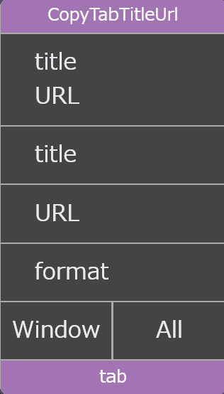

SNSで記事をシェアすることが多い人や、参考文献を書くことが多い人にオススメの拡張機能です。開いているWebページのタイトル、URLまたはその両方をコピーできます。[Markdown](https://ja.wikipedia.org/wiki/Markdown)形式でのコピーにも対応しています。

#### 詳細

- 日本語：△一部対応
- アドオンバッジ：なし
- ライセンス：[The MIT License](http://www.opensource.org/licenses/mit-license.php)
- ダークモード：〇対応

#### リンク

- [公式サイト](https://github.com/k08045kk/CopyTabTitleUrl)
- [Chrome版](https://chrome.google.com/webstore/detail/copytabtitleurl/lmgbdjfoaihhgdphombpgjpaohjfeapp)
- [Firefox版](https://addons.mozilla.org/ja/firefox/addon/copytabtitleurl/)

### Dark Reader

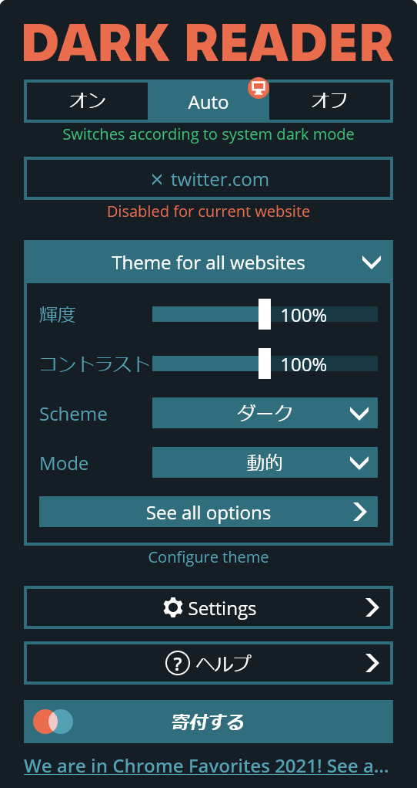

あらゆるWebページをダークモードにできる拡張機能です。

#### 詳細

- 日本語：△一部対応
- アドオンバッジ：[おすすめ](https://support.mozilla.org/ja/kb/add-on-badges#w_osusumenokuo-zhang-ji-neng)
- ライセンス：[The MIT License](http://www.opensource.org/licenses/mit-license.php)
- ダークモード：〇対応

#### リンク

- [公式サイト](https://darkreader.org/)
- [Chrome版](https://chrome.google.com/webstore/detail/dark-reader/eimadpbcbfnmbkopoojfekhnkhdbieeh)
- [Firefox版](https://addons.mozilla.org/ja/firefox/addon/darkreader/)

### Link to Text Fragment

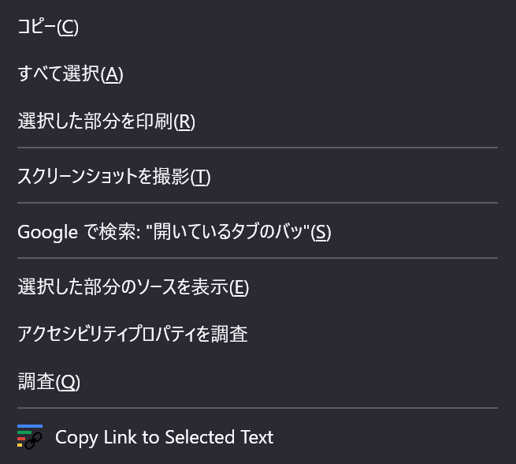

[Text Fragments](https://web.dev/text-fragments/)を利用して、Webページの特定のテキストへのリンクを作成したり読み込んだりするための拡張機能です。Chrome版も存在しますが、Chromeは[標準対応](https://chromestatus.com/feature/4733392803332096)しているため、わざわざ拡張機能をインストールする必要はありません。

#### 詳細

- 日本語：✖非対応
- アドオンバッジ：なし
- ライセンス：[Apache 2.0](https://www.apache.org/licenses/LICENSE-2.0)
- ダークモード：該当なし

#### リンク

- [公式サイト](https://github.com/GoogleChromeLabs/link-to-text-fragment)
- [Chrome版](https://chrome.google.com/webstore/detail/link-to-text-fragment/pbcodcjpfjdpcineamnnmbkkmkdpajjg)
- [Firefox版](https://addons.mozilla.org/ja/firefox/addon/link-to-text-fragment/)

### Multithreaded Download Manager

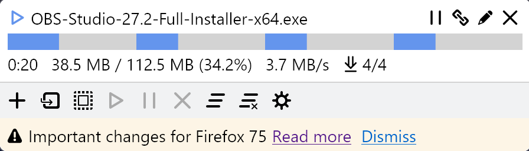

ファイルを分割して並列処理することで、高速でダウンロードできるようになります。小さなファイルだとあまり効果がありませんが、大きいファイルだとダウンロードが速くなることもあります。

GitHub[リポジトリー](https://github.com/jingyu9575/multithreaded-download-manager)の[README](https://github.com/jingyu9575/multithreaded-download-manager/blob/master/README.md)に次のように書かれており、この拡張機能はFirefox専用です。Chrome版は提供されていません。

> Download manager extension **for Firefox**, with multithreading support.
>
> — GitHubリポジトリーの[README](https://github.com/jingyu9575/multithreaded-download-manager/blob/master/README.md)より。強調は本記事の筆者による

#### 詳細

- 日本語：✖非対応
- アドオンバッジ：なし
- ライセンス：[Mozilla Public License 2.0](http://www.mozilla.org/MPL/2.0/)
- ダークモード：✖非対応

#### リンク

- [公式サイト](https://github.com/jingyu9575/multithreaded-download-manager)
- Chrome版なし
- [Firefox版](https://addons.mozilla.org/ja/firefox/addon/multithreaded-download-manager/)

### QR Code


開いているWebページの[QRコード](https://ja.wikipedia.org/wiki/QR%E3%82%B3%E3%83%BC%E3%83%89)を作成する拡張機能です。単にQRコードを表示するだけでなく、QRコードの画像を[PNG形式](https://developer.mozilla.org/ja/docs/Glossary/PNG)と[SVG形式](https://developer.mozilla.org/ja/docs/Web/SVG)から選んでダウンロードできます。QRコードを作成する拡張機能は他にもたくさんありますが、[ベクター画像](https://ja.wikipedia.org/wiki/%E3%83%99%E3%82%AF%E3%82%BF%E3%83%BC%E7%94%BB%E5%83%8F)の（拡大してもぼやけない）SVG形式でのダウンロードに対応しているため、この拡張機能を利用しています。Firefox版のみの提供で、Chrome版は提供されていません。

#### 詳細

- 日本語：✖非対応
- アドオンバッジ：なし
- ライセンス：[GNU General Public License v3.0](http://www.gnu.org/licenses/gpl-3.0.html)
- ダークモード：〇対応

#### リンク

- [公式サイト](https://github.com/pudymody/firefox-qr)
- Chrome版なし
- [Firefox版](https://addons.mozilla.org/ja/firefox/addon/qr-code-address-bar/)

### QR Code Reader

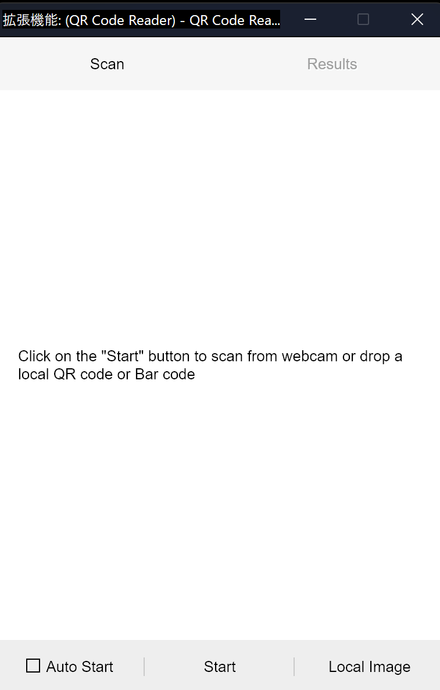

文字どおりQRコードリーダーです。[バーコード](https://ja.wikipedia.org/wiki/%E3%83%90%E3%83%BC%E3%82%B3%E3%83%BC%E3%83%89)もスキャンできます。

#### 詳細

- 日本語：✖非対応
- アドオンバッジ：なし
- ライセンス：[Mozilla Public License 2.0](http://www.mozilla.org/MPL/2.0/)
- ダークモード：✖非対応

#### リンク

- [公式サイト](https://add0n.com/qrcode-reader.html)
- [Chrome版](https://chrome.google.com/webstore/detail/qr-code-reader/jhigigpkpbeofhknomiadocogenlpcde)
- [Firefox版](https://addons.mozilla.org/ja/firefox/addon/qr-code-reader/?utm_source=addons.mozilla.org&utm_medium=referral&utm_content=search)

### SoundFixer

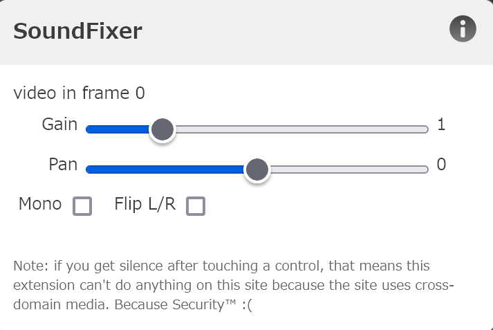

タブごとに音量や[パン](https://ja.wikipedia.org/wiki/%E3%83%91%E3%83%B3%E3%83%8B%E3%83%B3%E3%82%B0_(%E9%9F%B3%E9%9F%BF))を調整できる拡張機能です。GitHubの[リポジトリー](https://github.com/unrelentingtech/soundfixer)にはFirefox版のリンクしか掲載されておらず、Firefox版とChrome版で提供元が違うことから、Chrome版は非公式と思われます。

#### 詳細

- 日本語：✖非対応
- アドオンバッジ：[おすすめ](https://support.mozilla.org/ja/kb/add-on-badges#w_osusumenokuo-zhang-ji-neng)
- ライセンス：[The Unlicense](https://github.com/unrelentingtech/soundfixer/blob/master/UNLICENSE)
- ダークモード：✖非対応

#### リンク

- [公式サイト](https://github.com/unrelentingtech/soundfixer)
- [Chrome版（非公式）](https://chrome.google.com/webstore/detail/soundfixer/mbhbddecpoendcifccfckjkigbinefkg)
- [Firefox版](https://addons.mozilla.org/ja/firefox/addon/soundfixer/)

### Tab Session Manager

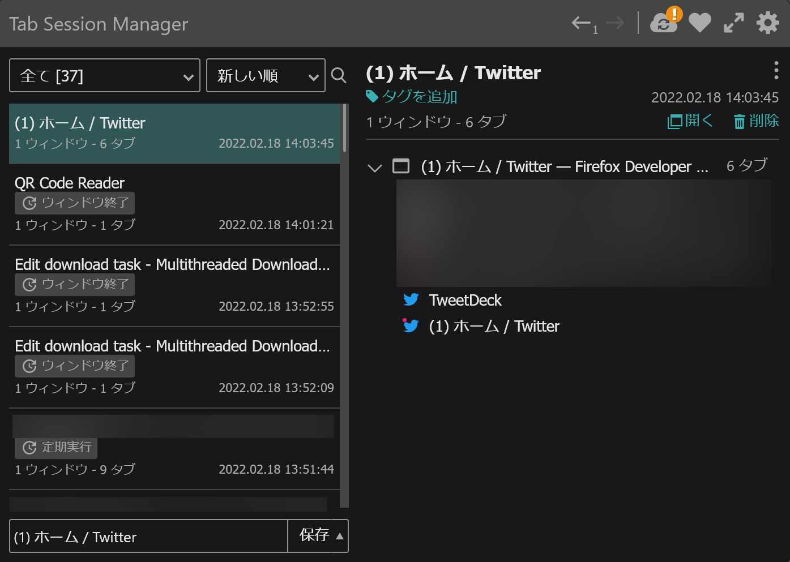

ブラウザーで開いているタブの一覧のバックアップを取ったり、エクスポートしたりできる拡張機能です。開いているタブの一覧を定期的に保存する機能が付いているので、ブラウザーがクラッシュした際に開いていたタブを復元できます。また、タブをたくさん開いてそれらのタブをあとでもう一度見たいというときには、タブの一覧をエクスポート・[インポート](https://github.com/sienori/Tab-Session-Manager/wiki/Q&A:-How-to-import-sessions-from-other-extensions#import-to-tab-session-manager)できます。

#### 詳細

- 日本語：〇対応
- アドオンバッジ：[おすすめ](https://support.mozilla.org/ja/kb/add-on-badges#w_osusumenokuo-zhang-ji-neng)
- ライセンス：[Mozilla Public License 2.0](http://www.mozilla.org/MPL/2.0/)
- ダークモード：〇対応

#### リンク

- [公式サイト](https://tab-session-manager.sienori.com/)
- [Chrome版](https://chrome.google.com/webstore/detail/tab-session-manager/iaiomicjabeggjcfkbimgmglanimpnae)
- [Firefox版](https://addons.mozilla.org/ja/firefox/addon/tab-session-manager/)

### Twitter Bookmarks Search

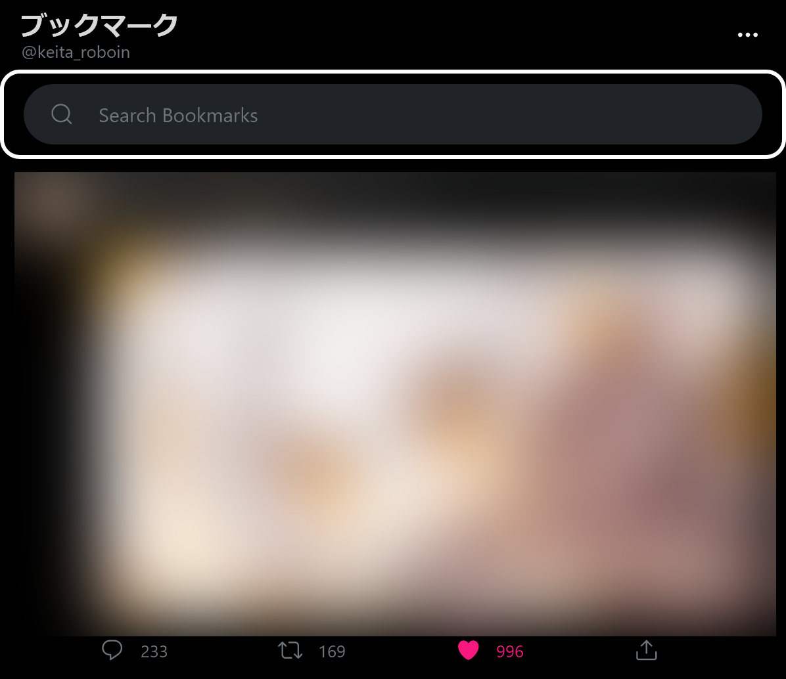

Twitterの[ブックマーク](https://help.twitter.com/ja/using-twitter/bookmarks)を検索できるようにする拡張機能です。ブックマークに保存されたすべてのツイートの中から検索できます。

この拡張機能は、あくまでTwitterのブックマーク機能で保存されたツイートを検索するものです。ブラウザーのブックマークから検索するわけではありません。ブラウザーのブックマークを検索したい場合は別の拡張機能が必要になります（Firefoxでは[標準対応](https://support.mozilla.org/ja/kb/bookmarks-firefox#w_butsukumakuwojian-tsukeruniha)）。

#### 詳細

- 日本語：✖非対応
- アドオンバッジ：なし
- ライセンス：[The MIT License](http://www.opensource.org/licenses/mit-license.php)
- ダークモード：〇対応

#### リンク

- [公式サイト](https://github.com/flybayer/twitter-bookmarks-search)
- [Chrome版](https://chrome.google.com/webstore/detail/twitter-bookmarks-search/flkokionhgagpmnhlngldhbfnblmenen)
- [Firefox版](https://addons.mozilla.org/ja/firefox/addon/twitter-bookmarks-search-2/)

### Web Search Navigator

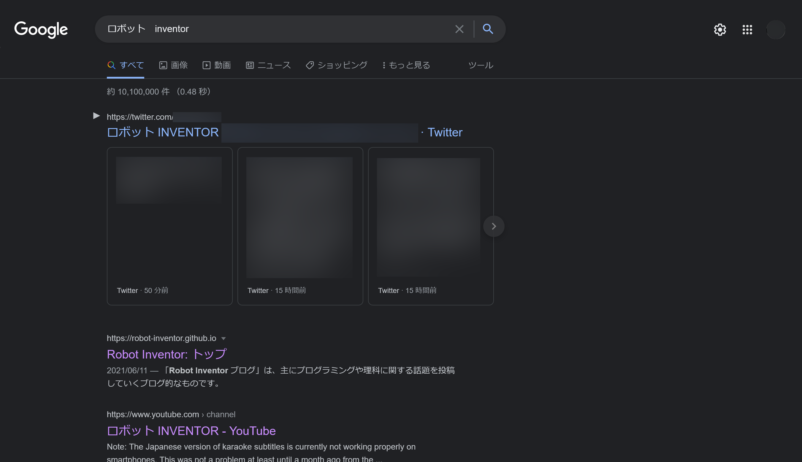

[Google検索](https://www.google.com/)の検索結果にキーボードショートカットを追加する拡張機能です。上下矢印キーで検索結果を選択、選択したページをエンターキーで開けます。キーボードから手を放さずに検索できるので便利です。

#### 詳細

- 日本語：✖非対応
- アドオンバッジ：なし
- ライセンス：[The MIT License](http://www.opensource.org/licenses/mit-license.php)
- ダークモード：〇対応

#### リンク

- [公式サイト](https://github.com/infokiller/web-search-navigator)
- [Chrome版](https://chrome.google.com/webstore/detail/web-search-navigator/cohamjploocgoejdfanacfgkhjkhdkek)
- [Firefox版](https://addons.mozilla.org/ja/firefox/addon/web-search-navigator/)

## プライバシー保護系

### ClearURLs

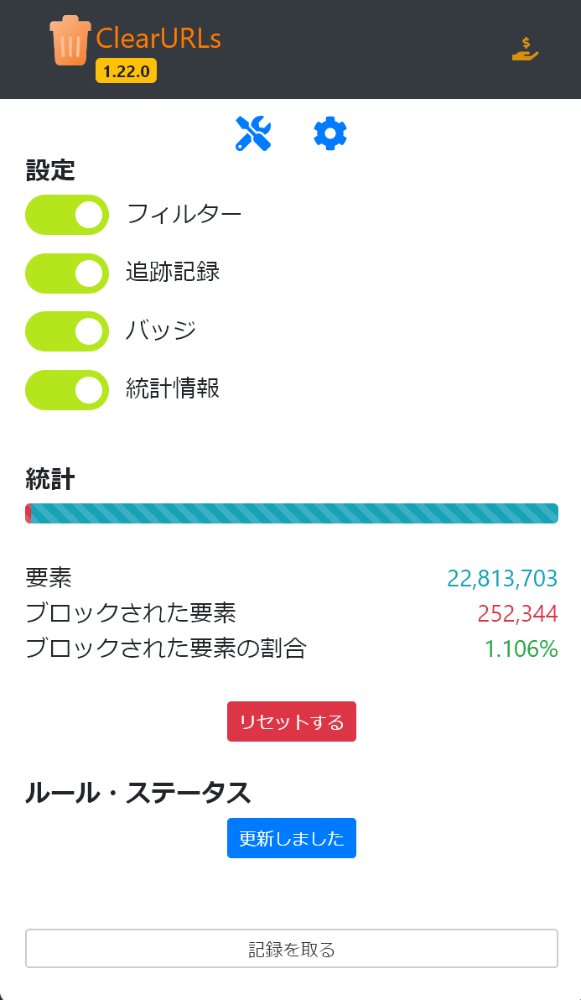

URLには[URLパラメーター](https://e-words.jp/w/URL%E3%83%91%E3%83%A9%E3%83%A1%E3%83%BC%E3%82%BF.html)というものが存在します。URLパラメーターには重要な情報（Google検索なら検索キーワード、YouTubeなら視聴する動画のIDなど）が含まれることもありますが、一方でトラッキングに使われることもあります。ClearURLsは、URLからトラッキングに利用されている不要なURLパラメーターを自動的に削除してくれます。これにより、プライバシーが保護されURLも短くなります。

[公式ページ](https://docs.clearurls.xyz/1.22.0/#application)に掲載されている例を引用すると、たとえばこんなURLが

```
https://www.amazon.com/dp/exampleProduct/ref=sxin_0_pb?__mk_de_DE=ÅMÅŽÕÑ&keywords=tea&pd_rd_i=exampleProduct&pd_rd_r=8d39e4cd-1e4f-43db-b6e7-72e969a84aa5&pd_rd_w=1pcKM&pd_rd_wg=hYrNl&pf_rd_p=50bbfd25-5ef7-41a2-68d6-74d854b30e30&pf_rd_r=0GMWD0YYKA7XFGX55ADP&qid=1517757263&rnid=2914120011
```

こんなに短くなります。

```
https://www.amazon.com/dp/exampleProduct
```

#### 詳細

- 日本語：〇対応
- アドオンバッジ：[おすすめ](https://support.mozilla.org/ja/kb/add-on-badges#w_osusumenokuo-zhang-ji-neng)
- ライセンス：[GNU Library General Public License v3.0](http://www.gnu.org/licenses/lgpl-3.0.html)
- ダークモード：✖非対応

#### リンク

- [公式サイト](https://docs.clearurls.xyz/)
- [Chrome版](https://chrome.google.com/webstore/detail/clearurls/lckanjgmijmafbedllaakclkaicjfmnk)
- [Firefox版](https://addons.mozilla.org/ja/firefox/addon/clearurls/)

### DuckDuckGo Privacy Essentials

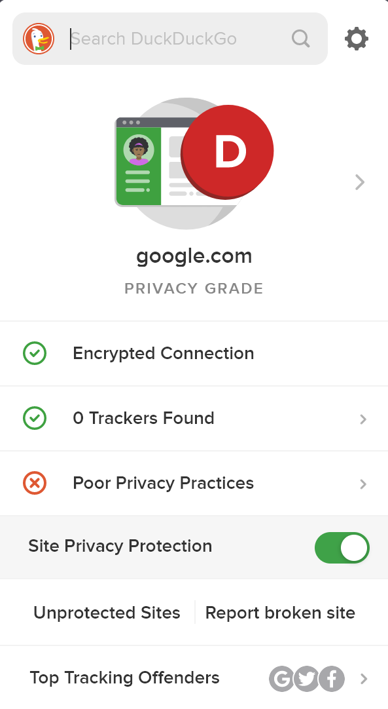

DuckDuckGo Privacy Essentialsはトラッカーをブロックしてくれる拡張機能です。プライバシーに配慮した検索エンジンを提供する[DuckDuckGo](https://duckduckgo.com/)が開発しています。トラッカーのブロックのほかに、サイトのプライバシーを評価してくれる機能も付いています。

#### 詳細

- 日本語：✖非対応
- アドオンバッジ：[おすすめ](https://support.mozilla.org/ja/kb/add-on-badges#w_osusumenokuo-zhang-ji-neng)
- ライセンス：[Apache License, Version 2.0](https://www.apache.org/licenses/LICENSE-2.0)
- ダークモード：✖非対応

#### リンク

- [公式サイト](https://duckduckgo.com/app)
- [Chrome版](https://chrome.google.com/webstore/detail/duckduckgo-privacy-essent/bkdgflcldnnnapblkhphbgpggdiikppg)
- [Firefox版](https://addons.mozilla.org/ja/firefox/addon/duckduckgo-for-firefox/)

### Privacy Badger

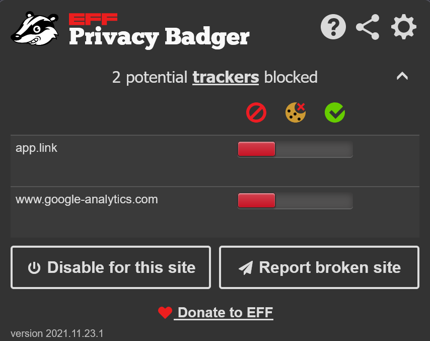

Privacy Badgerはトラッカーを自動でブロックしてくれる拡張機能です。[ドメイン](https://developer.mozilla.org/ja/docs/Glossary/Domain)ごとに「ブロックなし（*allow a domain*）」「[Cookie](https://developer.mozilla.org/ja/docs/Glossary/Cookie)をブロック（*block cookies*）」「ブロック（*block a domain*）」の3段階から自動で選択されます。

#### 詳細

- 日本語：✖非対応
- アドオンバッジ：[おすすめ](https://support.mozilla.org/ja/kb/add-on-badges#w_osusumenokuo-zhang-ji-neng)
- ライセンス：[GNU General Public License v3.0](http://www.gnu.org/licenses/gpl-3.0.html)
- ダークモード：〇対応

#### リンク

- [公式サイト](https://privacybadger.org/)
- [Chrome版](https://chrome.google.com/webstore/detail/privacy-badger/pkehgijcmpdhfbdbbnkijodmdjhbjlgp)
- [Firefox版](https://addons.mozilla.org/ja/firefox/addon/privacy-badger17/)

### uBlock Origin

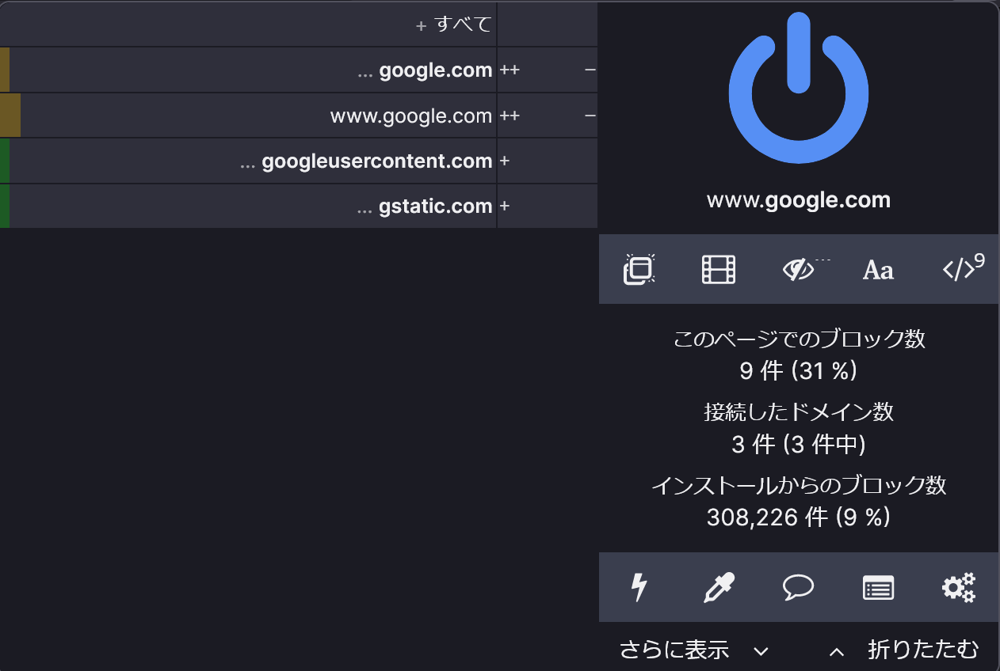

uBlock Originは、CPUやメモリーの使用量が少ない広告ブロッカーです。広告以外にも、一部のアフェリエイトリンクやトラッカーもブロックしてくれます。主要なすべてのブラウザーに対応していますが、[Firefox上でもっともよく動作](https://github.com/gorhill/uBlock/wiki/uBlock-Origin-works-best-on-Firefox)します。

#### 詳細

- 日本語：〇対応
- アドオンバッジ：[おすすめ](https://support.mozilla.org/ja/kb/add-on-badges#w_osusumenokuo-zhang-ji-neng)
- ライセンス：[Mozilla Public License 2.0](http://www.mozilla.org/MPL/2.0/)
- ダークモード：〇対応

#### リンク

- [公式サイト](https://ublockorigin.com/jp)
- [Chrome版](https://chrome.google.com/webstore/detail/ublock-origin/cjpalhdlnbpafiamejdnhcphjbkeiagm)
- [Firefox版](https://addons.mozilla.org/ja/firefox/addon/ublock-origin/)

## セキュリティー向上

### HTTPS Everywhere

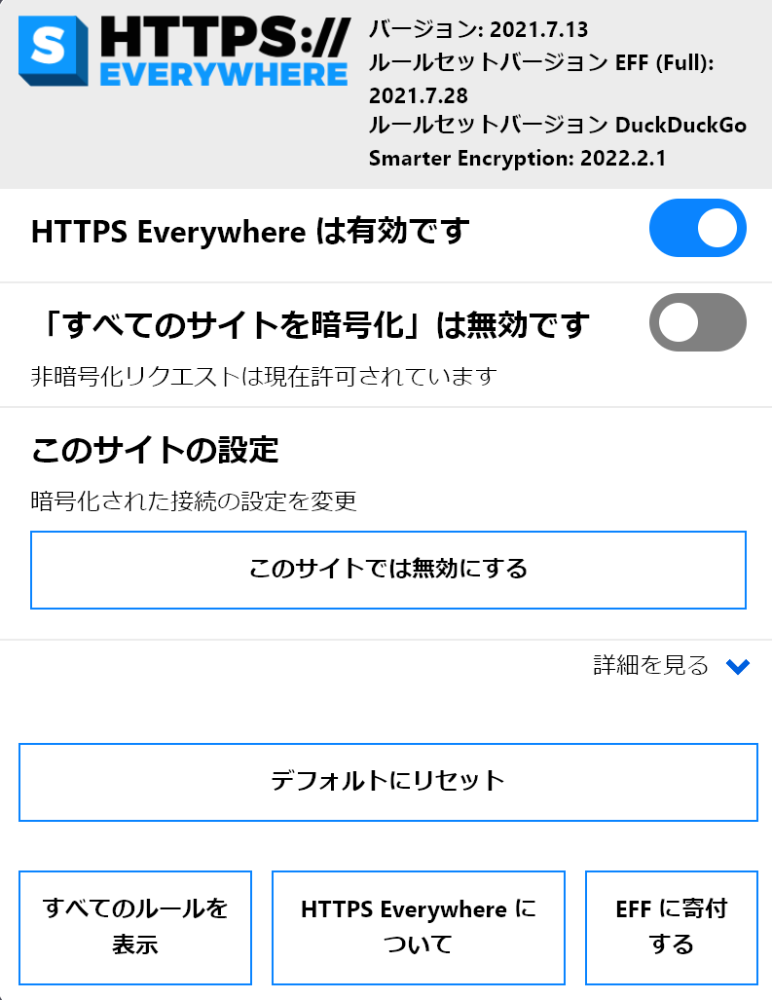

HTTPS Everywhereは、Webブラウザーの通信に[HTTPS接続](https://ja.wikipedia.org/wiki/HTTPS)を強制できる拡張機能です。HTTPSは通信を暗号化することで、通信中のデータの改ざんや盗聴を防げるものです。HTTPS Everywhereを使用してHTTPS接続を強制することで、セキュリティーを向上させられます。

現在のChromeには「[HTTPS-First Mode](https://blog.chromium.org/2021/07/increasing-https-adoption.html)」、Firefoxには「[HTTPS-Only モード](https://support.mozilla.org/ja/kb/https-only-prefs)」が標準搭載されているので、この拡張機能の必要性は低下しています。

:::caution
WebブラウザーのHTTPSサポートが充実したことを理由に、HTTPS Everywhereは2023年1月に廃止されました。詳細や代替手段については、こちらの記事で解説しています。

<ArticleCard link="/article/2022/08/12/https-everywhere-will-sunset/"/>
:::

#### 詳細

- 日本語：〇対応
- アドオンバッジ：[おすすめ](https://support.mozilla.org/ja/kb/add-on-badges#w_osusumenokuo-zhang-ji-neng)
- ライセンス：[Multiple](https://addons.mozilla.org/ja/firefox/addon/https-everywhere/license/)
- ダークモード：△一部対応

#### リンク

- [公式サイト](https://www.eff.org/ja/https-everywhere)
- [Chrome版](https://chrome.google.com/webstore/detail/https-everywhere/gcbommkclmclpchllfjekcdonpmejbdp)
- [Firefox版](https://addons.mozilla.org/ja/firefox/addon/https-everywhere/)

## Web開発者向け

### Firefox Multi-Account Containers

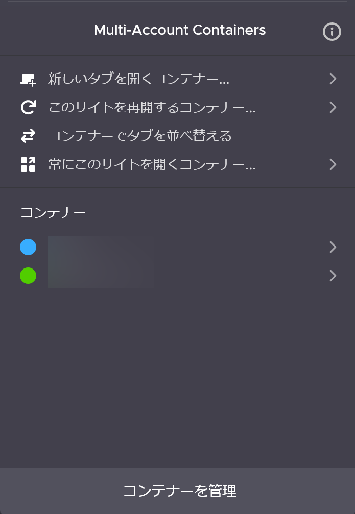

Firefoxでアカウントを切り替えてブラウジングするための拡張機能です。

たとえば仕事用のコンテナーと趣味用のコンテナーを分けることで、仕事用のコンテナーではさまざまなサービスに仕事用のアカウントでログイン、趣味用のコンテナーでは個人のアカウントでログインといった切り替えができます。

また、複数のアカウントへの同時ログインも可能です。

複数のアカウントを切り替える必要がある人にオススメです。[Mozilla](https://www.mozilla.org/ja/)がFirefoxの[コンテナータブ](https://support.mozilla.org/ja/kb/containers)機能を利用して開発している拡張機能なので、Chrome版はありません。

#### 詳細

- 日本語：△一部対応
- アドオンバッジ：[Mozillaが作成](https://support.mozilla.org/ja/kb/add-on-badges#w_firefox-niyorukuo-zhang-ji-neng)
- ライセンス：[Mozilla Public License 2.0](http://www.mozilla.org/MPL/2.0/)
- ダークモード：〇対応

#### リンク

- [公式サイト](https://github.com/mozilla/multi-account-containers/)
- Chrome版なし
- [Firefox版](https://addons.mozilla.org/ja/firefox/addon/multi-account-containers/)

### Google Lighthouse

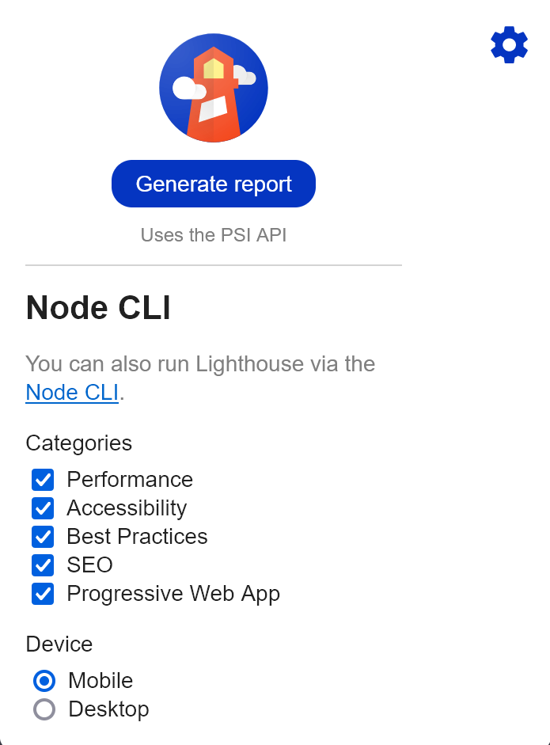

[PageSpeed Insights](https://pagespeed.web.dev/)で利用されている[Lighthouse](https://github.com/GoogleChrome/lighthouse)の拡張機能版です。Webページの読み込み速度やアクセシビリティー、SEO対策などの評価をしてくれる拡張機能です。

#### 詳細

- 日本語：✖非対応
- アドオンバッジ：なし
- ライセンス：[Apache-2.0](https://www.apache.org/licenses/LICENSE-2.0)
- ダークモード：△一部対応

#### リンク

- [公式サイト](https://github.com/GoogleChrome/lighthouse)
- [Chrome版](https://chrome.google.com/webstore/detail/lighthouse/blipmdconlkpinefehnmjammfjpmpbjk)
- [Firefox版](https://addons.mozilla.org/ja/firefox/addon/google-lighthouse/)

### Stylus

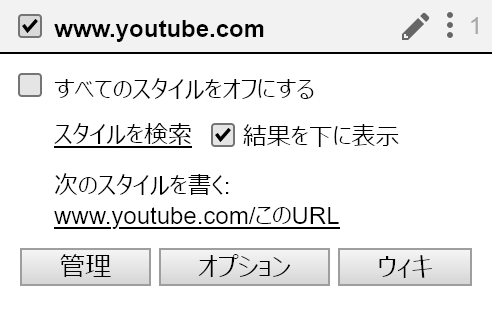

Webサイトの見た目をカスタマイズできる拡張機能です。自分で[CSS](https://developer.mozilla.org/ja/docs/Web/CSS)を書く必要があるので、一般向けではありません。

#### 詳細

- 日本語：〇対応
- アドオンバッジ：[おすすめ](https://support.mozilla.org/ja/kb/add-on-badges#w_osusumenokuo-zhang-ji-neng)
- ライセンス：[GNU General Public License v3.0](http://www.gnu.org/licenses/gpl-3.0.html)
- ダークモード：✖非対応

#### リンク

- [公式サイト](https://add0n.com/stylus.html)
- [Chrome版](https://chrome.google.com/webstore/detail/stylus/clngdbkpkpeebahjckkjfobafhncgmne)
- [Firefox版](https://addons.mozilla.org/ja/firefox/addon/styl-us/)
