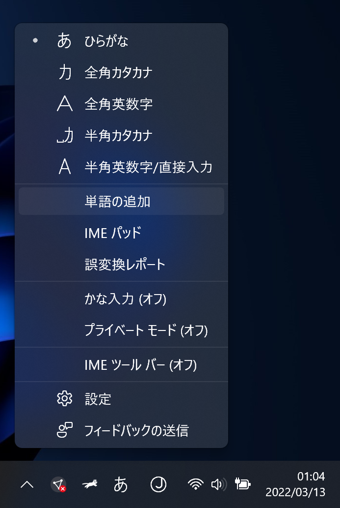
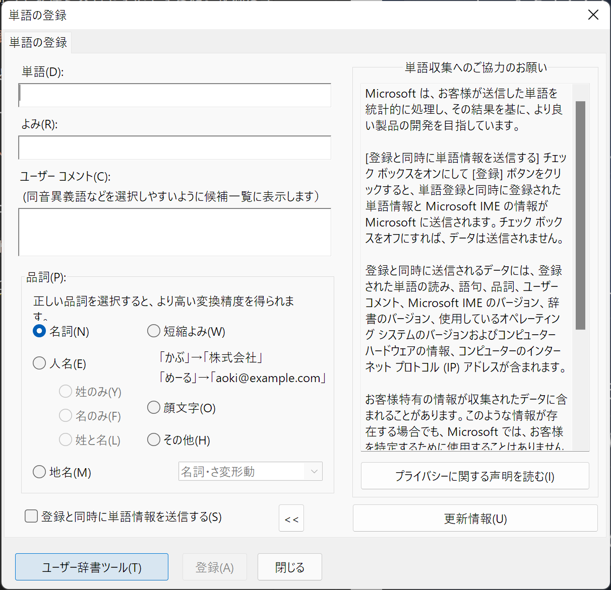

# Hololiveメンバーの名前をユーザー辞書に登録して変換しやすくする

Hololiveメンバーの名前って変換ミスしやすいですよね。便利なユーザー辞書を見つけたのでご紹介します。

- [ホロライブ用語・単語辞書 for Win10/macOS](https://github.com/heppokofrontend/hololive-dictionary)

このユーザー辞書を使うと、名前だけでなく、推しマーク・ハッシュタグ・ファンネーム・TwitterのIDも変換できます。とても便利。

使い方は公式リポジトリーが分かりやすいのでリンクだけ貼っておきます。

- [Windows 10での導入方法](https://github.com/heppokofrontend/hololive-dictionary/blob/main/WINDOWS.md)
- [macOSでの導入方法](https://github.com/heppokofrontend/hololive-dictionary/blob/main/MACOS.md)

ただ、Windows 11ではユーザー辞書ツールの開き方が少し変更されているのでその説明だけします。

タスクバー右下に表示されている［あ］または［A］を右クリックしてメニューを表示します。メニューの中の［単語の追加］をクリックします。

表示されたウィンドウの左下の［ユーザー辞書ツール］をクリックすると、ユーザー辞書ツールを開けます。

あとは、公式リポジトリーの[Windows 10での導入方法](https://github.com/heppokofrontend/hololive-dictionary/blob/main/WINDOWS.md)と同じです。
