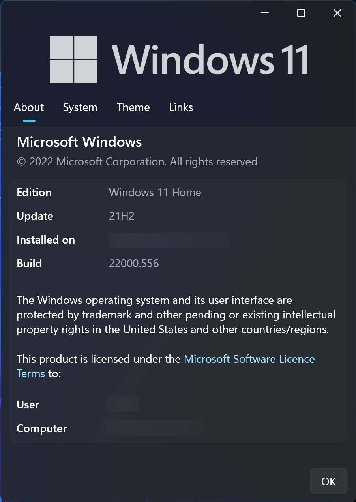
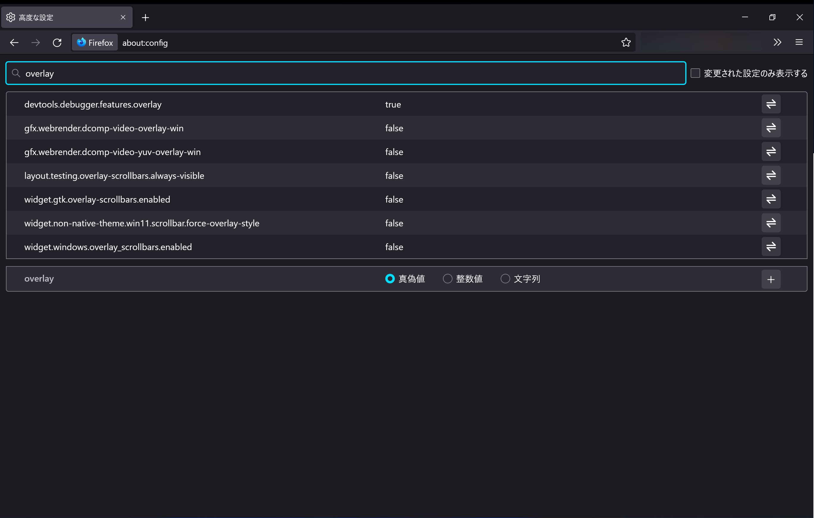
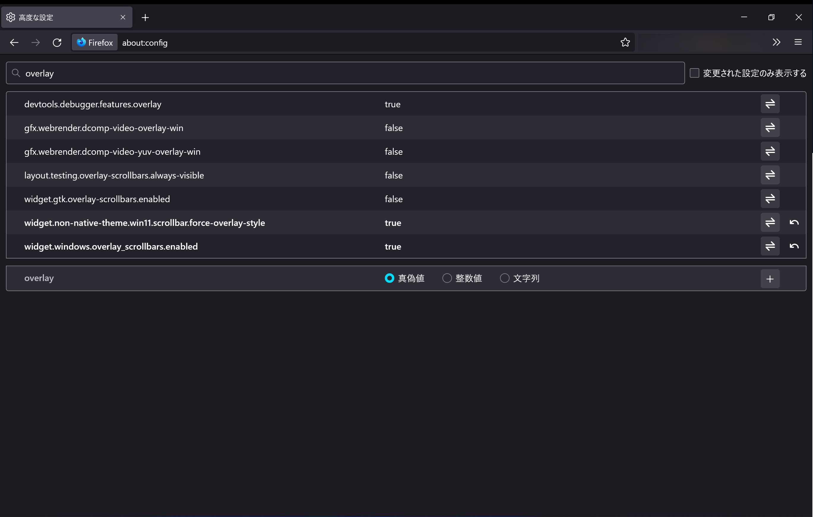

:::note alert
この記事の内容は、開発中の機能を有効にするものを含みます。バージョンによって操作方法が変更されたり、機能を有効にすることで不具合が生じたりする可能性があります。自己責任で試してください。
:::

Windows 11では、さまざまなソフトでオーバーレイスクロールバーが採用されています。この記事では、Firefoxのオーバーレイスクロールバーを有効にする方法について説明します。

## 動作確認環境

この記事は、次のような環境で動作確認しています。環境が違うと操作方法などが異なる場合があります。

- OS：Windows 11 21H2（22000.556）
- Firefox：Developer Edition v99.0b8

## オーバーレイスクロールバーとは

最初に、オーバーレイスクロールバーがどのようなものか説明します。やり方だけ知りたい場合は読み飛ばしてください。

通常のスクロールバーがこれです。左が何もしていないとき、右がスクロールバーにマウスを乗せたときです。

そして、これがオーバーレイスクロールバーです。先ほどと同様に、左が何もしていないとき、右がマウスを乗せたときです。

スクロールバーがコンテンツを邪魔しないようになっています。また、一定時間スクロールしないとスクロールバーが非表示になる機能も付いています。

## 有効にする方法

オーバーレイスクロールバーを有効にする方法について説明します。

まず、Firefoxのアドレスバーに``about:config``と入力します。注意をよく読み、理解したうえで［危険性を承知の上で使用する］をクリックします。

［設定名を検索］と書かれた検索ボックスに``overlay``と入力します。

表示された検索結果のうち、次の2つの項目の矢印⇌をクリックし、``false``から``true``に変更します。

- ``widget.non-native-theme.win11.scrollbar.force-overlay-style``
- ``widget.windows.overlay_scrollbars.enabled``

ブラウザーを再起動すると、オーバーレイスクロールバーが有効になります。
