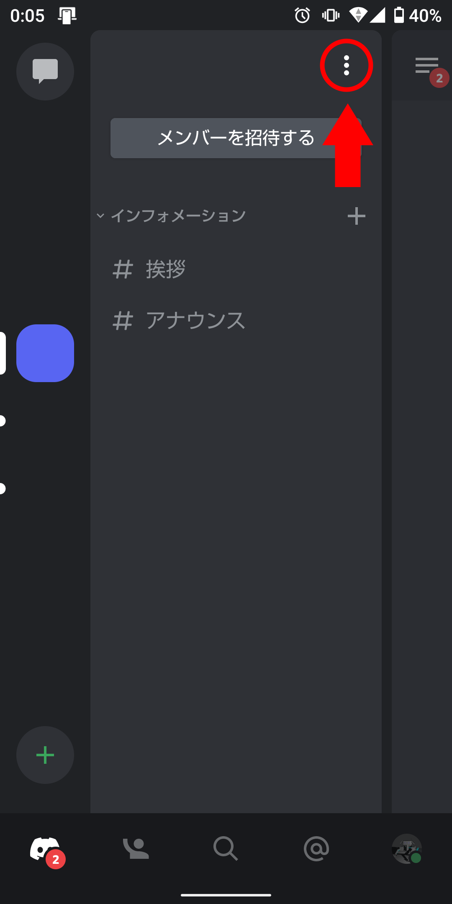
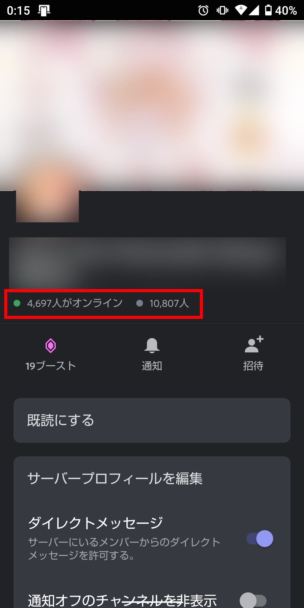
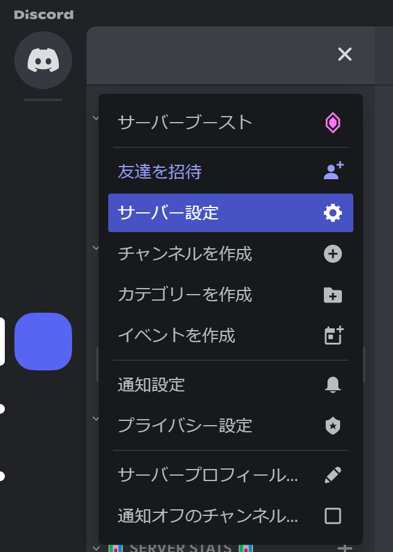
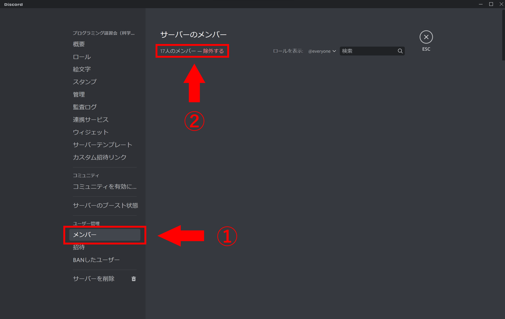

:::note info
この記事の内容は、DiscordのAndroidアプリのバージョン「122.7 - STABLE (122007)」とWindowsアプリのバージョン「Stable 124397 (2bf79b5)」で動作確認しています。
:::

この記事では、Discordでサーバーのメンバー数を、Botを使わずに確認する方法を紹介します。

## この記事で紹介する方法

この記事では、2つの方法を紹介します。

- [モバイルアプリを使う](#モバイルアプリを使う)（おすすめ・権限不要）
- [デスクトップアプリを使う](#デスクトップアプリを使う)（サーバー管理権限が必要）

モバイルアプリを使うと、［サーバー管理］権限がなくても簡単に人数を調べられるのでおすすめです。デスクトップアプリでは、［サーバー管理］権限があれば簡単に人数を調べられます。

状況に合わせて、2つの方法から選んでください。

## モバイルアプリを使う

Discordでメンバーの人数を確認する、もっとも簡単な方法はDiscordのモバイルアプリを使うことです。［サーバー管理］権限なしで、簡単に調べられます。

まず、Discordのモバイルアプリを開き、メンバーの人数を確認したいサーバーを選択します。次に、チャンネルを選択する画面の右上にある3点ドット［⋮］をタップして、メニューを開きます。

すると、サーバーの設定とともにメンバーの人数が表示されます。

緑色の丸で［●xxx人がオンライン］と書かれているのが、現在オンラインのメンバー数です。また、灰色で［●xxx人］と書かれているのが、オフラインのメンバーを含む人数です。

また、これらの人数にはBotを含みます。

## デスクトップアプリを使う

:::note warn
この方法は、**［サーバー管理］権限が必要**です。権限を持っていない場合、手作業で数えるか、[モバイルアプリを使う](#モバイルアプリを使う)必要があります。
:::

まず、人数を調べたいサーバーのサーバー名をクリックし、［サーバー設定］を開きます。

［サーバー設定］を開いたら、サイドバーから［ユーザー管理］内の［メンバー］をクリックします。すると、メンバーの一覧とともに人数が表示されます。

