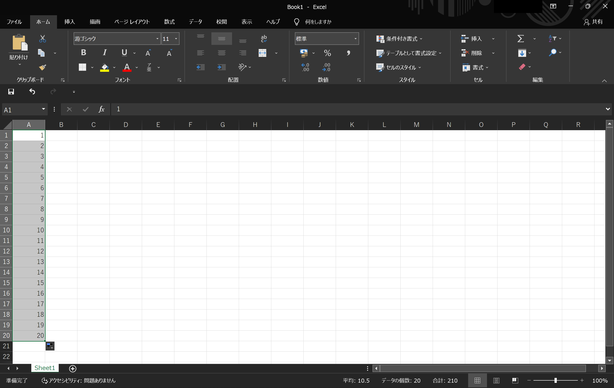
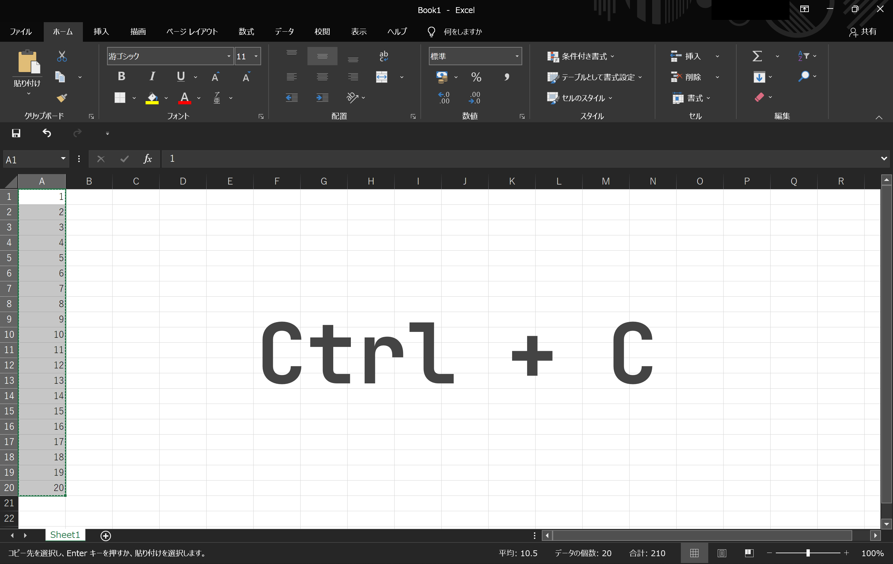
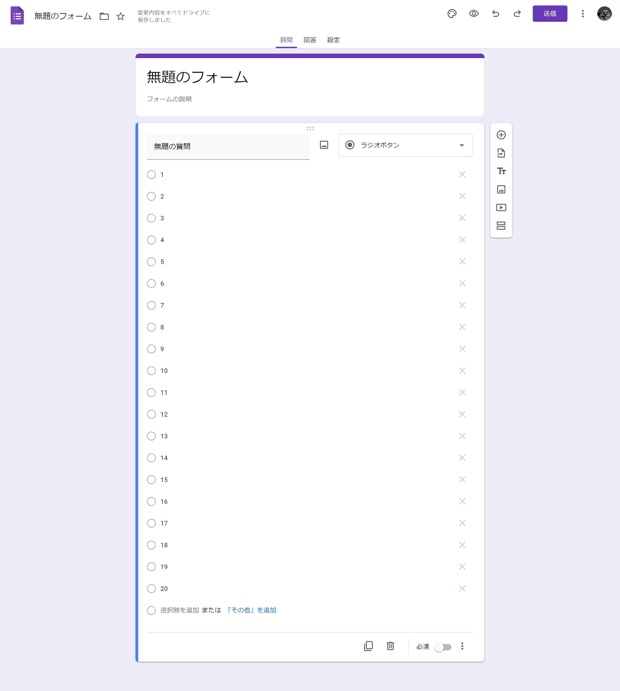

## はじめに

この記事では、「ExcelのデータからGoogleフォームの選択肢を作る方法」について説明します。

なお、この記事はGoogleフォームやExcelの基本的な操作ができる方を対象にしています。

:::note info
Excelでなくても、改行区切りの文字列でデータをコピーできれば、この記事で紹介する手順を使えます。
:::

### 使い道

ExcelのデータからGoogleフォームの選択肢を作れると、次のようなことができるようになります。

- 何かしらのデータや一覧などからフォームを作る
- Excelのオートフィルと組み合わせて、連番や日付の選択肢を楽に作る

## やり方

まず前提として、Googleフォームに改行を含む文字列を貼り付けると、改行ごとに自動で選択肢が追加されます。この挙動を利用して、Excelのデータからフォームの選択肢を作ります。

### 1. セルを縦方向に選択

Googleフォームに選択肢として追加したいデータを、Excelで縦に並べます。連番や日付の選択肢を作りたい場合は、Excelのオートフィルを使って、データを縦に生成してください。

次に、縦に並べた、それらのデータのセルを選択します。

ここでは例として、Excelのオートフィルで1〜20の連番を作成して選択しました。

### 2. コピー

選択したセルをコピーします。

### 3. 貼り付け

Googleフォームの選択肢を追加するテキストボックスに、コピーしたデータを貼り付けます。すると、データから自動で選択肢が作られます。

なお、この機能は、次のフォーム要素で利用可能です。

- ラジオボタン
- チェックボックス
- プルダウン
- 選択式（グリッド）
- チェックボックス（グリッド）

