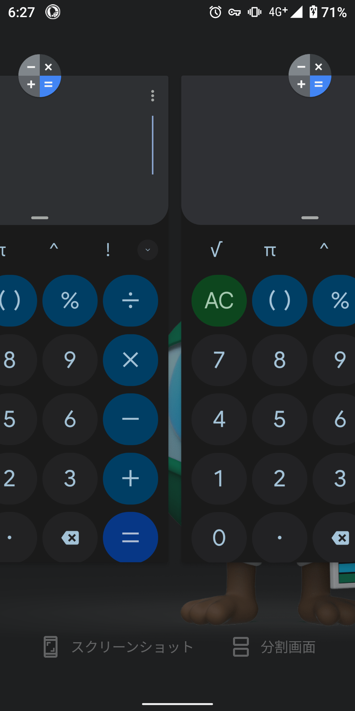
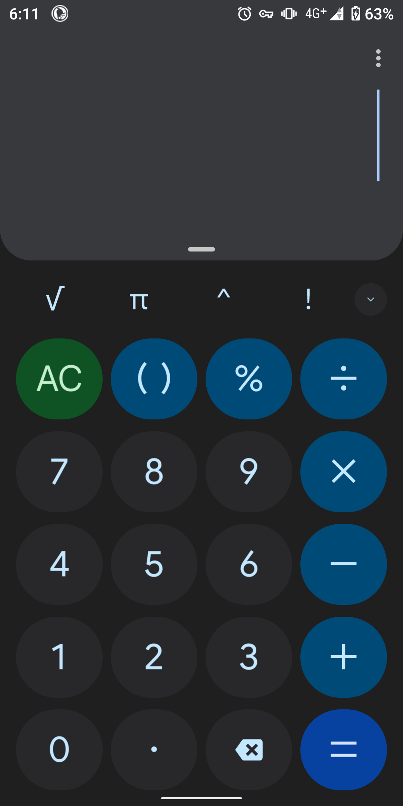
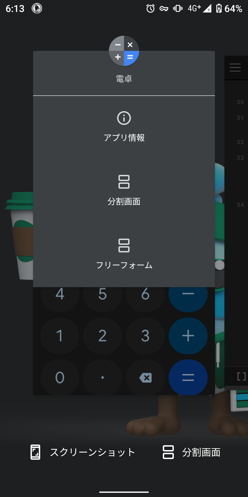
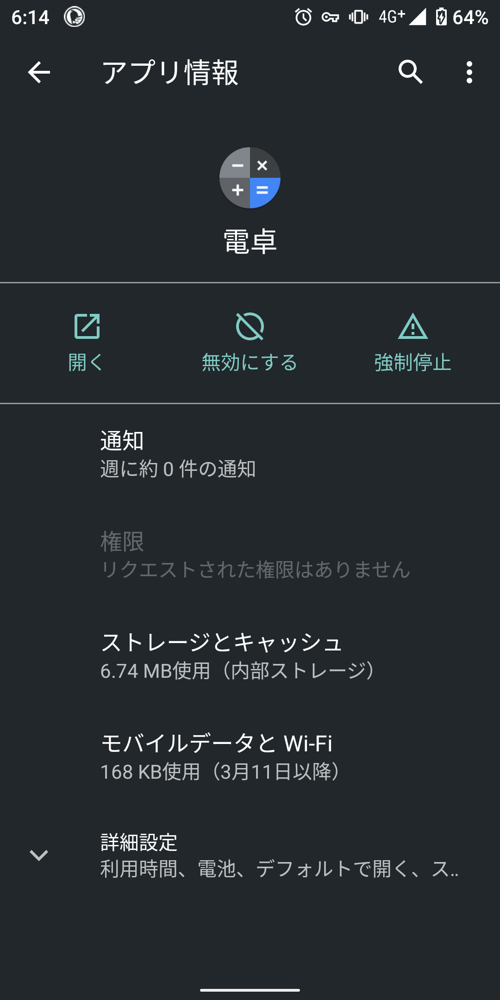
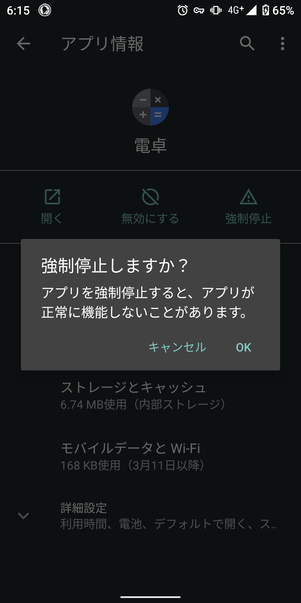
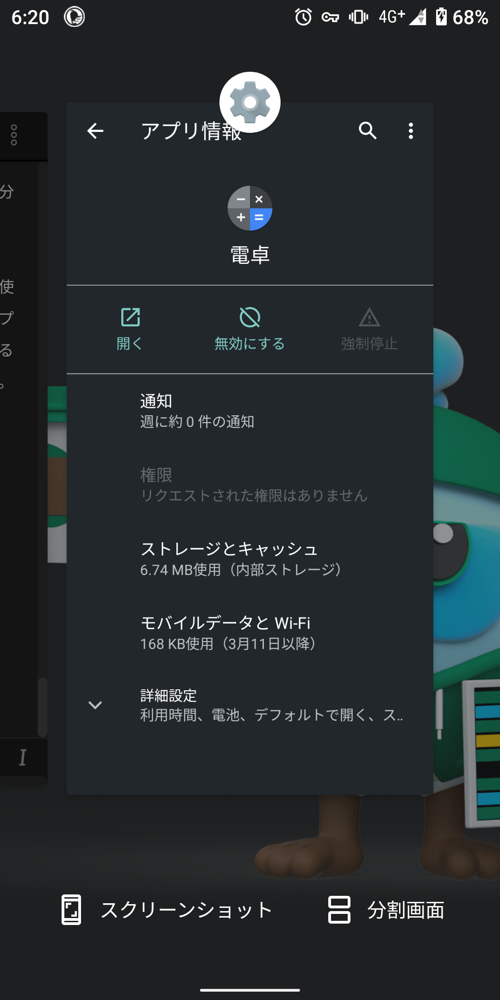
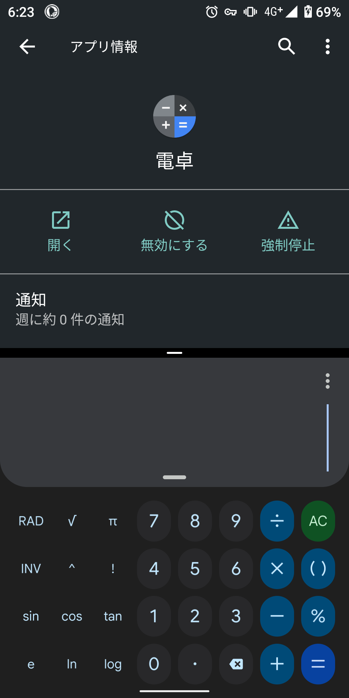
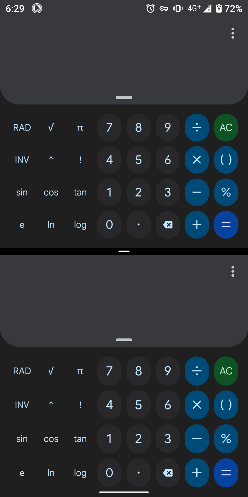

## はじめに

この記事では、特別なアプリをインストールせずに「Androidスマホで同じアプリを複数個起動する方法（マルチインスタンス）」について説明します。

ネットのほとんどの記事で紹介されている方法は、専用アプリのインストールが必須です。しかし、この記事で紹介する方法では、専用アプリのインストールやルート化（脱獄）は一切不要です。

同じアプリを複数個起動するとは、つまり、こういうことです。

:::danger

- この記事で紹介する方法は、Androidの正式な機能として搭載されているものではなく、バグと思われる挙動を利用したものです。自己責任で試してください
- スマホの機種やAndroidのバージョンによっては、使えない可能性があります。また、現在は使えていても、将来のOSのアップデートで使えなくなる可能性もあります
- ほとんどのアプリは、同時に複数個起動することを想定していないため、一部のアプリでは正常に動作しない可能性があります

:::

### 動作確認環境

この記事は、次のような環境で検証しています。スマホの機種やAndroidのバージョンによって、挙動や操作方法が多少異なります。

#### 機種1

- 機種：AQUOS sense3 SH-02M
- Androidバージョン：11
- カーネルバージョン：4.4.205-perf

#### 機種2

- 機種：Xperia XZ1 SO-01K
- Androidバージョン：9
- カーネルバージョン：4.4.148-perf+

## 手順

ここでは、電卓アプリを2つ起動するシーンを例に手順を紹介しますが、他のアプリでも同様の手順が使えます。

### 1. 目的のアプリを起動する

まずは、普通に目的のアプリを起動します。

### 2. アプリを強制停止する

アプリ切り替え画面（マルチタスク画面）に移動し、アプリのアイコンをタップ（または長押し）します。

メニューが開くので、［アプリ情報］や［i］マークを選択します。

開いた画面で、［強制停止］をタップします。

警告が表示されますが、［OK］をタップして続行します。このとき、対象のアプリで保存していないデータは失われますので、必ず保存してから［OK］をタップしてください。

### 3. 分割画面で別のアプリを起動する

強制停止したら、別のアプリで分割画面を利用します。

ここでは先ほどの設定アプリを使いますが、複数個起動したいアプリ以外で画面分割に対応しているアプリなら、何でも構いません。

画面下部に［分割画面］というボタンが表示されない場合は、アプリアイコンをタップして表示されるメニューからも実行できます。

### 4. 分割画面で対象のアプリを起動する

分割画面のもう1つのアプリとして、複数個起動したいアプリを選択します。

このとき、アプリ切り替え画面からではなく、**必ずアプリアイコンから起動してください**。

画面分割を終了し、アプリ切り替え画面に戻ると、対象のアプリが2つ起動しているのを確認できます。

もちろん、これらの画面分割もできます。また、ここまでの手順を繰り返せば、同じアプリを3つ以上起動できます。

## おまけ

なぜ、この方法で、同じアプリを複数個開けるのでしょうか。

私は趣味でプログラミングをしていますが、Androidの内部処理は把握していないので、挙動からの推測です。

<b>専門用語を使った、プログラマー向けの説明はこちら</b>

Androidは、「アプリアイコンをタップしたらアプリを起動する。ただし、すでにインスタンスが存在する場合は、新規のインスタンスを作成せずに既存のインスタンスを表示する」という挙動です。

この、インスタンスの存在確認の処理にバグがあると思われます。

挙動から推察すると、「アプリ切り替え画面にアプリが表示されているか」ではなく「プロセスが走っているか」で、インスタンスの存在を確認しているようです。

そのため、アプリを強制停止すると、プロセスがkillされるため「インスタンスは存在していない」と判定され、新規インスタンスが作成されます。

しかしながら、実際にはアプリ切り替え画面に表示されているためインスタンスはすでに存在しており、結果として複数のインスタンスが作成されるようです。

当然、この挙動に対しての対策が取られているはずですが、その対策は分割画面を想定していないようです。

こうして、同じアプリが複数個起動されるというわけです。

Androidは、「アプリアイコンをタップされたらアプリを起動する。ただし、すでに起動している場合は、新規で起動せずにアプリ画面を切り替える」という挙動です。

アプリアイコンをタップすると、「アプリがすでに起動しているか」という判定が入る訳です。この判定処理にバグがあると思われます。

アプリを強制停止すると、アプリ切り替え画面に表示されていたとしても、アプリのプログラムが走っていない状態になります。すると、Androidが「アプリをまだ起動していない」と勘違いし、新規で起動してしまいます。

当然、この挙動に対しての対策が取られているはずですが、その対策は分割画面を想定していないようです。

こうして、同じアプリが複数個起動されるというわけです。
