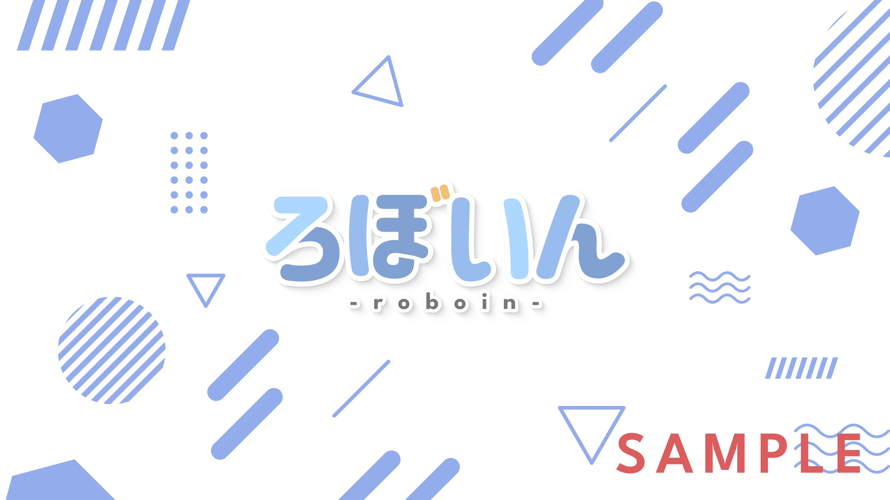
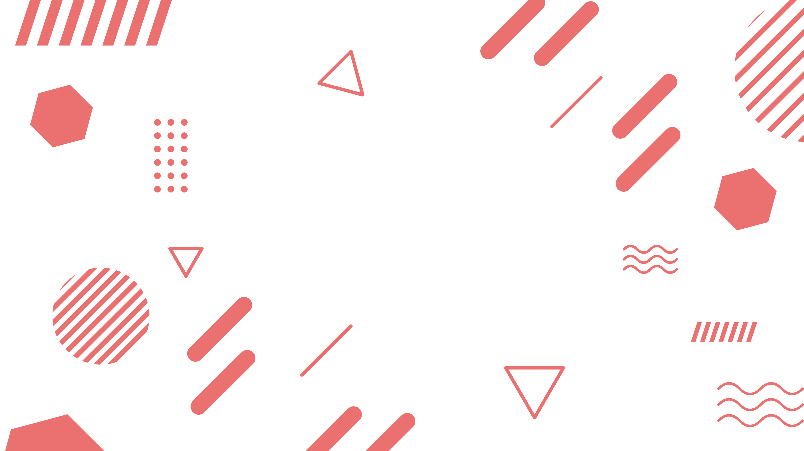
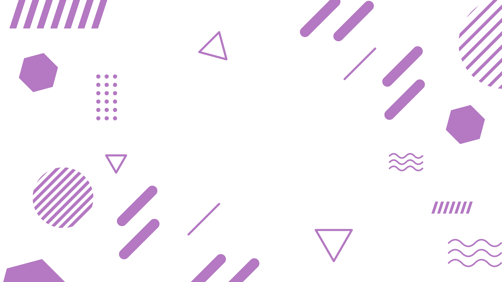
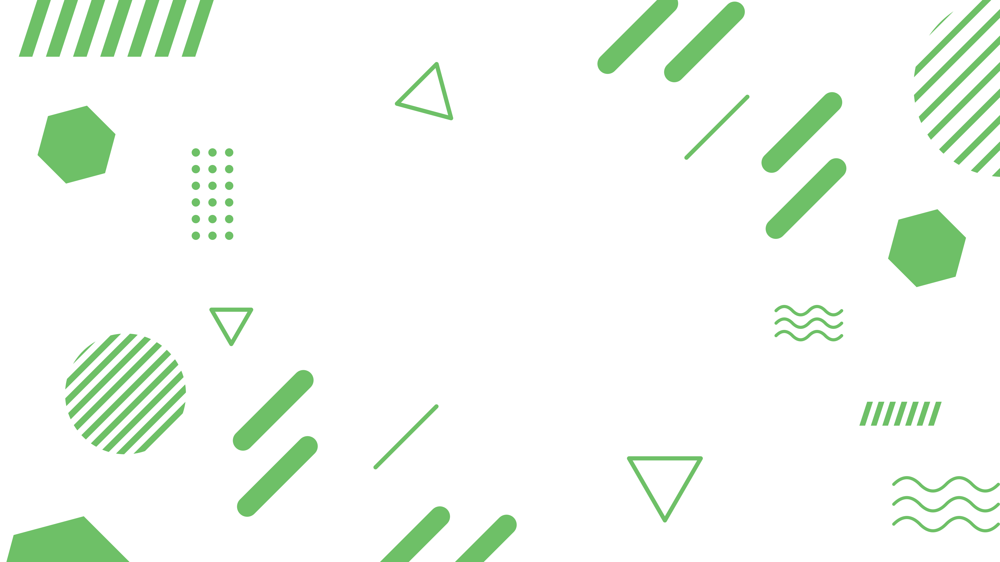

VTuber向けのフリー素材を配布します。ロゴや立ち絵の背景素材としてどうぞ！！必ず利用条件を確認のうえ、ご利用ください。カラーバリエーションは記事の末尾の素材一覧にまとめてあります。

※重要：画像はプレビューのため、そのままダウンロードしても低画質だったり、開けなかったりする可能性があります。**画像を1度クリックしてから**、開いた画面で保存してください。

## 使用例

中央にロゴや立ち絵を配置できます。

※使用例の画像および「ろぼいん」ロゴは、フリー素材ではありません。

## 利用条件

宣伝ツイートのリツイートまたは引用リツイートでご自由にご利用いただけます。引用リツイートの場合は、素材を利用したツイートのリプ欄にぶら下げる形でもOKです。また、多少の加工は構いません。

素材の自作発言・再配布・グッズ等への利用は禁止です。その他、分からないことなどがあれば、Twitterでお気軽にご連絡ください！

<blockquote class="twitter-tweet" data-dnt="true" data-theme="dark">
【フリー素材配布】  VTuberさんの自慢のロゴや立ち絵を見せてください！！シンプルな背景素材です！  🆗RTまたは引リツ(素材を使ったツイートのリプ欄でも可)で自由に利用可。多少の加工OK 🆖自作発言・再配布・グッズ等への利用<a href="https://twitter.com/hashtag/VTuber%E7%B4%A0%E6%9D%90?src=hash&amp;ref_src=twsrc%5Etfw">#VTuber素材</a><a href="https://twitter.com/hashtag/VTuberAssets?src=hash&amp;ref_src=twsrc%5Etfw">#VTuberAssets</a><a href="https://twitter.com/hashtag/%E3%83%95%E3%83%AA%E3%83%BC%E7%B4%A0%E6%9D%90?src=hash&amp;ref_src=twsrc%5Etfw">#フリー素材</a>  色違いはリプ欄からどうぞ！ <a href="https://t.co/Uh2a3tgPYb">pic.twitter.com/Uh2a3tgPYb</a>
&mdash; ろぼいん@VTuberではない (@keita_roboin) <a href="https://twitter.com/keita_roboin/status/1579117498435522560?ref_src=twsrc%5Etfw">October 9, 2022</a></blockquote> 

## 素材一覧

素材のカラーバリエーションです。たいていのVTuberさんはこの色で足りると思いますが、「この色が欲しい」などがあれば宣伝ツイートのリプ欄へどうぞ。気が向いたら作ります～

※重要：以下の画像はプレビューのため、そのままダウンロードしても低画質だったり、開けなかったりする可能性があります。**画像を1度クリックしてから**、開いた画面で保存してください。

