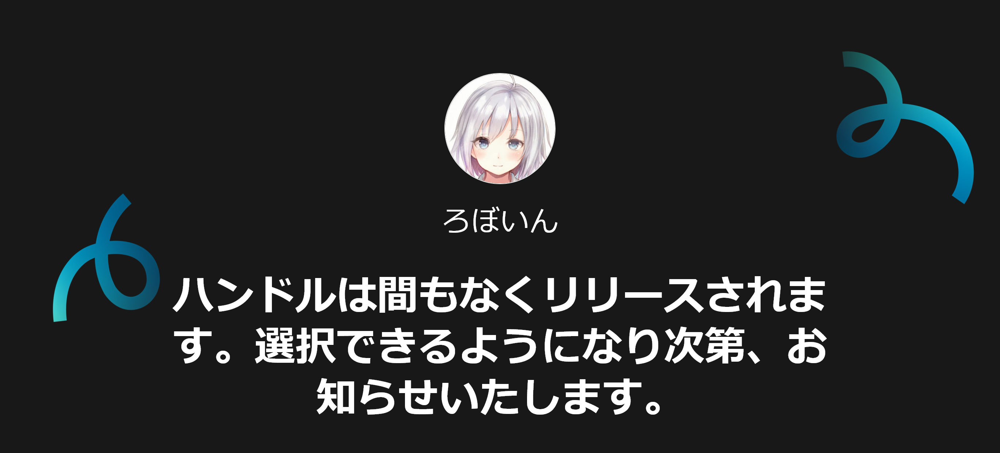
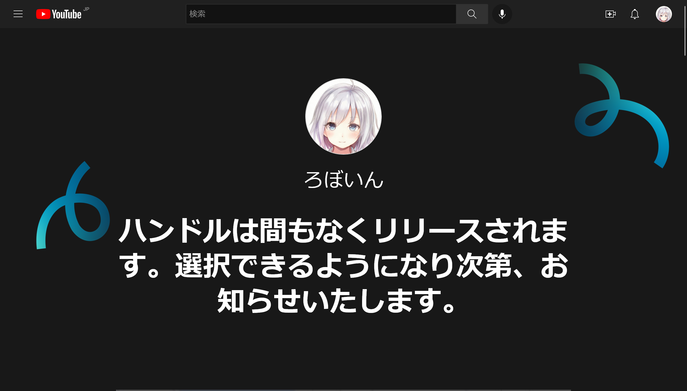
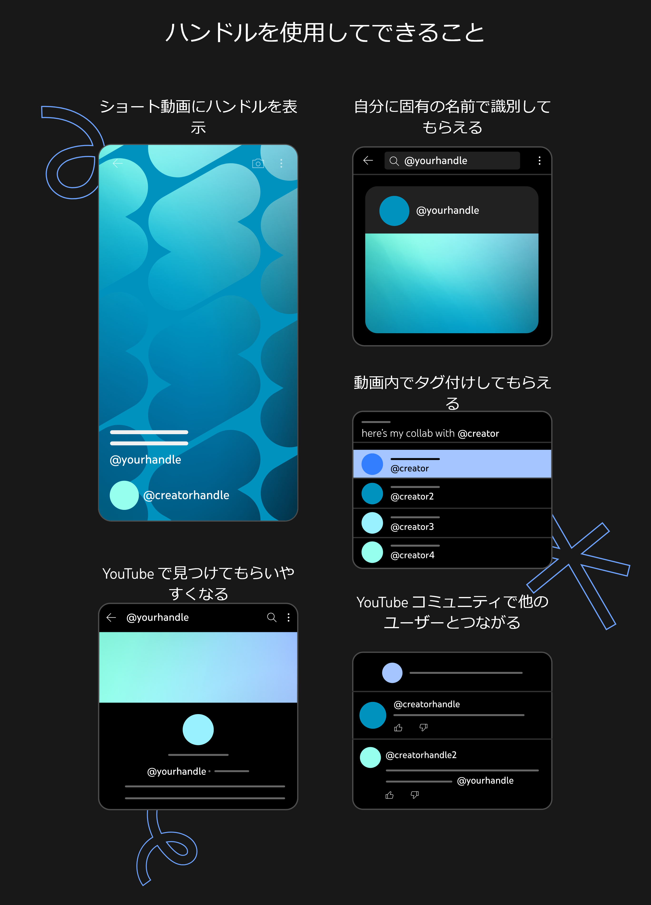

import { YouTube } from "@astro-community/astro-embed-youtube";

## この記事の概要

- Twitter のユーザー名（スクリーンネーム）のように@から始まる一意の ID の「ハンドル」が YouTube に実装される
- 11 月 14 日までに徐々に展開され、手動で設定しない場合は YouTube 側で自動的に付与される
- ハンドルは早い者勝ちで他人と同じ文字列を設定できないため、早めに設定しないとなりすましに悪用されるリスクがある

## ハンドル機能について

日本時間の 2022 年 10 月 11 日、YouTube が「ハンドル」機能の実装を[発表](https://support.google.com/youtube/thread/183284252)しました。

<blockquote class="twitter-tweet" data-dnt="true" data-theme="dark">
📣YouTube にハンドルが導入されます✨  ハンドルとは、YouTube で視聴者がクリエイターを見つけて繋がったり、クリエイター同士が繋がったりするための新しい方法です。  既存のチャンネルの URL や名前などは引き続きご利用いただけます。 <a href="https://t.co/Ix6pEAPbdI">pic.twitter.com/Ix6pEAPbdI</a>
&mdash; YouTube クリエイター (@ytcreatorsjapan) <a href="https://twitter.com/ytcreatorsjapan/status/1579615661864628224?ref_src=twsrc%5Etfw">October 10, 2022</a></blockquote> 

ハンドルは、Twitter のユーザー名（スクリーンネーム）のように、@から始まる一意の ID です。つまり、他人と同じ文字列は設定できません。

この機能は、11 月 14 日までに徐々に展開されます。利用できるようになるタイミングは、「YouTube 全体のプレゼンス、チャンネル登録者数、チャンネルがアクティブか非アクティブかなどのさまざまな要因」によって決まります。このことから、おそらく人気で活発なチャンネルから利用可能になると思われます。

また、ハンドルを利用可能になると、メールと YouTube Studio に通知が送信されます。通知が来たら、[https://www.youtube.com/handle](https://www.youtube.com/handle)でハンドルを設定できるようになります。私のチャンネルでは、記事執筆時点でまだ利用できませんでした。

ハンドルを 11 月 14 日までに手動で設定しなかった場合は、YouTube 側で自動的に設定されます。すでにカスタム URL を利用しているチャンネルでは、カスタム URL を元に設定される仕組みです。このように自動設定されたハンドルは、あとからでも変更できます。

ハンドルを設定したり変更したりしても、認証バッジ（公式マーク）は削除されません。ただし、チャンネル名を変更した場合は再申請が必要になります。

ハンドルについての詳細は、[ハンドルの設定ページ](https://www.youtube.com/handle)、[YouTube 公式ブログ（英語）](https://blog.youtube/news-and-events/introducing-handles-a-new-way-to-identify-your-youtube-channel/)、[YouTube コミュニティー（英語）](https://support.google.com/youtube/thread/183284252)から確認できます。また、英語ですが YouTube 公式の解説動画も分かりやすいです。

<YouTube id="mVVp37YGwyQ" />

## ハンドルの役割

ハンドルは、YouTube 上でチャンネルを識別するのに役立ちます。チャンネル名は他人と同じ設定にできるため、これまで YouTube では同名のチャンネルはチャンネル ID をもとに見分ける必要がありました。しかし、チャンネル ID はランダムな文字列で、決して覚えやすいとはいえません。

そこで、ハンドルの出番です。@から始まる覚えやすい ID を設定することで、同名のチャンネルやなりすましを見分けやすくなります。また、ハンドルを使ったメンションもできるようになるそうです。

つまり、YouTube のハンドルは Twitter のユーザー名と同じような機能だと考えて問題ないでしょう。

[https://www.youtube.com/handle](https://www.youtube.com/handle)より

## 早く設定しないと なりすまされる可能性も

私は、Twitter や Instagram のユーザー名と同じ文字列で、できるだけ早く登録することを推奨します。

前述のように、YouTube のハンドルは早い者勝ちで、他人と同じ文字列は設定できません。この特徴のおかげで、長期的にはなりすましを見分けやすくなります。しかし、次のような場合はどうでしょうか？

1. あなたは YouTube チャンネルの運営者で、ハンドルを手動で設定しなかった
2. 悪意のある第三者があなたの Twitter のユーザー名と同じ文字列で、YouTube のハンドルを取得した
3. あなたの Twitter と同じハンドルを取得したユーザーが、チャンネル名やアイコンをあなたの YouTube チャンネルと同じ設定にした

この場合、YouTube のチャンネル登録者数は誤魔化せないものの、全体的にはあなたのチャンネルと酷似したチャンネルを作成し、なりすませてしまいます。

まるで本物のようになりすませるだけでも問題ですが、なりすましたチャンネルで詐欺やデマの動画を流されたらどうでしょう？まるであなたが詐欺やデマに加担しているように見えてしまいます。こうなってしまったらあなたがなりすましに気づいて関与を否定し、なりすましが凍結されるまで、あなたのイメージは悪くなる一方です。

あなたが詐欺やデマの拡散に加担していると勘違いしたすべての人に、関与を否定するメッセージが届くとは限りません。なりすましで一度悪くなったイメージは、完全には元に戻らないかもしれません。

このように YouTube のハンドルは長期的には偽物を見分けやすくなる一方で、短期的にはむしろ、なりすましに利用される可能性があります。

YouTube のハンドルを悪用したなりすましを防ぐ方法はただ 1 つです。ハンドル機能を利用可能になり次第、他の SNS と同じ ID（Twitter のユーザー名など）でできるだけ早く設定しましょう。
