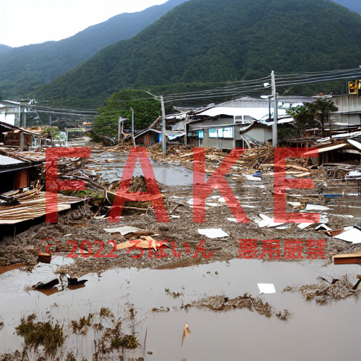
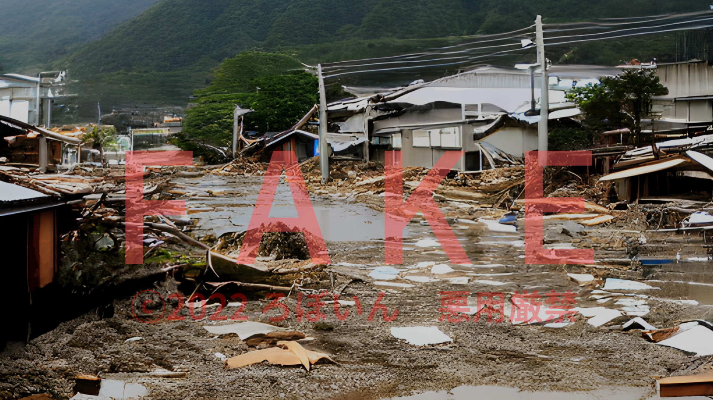
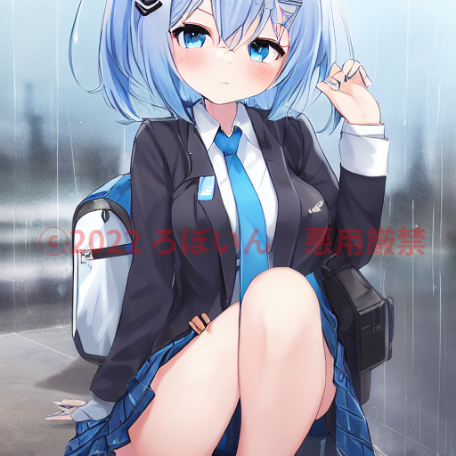
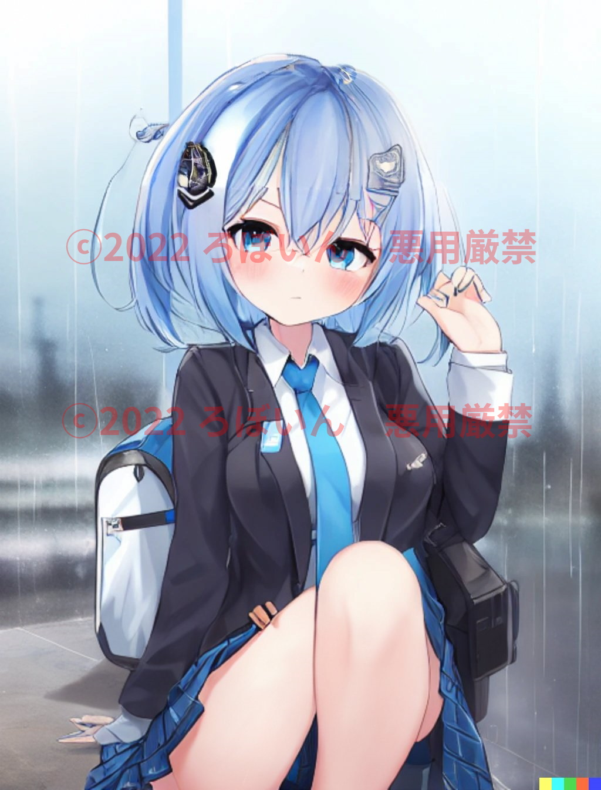

## 目次

- [イラスト生成AIに対するよくある誤解](#イラスト生成aiに対するよくある誤解)
  - [目次](#目次)
  - [はじめに](#はじめに)
  - [注意事項](#注意事項)
  - [AIは既存のイラストを切り貼りしている/コラージュしている](#aiは既存のイラストを切り貼りしているコラージュしている)
    - [解説](#解説)
    - [ベクトルについて](#ベクトルについて)
    - [厳密には「切り貼り」も間違いではない](#厳密には切り貼りも間違いではない)
  - [AIのイラストは既存のイラストの模倣である](#aiのイラストは既存のイラストの模倣である)
    - [解説](#解説-1)
  - [AIにひらめきは存在しない](#aiにひらめきは存在しない)
    - [解説](#解説-2)
  - [人間のイラストレーターを守るために、AIが描いたイラストを見分けるAIを作るべき](#人間のイラストレーターを守るためにaiが描いたイラストを見分けるaiを作るべき)
    - [解説](#解説-3)
  - [AIで生成されたイラストは画質（解像度）で見分けられる](#aiで生成されたイラストは画質解像度で見分けられる)
    - [解説](#解説-4)
  - [イラスト生成AIは、学習元のイラストに酷似したイラストを生成する](#イラスト生成aiは学習元のイラストに酷似したイラストを生成する)
    - [解説](#解説-5)
  - [AIはイラストを無断で学習しており違法](#aiはイラストを無断で学習しており違法)
    - [解説](#解説-6)
    - [追記](#追記)
  - [AIにイラストを学習させるのは無条件で合法](#aiにイラストを学習させるのは無条件で合法)
    - [解説](#解説-7)
  - [AIが生成したイラストには著作権が存在しない](#aiが生成したイラストには著作権が存在しない)
    - [解説](#解説-8)
  - [AIを使えば狙ったイラストを簡単に生成できる](#aiを使えば狙ったイラストを簡単に生成できる)
    - [解説](#解説-9)
  - [おわりに](#おわりに)
  - [参考文献](#参考文献)
  - [更新履歴](#更新履歴)

## はじめに

Twitterを眺めていると、イラスト生成AIに対する誤解が多く見受けられます。この記事では、イラスト生成AIに対するよくある誤解について、説明します。

全体を通していえることは、AIは万能ではないということです。最近話題に上がっているイラスト生成AIは、完全自律でイラストを生成するわけではありません。現時点でのAIに狙ったイラストを生成させるには、人間の介入が必要です。

また、AIは脳の神経細胞を数学的に再現したものを使った、非常に複雑な仕組みで動いています。イラスト生成AIは、既存のイラストを切り貼りするようなシステムというよりは、「小さい脳みそ」というイメージが近いです。そもそもAIは「人工**知能**」の略ですからね。

できるだけ噛み砕いて書いたつもりですが、AIは複雑な概念なので分かりにくかったらすみません。適宜「参考」として、より詳しく書かれた記事のリンクを貼っているので、気になる方はそちらも併せて参考にしてください。だいぶ長い記事なので、お時間のあるときに少しずつ読んでいただければ幸いです。

（ちゃんと説明しようとするとこれだけ長くなってしまうというのも、TwitterでAIに対する誤解や勘違いが多い理由の1つだと思います...）

## 注意事項

本編へ入る前に、いくつか注意事項があります。

まず、AIは非常に複雑で、私も勉強中です。もし間違っていることなどがあれば、優しくコメントや編集リクエストをいただけると助かります。

イラスト生成AIについては、誤解にもとづく的はずれな批判がある一方で、誤解にもとづかない正当な批判もあります。実際、現状のイラスト生成AIには批判されるべき部分があるのも事実です。この記事では、こうした正当な批判を否定する意図はありません。

また、この記事では法律に関わる部分の説明が含まれます。私は法律の専門家ではありません。専門家による解説を参考に書いていますが、法律の正確な解釈は、専門家の意見や判例を参考にしてください。

では、本編に入りましょう。

## AIは既存のイラストを切り貼りしている/コラージュしている

誤：AIは既存のイラストを切り貼りしている/コラージュしている。

正：AIは無意味なノイズからノイズを取り除くことでイラストを生成している。一般的な意味での切り貼りやコラージュとはまったく異なる。

### 解説

「AIは既存のイラストを切り貼りしている」「AIのイラストは既存のイラストのコラージュだ」といった意見を見かけますが、それらは誤りです。

AIのイラストが、切り貼りやコラージュだとするならば、人間が描いたイラストもコラージュということになってしまいます。詳細は「[AIのイラストは既存のイラストの模倣である](#aiのイラストは既存のイラストの模倣である)」という誤解についての説明も併せて参照してください。

さて、ここからはAIの仕組みの話になります。「AIは無意味なノイズからノイズを取り除くことでイラストを生成している」と聞いて、少し混乱するかもしれません。ノイズからノイズを取り除いたら、何も残らないと思いますよね？大丈夫です、ちゃんと説明します。

[Stable Diffusion](https://github.com/CompVis/stable-diffusion)や[NovelAI Diffusion](https://novelai.net/)といった最近の画像生成AIは、「拡散モデル」という仕組みを使っています。拡散モデルは、次のような仕組みです。

1. 画像と、それにノイズを加えたものを用意する
2. ノイズを加えた画像から（ノイズを取り除いて）元画像を推測できるようにAIを訓練する
3. 無意味なノイズを与えると、存在しない「元画像」を生成できるようになる

これを人間で例えると、こんなイメージです。

※厳密には、AIの場合はノイズあり画像と元画像の両方が与えられます。

1. ある国ではイラストが禁止されることになり、モザイクのかかったイラストしか見られなくなった
2. 人々は、モザイクのかかったイラストからもとのイラストを想像するようになった
3. 人々に「モザイクのかかったイラストのように見えるが実際は無意味な画像」を見せると、その画像からイラストを想像しようとする

これが、拡散モデルの仕組みです。

イラスト生成AIでは、プロンプト（通称：呪文）と呼ばれる、「どのようなイラストが欲しいか」という文章を与えます。そうすると、AIはその文章に沿ったイラストを生成してくれます。これをさきほどの説明に組み込むと、こうなります。

1. 画像と、それにノイズを加えたものを用意する
2. ノイズを加えた画像から（ノイズを取り除いて）元画像を推測できるようにAIを訓練する
3. 無意味なノイズを与えると、存在しない「元画像」を生成できるようになる。**このとき、プロンプトのベクトルに近似するように画像を生成する**（ベクトルについては後述）

人間で例えると、こうです。

1. ある国ではイラストが禁止されることになり、モザイクのかかったイラストしか見られなくなった
2. 人々は、モザイクのかかったイラストからもとのイラストを想像するようになった
3. 人々に「モザイクのかかったイラストのように見えるが実際は無意味な画像」を見せ、**「これは黒髪のケモミミ美少女が海で遊んでいるイラストだよ」と伝える**とその画像からケモミミ美少女のイラストを想像しようとする

ここまでの説明で分かるように、イラスト生成AIは既存のイラストを切り貼りしているわけではありません。もっと複雑な仕組みで動いています。

このあたりの仕組みをもう少し詳しく知りたい方は、こちらのツイートがオススメです。

<blockquote class="twitter-tweet" data-dnt="true" data-theme="dark">
昨今のお絵描きAIの進捗が著しく、いろんな方に一歩踏み込んで知ってもらいたいと思ったのでその仕組みについて解説資料を公開します〜（先日の技術書典の本の内容です）。これからいろんな分野の方が押さえておいても良い技術だと思うので、仕組みから興味持ってもらいたいなーという気持です。(1/5) <a href="https://t.co/p7iBSY7ma5">pic.twitter.com/p7iBSY7ma5</a>
&mdash; まっくす (@minux302) <a href="https://twitter.com/minux302/status/1576165296205094912?ref_src=twsrc%5Etfw">October 1, 2022</a></blockquote> 

参考：
- [画像生成AI「Stable Diffusion」がどのような仕組みでテキストから画像を生成するのかを詳しく図解 - GIGAZINE](https://gigazine.net/news/20221006-visuals-explaining-stable-diffusion/)
- [最近話題の"Diffusion Model（拡散モデル）"について、簡潔にまとめてみた - AI・セキュリティのまとめのまとめ](https://nakajimeee.hatenablog.com/entry/2022/01/03/041646)
- [DALL-E2やStable Diffusion等の拡散モデルの動作原理と説明がつかない事](https://webbigdata.jp/ai/post-14457)

### ベクトルについて

AIでは、よくベクトルが利用されます。2次元や3次元といったレベルではなく、もっと高次元のベクトルです。

画像生成AIでは、学習データの文章と画像をそれぞれベクトルに変換します。このとき、似た意味の文章や画像は似たベクトル、まったく違うものはまったく違うベクトルとなるようにします。

プロンプトの文章のベクトルに近似するベクトルをもつ画像を生成すれば、プロンプトの指示に沿った画像を生成できるわけです。

### 厳密には「切り貼り」も間違いではない

厳密には、「イラスト生成AIが切り貼りしている」という表現は完全に間違っているわけではありません。ただ、みなさんの想像する「切り貼り」とは、まったく違います。

多くの人がイメージする切り貼りは、「AIは既存のイラストをバラバラのパーツに分け、それらを組み合わせている」ということだと思います。これは間違っていて、実際には具体的なパーツではなく、抽象的な概念を切り貼りしています。

概念の切り貼りには、ベクトルの計算を利用します。「[【Python】Word2Vecの使い方 - Qiita](https://qiita.com/kenta1984/items/93b64768494f971edf86)」という記事の例が分かりやすいので、そこから引用します。

> 「日本」ー「東京」＋「ソウル」=「韓国」

このように、ベクトルを使うと概念の計算ができます。AIは、入力されたプロンプトのベクトルを計算しています。

プロンプトのベクトルを計算するという意味では、AIが切り貼りしているというのも間違ってはいません。しかし、あくまで具体的なパーツではなく、抽象的な概念の切り貼りです。

人間がイラストを描くときには、他人のイラストを切り貼りしません。でも、たとえば「黒髪ロングの清楚な女の子のイラスト」を描くときには「黒髪」「ロング」「清楚」「女の子」という概念を組み合わせて描きます。

AIも同様で、他人のイラストの具体的なパーツを切り貼りする代わりに、抽象的な概念を組み合わせてイラストを生成しています。

イラスト生成AIにおける「学習」は、この抽象的な概念をAIに学ばせることです。

このように、「AIが切り貼りしている」という表現が完全に間違っているわけではありませんが、ほとんどの人のイメージする意味では、「切り貼りしていない」が正しくなります。

## AIのイラストは既存のイラストの模倣である

誤：AIのイラストは既存のイラストの模倣である。

正：内部の仕組みは違うが、AIも人間も過去に見たイラストから学習して（組み合わせて）描いている。

### 解説

内部の細かい仕組みは違うものの、最近のAIは「脳の仕組みを模倣する」というアイディアが根本にあります。脳の神経細胞を数学的に再現した「ニューラルネットワーク」がAIの中で動いています（ニューラルネットワークを使っていないAIもあります）。

このニューラルネットワークをどの部分でどのように使うかで、AIをさまざまな種類に分けられます。たとえば拡散モデルでは、ノイズの除去にニューラルネットワークを使っています。

参考：[ニューラルネットワークとは - 意味をわかりやすく - IT用語辞典 e-Words](https://e-words.jp/w/%E3%83%8B%E3%83%A5%E3%83%BC%E3%83%A9%E3%83%AB%E3%83%8D%E3%83%83%E3%83%88%E3%83%AF%E3%83%BC%E3%82%AF.html)

人間がアイディアを思いつくとき、「脳の中に散らばる『記憶の断片』をつなぎ合わせ」ているのではないかといわれています。

参考：[ひらめきと記憶の正体 脳の解明が認知症治療につながる | NHK健康チャンネル](https://www.nhk.or.jp/kenko/atc_1304.html)

一方でAIは、画像の特徴量と呼ばれるものから学習してイラストを生成しています。AIのイラストも人間が描いたイラストも、自分が過去に見たものを組み合わせているに過ぎません。

ここまで読んだ一部の方は、人間や自らの創造性について否定されたと感じて不快に思うかもしれません。

不快に感じた方には申し訳ありません。しかしその一方で事実として、人間もAIもイラストを「学習」し、過去に見たものを組み合わせて描いているということは理解していただきたいポイントです。

AIのイラストが既存のイラストの模倣だとするならば、人間のイラストも既存のイラストの模倣ということになります。人間のイラストが模倣ではないとするならば、AIのイラストも模倣ではないといえます。

では、AIは人間と完全に同じかというと、そうでもありません。人間はノイズからイラストを生み出しているわけではありませんし、そういった内部の細かい仕組みは異なります。

また、人間はそれまでの長い人生で蓄積されてきたすべての経験を活かせますが、AIは与えられたデータからしか学習できません。「なぜこの線がここにあるのか」「なぜこういう描き方をしているのか」ということを考えるのも、現在のAIにはできません。いくらAIが人間の脳と似た仕組みだとしても、所詮は人間の脳の劣化版でしかないのです。今のところは...。

（劣化版だったとしても、人間の脳を真似た仕組みを使っていますし、AIのイラストが模倣だとするなら人間のイラストも模倣ということになりかねないという点は変わりません）

※イラストの学習は、おもに「イラストの見た目を学習する」「そのイラストがなぜそうなっているのかを考えたり、イラスト以外の知識（骨格の知識など）を活用したりする」の2つに分けられます。そのうち、AIにできているのは前者のみです。私は、AIが2つのうち1つをできているという意味で「脳の劣化版」と考えていますが、「1つしかできていない」と捉えるなら人間とまったく似ていないという意見もまた、正しいと思います。

## AIにひらめきは存在しない

誤：AIにひらめきは存在しない。

正：解釈によっては、AIにもひらめきが存在する。

### 解説

まず、ひらめきとは何かを定義する必要があります。ここでは、「模倣ではなくそれまでにない何かを生み出すこと」としましょう。

1つ前の項目で説明したように人間は過去に見たものから学習し、それらを複雑に組み合わせることで、ひらめいています。AIも、与えられたデータから学習し、複雑に組み合わせてイラストを生成しています。

そういう意味では、AIにもひらめきは可能です。しかし、AIは今のところ、データのある分野でしかひらめけません。たとえば、イラストという分野はデータがあるのでひらめけますが、データのない分野では機能しません。

AIは特定の分野においてのひらめきはできますが、汎用的に他の分野で機能するといったことはできないのです。このような現在のAIを「特化型AI」といいます。一方で、分野関係なく機能する、人間のようなAIを「汎用AI」といいます。現時点では、汎用AIは発明されていません。

また、「[AIのイラストは既存のイラストの模倣である](#aiのイラストは既存のイラストの模倣である)」の最後の方で説明したように、実際には人間は他の分野の知識をイラストに持ち込めます。ひらめきを「他の分野の知識を持ち込むこと」と定義するならば、現在の特化型AIに、ひらめきは無理でしょう。

## 人間のイラストレーターを守るために、AIが描いたイラストを見分けるAIを作るべき

誤：人間のイラストレーターを守るために、AIが描いたイラストを見分けるAIを作るべき。

正：むしろ逆効果になるため、AIのイラストを見分けるシステムを作ってはならない。

### 解説

「作るべき」「作ってはならない」など、少し主観が混ざってしまいますが、「こういう可能性も十分考えられる」という話をします。

AIがクオリティーの高いイラストを生成できるようになったため、AIのイラストを見分けるAIがあったら便利なのは事実です。

しかし、そのようなAIはむしろ逆効果になる可能性があります。

AIにはさまざまな種類がありますが、その中の1つに「GAN」というものがあります。GANは、画像を生成する部分と、生成された画像が本物か偽物かを見分ける部分に分けられます。それらを互いに競わせて、後者が見分けられない画像を前者が生成できるように訓練するという仕組みです。

参考：[GAN：敵対的生成ネットワークとは何か　～「教師なし学習」による画像生成 - アイマガジン｜i Magazine｜IS magazine](https://www.imagazine.co.jp/gan%EF%BC%9A%E6%95%B5%E5%AF%BE%E7%9A%84%E7%94%9F%E6%88%90%E3%83%8D%E3%83%83%E3%83%88%E3%83%AF%E3%83%BC%E3%82%AF%E3%81%A8%E3%81%AF%E4%BD%95%E3%81%8B%E3%80%80%EF%BD%9E%E3%80%8C%E6%95%99%E5%B8%AB/)

最近の画像生成AIは、GANではなく「拡散モデル」という仕組みを使っています。この拡散モデルに、AIが生成したイラストを見分けるAIを内蔵したGANを組み合わせることで、より破綻の少ないイラスト生成AIを作れる可能性があります。

そうなったらもはや、人間にもAIにも、AIのイラストを見分けられなくなるかもしれません。

したがってAIが描いたイラストを見分けるAIは、技術的に可能でも、クリエイター保護の観点では逆効果になるため作るべきではないといえます。

AIが描いたイラストを見分けるAIを作ったら、それを取り込んだ最強のイラスト生成AIが生まれてしまった、となっては本末転倒ですからね。

## AIで生成されたイラストは画質（解像度）で見分けられる

誤：AIで生成されたイラストは画質（解像度）で見分けられる。

正：部分的には正しいが、画質（解像度）だけで判断するのは危険。

### 解説

ここでは、画質を「解像度」として解釈します。

AIで生成されたイラストは、たしかに低解像度の場合が多いです。これは、高解像度のイラストを生成しようとすると、処理が重くなりすぎるためです。AIが生成した画像は、現時点では512pxが主流です。もしAIに4倍の2048pxの画像を生成させるとしたら、単純計算で16倍（縦4倍・横4倍で4×4=16倍）の性能が必要になってしまいます。

そのため、AIで生成されたイラストをそのまま投稿した場合は、低解像度なため判別できます。

ところが、実は解像度を上げるAIも存在しています。代表的なものには[waifu2x](http://waifu2x.udp.jp/index.ja.html)や[Real-ESRGAN](https://github.com/xinntao/Real-ESRGAN)などがあります。こうしたAIを使うと、ノイズをある程度除去したり、解像度を上げたりできます。この技術を「超解像」といいます。

少し前にStable Diffusionを使った画像が、静岡の水害のデマに利用されましたね。それを受けて、私はAIが生成した画像からどれだけ「AIっぽさ」をなくせるか実験しました。

<blockquote class="twitter-tweet" data-dnt="true" data-theme="dark">
やっぱりStable Diffusionで作った画像をちょっと加工するだけで見破るのがだいぶ難しくなる。  1枚目がStable Diffusionで「flood damage, Shizuoka」で作った画像。2枚目は1枚目をスマホで軽く編集したもの。生成〜加工まで全体で10分かかってない。 <a href="https://t.co/5ExzZKZpBJ">pic.twitter.com/5ExzZKZpBJ</a>
&mdash; ろぼいん@VTuberではない (@keita_roboin) <a href="https://twitter.com/keita_roboin/status/1575370417878970369?ref_src=twsrc%5Etfw">September 29, 2022</a></blockquote> 

このように、超解像を使って解像度を上げ、少し加工するだけで格段にクオリティーが上がります。この例では、画像の生成から加工まで、スマホと無料のツールだけで約7分でできました。

※悪用防止のために透かしを入れています。

加工前：

加工後：

イラストについても同様です。現時点でのイラスト生成AIは、解像度が低く、手が破綻していることが多いです。しかし、AIで解像度を上げ、破綻している部分をimg2imgで修正すれば、数分でクオリティーを上げられます。

そのため、AIのイラストは画質（解像度）で見分けられる場合もありますが、それだけで判断するのは危険です。

## イラスト生成AIは、学習元のイラストに酷似したイラストを生成する

誤：イラスト生成AIは、学習元のイラストに酷似したイラストを生成する。実際に似たイラストが生成されたという画像付きツイートを見た。

正：それはおそらくデマ。「基本的には」学習元のイラストに酷似したイラストが偶然生成されることはほぼない。

### 解説

Twitterでは、既存のイラストに酷似したイラストが生成されたとする画像付きツイートが出回っています。しかし、それらは本人に悪意があったかは分からないものの、デマの可能性が高いです。

これらのツイートは「AIに既存のイラストを読み込ませて、酷似したイラストを生成するよう意図的に設定した」場合を切り取ったものと思われます。既存のイラストに似たものを作れるのが問題だ、という方もいるかもしれません。しかし、それは人間のトレパクと同じで、AIではなく利用者の問題だと考えます。

ここからは詳しい説明に入ります。前提として、イラスト生成AIには「txt2img」と「img2img」の2つの機能が搭載されています。

txt2imgは、プロンプトと呼ばれる「どのようなイラストが欲しいか」という文章（通称：呪文）を与えると、それに沿ったイラストを生成します。

一方でimg2imgは、元となるイラストとプロンプトを与えると、元のイラストに似たイラストを生成します。おもにAIで生成したイラストの細かい修正や、生成したいイラストの雰囲気をAIに伝えるのに利用できます。

参考：[【NovelAI Diffusion】絵や人形を使った画像生成のやり方 - MarkdownとBullet Journal](https://programmingforever.hatenablog.com/entry/2022/10/05/174946)

txt2imgでは、基本的には学習元のイラストに酷似することはほとんどありません。「絶対ない」とは言い切れませんが、それは人間も同じです。限りなく低い確率で、偶然既存のイラストに似る可能性は否定できません。

img2imgは、元のイラストに似たイラストを生成する機能なので、当然ながら元イラストに似たイラストが出てきます。

img2imgでは、どの程度元のイラストに似せるかを設定できます。設定によっては元イラストとほぼ同じものが生成されますし、設定によっては元イラストとまったく異なるイラストが生成されます。

すでに一部の人が指摘していますが、既存のイラストに酷似したイラストが生成されたとするツイートは、img2imgを使った可能性が高いです。

このimg2imgで元のイラストに酷似するように設定した場合を挙げて、「AIは既存のイラストに酷似したイラストを生成する」とする主張は、一部の人間がトレパクや模写しているのを挙げて「これだから人間のイラストレーターは既存のイラストのパクリしかできない」と主張するようなものです。

意図的に酷似したイラストが生成されるようにした一部のケースを切り取り、「既存のイラストに酷似している」と主張しても、意味がありません。それはAIではなく利用者の問題です。

イラスト生成AIが既存のイラストに酷似したイラストを生成することはありますが、それはimg2imgという「既存のイラストを真似る機能」を使った場合のAIの1つの側面でしかありません。

したがって悪意があったかは不明ですが、これらのツイートをもって「AIは既存のイラストを模倣している」「AIは既存のイラストに酷似したイラストを生成する」とする主張は、「AIに意図的にそうさせた場合を切り取った」ものであり、それをもってイラスト生成AI自体に対する批判とすることは適切ではないと考えます。

さて、はじめに「『**基本的には**』学習元のイラストに酷似したイラストが偶然生成されることはほぼない」と書きました。ここまでの説明に反するようですが、「基本的には」と書いたのは、条件によっては学習元のイラストに似たイラストが生成されることもありえるからです。

「[AIは既存のイラストを切り貼りしている/コラージュしている](#aiは既存のイラストを切り貼りしているコラージュしている)」という誤解のところで説明したように、AIにイラストを学習させることは、AIに概念を学ばせることと言い換えられます。

たとえば、学習データ（データセット）に含まれるキャラクターAのイラストのほとんどが、イラストレーターBによるものだったとします。

このデータセットから学習したAIにキャラクターAのイラストを生成させると、完成したイラストに「イラストレーターBのサインのような何か」が含まれることがあります。

これは、AIが「イラストレーターBのサインはキャラクターAの概念の一部だ」と勘違いしてしまったためです。このように、学習データが少ないキャラクターを生成させようとしたり、データセットに偏りがあったりする場合には既存のイラストに似る可能性があります。しかしこの場合でも、「比べたら雰囲気が似ている」ことはあっても、酷似するとは考えにくいです。そもそも、学習データにおいて数の少ないデータは、出力にほとんど影響しません。

（この問題はAIというよりも、データセットの問題のように感じます）

一方でそのような場合でない限りは、前述のとおり既存のイラストに似たイラストが生成されることはほとんどないと考えてよいでしょう。

## AIはイラストを無断で学習しており違法

誤：AIはイラストを無断で学習しており違法

正：AIはイラストを無断で学習しているが合法（条件あり）

### 解説

※私は法律の専門家ではありません。専門家による解説を参考に書いていますが、法律の正確な解釈は専門家の意見や判例を参考にしてください。

人間が描いたイラストは、著作権法によって保護されています。しかし、現行の日本の著作権法では、無条件ですべての場合において保護されるわけではありません。著作権が保護されない場合として、いくつかの例外が設けられています。

その例外の1つが、[著作権法](https://elaws.e-gov.go.jp/document?lawid=345AC0000000048)第30条の4です。

> 第三十条の四　著作物は、次に掲げる場合その他の当該著作物に表現された思想又は感情を自ら享受し又は他人に享受させることを目的としない場合には、その必要と認められる限度において、いずれの方法によるかを問わず、利用することができる。ただし、当該著作物の種類及び用途並びに当該利用の態様に照らし著作権者の利益を不当に害することとなる場合は、この限りでない。
>
> 一　著作物の録音、録画その他の利用に係る技術の開発又は実用化のための試験の用に供する場合
>
> **二　情報解析（多数の著作物その他の大量の情報から、当該情報を構成する言語、音、影像その他の要素に係る情報を抽出し、比較、分類その他の解析を行うことをいう。第四十七条の五第一項第二号において同じ。）の用に供する場合**
>
> 三　前二号に掲げる場合のほか、著作物の表現についての人の知覚による認識を伴うことなく当該著作物を電子計算機による情報処理の過程における利用その他の利用（プログラムの著作物にあつては、当該著作物の電子計算機における実行を除く。）に供する場合
>
> ※太字強調は筆者による

大事なのは、太字にした部分です。AIにイラストを学習させる行為は、この「情報解析」にあたるため、作者に無断で利用できます。

ただし、「当該著作物の種類及び用途並びに当該利用の態様に照らし著作権者の利益を不当に害することとなる場合は、この限りでない」~~「多数の著作物その他の大量の情報から、当該情報を構成する言語、音、影像その他の要素に係る情報を抽出し、比較、分類その他の解析を行うことをいう」~~ とあることから、AIに学習させることでイラストレーターの利益を不当に害する場合~~や、少数の著作物から学習させる場合~~は違法になる可能性があります。（後述の追記参照）

ほかにも、学習させる場所やサービスの利用規約も関わってきます。AIに学習させるサーバーが日本にない場合は、日本の著作権法が適用されない可能性があります。また、AIに学習させることが利用規約で禁止されているサービスからダウンロードしたイラストは、AIの学習に利用できません。

参考：
- [無断でダウンロードしたデータでもAI開発に使える？　改正著作権法を弁護士が解説](https://atmarkit.itmedia.co.jp/ait/spv/1903/27/news013.html)
- [クリエイターのための法律Q&A - 画像生成AIと著作権を弁護士が解説　Stable Diffusion流行やmimic炎上（KAI-YOU Premium）](https://premium.kai-you.net/article/574)

### 追記

Twitterで[masao](https://twitter.com/namiyome)さんよりご指摘をいただきました。原文は[こちら](https://twitter.com/namiyome/status/1582297024502059008)ですが、まとめると次のような内容です。

- 少数の著作物から学習させる場合でも、**学習元のイラスト**で表現された思想や感情の享受が目的でなければ、第30条の4の2号を適用できる
  - この場合、3号に該当するとも考えられる
- AIにイラストを学習させる目的でも、**学習元のイラスト**で表現された思想や感情の享受が目的の1つの場合は、権利者の許諾が必要
- AIで生成されたイラストは享受の判定の対象外
  - ただし、AIが生成したイラストが学習元のイラストに似ている場合は、享受の判定の対象になる可能性あり

## AIにイラストを学習させるのは無条件で合法

誤：AIにイラストを学習させるのは無条件で合法。

正：AIにイラストを学習させるのは条件付きで合法。

### 解説

詳細は、「[AIはイラストを無断で学習しており違法](#aiはイラストを無断で学習しており違法)」という誤解のところで解説しています。

## AIが生成したイラストには著作権が存在しない

誤：AIが生成したイラストには著作権が存在しない。

正：AIが生成したイラストに著作権が認められる場合もある。

### 解説

※私は法律の専門家ではありません。専門家による解説を参考に書いていますが、法律の正確な解釈は専門家の意見や判例を参考にしてください。

このあたりは少し複雑なので、「[Midjourney、Stable Diffusion、mimicなどの画像自動生成AIと著作権 | STORIA法律事務所](https://storialaw.jp/blog/8820)」より引用します。

> まず短い呪文を入力したら一発で素晴らしい画像が出てきた、というパターンでは「創作的寄与」がなく、著作権が発生しない可能性が高いです

> 詳細かつ長い呪文を唱えて画像を生成した場合には「創作的寄与」があり、当該画像について著作権が発生する可能性が高くなると思われます

> 「AIにより自動生成される複数の生成物から、人間が好みのものを選択する行為」についても「創作的寄与」に該当する可能性は十分にあるのではないかと考えています

とのことです。また、AIが生成したイラストに創作的な加工を加えた場合も、著作権が発生します。

このように「創作的寄与」があるかどうかで、AIのイラストに著作権が認められたり、認められなかったりします。AIが生成したからといって、必ずしも「著作権が存在しない」とはならないということですね。

AIが完全に自律的に生成したイラストには、著作権が認められない可能性が高いです。しかし、最近話題に上がっているようなAIは、人間が入力するプロンプトに依存しているため、著作権が認められる余地があるわけです。

ただ、実際にどういう判断になるかは、判例が出ないと分からない部分もあると思います。

AIが生成したイラストは「著作権が存在しないかもしれない」ということを念頭に利用した方が安全でしょう。また、ネットで見つけたAIのイラストを「著作権がない」と断定して無断利用するのも危険です。

AIが生成したイラストは、「著作権があるかもしれないし、ないかもしれない」と考えて活用しましょう。

## AIを使えば狙ったイラストを簡単に生成できる

誤：AIを使えば狙ったイラストを簡単に生成できる。

正：ただイラストを生成するだけなら簡単にできるが、狙ったイラストを生成するにはそれなりの試行錯誤と工夫と手間が必要。

### 解説

はじめに断っておきますが、人間が1からイラストを描く場合とAIを使った場合とでは、前者の方が圧倒的に大変です。そもそも、イラストを描けるようになるまで多くの努力が必要です。そのうえで、AIを使ったイラスト生成にまったく手間がかからないかというと、そうでもないという話をします。

実際にイラスト生成AIを使ったことがある人なら分かると思いますが、AIにイラストを生成してもらうには、プロンプト（通称：呪文）と呼ばれる文章を入力する必要があります。

イラスト生成AIは、適当なプロンプトを入力してもちゃんとイラストを生成してくれます。しかし、AIに思いどおりのイラストを生成させるにはそれなりの試行錯誤が必要です。

まず、生成されたイラストを確認しつつ、さまざまなプロンプトを試す必要があります。このプロンプトも、ただ文章を入力するだけでなく、括弧を使って単語の影響度をコントロールしなければなりません。

ある程度いい感じのイラストを生成できるプロンプトが見つかったら、イラストを何枚も（人によっては数十枚〜数百枚）生成させ、狙ったイラストに近いイラストが生成されるのを待ちます（通称：ガチャ）。

生成された大量のイラストから、もっとも「惜しい」イラストを選別します。今度は、img2imgという機能を使って、惜しい部分を修正します。このときも、やはりプロンプトの調整やガチャが必要です。また、細かい修正はAIにはできず、人間が手作業でする必要があります。

惜しいイラストを修正するには、惜しいということ自体と、どこがおかしいのかを見極める必要があります。細かい修正には、イラストを見極める力と手作業で修正する力、すなわち人間のイラスト技術が必要になるのです。これは、イラストレーターではない素人には、真似できない部分ですね。

このように、ただイラストを生成するだけなら簡単です。しかし、手作業で描く場合ほどではないにしても、狙ったイラストを生成するにはそれなりの試行錯誤と工夫と手間が必要になります。また、クオリティーをさらに上げるには、AIを使う側にイラスト技術が求められるということです。

実際に、Waifu Diffusionというイラスト生成AIでイラスト生成を試してみました。3時間以上プロンプトと格闘し、100枚ほど生成させてできた奇跡の一枚がこれです。

頭が見切れてしまっています。これを、[DALL·E 2](https://openai.com/dall-e-2/)の[Outpainting](https://openai.com/blog/dall-e-introducing-outpainting/)で修正したものがこれです。

足や手などがおかしいですね。これ以上の修正は、現時点ではAIには無理です。手や、頭の「継ぎ目」は、イラストを描ける人でないと修正できません。

ここまでで、おそらく4時間ほどです。完璧にするには、ここからさらに手作業で修正しなければなりません。こだわるなら、大部分の修正が必要になるかもしれません。そうなると、一部の筆の速い人にとっては、最初から自分で描いた方が早い場合が出てくる可能性があります。

このように人間がイラストを描く場合よりAIを使った方が楽に早くイラストを作れますが、AIを使ったイラスト生成にまったく手間がかからないかというと、そうでもありません。

なお、顔が見切れる問題については、NovelAI Diffusionがデータセットの工夫で[克服済み](https://gigazine.net/news/20221011-novelai-model-improvements-stable-diffusion/#:~:text=novelai%E3%81%A6%E3%82%99%E3%81%AF%E4%B8%AD%E5%A4%AE%E3%82%AF%E3%83%AD%E3%83%83%E3%83%95%E3%82%9A%E3%81%A6%E3%82%99%E3%81%AF%E3%81%AA%E3%81%8F%E3%83%A9%E3%83%B3%E3%82%BF%E3%82%99%E3%83%A0%E3%82%AF%E3%83%AD%E3%83%83%E3%83%95%E3%82%9A%E3%81%AB%E3%81%99%E3%82%8B%E3%81%93%E3%81%A8%E3%81%A6%E3%82%99%E3%80%81%E3%81%93%E3%81%AE%E5%95%8F%E9%A1%8C%E3%82%92%E5%B0%91%E3%81%97%E6%94%B9%E5%96%84%E3%81%99%E3%82%8B%E3%81%93%E3%81%A8%E3%81%AB%E6%88%90%E5%8A%9F%E3%81%97%E3%81%9F%E3%81%9D%E3%81%86%E3%81%A6%E3%82%99%E3%81%99)です。

## おわりに

イラスト生成AIに対する、よくある誤解について説明してみました。だいぶ長くなってしまい、私も驚いています。

この記事では、AIの仕組みについても少し触れましたが、これでもごく一部しか説明できていません。AIは非常に複雑なのです。

しかし複雑だからといって、何も調べずに技術に対して理解しないまま、あるいは勘違いしたまま批判していては、時代に取り残されたり将来性のある技術を潰してしまったりします。

確かに、一部のイラスト生成AIが無断転載サイトから学習しているなど、批判されても仕方ない部分もあります。一方で、AIに対する誤解による批判が存在しているのも事実です。

また、AIというより利用者の問題ではないか、と思うものもあります。日常で広く使われている包丁も自動車も、正しく使えば便利な道具です。しかし、そこに利用者の悪意が加わると、凶器に変化します。

AIも同様です。うまく利用すれば、これまでにない強力なツールとなるでしょう。しかし、悪意を持って利用すれば、大きな脅威となります。

イラスト生成AIの登場で、他人のラフをAIに入れて本人より先に完成させて公開する、といった悪事のハードルが下がってしまったことは事実でしょう。しかしそれは、AIがなくてもできることです。

悪事を働こうとする人間は、AIがなくても別の方法で同じことをします。たとえAIを禁止したとしても、根本的な解決にはならないのです。

AIに悪用対策を施す必要がない、といいたいわけではありません。悪用対策と利便性は、多くの場合トレードオフの関係です。今後、AIの分野においては、そのバランスを探っていく必要があるでしょう。それと同時に、利用者のモラルを育てていかなければなりません。

使用したツールに依存しない、包括的な法規制も必要になってくるはずです。

今、AIはとくにイラスト分野において、目に見えて急速な進歩を遂げています。この激的な変化に驚き、不安に感じている方も多いでしょう。感情的になってしまうこともあるかと思います。

今後このままいけば、「イラストを描けること」の価値は急落します。イラストが欲しいだけなら、人間に描いてもらう必要はないからです。

一方で、しばらくは「一貫性を持ったイラストを描く（同じキャラを複数枚描く）」「詳細な要望を反映する」「細部まで破綻せずに描く」といったことは、人間にしかできません。ただ、これもAIはすぐに克服するでしょう。

そうなったとき、「イラスト自体」ではなく「誰が描いたか」でイラストの価値が決まるようになります。たとえあなたの画風でイラストを生成するAIが登場しても、「あなたが描いたイラスト」はあなただけの特権です。誰が描いたかということを含め、「AIにはない付加価値」が重要になってきます。

価値を求める必要がない「趣味としてのイラスト」と、「付加価値を提供できるイラスト」が生き残るはずです。

こうなる前に、クリエイターを保護するために利便性を犠牲にして技術を規制するのか、それともAIを活用して共存する方向に進むのか、あるいはAIによってクリエイターが不要になるのか。どの未来に進むかは、現代に生きる私たち一人ひとりの手に委ねられているのです。

今は、次へ進むときです。一度落ち着いて知識を身に着けたうえで、これからの技術について、そして創作活動の未来について、考えていかなければなりません。

誤った理解は、誤った未来へと導きます。正しい理解によってのみ、正しい判断が実現されるのです。この記事が、そのための一助となれば幸いです。

## 参考文献

- [https://twitter.com/minux302/status/1576165296205094912](https://twitter.com/minux302/status/1576165296205094912)
- [画像生成AI「Stable Diffusion」がどのような仕組みでテキストから画像を生成するのかを詳しく図解 - GIGAZINE](https://gigazine.net/news/20221006-visuals-explaining-stable-diffusion/)
- [最近話題の"Diffusion Model（拡散モデル）"について、簡潔にまとめてみた - AI・セキュリティのまとめのまとめ](https://nakajimeee.hatenablog.com/entry/2022/01/03/041646)
- [DALL-E2やStable Diffusion等の拡散モデルの動作原理と説明がつかない事](https://webbigdata.jp/ai/post-14457)
- [【Python】Word2Vecの使い方 - Qiita](https://qiita.com/kenta1984/items/93b64768494f971edf86)
- [いますぐ使える単語埋め込みベクトルのリスト - Qiita](https://qiita.com/Hironsan/items/8f7d35f0a36e0f99752c)
- [ニューラルネットワークとは - 意味をわかりやすく - IT用語辞典 e-Words](https://e-words.jp/w/%E3%83%8B%E3%83%A5%E3%83%BC%E3%83%A9%E3%83%AB%E3%83%8D%E3%83%83%E3%83%88%E3%83%AF%E3%83%BC%E3%82%AF.html)
- [ひらめきと記憶の正体 脳の解明が認知症治療につながる | NHK健康チャンネル](https://www.nhk.or.jp/kenko/atc_1304.html)
- [GAN：敵対的生成ネットワークとは何か　～「教師なし学習」による画像生成 - アイマガジン｜i Magazine｜IS magazine](https://www.imagazine.co.jp/gan%EF%BC%9A%E6%95%B5%E5%AF%BE%E7%9A%84%E7%94%9F%E6%88%90%E3%83%8D%E3%83%83%E3%83%88%E3%83%AF%E3%83%BC%E3%82%AF%E3%81%A8%E3%81%AF%E4%BD%95%E3%81%8B%E3%80%80%EF%BD%9E%E3%80%8C%E6%95%99%E5%B8%AB/)
- [【NovelAI Diffusion】絵や人形を使った画像生成のやり方 - MarkdownとBullet Journal](https://programmingforever.hatenablog.com/entry/2022/10/05/174946)
- [著作権法 | e-Gov法令検索](https://elaws.e-gov.go.jp/document?lawid=345AC0000000048)
- [無断でダウンロードしたデータでもAI開発に使える？　改正著作権法を弁護士が解説](https://atmarkit.itmedia.co.jp/ait/spv/1903/27/news013.html)
- [クリエイターのための法律Q&A - 画像生成AIと著作権を弁護士が解説　Stable Diffusion流行やmimic炎上（KAI-YOU Premium）](https://premium.kai-you.net/article/574)
- [Midjourney、Stable Diffusion、mimicなどの画像自動生成AIと著作権 | STORIA法律事務所](https://storialaw.jp/blog/8820)
- [NovelAI Improvements on Stable Diffusion | by NovelAI | Oct, 2022 | Medium](https://blog.novelai.net/novelai-improvements-on-stable-diffusion-e10d38db82ac)
- [超高精度なイラストを生成できると話題の「NovelAI」は本家Stable Diffusionにどんな改善を加えたのか？ - GIGAZINE](https://gigazine.net/news/20221011-novelai-model-improvements-stable-diffusion/)

## 更新履歴

2022/10/19 23:05　誤解を招く可能性のある一部の表現を修正
2022/10/18 20:10　「AIはイラストを無断で学習しており違法」の項目の著作権法に関する内容を改訂
2022/10/18 15:20　「AIにひらめきは存在しない」の項目を編集
