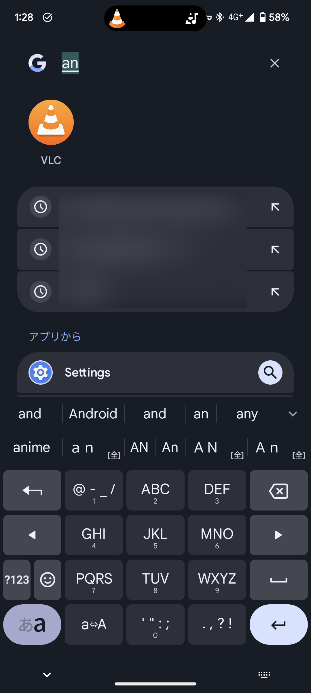
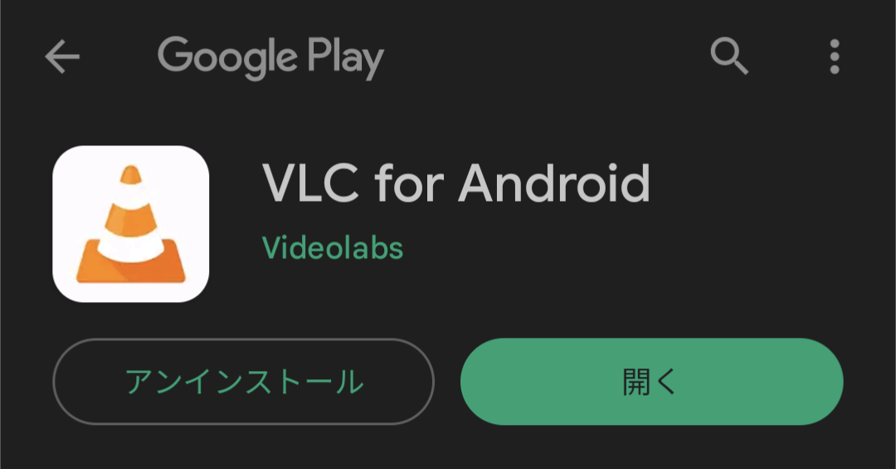
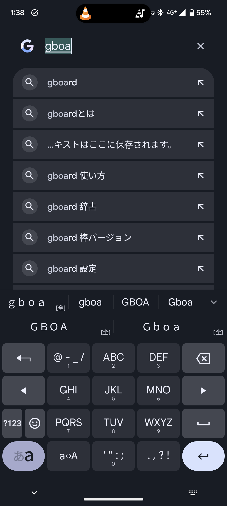
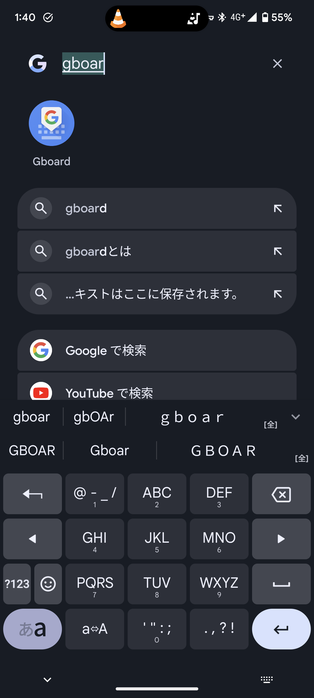

:::note info
この記事の内容は、次の環境で動作確認しています。

- 端末：Google Pixel 6
- OS：Android 13（ビルドTQ1A.221205.011）
:::

## はじめに

Google PixelのPixel Launcherで利用できるアプリ検索は、直感に反した変な挙動をするときがあります。この記事では、その理由と対策を2つのケースに分けて説明します。

## ケース1

まずは、1つ目のケースです。アプリ検索で「an」と入力すると、アプリ名に「an」が含まれていないのに、検索結果に「VLC」が表示されます。

### 理由

このように、アプリ名に検索対象の文字列が含まれていないのに検索結果に表示されることがあるのは、略称ではなく正式なアプリ名で検索する仕組みだからです。

さきほどの例の「VLC」は、正式には「VLC for Android」という名前で登録されています。

つまりこのケースは、アプリの正式な名称と、Pixel Launcherに表示される略称が一致していないために発生します。

### 対策

対策としては、アプリの正式名称を考慮したうえで検索するという方法が挙げられます。

## ケース2

アプリ名を正確に入力しているのに、検索結果に表示されたりされなかったりする場合があります。

たとえば、画像のようなケース。「Gboard」を検索するときに「gboa」では表示されないのに、「gboar」だと表示されます。

### 理由

これは、Android 13で追加された「新機能」にPixel Launcherが対応したためです。

Android 13では、アプリがキーボードの予測変換の情報を取得できるようになりました。これにより、漢字やカタカナへ変換する前に検索結果を表示できるようになっています。この機能はとくに日本語ユーザーに恩恵をもたらす一方で、予測変換が適切でない場合は適切な検索結果が表示されないという弊害もあります。

さきほどのケースは、これに該当します。2枚のスクリーンショットの予測変換に注目してください。1枚目の「gboa」と入力したときは、予測変換として全角の「ｇｂｏａ」が表示されています。しかし、全角の「ｇｂｏａ」を含むアプリは存在しないため、検索結果が表示されません。

一方で2枚目の「gboar」では、予測変換が半角の「gboar」になっているため、「Gboard」が表示されています。

つまりこのケースは、キーボードの予測変換が意図したものでない場合に発生します。

### 対策

アプリ名を途中まで入力したら、エンターを押して変換を確定すると、予測変換とは関係なく確定した文字列を含むアプリが表示されます。

また、キーボードアプリのユーザー辞書などを用いて適切な予測変換が表示されるようにすることも有効です。

## まとめ

Pixel Launcherのアプリ検索は便利な一方で、直感に反する変な挙動をするときがあります。この問題は、さまざまな要素が関係した結果として発生しています。

この記事で紹介した方法を使うことで、直感に反する挙動を抑制できます。
