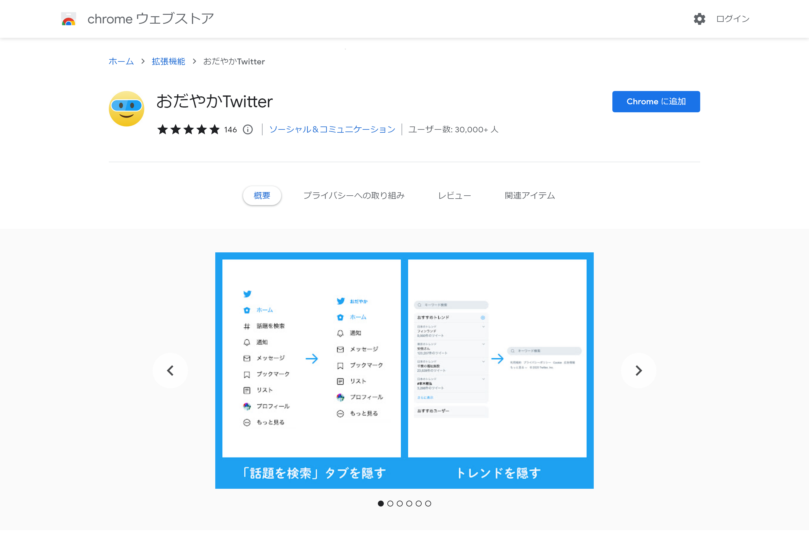
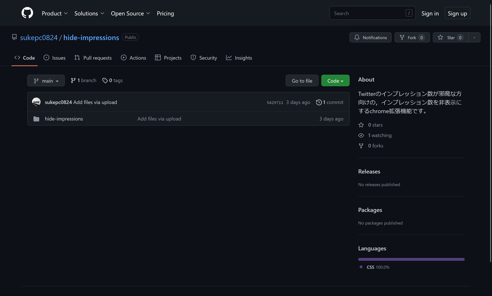
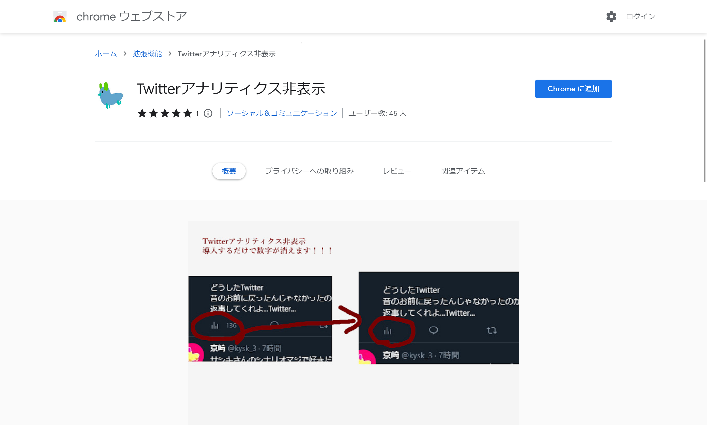
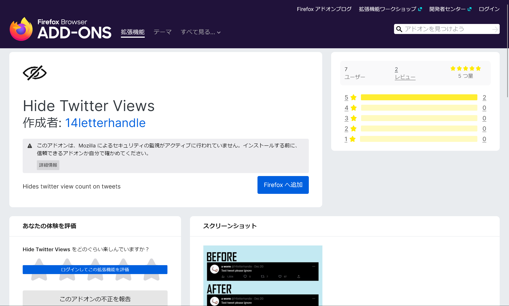

2022年12月23日、Twitterにインプレッション数を表示する機能が実装されました。この機能を鬱陶しいと感じる人や、他人と比べてしまうため非表示にしたいという人もいると思います。

この記事では、そういった人のためにインプレッション数を非表示にする方法を紹介します。

## スマートフォンの場合

まずはスマートフォンの場合についてです。現時点ではスマートフォンのTwitterアプリでインプレッション数を非表示にする機能は実装されていません。しかし、イーロン・マスクがインプレッション数を非表示にする機能を検討しているとツイートしています。

また、アプリ版では非表示にできませんが、スマートフォンのブラウザーを使ってTwitterにアクセスした場合はインプレッション数が表示されません（2022年12月27日時点）。

## パソコンの場合

パソコンの場合は、ブラウザーに拡張機能をインストールすることでインプレッション数を非表示にできます。

ここでは、代表的な拡張機能をいくつか紹介します。

- Hide View Count（オススメ）
- おだやかTwitter
- Hide Impression
- Twitterアナリティクス非表示
- Hide Twitter Views

### Hide View Count

今回紹介する拡張機能の中で一番オススメの拡張機能です。

この拡張機能は私が作ったのですが、ありがたいことに、告知ツイートは記事執筆時点で2,800回以上リツイートしていただきました。（日本語版の告知はぜんぜん伸びてない）

<blockquote class="twitter-tweet" data-dnt="true" data-theme="dark">
I&#39;ve created an extension named &quot;Hide View Count&quot; that hides the number of impressions of all tweets. It won&#39;t allow view count to be displayed for even a second!  Easy to use, just install it on your PC&#39;s Chrome or Firefox!  The installation link is in the tweet below. <a href="https://t.co/8wBwnPUPOs">pic.twitter.com/8wBwnPUPOs</a>
&mdash; ろぼいん@一般人 (@keita_roboin) <a href="https://twitter.com/keita_roboin/status/1606649067832217600?ref_src=twsrc%5Etfw">December 24, 2022</a></blockquote> 

インストールが簡単で、余計な機能は一切ありません。インプレッション数とそのアイコンを非表示にするだけの拡張機能です。ChromeとFirefoxの両方で動作します。

他の拡張機能との比較は[こちら](https://robot-inventor.github.io/article/2022/12/24/hide-twitter-view-count/#%E9%A1%9E%E4%BC%BC%E3%81%AE%E6%8B%A1%E5%BC%B5%E6%A9%9F%E8%83%BD%E3%81%A8%E3%81%AE%E9%81%95%E3%81%84)を参考にしてください。

- [Chrome版](https://chrome.google.com/webstore/detail/hide-view-count/mmefeobjcchickbjelledfhagoddcklp)
- [Firefox版](https://addons.mozilla.org/firefox/addon/hide-view-count/)

### おだやかTwitter

Chromeでのみ動作します。また、インプレッション数を非表示にすること以外の機能もついています。

Chromeを使っていて、インプレッション数以外も非表示にしたい人にオススメです。

- [Chrome版](https://chrome.google.com/webstore/detail/calm-twitter/cknklikacoaeledfaldmhabmldkldocj)
- Firefox版なし

### Hide Impression

Chromeでのみ動作します。また、拡張機能自体はシンプルな作りになっています。

ストアに登録されていないので、インストールには特別な手段を使う必要があります。作者の方の動画を参考にインストールしてください。

<blockquote class="twitter-tweet" data-dnt="true" data-theme="dark">
Twitterのインプレッション数を非表示にできる拡張機能を作りました<a href="https://t.co/0nqfHup2Fv">https://t.co/0nqfHup2Fv</a> <a href="https://t.co/mnRMuGIoeG">pic.twitter.com/mnRMuGIoeG</a>
&mdash; スケ/SUKE (@pcsuke) <a href="https://twitter.com/pcsuke/status/1606549036399751169?ref_src=twsrc%5Etfw">December 24, 2022</a></blockquote> 

### Twitterアナリティクス非表示

Chromeでのみ動作します。数字のみを非表示にするため、インプレッション数のアイコンは非表示になりません。

数字だけが非表示になればいいという人にオススメです。

- [Chrome版](https://chrome.google.com/webstore/detail/twitter%E3%82%A2%E3%83%8A%E3%83%AA%E3%83%86%E3%82%A3%E3%82%AF%E3%82%B9%E9%9D%9E%E8%A1%A8%E7%A4%BA/pcmnplinobfhahpdhacoajjeejnjfcac)
- Firefox版なし

### Hide Twitter Views

Firefoxでのみ動作します。また、Twitterの言語設定が英語以外になっていると動作しません。

Firefoxを使っていて、Twitterの言語設定を英語にしている人にオススメです。

- Chrome版なし
- [Firefox版](https://addons.mozilla.org/firefox/addon/hide-twitter-views/)

### まとめ

他のブログでは「インプレッション数を非表示にする方法」というタイトルにしておきながら、長い記事を読み進めると「インプレッション数を非表示にする方法はありませんでした」と書いてあるふざけた記事がありますが、この記事では真面目かつ簡潔に説明しました。

（私としてはHide View Countを使ってほしいですが）他の拡張機能も素晴らしいので、ぜひ自分にあった拡張機能をインストールしてみてください！

なお、この記事で紹介した拡張機能はすべて、掲載前にプログラムを確認して安全だということを確認しています。しかし、今後のアップデートで悪意のあるプログラムに変更される可能性は完全には否定できないので、インストールの際は自己責任でお願いします。

以上、Twitterのインプレッション数を非表示にする方法の解説でした。
