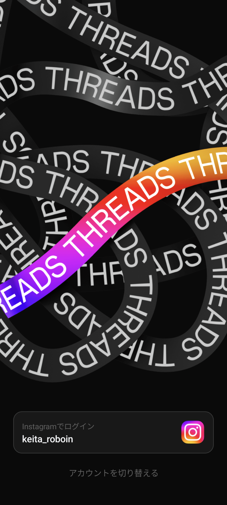
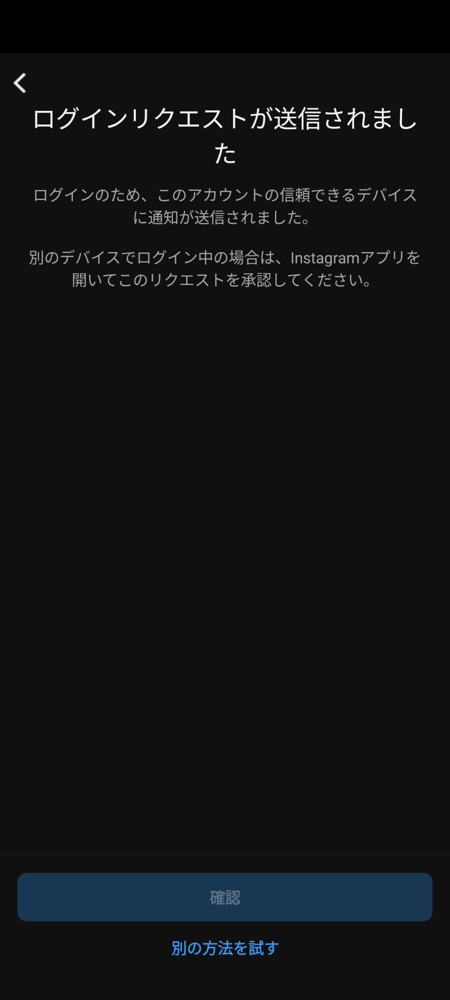
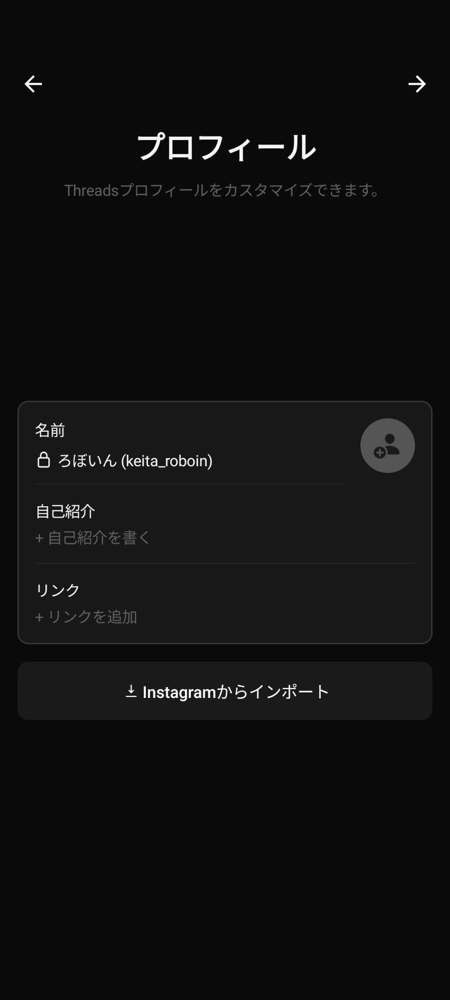
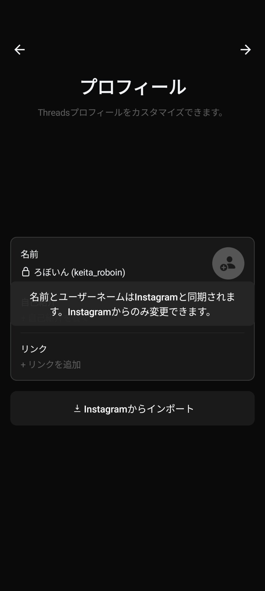
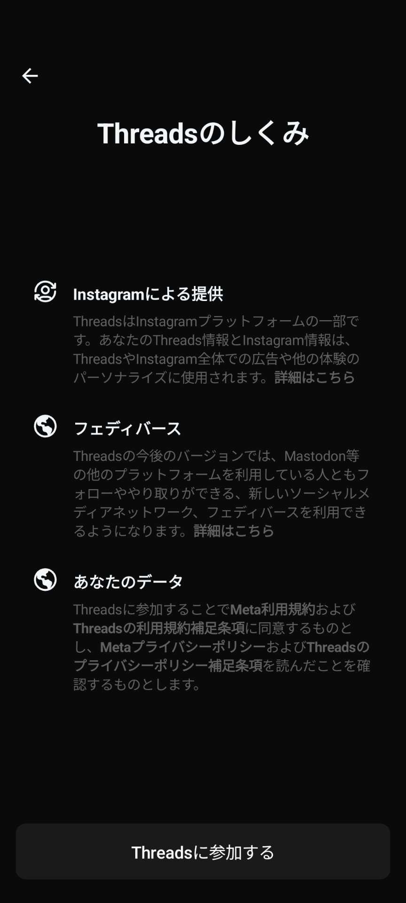
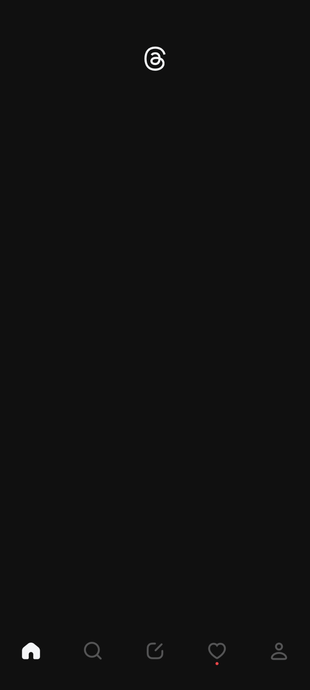
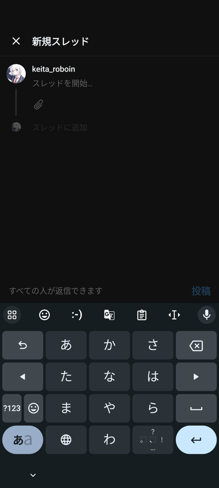
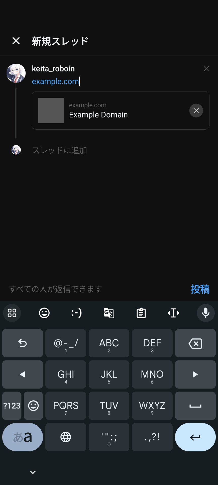
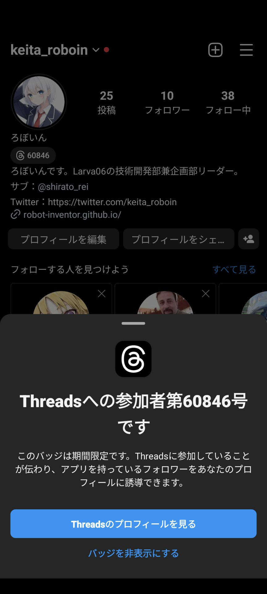

import ArticleCard from "/src/components/ArticleCard.astro";

## Threadsとは？

[Threads](https://www.threads.net/)は、Instagramの運営元のMeta（旧Facebook）が開発したテキストベースのSNSです。Instagramからユーザー名やフォローしているアカウントをそのまま引き継げます。

ThreadsはTwitterの対抗のSNSとして注目されており、Twitterがログインしていないと[閲覧できなく](https://www.techno-edge.net/article/2023/07/02/1528.html)なったり、1日の閲覧数に[制限](https://k-tai.watch.impress.co.jp/docs/news/1513249.html)がかかったりした直後に発表されました。

日本時間2023年7月6日午後11時にリリースが予告されていましたが、前倒しされ、午前8時ごろから利用可能になりました。

将来的には[Mastodon](https://joinmastodon.org/ja)や[Misskey](https://join.misskey.page/ja-JP/)で採用されている[ActivityPub](https://www.w3.org/TR/activitypub/)に対応し、これらのSNSと相互運用できるようになる予定です。

## Threadsの注意点

記事執筆時点では、Threadsを使う際の注意点として、次のようなものが挙げられます。

- Instagramアカウントがないと使えません
- Threadsのアカウントを削除するにはInstagramのアカウントを削除する必要があります
- Twitterのような「メディア欄」「いいね欄」はありません
- 再投稿（Twitterのリツイート機能に相当）をしたユーザーやその人数は分かりません
- フォローしている人の投稿だけを表示するタイムラインはありません
- 詐欺など、[悪質な商業利用](https://www.itmedia.co.jp/news/articles/2307/06/news135.html)はできません

## Threadsの登録方法

Threadsのアプリは、次のリンクからダウンロードできます。

- [iOS](https://apps.apple.com/us/app/threads-an-instagram-app/id6446901002)
- [Android](https://play.google.com/store/apps/details?id=com.instagram.barcelona)

Web版は[threads.net](https://www.threads.net/)から利用できるようになる予定ですが、記事執筆時点ではまだ利用できません。

アプリをインストールして開いたら、Instagramと同じアカウントが画面下部に表示されます。Instagramアプリに複数のアカウントでログインしている場合は、［アカウントを切り替える］をタップするとThreadsでログインするアカウントを選択できます。

表示されているアカウントでログインする場合は、［Instagramでログイン］という文字とともに表示されているユーザーネームをタップすると、Instagramアプリにログインリクエストが送信されます。

Instagramアプリからログインリクエストの通知が届くので、通知を開いて［承認］をタップし、［リクエストを承認］をタップします。

Threadsアプリに戻って少し待つと、画面が切り替わってプロフィールの設定画面が表示されます。

名前とユーザーネームはInstagramと共通のため、変更できません。変更したい場合は、Instagramアカウントの方で変更する必要があります。

アイコンと自己紹介、プロフィールに表示するリンクは自由に設定できます。また、［Instagramからインポート］をタップすれば、Instagramからそれらをそのまま引き継ぐこともできます。

画面右上の矢印をタップすると次の画面に進みます。アカウントの公開範囲の設定が表示されたら、お好みの設定を選択します。

次に、［Threadsのしくみ］というタイトルでThreadsについての説明が表示されます。

ThreadsがInstagramによって提供されていることや、将来的にフェディバースに対応してMastodonなどとフォローややりとりをできるようになることが説明されています。

Mastodonとやり取りできるという文言から、Threadsが将来的にActivityPubに対応し、Misskeyなどともやり取りできるようになると推測できます。

画面下部の［Threadsに参加する］をタップすると、アカウントの作成が完了します。

Instagramでフォローしているアカウントをまとめてフォローする画面が表示されるので、必要であればフォローしておきましょう。

なお、現時点では複数のアカウントに同時にログインする機能は提供されていません。アカウントを切り替えるには、画面右下のアイコンからプロフィールを表示し、右上のメニューから［ログアウト］して別のアカウントでログインし直す必要があります。

## Threadsの使い方

Threadsのホーム画面には、まだ何も表示されていないかもしれません。最初に、何かを投稿してみましょう。

画面下部に表示されているメニューの中央のボタンをタップすると、投稿画面が表示されます。好きなテキストを入力して投稿してみましょう！

Threadsでは、Twitterと同様に、複数の投稿をつなげるスレッド機能を利用できます。また、画面下部の［すべての人が返信できます］をタップすると、どのアカウントが投稿に返信できるかを設定できます。

クリップのアイコンをタップすると画像を最大で10枚まで添付できます。

また、ThreadsではInstagramと違って投稿にリンクを含めることができます。

さらに、Threadsの投稿はInstagramのストーリーやフィードでシェアできます。詳細については、こちらの記事をご覧ください。

<ArticleCard link="/article/2023/07/07/share-threads-to-instagram/" />

## おまけ

Threadsのアカウントを作成したあとにInstagramアプリを開くと、プロフィールの名前の下に番号が表示されるようになっています。

この番号をタップすると、自分が何番目にThreadsのアカウントを作成したかを確認できます。このバッジは期間限定で表示されるようです。私は60846番目でした。

また、Instagramで「Threads」と検索すると、Threadsのチケットが表示されます。アカウントによっては表示されないこともありますが、表示されなくてもThreadsのアカウントを作成できます。

<blockquote class="twitter-tweet" data-dnt="true" data-theme="dark">
Instagramで「Threads」で検索するとチケットとカウントダウンが表示されるようになってる！！アカウントによって表示されたりされなかったりするみたい <a href="https://t.co/sCSWMPNzfc">pic.twitter.com/sCSWMPNzfc</a>
&mdash; ろぼいん@一般人 (@keita_roboin) <a href="https://twitter.com/keita_roboin/status/1676640072001806337?ref_src=twsrc%5Etfw">July 5, 2023</a></blockquote> 

## まとめ

この記事では、MetaのTwitter対抗SNS「Threads」の登録方法と使い方を紹介しました。

Twitterと共通の機能が複数みられることがら、Metaが明らかにTwitterとの競争を意識していることが分かります。

また、他のSNSとの相互運用など、Twitterにはない機能もありました。Instagramアカウントから簡単にアカウントを作成でき、またフォローしている人もまとめてフォローできることから、急速にユーザー数を増やしたいというMetaの思惑がみえます。

Metaは、Twitterとの競争に勝つために、Twitterにはない機能をどんどん追加していくと予想されます。今後の動向に注目です。

最後に、ぜひTwitterやThreads、Misskeyのフォローをお願いします！

- [Twitter](https://twitter.com/keita_roboin)
- [Threads](https://www.threads.net/@keita_roboin)
- [Misskey](https://misskey.io/@roboin)
