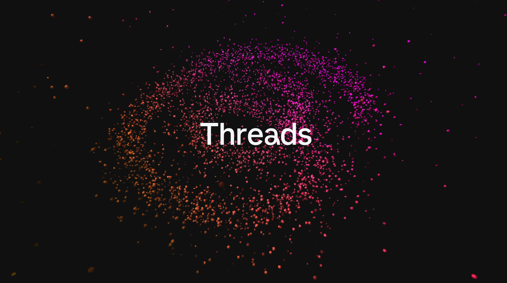
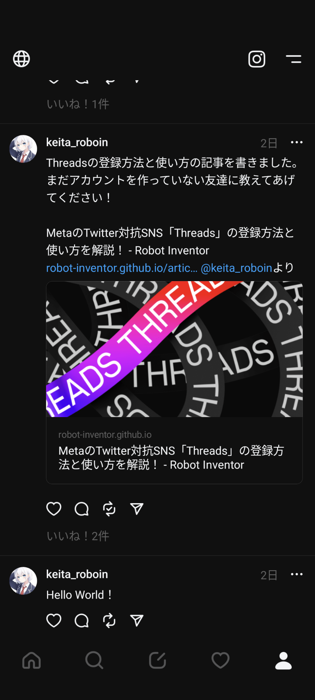
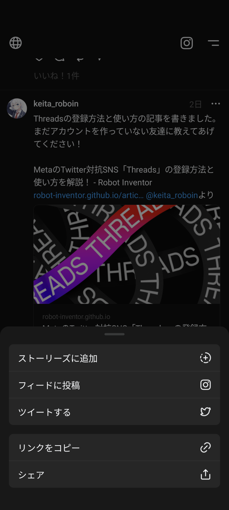
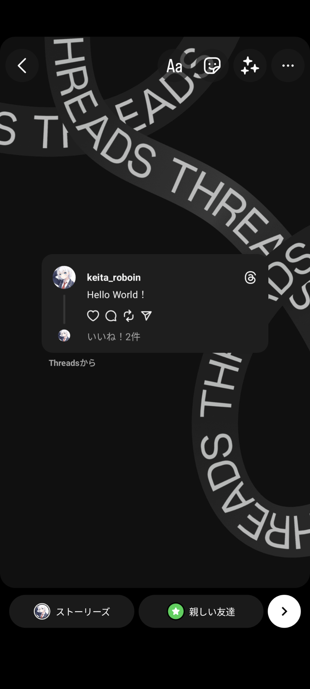
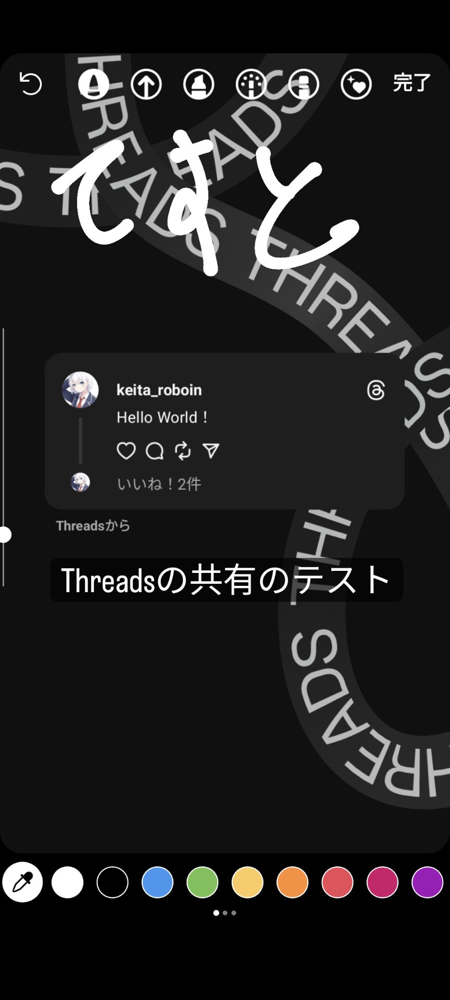
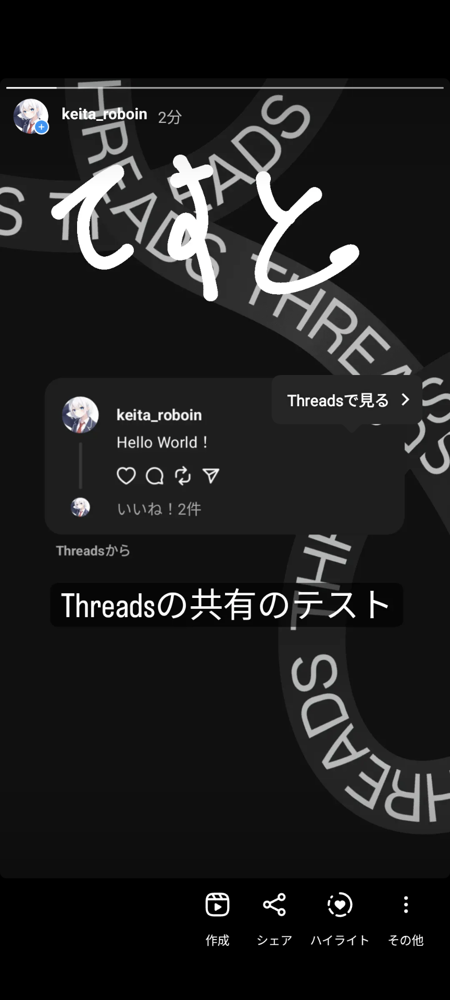
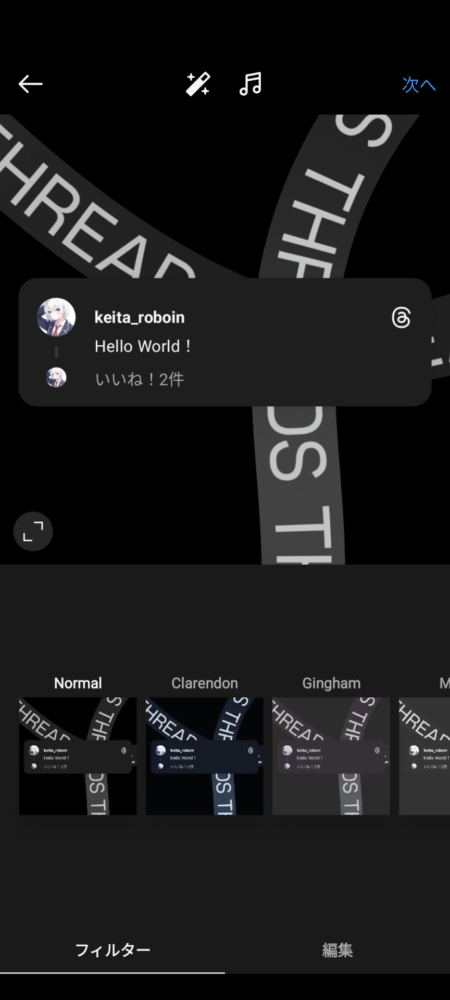
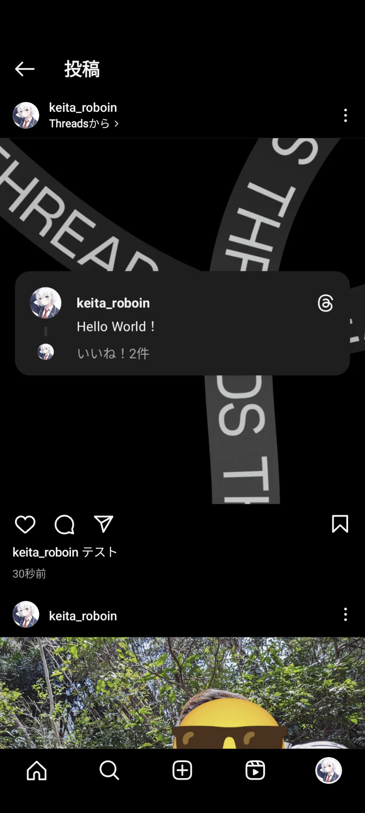

import { YouTube } from "@astro-community/astro-embed-youtube";
import ArticleCard from "/src/components/ArticleCard.astro";

Threads は Instagram の運営元の Meta が最近公開した、テキストベースの SNS です。利用するには Instagram のアカウントが必要ですが、Threads の投稿は Instagram には表示されません。この記事では、Threads の投稿を Instagram のストーリーやフィードにシェアする方法を、画像付きで分かりやすく解説します。

## Threads とは

Threads は Instagram の運営元の Meta が最近公開した、テキストベースの新しい SNS です。Twitter がログインしていないと閲覧できなくなったり、1 日の閲覧数に制限がかかったりした直後に発表され、話題になりました。Threads は Twitter の対抗の SNS として注目されています。

Threads のユーザー数はわずか[16 時間で 3,000 万人に到達](https://xtrend.nikkei.com/atcl/contents/casestudy/00012/01240/)しました。ユーザー数が[史上最速で 1 億人に到達](https://japan.zdnet.com/article/35199601/)した ChatGPT ですら[100 万ユーザーの獲得に 6 日](https://www.itmedia.co.jp/news/articles/2212/06/news110.html)かかっており、Threads のユーザー数が驚異的なスピードで増えていることが分かります。

また、Threads は将来的に ActivityPub に対応し、Misskey や Mastodon のアカウントをフォローしたり、それらのアカウントとやり取りしたりできるようになる予定です。

Threads の登録方法や基本的な使い方は、こちらの記事で詳しく解説しています。

<ArticleCard link="/article/2023/07/06/meta-twitter-competing-app-threads/" />

## Threads の投稿を Instagram にシェアする方法

Threads では、投稿を Instagram のストーリーやフィードにシェアできます。この機能を使うと、Threads の投稿を手軽に Instagram のフォローと共有できます。

まずは、Instagram でシェアしたい Threads の投稿を開きましょう。投稿の下に表示されている紙飛行機のアイコンをタップします。

すると、共有のメニューが表示されます。Instagram のストーリーでシェアしたい場合は［ストーリーズに追加］、フィード（ストーリーではない通常の投稿）でシェアしたい場合は［フィードに投稿］をタップします。

Instagram アプリが開き、ストーリーやフィードの投稿画面が表示されます。ここからは、ストーリーの場合とフィードの場合で少し異なります。

### ストーリーの場合

ストーリーの場合は［Threads から］という言葉とともに、Threads の投稿のスクリーンショットが表示されます。この画面では、通常のストーリーと同じように編集や加工ができます。

また、他のサイトなどでは背景の画像を変更できないという情報もありますが、**実際には変更可能**です。背景を 2 本の指でピンチインすると、背景画像の大きさや位置を変更できます。左右にスワイプすれば背景色をプリセットから選択できます。他にも、落書きツールを選択して長押しすれば、背景を単色で塗りつぶせます。

詳細な手順は、次の動画をご覧ください。

<YouTube id="w703Zdm4KRs" />

ストーリーでは、ストーリーに埋め込まれた Threads の投稿をタップすると［Threads で見る］というボタンが現れます。このボタンをタップすると Threads のアプリが開き、投稿を表示できます。

### フィードの場合

フィードの場合もストーリーの場合と同様で、通常の投稿と同じように加工できます。

フィードでは、ユーザーネームの下に表示される［Threads から］というボタンをタップすると、投稿を Threads アプリで表示できます。このとき、間違えてユーザーネームをタップすると、Instagram のプロフィールが表示されてしまうので注意してください。

## まとめ

この記事では、Threads の投稿を Instagram のストーリーやフィードにシェアする方法を解説しました。Threads の投稿を Instagram にシェアすると、Instagram のフォローと共有できるので、より多くの人に投稿を見てもらえます。ぜひ、この機能を使って、Threads の投稿を Instagram にシェアしてみてください！

最後に、Twitter や Threads、Misskey もやっているので、ぜひフォローしてください！！

- [Twitter](https://twitter.com/keita_roboin)
- [Threads](https://www.threads.net/@keita_roboin)
- [Misskey](https://misskey.io/@roboin)
