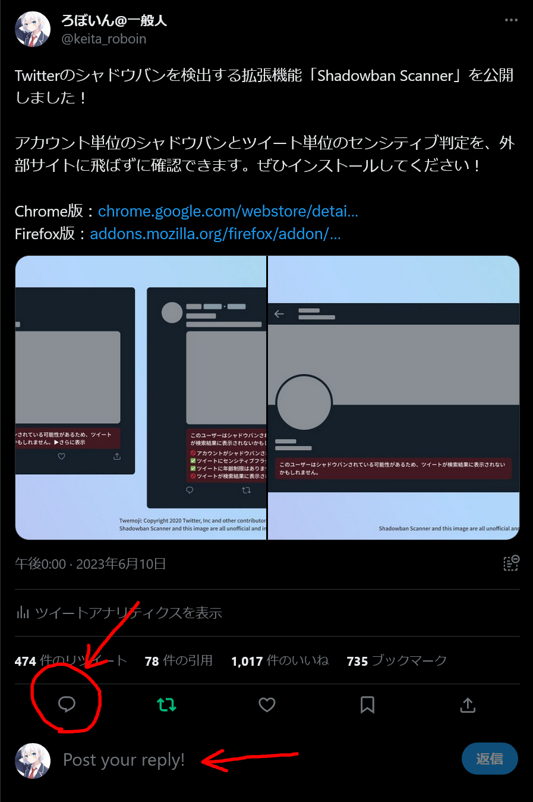
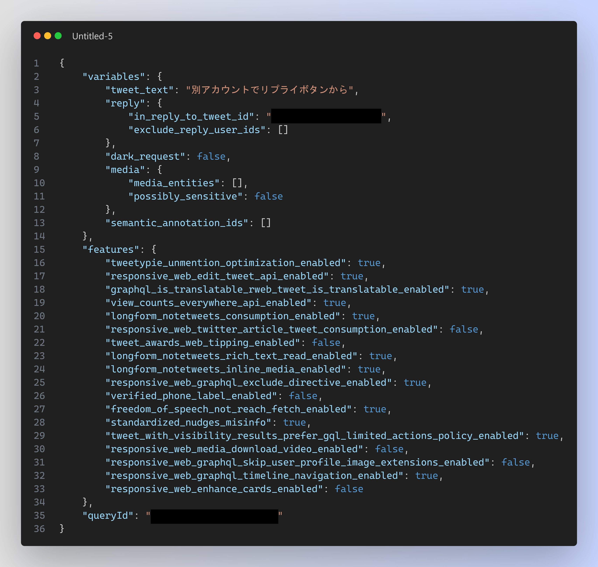
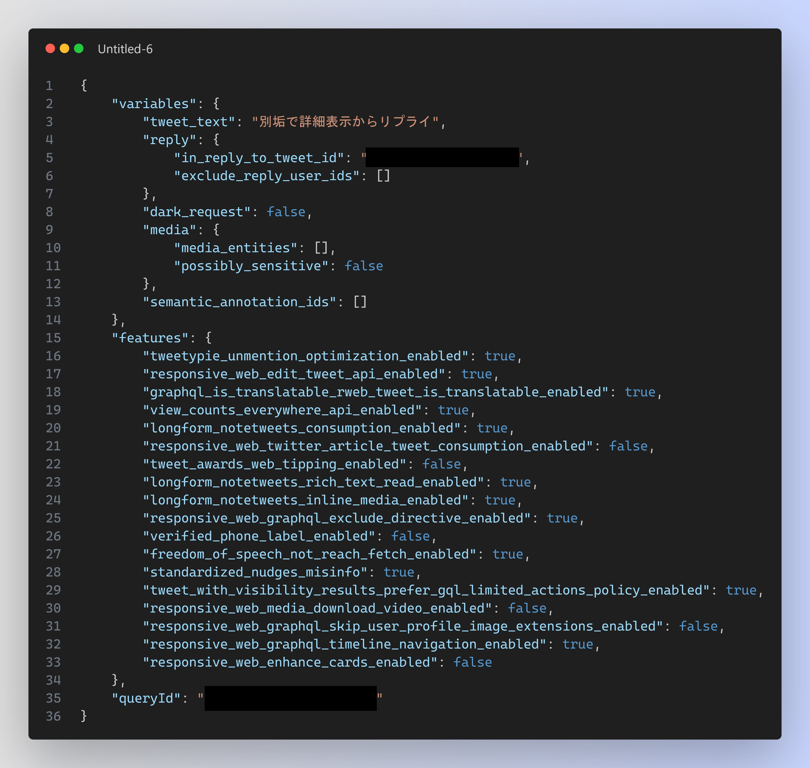
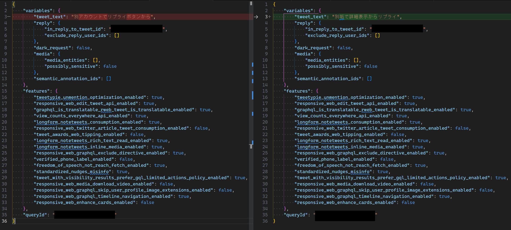
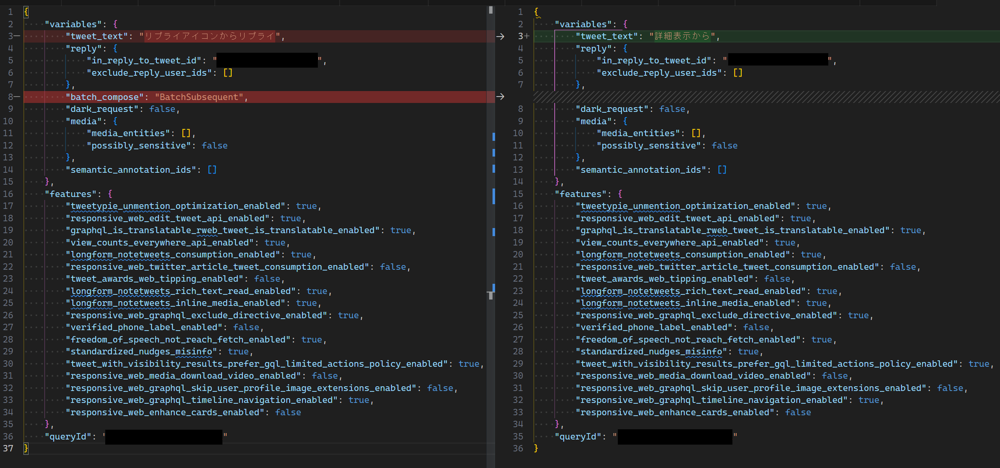
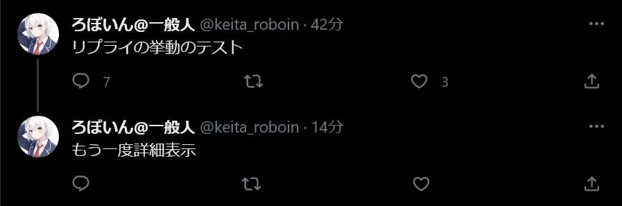
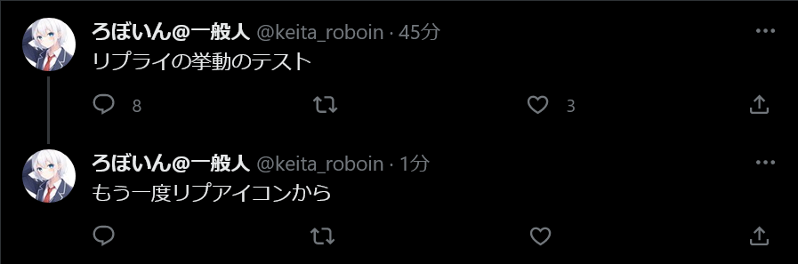

先日、X（旧Twitter）には2つの返信方法があり、片方はタイムラインに表示されてもう片方は表示されないという[投稿](https://twitter.com/ErrorCodeL/status/1686355534189146112)が話題になりました。

この情報が事実かどうか気になったため、それぞれの返信方法の通信内容を調査して検証しました。なお、この投稿はのちに私を含めた複数のユーザーの検証の結果誤りだと判明しており、本人も誤りだったと認めています。

この記事の内容は、投稿の情報が事実かどうか判明する前の段階で行った検証のものです。また、私がX（旧Twitter）へ投稿した内容とほぼ同一ですが、この記事では少しだけ詳しく書いてありまず。

<blockquote class="twitter-tweet" data-dnt="true" data-theme="dark">
検証した結果、少なくともWeb版では2つの返信方法で違いはなかった。これは勘違いか古い情報だと思う。  1枚目がリプライアイコンから、2枚目が詳細表示のテキストボックスから他のアカウントに返信したときに送信される内容。ツイートの文章以外は同じだから、違いが出るのはありえないはず。 (続く) <a href="https://t.co/ibyXMD6k6D">https://t.co/ibyXMD6k6D</a> <a href="https://t.co/M9L1fGuyes">pic.twitter.com/M9L1fGuyes</a>
&mdash; ろぼいん@一般人 (@keita_roboin) <a href="https://twitter.com/keita_roboin/status/1686607997257261056?ref_src=twsrc%5Etfw">August 2, 2023</a></blockquote> 

## 概要

Twitterの返信方法には、次の2種類があります。

- 吹き出しアイコンをクリック（タップ）して返信
- ツイートをクリックすると表示される詳細表示の［返信を投稿］というテキストボックスから返信

先日話題になった投稿では、前者の返信方法で返信するとリプライが他人のタイムラインに表示され、後者では表示されないとされていました。

この記事では、この情報が事実かどうかを、技術的な側面から検証します。

## 検証方法

検証には、Webブラウザーの開発者ツールを使用します。開発者ツールは、Webサイトの構造や通信内容を調査するためのツールです。

今回はこの開発者ツールを用いて、返信した際に送信される通信を監視し、その内容を調査します。送信される内容に違いがあれば、それがリプライの表示に影響を与える可能性があります。一方で送信される内容が同じなら、Twitterのサーバーからはどちらの方法で返信したか区別がつかないため、どちらも同じように扱われると考えられます。

また、アカウントAとアカウントBを用意し、アカウントAの投稿にアカウントBから投稿する（他人の投稿に返信する）場合と、アカウントAの投稿にアカウントAから返信する（自分の投稿に返信する）場合の両方を調べました。

## 検証結果

### 他人の投稿に返信する場合

次の画像はそれぞれ順に、吹き出しアイコンから返信した場合と、詳細表示の［返信を投稿］から返信した場合に送信される内容です。

どちらの場合も、アカウントAの投稿にアカウントBから返信（他人の投稿に返信）しました。また、黒塗りの部分は機密情報が含まれる可能性を否定できないため黒塗りにしていますが、検証結果には影響ありません。

また、次の画像はこれらの送信内容を比較したものです。赤や緑でハイライトされている部分が、送信内容に違いがある部分です。返信の文章以外の部分はすべて同じということが分かります。

したがって、他人の投稿に返信する場合は、どちらの返信方法でも送信内容が同じなため、Twitterのサーバーからは2つの返信方法を区別できまぜん。どちらの返信方法でも同じようにタイムラインに表示される（またはどちらも同じように表示されない）と考えられます。

### 自分の投稿に返信する場合

次に、アカウントAの投稿にアカウントAから返信（自分の投稿に返信）した場合について調査しました。

次の画像は、吹き出しアイコンから返信した場合（左）と、詳細表示の［返信を投稿］から返信した場合に送信される内容（右）の比較です。

自分の投稿に返信した場合は、返信の文章以外にも送信内容に違いがあることが分かります。吹き出しアイコンから返信した場合には``batch_compose``という項目が存在していますが、詳細表示の［返信を投稿］から返信した場合には存在していません。

では、自分の投稿に返信した場合は、2つの返信方法でタイムラインへの表示のされ方が変わるのでしょうか。

次の画像は、詳細表示の［返信を投稿］から自分の投稿に返信したあと、他のアカウントのタイムラインを確認したようすです。返信がタイムラインに表示されています。

次に、吹き出しアイコンから返信したあとに、同様に他のアカウントのタイムラインを確認しました。こちらも、返信がタイムラインに表示されています。その代わりに、先ほどまで表示されていた、詳細表示から送信した返信は表示されなくなりました。

順番を逆にして、吹き出しアイコンから返信したあとに詳細表示から返信した場合も同様でした。返信方法を問わず、常に最新の返信のみが表示されます。

## まとめ

以上の検証から、次のことが分かりました。

- 他人の投稿に返信する場合は、どちらの返信方法でも違いはない
- 自分の投稿に返信する場合は、返信方法によって送信されるデータが異なるものの、タイムラインには返信方法を問わず最新の返信のみが表示される

したがって、他人の投稿に返信する場合も、自分の投稿に返信する場合も、返信方法による違いはないという結論になりました。

冒頭で紹介した、返信方法によってタイムラインに表示されたりされなかったりするという情報は、誤りだと考えられます。ただし、昔はそうだったという可能性はあります。または「詳細表示から返信したあとに吹き出しアイコンから返信してタイムラインを確認したところ、（最新の返信である）後者のみがタイムラインに表示された」という現象を、返信方法によってタイムラインへの表示のされ方が異なると勘違いした可能性もあります。

最後に宣伝です。[Twitter（X）](https://twitter.com/keita_roboin)をやっているので、ぜひフォローしてください！また、アカウント単位のシャドウバンとツイート単位のセンシティブフラグを検出する[拡張機能](https://twitter.com/keita_roboin/status/1667365975937757185)を開発しています。こちらもぜひインストールしみてください！
