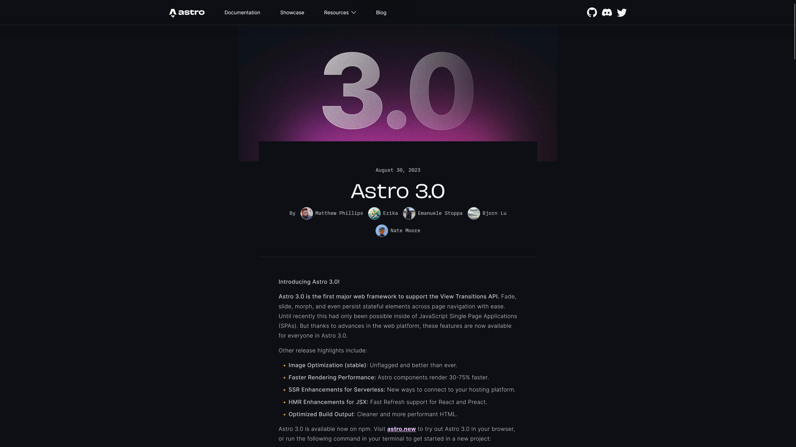

*Astro 3.0のリリースについての[公式ブログ](https://astro.build/blog/astro-3/)のスクリーンショット*

2023年8月31日、拡張性と速度が売りの静的サイトジェネレーター「Astro」のバージョン3.0がリリースされました。最適化やページ変遷の機能が強化され、今までよりさらに高速なサイトを構築できるようになりました。

この記事では[公式ブログ](https://astro.build/blog/astro-3/)を参考に、Astro 3.0の新機能や変更点の一部をまとめました。省略している項目もあるので、詳しい情報は[公式ブログ](https://astro.build/blog/astro-3/)を参照してください。

<blockquote class="twitter-tweet" data-dnt="true" data-theme="dark"><p lang="en" dir="ltr">Astro 3.0 is out now! 🪐<br><br>30% faster and more powerful than ever. View Transitions, Image Optimization, JSX Fast Refresh, and so much more. <a href="https://t.co/vOi44246Hg">https://t.co/vOi44246Hg</a></p>&mdash; Astro (@astrodotbuild) <a href="https://twitter.com/astrodotbuild/status/1696900204853698767?ref_src=twsrc%5Etfw">August 30, 2023</a></blockquote> <script async src="https://platform.twitter.com/widgets.js" charset="utf-8"></script>

## View Transitionsのサポート

Astro 3.0は、[View Transitions API](https://developer.mozilla.org/en-US/docs/Web/API/View_Transitions_API)をサポートする最初の主要なWebフレームワークです。ブラウザーのView Transitions APIを使うと、[MPA](https://e-words.jp/w/%E3%83%9E%E3%83%AB%E3%83%81%E3%83%9A%E3%83%BC%E3%82%B8%E3%82%A2%E3%83%97%E3%83%AA%E3%82%B1%E3%83%BC%E3%82%B7%E3%83%A7%E3%83%B3.html)（Multiple Page Application）で[SPA](https://e-words.jp/w/%E3%82%B7%E3%83%B3%E3%82%B0%E3%83%AB%E3%83%9A%E3%83%BC%E3%82%B8%E3%82%A2%E3%83%97%E3%83%AA%E3%82%B1%E3%83%BC%E3%82%B7%E3%83%A7%E3%83%B3.html)（Single Page Application）のようにスムーズなページ変遷を実現できます。

View Transitions APIを使うと、たとえばページのヘッダーを表示したまま、コンテンツ部分だけをフェードエフェクトで切り替えるようなことができるようになります。

Astro 3.0では、たった2行のコードを追加するだけでView Transitionsを使えるようになります。すべてのページで読み込まれるようなファイルに``<ViewTransitions />``を追加し、``<head>``タグ内で読み込みます。

詳細なカスタマイズは可能ですが、たったこれだけの作業で最低限View Transitionsを使えるようになります。

```astro
---
import {ViewTransitions} from 'astro:transitions';
---
<head>
  <title>タイトル</title>
  <ViewTransitions />
</head>
<body>
</body>
```

また、AstroのView Transitions機能には、View Transitions APIをサポートしていないブラウザーのためのフォールバック機能も含まれています。これにより、すべてのユーザーにスムーズなページ変遷を提供できます。

実際に試してみたところ、画像など、Webページでないファイルへのリンクが正しく動作しませんでした。公式ドキュメントにも[書いてある](https://docs.astro.build/ja/guides/view-transitions/#%E3%82%AF%E3%83%A9%E3%82%A4%E3%82%A2%E3%83%B3%E3%83%88%E3%82%B5%E3%82%A4%E3%83%89%E3%83%8A%E3%83%93%E3%82%B2%E3%83%BC%E3%82%B7%E3%83%A7%E3%83%B3%E3%81%AE%E9%98%B2%E6%AD%A2)のですが、こうしたページでないものへのリンクには``data-astro-reload``属性を付与する必要があります。

- 参考：[ビュートランジション 🚀 Astroドキュメント](https://docs.astro.build/ja/guides/view-transitions/)

## レンダリングの高速化

Astro 3.0では、レンダリング速度が大幅に向上しました。ほとんどのコンポーネントはAstro 2.9と比較して30%高速になりました。複雑なベンチマークでは、75%向上した場合もあるそうです。

## 画像の最適化

試験機能として提供されていた画像の最適化機能が、Astro 3.0で安定版になりました。Astroが画像を自動で検知し、最適化してくれます。また、画像のサイズを事前に計算することで、[CLS](https://web.dev/i18n/ja/cls/)（Cumulative Layout Shift・画像の読み込みなどによりレイアウトがズレること）を防ぐ機能もあります。

また、Astroではこれまで、画像の最適化に[Squoosh](https://github.com/GoogleChromeLabs/squoosh)を利用していましたが、積極的に[メンテナンスされなくなった](https://github.com/GoogleChromeLabs/squoosh/issues/1304#issuecomment-1369801368)ため、[sharp](https://github.com/lovell/sharp)に置き換えられました。

- 参考：[画像 🚀 Astroドキュメント](https://docs.astro.build/ja/guides/images/)

## ビルド結果の最適化

Astro 3.0では、ビルドしたHTMLが自動で圧縮されるようになりました。また、ファイルサイズの小さいCSSは、自動的にインライン化されます。これにより、Astroで作成したサイトのパフォーマンスが向上します。

## Astro 3.0へのアップデート方法

Astroのパッケージを最新バージョンにアップデートするには、次のコマンドを実行します。

```console
npm create astro@latest
```

サイトの作りによっては、Astro 3.0へのアップデートのために追加の作業が必要になる場合もあります。詳しくは[公式のガイド](https://docs.astro.build/en/guides/upgrade-to/v3/)を参照してください。

また、Astro 3.0へのアップデートと一緒に、インテグレーションもアップデートすることをオススメします。私の環境ではAstro 3.0にアップデートしたあと、mdxファイルでエラーが発生しましたが、インテグレーションをアップデートすることで解決しました。
