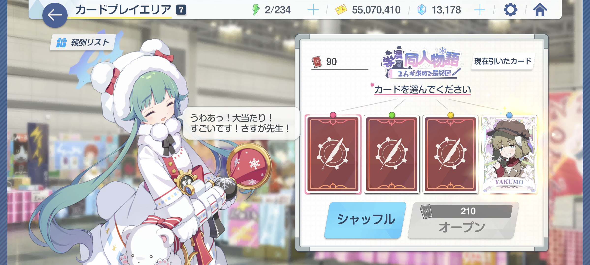

[ブルアカ](https://bluearchive.jp/)の一部のイベントには、カードめくりというミニゲームが存在しています。カードめくりには複数のめくり方があります。どのめくり方の効率が一番いいのか、シミュレーションを作って検証してみました。

※結果だけ見たい方は「[シミュレーション結果](#シミュレーション結果)」まで飛んでください。

## カードめくりとは

カードめくりは、イベントアイテムを消費することでカードをめくれるミニゲームです。カードには複数の種類があり、種類ごとにもらえる報酬が決まっています。カードめくりのカードには、次の種類があります。上に行くほどレアなカードで、報酬も豪華になります。

- UR
- SR
- R
- N

一度に4枚のカードが表示され、そのうち少なくとも1枚はSR以上が入っています（最低保証）。それぞれのカードの確率は公表されていませんが、有志の調査によっておおまかな確率が判明しています。

カードをめくる際のアイテムの消費量は、1枚目は200個ですが、2枚目は210個、3枚目は220個、4枚目は230個というようにどんどん増えていきます。また、アイテムを消費せずに途中でシャッフルでき、シャッフルするとアイテムの消費量が200個に戻ります。

## カードめくりの派閥

そんなカードめくりですが、複数の派閥が存在しています。主要な派閥としては次のようなものがあります。

- 1枚めくるごとにシャッフル
- すべてめくってからシャッフル
- SR以上が出たらシャッフル

どのめくり方の効率が一番いいのか、SNSではたびたび議論になります。それぞれのめくり方の特徴は次のとおりです。

- 1枚目めくるごとにシャッフル：アイテムの消費量がもっとも少なく、多くのカードをめくれるが、隠れているURを逃す可能性がある
- すべてめくってからシャッフル：隠れているURを逃さないが、アイテムの消費量は増える
- SR以上が出たらシャッフル：ある程度の枚数をめくることでURを逃す可能性を減らせるが、すべてめくる場合ほどではない

では、確率的にはどのめくり方の効率が一番いいのでしょうか？

## 効率の定義

この問題を考える上で、最初に「効率がいい」というのが何を指しているかを明確にする必要があります。

同じめくり方でもどのアイテムが欲しいかによって効率は変わります。ここでは、「レアリティーの高いカードをより多くめくれる」のが効率がいい、と定義します。

## シミュレーション方法

今回の検証のために、カードめくりのシミュレーターを開発しました。このシミュレーターは、決まったアイテム量でカードをめくったとき、どのめくり方でどの種類のカードが何枚出るかをシミュレーションできます。

ただし、ビジュアルの再現はない、あくまで数値だけのシミュレーションです。ソースコードはGitHubで[公開](https://github.com/Robot-Inventor/card-flipping-simulator)しています。注意はしていますが、間違いやバグなどがあれば、Issueか[Twitter](https://twitter.com/keita_roboin)にてお知らせください。

[きりは](https://www.youtube.com/@KirihaChannel)さんの[動画](https://www.youtube.com/watch?v=S_gbE22j2ZI)によれば、各カードの確率は次のとおりです。

| カードの種類 |  確率 |
| ------------ | ----: |
| UR           |  7.4% |
| SR           | 38.9% |
| R            | 23.9% |
| N            | 29.8% |

ただし、この確率は最低保証が反映されているという点に注意が必要です。最低保証の反映後の確率が上のデータと同じになるように、シミュレーターの確率を調整したところ、最低保証の反映前の確率は概ね次のようになりました。

| カードの種類 |  確率 |
| ------------ | ----: |
| UR           |  7.0% |
| SR           | 36.8% |
| R            | 25.0% |
| N            | 31.2% |

シミュレーターでは、この確率を使いつつ、最低保証の反映後の確率がきりはさんのデータと一致するようにしています。

シミュレーション全般に関する注意事項や仮定は次のとおりです。

- 確率を用いたシミュレーターなので、実行するたびに結果が変わる可能性があります
- アイテムの初期量は1,000,000,000個で、すべての引き方で共通です
- アイテムの残量が足りなくなってそれまでの引き方（例：すべて引いてからシャッフル）を維持できなくなった場合は、シャッフルします。そして、最後の1枚を引ける場合は引いてからシミュレーションを終了します
- シャッフルすると4枚の新しいカードが用意され、そのうち少なくとも1枚はSR以上です（最低保証）。アイテムを消費せずにシャッフルできます
- 最低保証の仕組みの詳細が分からなかったため、このシミュレーターでは次のような実装をしています。**実際のゲームの実装とは異なる可能性があります**
  - 通常の確率に従って3枚のカードを用意する
  - 3枚のカードにSR以上が含まれる場合は、4枚目は通常の確率通りに用意する
  - 3枚のカードにSR以上が含まれない場合は、4枚目はSR以上が出るまで用意し直す
  - 4枚目が用意できたら、4枚のカードをランダムな順番に並べ替える
- このシミュレーターでは、カードを用意する際にランダムな順番に並べ替えているため、引く順番は関係ありません
  - これは、**実際のゲームの実装とは異なる可能性があります**
  - たとえば、もし実際のゲームの実装が「右端が最低保証枠」だった場合は、右から引いた方が有利になります（が、実際の実装は不明です）

## シミュレーション結果

シミュレーション結果は次のようになりました。一般的な派閥に加え、「2枚引いたらシャッフル」「3枚引いたらシャッフル」も検証しています。

確率に依存したシミュレーションなので、細かい数値は実行するごとに変わりますが、傾向は変わらないはずです。

### 1枚引いたらシャッフルする場合

| カードの種類 |      回数 |    確率 |
| ------------ | --------: | ------: |
| UR           |   369,377 |  約7.4% |
| SR           | 1,945,173 | 約38.9% |
| R            | 1,197,146 | 約23.9% |
| N            | 1,488,304 | 約29.8% |
| 合計         | 5,000,000 |     N/A |

### 2枚引いたらシャッフルする場合

| カードの種類 |      回数 |    確率 |
| ------------ | --------: | ------: |
| UR           |   360,962 |  約7.4% |
| SR           | 1,898,623 | 約38.9% |
| R            | 1,166,606 | 約23.9% |
| N            | 1,451,857 | 約29.8% |
| 合計         | 4,878,048 |     N/A |

### 3枚引いたらシャッフルする場合

| カードの種類 |      回数 |    確率 |
| ------------ | --------: | ------: |
| UR           |   352,268 |  約7.4% |
| SR           | 1,853,090 | 約38.9% |
| R            | 1,140,337 | 約23.9% |
| N            | 1,416,209 | 約29.7% |
| 合計         | 4,761,904 |     N/A |

### 4枚すべて引いたらシャッフルする場合

| カードの種類 |      回数 |    確率 |
| ------------ | --------: | ------: |
| UR           |   343,570 |  約7.4% |
| SR           | 1,811,078 | 約38.9% |
| R            | 1,112,018 | 約23.9% |
| N            | 1,384,496 | 約29.8% |
| 合計         | 4,651,162 |     N/A |

### SR以上が出たらシャッフルする場合

| カードの種類 |      回数 |    確率 |
| ------------ | --------: | ------: |
| UR           |   404,625 |  約8.4% |
| SR           | 2,129,543 | 約44.1% |
| R            | 1,019,590 | 約21.1% |
| N            | 1,272,093 | 約26.4% |
| 合計         | 4,825,851 |     N/A |

## 分析

### カードをめくれる回数が多いのは？

使用できるアイテムの量が同じ場合、カードをめくれる回数は、アイテムの消費量が少ない「1枚引いたらシャッフル」がもっとも多い結果となりました。これは当然ですね。

2位以降は順番に「2枚引いたらシャッフル」「SR以上が出たらシャッフル」「3枚引いたらシャッフル」「4枚すべて引いたらシャッフル」となりました。

### 一番効率がいいのは？

前述のとおり、ここでは「レアリティーの高いカードをより多くめくれる」のが効率がいい、と定義しています。

この定義に則ると、注目すべきことに、一番効率がいいのは「**SR以上が出たらシャッフル**」となりました。カードをめくれる回数は3位なのにもかかわらず、SR以上の枚数が他よりも圧倒的に多くなりました。これは、SR以上が出るまで引くことで最低保証の恩恵を得られ、極端な下振れを防げるためと考えられます。

<small>（シミュレーションのプログラムが間違っている可能性もありますが、たぶん大丈夫…なはず…）</small>

一方で、R以下は「1枚引いたらシャッフル」がもっとも多くなりました。

## まとめ

SR以上で得られる報酬が目当ての場合は、（シミュレーションが間違っていなければ）「SR以上が出たらシャッフル」がもっとも効率がいいということになります。逆にR以下で得られる素材が欲しい場合は、1枚引いたらシャッフルの効率がいいといえるでしょう。

最後に、TwitterやMisskeyをやっているので、ぜひフォローをお願いします！！（Twitterはリツイートが多いのでリツイートオフ推奨）

- Twitter：[@keita_roboin](https://twitter.com/keita_roboin)
- Misskey：[@roboin@misskey.io](https://misskey.io/@roboin)
