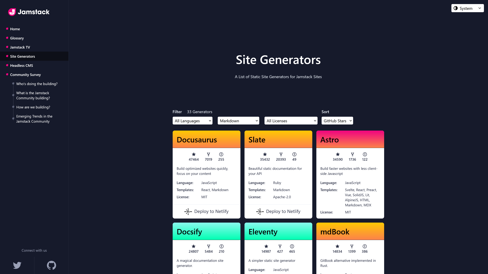

今までこのブログでは独自に開発したCMSと静的サイトジェネレーターを使っていましたが、Astroに移行しました。この記事では、Astroに移行した理由と、つまづいたところを紹介します。

## Astroとは？

[Astro](https://astro.build/)は、Markdownを用いて記事を執筆できる[静的サイトジェネレーター](https://www.cloudflare.com/ja-jp/learning/performance/static-site-generator/)です。Astroデフォルトでスクリプトが不要なので、高速なWebサイトを構築できます。詳しくは公式ドキュメントをご覧ください。

- [Astroを選ぶ理由 🚀 Astroドキュメント](https://docs.astro.build/ja/concepts/why-astro/)

## 独自システムを辞めた理由

今までこのブログでは、独自に開発したCMSと静的サイトジェネレーターを使っていました。この[システム](https://github.com/Robot-Inventor/Robot-Inventor.github.io/blob/590182bfbea2a196d936302a02b3362c3a406a5d/command/build.js)は2021年6月に実施した[全面リニューアル](https://robot-inventor.github.io/article/2021/06/15/)で導入し、2022年2月に[再構築](https://github.com/Robot-Inventor/Robot-Inventor.github.io/blob/ea73ae9a6e3b045e0a53ce37568d35ef83b01fcb/command/build.ts)したものです。

Markdownで書いた記事を、テンプレートを使ってHTMLに変換するというシステムです。その過程で、HTMLや画像の最適化をしていました。

しかし、このシステムにはいくつか問題がありました。

まず、主に画像の最適化処理において多重forループがあり、ソースコードが複雑になっていました。また、新しい記事のデータベースへの登録はコマンドラインから可能ですが、既存の記事に関するデータの変更や削除には、手動でデータベースを編集する必要がありました。

さらに、そもそも独自開発したものなので、信頼性とパフォーマンスの面で不安がありました。

以上の理由から、独自システムを辞めることにしました。

## Astroを選んだ理由

では、数あるCMSや静的サイトジェネレーターの中から、なぜAstroを選んだのでしょうか。

まず、システムを選定する上で必須の条件として、次のようなものがありました。

1. 静的サイトジェネレーターであること
2. Markdownで記事を執筆できること
3. 特定のライブラリーに依存しないこと
4. 拡張性やカスタマイズ性が高いこと

「静的サイトジェネレーターであること」については、このブログで利用している[GitHub Pages](https://docs.github.com/ja/pages/getting-started-with-github-pages/about-github-pages)が静的サイトにのみ対応しているためです。

「Markdownで記事を執筆できること」については、理由が2つあります。1つ目は、既存の記事がMarkdownで作成されているためです。2つ目は、Markdownだとさまざまな環境で気軽に執筆できるためです。

「特定のライブラリーに依存しないこと」については、これによってJavaScriptのコードの量を減らせ、サイトのパフォーマンスを向上できるためです。ライブラリーを使用すると、その分だけページの読み込みが遅くなります。

主要な静的サイトジェネレーターとしては、[Next.js](https://nextjs.org/)や[Nuxt.js](https://nuxt.com/)などがあります。しかし、Next.jsはReactベースですし、Nuxt.jsはVue.jsベースです。この時点で「特定のライブラリーに依存しないこと」に当てはまらないため、選択肢から外しました。

静的サイトジェネレーターを選定する上で参考になったのが、Jamstackのサイトです。Jamstackのサイトでは、主要な静的サイトジェネレーターを条件に合わせて絞り込めるようになっています。

- [Static Site Generators - Top Open Source SSGs | Jamstack](https://jamstack.org/generators/)

このページで［Templates］としてMarkdownを指定すると、次のようになりました。



GitHubのスター順で並べると、「Docusaurus」「Slate」「Astro」「Docsify」「Eleventy」「mdBook」といったものが上位になりました。この中で、上から順番に調査しました。

まず、DocusaurusはReactベースなので除外しました。

Slateについては、ブログというよりもドキュメント用ですし、Rubyで作られているので除外しました。Ruby自体は悪くないのですが、ライブラリーのインストールなどに使っている[Node.js](https://nodejs.org/ja)で統一できた方が便利だからです。

最終的に、条件に合致しておりGitHubのスター数も多いためAstroを選びました。

## Astroへの移行でつまづいたところ

Astroはとても使いやすく、ブログの基礎部分の移行作業はたったの30分で完了しました。他の細かい部分の調整や移行などを含めると、最終的に6日間で移行できました。

基礎部分が30分で終わったのに最終的に6日間かかっていることからも分かるとおり、いくつかつまづいた点があるので紹介します。

### 画像の相対パス

Astroはv3.0で正式サポートされた[assets](https://docs.astro.build/ja/guides/images/)機能により、Markdownファイル内で画像を相対パスで指定できます。

しかし、相対パスを記述する際、``./``は省略できないようです。つまり、次の例では、上は正しく動作しますが、下は正しく動作しません。

```markdown
<!-- 正しく動く -->


<!-- 正しく動かない -->

```

相対パスの``./``を省略すると、「Octal literal in strict mode (Note that you need plugins to import files that are not JavaScript)」というエラーが発生します。

Astroのソースコードを確認したところ、これはWindows環境で発生する問題のようです。軽くしか調査していませんが、おおむね次のような理由で発生しているようです。

- AstroはVite用のコードをテンプレートリテラルで生成している
- ``./``を省略すると、パスの正規化の関係で絶対パスへの変換時に区切り文字が``\``になる
- テンプレートリテラル内で``\``を使用すると、エスケープシーケンスとして扱われ、``\``の後に続く文字が8進数として解釈される

この問題を回避するため、既存の記事で``./``が省略されている相対パスに``./``を追加するスクリプトを作って修正しました。

### Note記法の対応

今までこのブログでは、Markdownパーサーとして[Marked](https://github.com/markedjs/marked)を採用していました。また、Qiitaの[Note記法](https://qiita.com/Qiita/items/c686397e4a0f4f11683d#note---%E8%A3%9C%E8%B6%B3%E8%AA%AC%E6%98%8E)を使うために、[qnote-parser](https://github.com/Robot-Inventor/qnote)というプラグインを開発して使っていました。

しかし、AstroではMarkdownパーサーとして[remark](https://github.com/remarkjs/remark)を採用しており、このプラグインを利用できません。

そこで、[qiita-to-md](https://github.com/MasatoMakino/qiita-to-md)というパッケージの内部で使われているプラグインを利用することにしました。``astro.config.mjs``に次のように記述することで、Note記法を利用できるようになります。

```javascript
import { defineConfig } from 'astro/config';
import { RemarkNotePlugin } from "@masatomakino/qiita-to-md/bin/plugin/RemarkNotePlugin";

export default defineConfig({
    site: "<サイトのURL>",
    markdown: {
        remarkPlugins: [RemarkNotePlugin.plugin],
        remarkRehype: {
            handlers: {
                note: RemarkNotePlugin.rehypeNoteHandler
            }
        }
    }
});
```

注意点として、記事執筆時点でこのプラグインには改段落やリストを含むNote記法を正しく変換できない[バグ](https://github.com/MasatoMakino/qiita-to-md/issues/33)があります。

また、このプラグインはQiitaの記事をダウンロードしてMarkdownとHTMLとして保存するためのものなので、単体で使うことが想定されていません。そのため、改行コードとして``\r\n``ではなく``\n``を使用する必要があります。これについても、スクリプトでまとめて置き換えました。

### frontmatterの画像のパス

Astroの[コンテンツコレクションと画像](https://docs.astro.build/ja/guides/images/#%E3%82%B3%E3%83%B3%E3%83%86%E3%83%B3%E3%83%84%E3%82%B3%E3%83%AC%E3%82%AF%E3%82%B7%E3%83%A7%E3%83%B3%E3%81%A8%E7%94%BB%E5%83%8F)についてのドキュメントで、「ブログ記事のカバー画像など、コンテンツコレクションのエントリに関連付けられた画像を、現在のフォルダからの相対パスを使ってフロントマターに宣言できます」と書かれています。

ドキュメントでは例として、次のコードが掲載されています。

```astro
---
import { Image } from "astro:assets";
import { getCollection } from "astro:content";
const allBlogPosts = await getCollection("blog");
---

{
  allBlogPosts.map((post) => (
    <div>
      <Image src={post.data.cover} alt={post.data.coverAlt} />
      <h2>
        <a href={"/blog/" + post.slug}>{post.data.title}</a>
      </h2>
    </div>
  ))
}
```

このことから、てっきり``<Image />``コンポーネントを````タグに置き換えても同様に動作すると思っていました。しかし、実際には次のように記述する必要があります。

```astro
---
import { Image } from "astro:assets";
import { getCollection } from "astro:content";
const allBlogPosts = await getCollection("blog");
---

{
  allBlogPosts.map((post) => (
    <div>
      
      <h2>
        <a href={"/blog/" + post.slug}>{post.data.title}</a>
      </h2>
    </div>
  ))
}
```

````タグに渡すときには``post.data.cover``ではなく``post.data.cover.src``とする必要があるようです。

これは、Astroが単純にfrontmatterの画像のパスを解決しているだけでなく、画像の最適化もしており、``post.data.cover``にパス以外の情報も含まれているためです。

### View Transitions機能が画像へのリンクを破壊する

Astroでは、たった[2行のコードを追加](https://docs.astro.build/ja/guides/view-transitions/)するだけで、ブラウザーの[View Transitions API](https://developer.mozilla.org/en-US/docs/Web/API/View_Transitions_API)を利用できるようになります。また、この機能をサポートしていないブラウザーのためのフォールバックも提供されています。

View Transitionsを使うと、MPAでSPAのようなシームレスなページ遷移を実現できます。

しかし、この機能は画像やPDFなど、非ページへのリンクを[破壊](https://docs.astro.build/ja/guides/view-transitions/#%E3%82%AF%E3%83%A9%E3%82%A4%E3%82%A2%E3%83%B3%E3%83%88%E3%82%B5%E3%82%A4%E3%83%89%E3%83%8A%E3%83%93%E3%82%B2%E3%83%BC%E3%82%B7%E3%83%A7%E3%83%B3%E3%81%AE%E9%98%B2%E6%AD%A2)します。非ページへのリンクをクリックすると、画像やPDFの代わりに画面に奇妙な文字列が表示されます。

これを回避するには、非ページへのリンクに``data-astro-reload``属性を付与します。この属性が付与されたリンクでは、View Transitionsが無効になります。

このブログでは、フロントエンドのJavaScriptを用いて、``href``属性の末尾が``/``で終わっていないリンクに対して``data-astro-reload``属性を付与するようにしています。

この解決策は、ページへのリンクが``https://example.com/page-title/``という形式になっているため動作します。``https://example.com/page-title``という形式や``https://example.com/page-title.html``という形式の場合は別の対応が必要です。

### .astroファイル内での条件分岐

.astroファイル内で特定の変数の値に応じて要素を追加したりしなかったりするには、たとえば次のようにします。

``条件分岐に使う変数 && (追加する要素)``という形式で記述します。

```astro
{
    Astro.props.frontmatter.showThumbnail && Astro.props.frontmatter.thumbnail && (
        
    )
}
```

## まとめ

この記事では、ブログをAstroに移行した理由と、つまづいたところを紹介しました。

いくつかつまづいた点はありましたが、Astroは使いやすく高速です。また、今まで手動でコマンドを実行したり編集したりする必要があった、記事一覧や、トップページの新着記事と新着動画などを自動で更新できるようになりました。

カスタマイズ性も高いので、ぜひAstroを使ってみてください。
