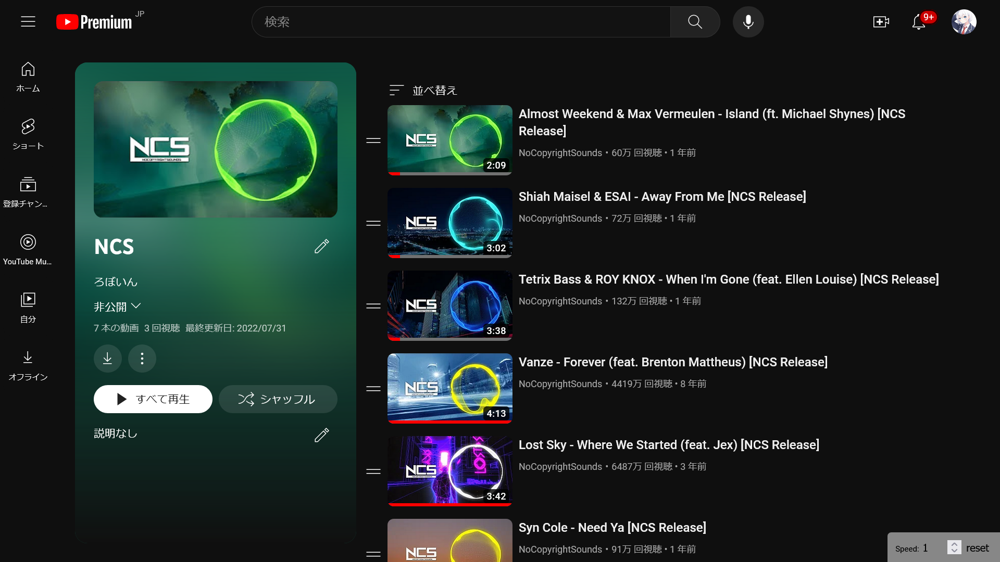
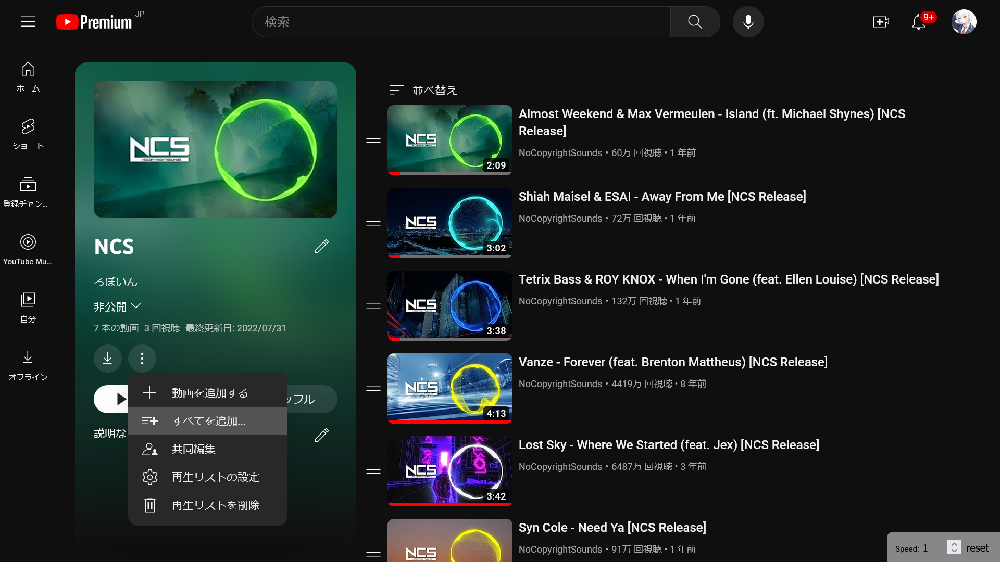
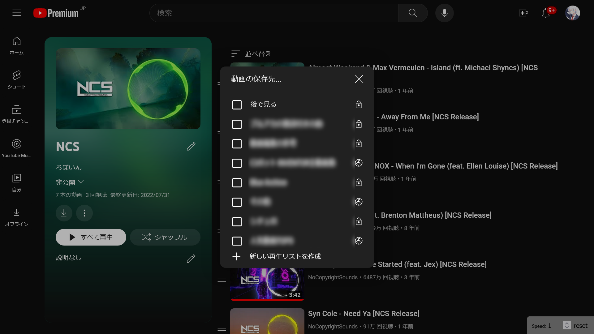

YouTubeで作った複数の再生リストをまとめたいと思ったことはありませんか？この記事では、既存の複数のYouTubeの再生リストを1つにまとめる方法を、画像付きで分かりやすく紹介します。

:::note
この記事で紹介する方法は、自分で作成した再生リストでのみ利用できます。他のユーザーが作成した再生リストをまとめることはできません。
:::

## 1. 新しい再生リストを作る

複数の再生リストをまとめた新しい再生リストを作りたい場合は、まず新しい再生リストを作成します。

既存の再生リストに他の再生リストの動画を追加したい場合は、この手順は不要です。

## 2. まとめたい再生リストを開く

複数の再生リストをまとめた新しい再生リストを作りたい場合は、まとめたい再生リストを開きます。

既存の再生リストに他の再生リストの動画を追加したい場合は、まとめられる側の再生リストを開きます。つまり、Aという再生リストにBという再生リストの動画を追加したい場合は、Bを開いてください。

## 3. メニューを開く

3点ドット（⁝）のメニューボタンをクリックし、［すべてを追加…］を選びます。

## 4. 追加先の再生リストを選ぶ

［動画の保存先…］という画面が表示されるので、動画を追加したい再生リストを選びます。

## 完了

これで、再生リスト内のすべての動画が、選んだ再生リストに追加されます。
