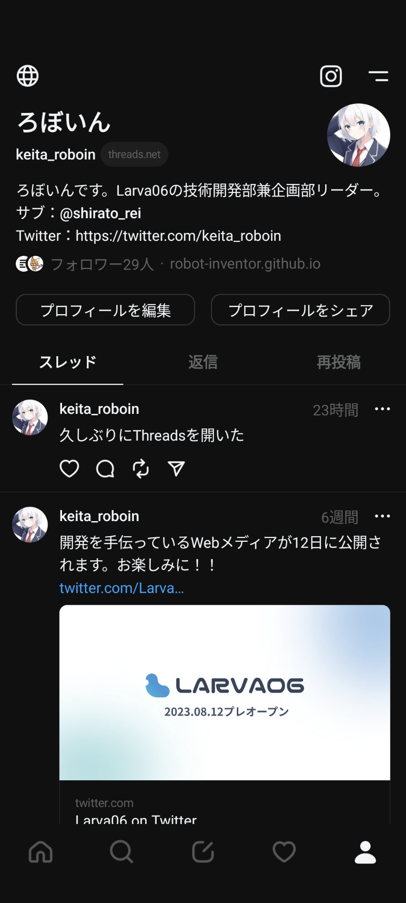
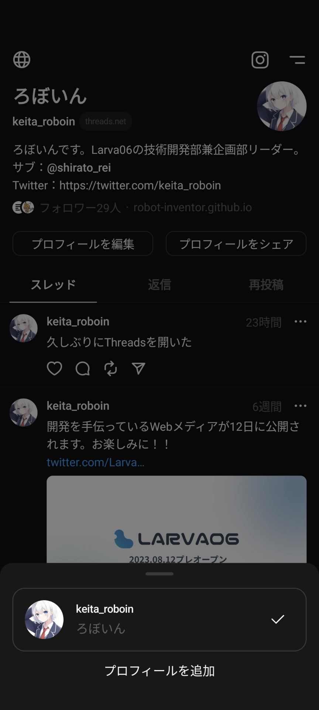

2023年9月22日、Metaが開発したTwitter（X）競合のSNS「Threads」のモバイルアプリに、ログアウトせずに複数のアカウントを切り替えられる機能が搭載されました。この機能はThreadsのリリース当初から要望があった機能です。

<blockquote class="twitter-tweet" data-dnt="true" data-theme="dark">
thought you&#39;d wanna know you can now switch between multiple profiles on Threads  👉👈 <a href="https://t.co/kb16NU4n2A">pic.twitter.com/kb16NU4n2A</a>
&mdash; Instagram (@instagram) <a href="https://twitter.com/instagram/status/1704945846788485436?ref_src=twsrc%5Etfw">September 21, 2023</a></blockquote> 

今までは、アカウントを切り替えるためには一度ログアウトしてからログインし直すという「力技」が必要でしたが、これからは簡単に複数のアカウントを切り替えられるようになります。

## アカウントの切り替え方法

:::note info
この記事の内容は、Android版Threadsアプリのバージョン302.0.0.2.113で確認しています。アカウントを切り替えられない場合は、アプリをアップデートしてみてください。
:::

Threadsのアカウント切り替え機能を使うには、まずThreadsアプリを開きます。

そして、画面右下のアカウントボタンを長押しします。

すると、［プロフィールを追加］というボタンが表示されるため、タップします。

あとは使いたいアカウントにログインすれば、次回からアカウントボタンの長押しで切り替えられるようになります。

実際に試してみたところ、プロフィールの追加の画面では、候補としてすでにInstagramアプリでログインしているアカウントが表示されるようでした。
