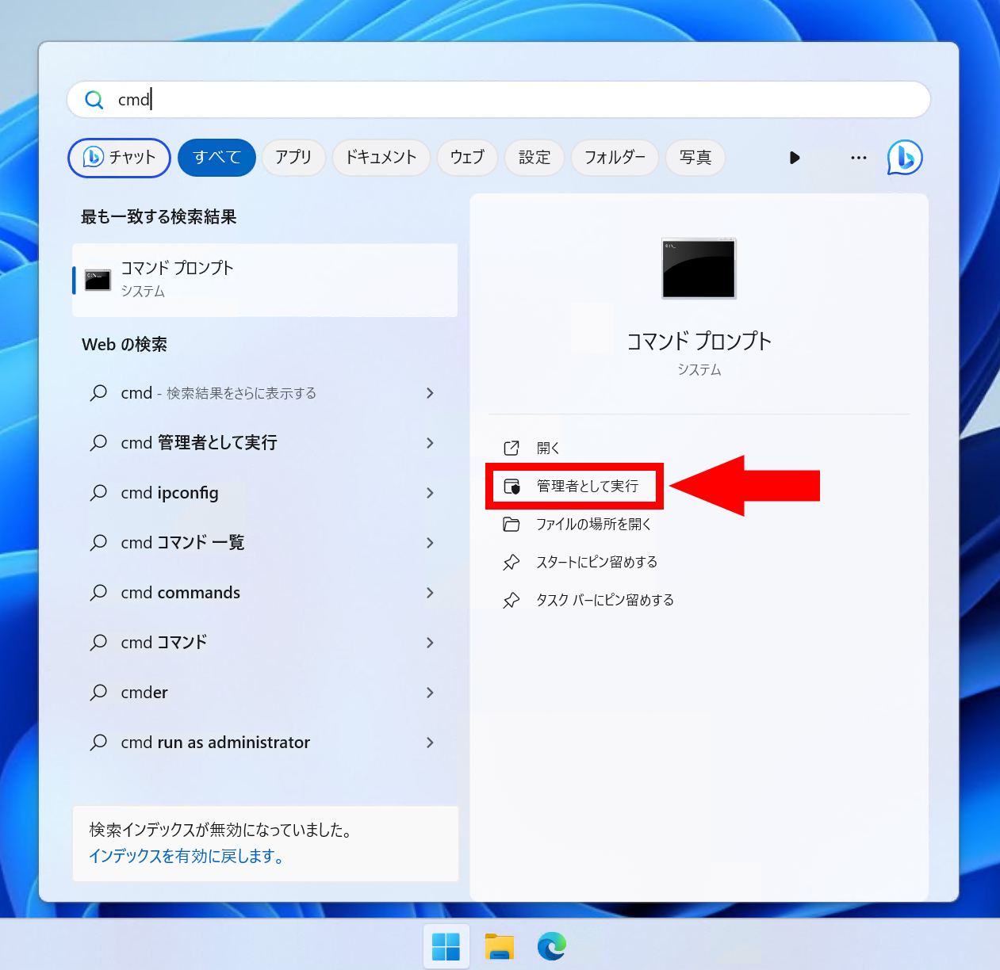

import { YouTube } from "@astro-community/astro-embed-youtube";

2023年9月27日、Windows11に言語モデルを活用したアシスタント「Copilot in Windows」が追加されました。このCopilot in Windowsをタスクバーから削除する方法を紹介します。

## Copilot in Windowsとは？

Copilot in Windowsは、日本時間2023年9月27日のアップデートでWindows 11に追加されたアシスタントです。MicrosoftのAIツール群「Microsoft Copilot」の一部で、ChatGPTのような大規模言語モデル（LLM）を活用し、言葉で指示するだけでさまざまな作業や処理を実行できます。

詳しくはMicrosoft公式の記事や動画をご覧ください。

- [AI があなたの毎日を支援する、Microsoft Copilot を発表 - News Center Japan](https://news.microsoft.com/ja-jp/2023/09/22/230922-announcing-microsoft-copilot-your-everyday-ai-companion/)

<YouTube id="5rEZGSFgZVY"/>

## Copilot in Windowsを消す方法

公式のPVで紹介されているとおり、Copilot in Windowsはタスクバーに追加されます。Windows11のアップデートの一部として提供されており、アップデートと共に勝手にインストールされます。

活用すればとても便利な機能ですが、使わない人にとっては邪魔になります。


*[Introducing Copilot in Windows 11, new AI tools, and more - YouTube](https://www.youtube.com/watch?v=5rEZGSFgZVY)より*

Copilot in Windowsをタスクバーから削除するには、タスクバーの何もないところを右クリックし、［タスクバーの設定］を選択します。


設定アプリが開くので、［タスクバー項目］から［Copilot（プレビュー）］をオフにします。


これで無事、タスクバーからCopilot in Windowsが消えました。


## Copilot in Windowsを再表示する方法

Copilot in Windowsを再表示するには、［タスクバー項目］から［Copilot（プレビュー）］をオンにします。こうすることで、タスクバーにCopilot in Windowsが表示されます。

## 完全に削除する方法

ここまで紹介したのは、タスクバーからCopilot in Windowsを非表示にする方法です。ここからは、非表示にするだけでなく完全に削除する方法を紹介します。

:::danger
これはWindows 11のレジストリーを変更する方法です。操作を誤るとWindowsの動作に問題が発生し、**最悪の場合Windowsが起動しなくなる可能性があります**。この方法を試す場合は、自己責任でお願いします。

よほどのことがない限り、**タスクバーから非表示にするだけで十分**です。
:::

どうしても何があってもCopilot in Windowsを削除したい場合は、次の手順でレジストリーを変更します。

レジストリーを変更するには、Windowsキーを押してスタートメニューを開いた状態で、「cmd」と入力します。［コマンドプロンプト］と表示されたら、右クリックして［管理者として実行］を選択します。



コマンドライン（黒い画面）が開くので、次のコマンドを入力し、エンターを押します。

```powershell
reg add "HKEY_CURRENT_USER\Software\Policies\Microsoft\Windows\WindowsCopilot" /v "TurnOffWindowsCopilot" /t REG_DWORD /d 1 /f
```

このコマンドを実行したら、パソコンを再起動してください。再起動後、Copilot in Windowsは完全に削除されます。

## 完全に削除したCopilot in Windowsを復元する方法

Copilot in Windowsを完全に削除したものの復元したいという場合は、レジストリーを変更します。

Copilot in Windowsを削除した時と同様にコマンドライン（黒い画面）を開いたら、次のコマンドを入力し、エンターを押します。

```powershell
reg delete "HKEY_CURRENT_USER\Software\Policies\Microsoft\Windows\WindowsCopilot" /f
```

## まとめ

Copilot in Windowsは、Windows 11のアップデートの一部として提供されるAIアシスタントです。タスクバーに追加されるため、使わない人にとっては邪魔になります。

この記事では、Copilot in Windowsをタスクバーから非表示にする方法と、完全に削除する方法を紹介しました。Copilot in Windowsの存在が気になる人は、ぜひ試してみてください。
