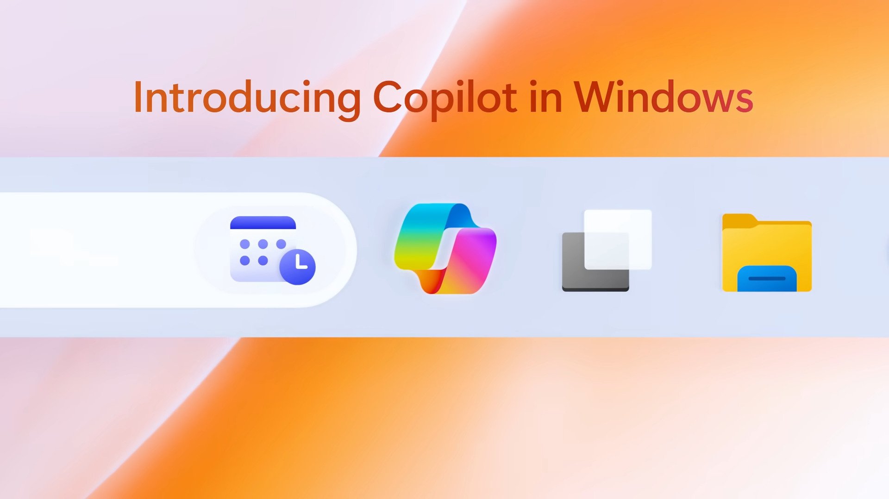
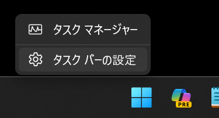
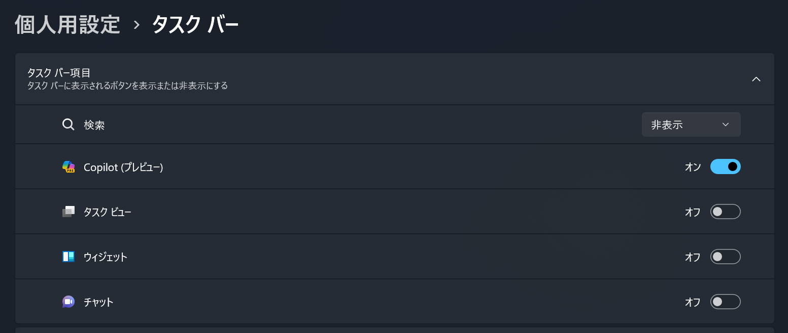
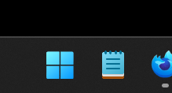

import { YouTube } from "@astro-community/astro-embed-youtube";

2023年9月27日、Windows 11に言語モデルを活用したアシスタント「Microsoft Copilot」が追加されました。このMicrosoft Copilotをタスクバーから削除する方法を紹介します。

## Microsoft Copilotとは？

Microsoft Copilotは、日本時間2023年9月27日のアップデートでWindowsに追加されたアシスタントです。Microsoft Copilotは、Chat-GPTのような大規模言語モデル（LLM）を活用し、言葉で指示するだけでさまざまな作業や処理を実行できます。

詳しくはMicrosoft公式の記事や動画をご覧ください。

- [AI があなたの毎日を支援する、Microsoft Copilot を発表 - News Center Japan](https://news.microsoft.com/ja-jp/2023/09/22/230922-announcing-microsoft-copilot-your-everyday-ai-companion/)

<YouTube id="5rEZGSFgZVY"/>

## Microsoft Copilotを消す方法

公式のPVで紹介されているとおり、Microsoft Copilotはタスクバーに追加されます。活用すればとても便利な機能ですが、使わない人にとっては邪魔になります。

*[Introducing Copilot in Windows 11, new AI tools, and more - YouTube](https://www.youtube.com/watch?v=5rEZGSFgZVY)より*

Microsoft Copilotをタスクバーから削除するには、タスクバーの何もないところを右クリックし、［タスクバーの設定］を選択します。

設定アプリが開くので、［タスクバー項目］から［Copilot（プレビュー）］をオフにします。

これで無事、タスクバーからMicrosoft Copilotが消えました。

