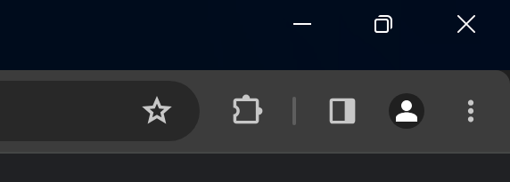
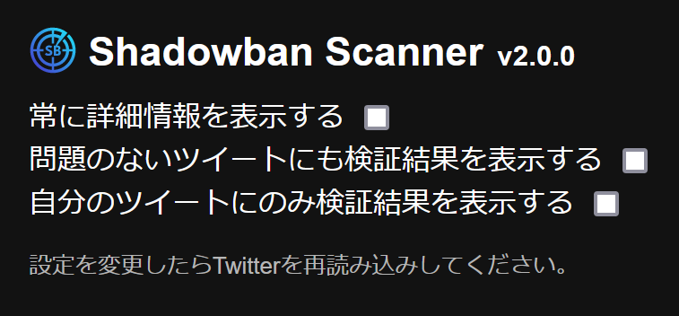

import { YouTube } from "@astro-community/astro-embed-youtube";

## はじめに

この記事では、Twitter（X）のセンシティブ判定やシャドウバンを検出できる「Shadowban Scanner」の使い方を解説します。

<blockquote class="twitter-tweet" data-dnt="true" data-theme="dark">
Twitterのシャドウバンを検出する拡張機能「Shadowban Scanner」を公開しました！  アカウント単位のシャドウバンとツイート単位のセンシティブ判定を、外部サイトに飛ばずに確認できます。ぜひインストールしてください！  Chrome版：<a href="https://t.co/33XTpVLF8G">https://t.co/33XTpVLF8G</a> Firefox版：<a href="https://t.co/jNaxV8pVYw">https://t.co/jNaxV8pVYw</a> <a href="https://t.co/wV3IWAlJww">pic.twitter.com/wV3IWAlJww</a>
&mdash; ろぼいん@一般人 (@keita_roboin) <a href="https://twitter.com/keita_roboin/status/1667365975937757185?ref_src=twsrc%5Etfw">June 10, 2023</a></blockquote> 

## センシティブ判定とは

まずは、Twitterのセンシティブ判定について説明します。

Twitterには、アカウントごとのいわゆるシャドウバンとは別に、ツイートごとのセンシティブ判定が存在しています。

センシティブ判定されたツイートは、Twitterのオススメや検索結果に表示されにくくなり、インプレッション数に大きな影響を与えます。また、センシティブ判定されているツイートや、センシティブ判定されているリツイートが多いアカウントは、シャドウバンを受ける可能性があります。

しかし、Twitterはセンシティブ判定を確認する手段を公式に提供していません。そこで登場するのが、Shadowban Scannerです。

## Shadowban Scannerとは

[Shadowban Scanner](https://robot-inventor.github.io/shadowban-scanner/)は、Twitterのセンシティブ判定やシャドウバンを検出できる拡張機能です。

この拡張機能をパソコンのブラウザーにインストールすると、ツイートの下にセンシティブ判定やシャドウバンの状態を表示できます。外部サイトへ飛ばずに、アカウントやツイートの状態を確認できます。

他の人のアカウントやツイートの状態も確認できますし、自分のアカウントやツイートの状態だけを表示するような設定もできます。

Shadowban Scannerには、次のような機能が搭載されています。

- アカウント単位のシャドウバンとセンシティブフラグの検出
- プロフィールのメディア（アイコンとヘッダー画像）のセンシティブフラグの検出
- ツイート単位のセンシティブフラグの検出
- ツイートの年齢制限の検出

また、ユーザースクリプト版も存在しますが、設定の変更ができないので拡張機能版がオススメです。

Shadowban Scannerは拡張機能版、ユーザースクリプト版ともにスマートフォンに対応しておらず、PCでのみ利用できます。

- [Shadowban Scanner公式サイト](https://robot-inventor.github.io/shadowban-scanner/)

<YouTube id="S2mRHz9SEig" />

:::note info
Shadowban Scannerは類似の他のツールと同様に、偽陽性や偽陰性が発生することがあります。Shadowban Scannerで継続的にアカウントやツイートの状態を確認しつつ、必要に応じて他のツールと併用することをオススメします。
:::

## インストール方法

お使いのブラウザーに合わせて、次のリンクからShadowban Scannerをインストールしてください。

- [Chrome版](https://chrome.google.com/webstore/detail/shadowban-scanner/enlganfikppbjhabhkkilafmkhifadjd)
- [Edge版](https://microsoftedge.microsoft.com/addons/detail/shadowban-scanner/kfeecmboomhggeeceipnbbdjmhjoccbl)
- [Firefox版](https://addons.mozilla.org/firefox/addon/shadowban-scanner/)

## 使い方

Shadowban Scannerは、デフォルトでは、シャドウバンされていたりセンシティブ判定を受けたりしているツイートとアカウントにのみメッセージを表示します。つまり、デフォルトでは問題のないツイートやアカウントにメッセージを表示しません。

デフォルトの動作で問題なければ、これで必要な作業は完了です。動作をカスタマイズしたい場合は、設定で変更できます。

## 設定の変更方法

設定画面の開き方はブラウザーによって異なります。

たいていはウィンドウの右上にある拡張機能ボタン（パズルのピースのようなアイコン）をクリックすると、拡張機能の一覧が表示されるので、その中からShadowban Scannerのアイコンをクリックしてください。

*Chromeの拡張機能ボタン*

*Firefoxの拡張機能ボタン*

Shadowban Scannerの設定画面は次のようになっています。それぞれの設定項目について、順番に解説します。設定を変更したら、必ずTwitterを再読み込みしてください。

### 常に詳細情報を表示する

Shadowban Scannerでは、デフォルトでは画像の左の例のように、アカウントやツイートの状態の概要が表示されます。［さらに表示］をクリックすると、画像の右の例のように、詳細な情報が表示されます。

設定の［常に詳細情報を表示する］にチェックを入れておくと、［さらに表示］をクリックしなくても、常に詳細な情報が表示されるようになります。

### 問題のないツイートにも検証結果を表示する

Shadowban Scannerでは、デフォルトではシャドウバンやセンシティブ判定を受けていないツイートやアカウントにはメッセージを表示しません。［問題のないツイートにも検証結果を表示する］にチェックを入れておくと、問題のないツイートやアカウントにもメッセージを表示するようになります。

必要なときにだけメッセージを表示したい場合は、この設定をオフにしておくとよいでしょう。

一方で、問題のあるツイートやアカウントにしか表示されないと、メッセージの表示頻度が低くなるので、Shadowban Scannerが正しく動作しているか心配になるかもしれません。そういった場合は、この設定をオンにすることをオススメします。

### 自分のツイートにのみ検証結果を表示する

デフォルトでは、自分のツイートか他人のツイートかを問わず、誰のツイートにもメッセージが表示されます。［自分のツイートにのみ検証結果を表示する］にチェックを入れておくと、自分のツイートにのみメッセージが表示されるようになります。

デフォルトの状態だと他人のツイートにもメッセージが表示されて鬱陶しいという場合には、この設定をオンにしましょう。

## まとめ

この記事では、Twitterのセンシティブ判定やシャドウバンを検出できる「Shadowban Scanner」の使い方を解説しました。

Shadowban Scannerを使って、アカウントやツイートの状態を手軽に確認してみてください！

最後に、TwitterやMisskeyをやっているので、ぜひフォローをお願いします！また、Shadowban Scannerの拡散もお願いします！

- Twitter：[@keita_roboin](https://twitter.com/keita_roboin)
- Misskey：[@roboin@misskey.io](https://misskey.io/@roboin)

<blockquote class="twitter-tweet" data-dnt="true" data-theme="dark">
Twitterのシャドウバンを検出する拡張機能「Shadowban Scanner」を公開しました！  アカウント単位のシャドウバンとツイート単位のセンシティブ判定を、外部サイトに飛ばずに確認できます。ぜひインストールしてください！  Chrome版：<a href="https://t.co/33XTpVLF8G">https://t.co/33XTpVLF8G</a> Firefox版：<a href="https://t.co/jNaxV8pVYw">https://t.co/jNaxV8pVYw</a> <a href="https://t.co/wV3IWAlJww">pic.twitter.com/wV3IWAlJww</a>
&mdash; ろぼいん@一般人 (@keita_roboin) <a href="https://twitter.com/keita_roboin/status/1667365975937757185?ref_src=twsrc%5Etfw">June 10, 2023</a></blockquote> 
