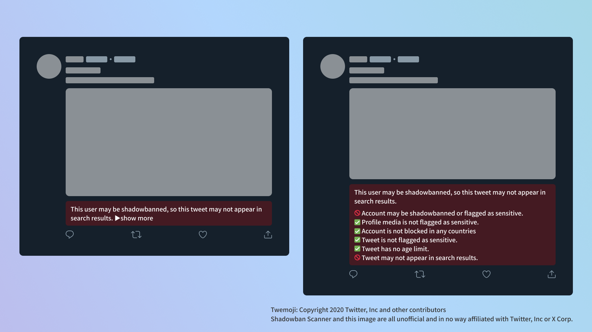
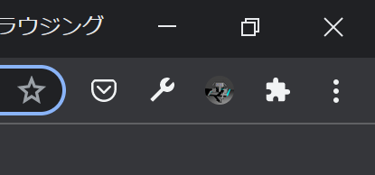
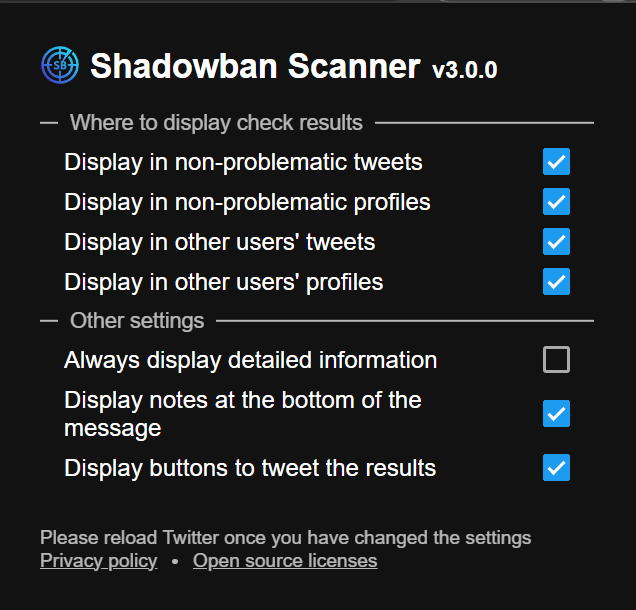
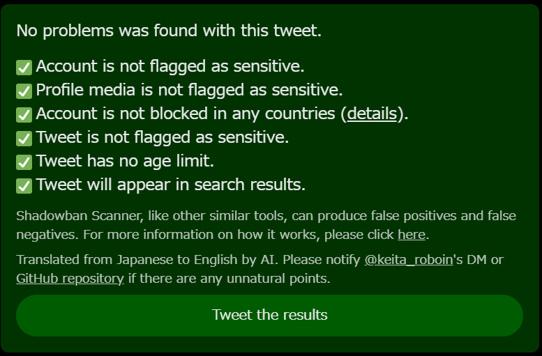

import { YouTube } from "@astro-community/astro-embed-youtube";

## Introduction

In this article, I will guide you through the usage of "Shadowban Scanner," a tool that allows you to check sensitive content classifications and shadowbans on Twitter (X) in real-time.

## What is Shadowban?

First, let's explain what a shadowban on Twitter entails.

There are two definitions of shadowban. The first definition, commonly used, refers to a phenomenon where tweets become less likely to appear in search results or recommendations or may not appear at all.

The second definition is the official one provided by Twitter. It involves posting tweets in a way that others cannot discover them without the knowledge of the poster. More details can be found in Twitter's official blog:

- [Twitter's Official Blog on Shadowban](https://blog.twitter.com/en_us/topics/company/2018/Setting-the-record-straight-on-shadow-banning)

In this official blog, Twitter claims not to engage in the shadowban defined officially. Still, it does not deny the existence of shadowbans based on the common definition.

With the common definition of shadowban, accessing the profile allows you to view tweets.

This does not align with Twitter's official definition of making tweets undiscoverable to everyone, and it corresponds to the official blog's statement that finding tweets may require additional effort, such as accessing the profile directly.

Therefore, while Twitter asserts that it does not perform an official shadowban, it indirectly acknowledges the existence of a shadowban based on the common definition. Note that a shadowban in the common definition appears to align with what Twitter refers to as "ranking."

Regardless, undergoing a shadowban significantly reduces impression numbers. However, Twitter does not officially provide means to confirm sensitive flags or shadowbans. This is where Shadowban Scanner comes into play.

## What is Shadowban Scanner?

[Shadowban Scanner](https://shadowban-scanner.roboin.io/en/) is a browser extension that allows real-time checking of sensitive content classifications and shadowbans on Twitter. Released in 2023, this extension received an enhanced version, v3.0, on December.

Once installed on your computer's browser, this extension enables the display of sensitive content classifications and shadowban status below tweets. Without navigating to external sites, you can conveniently and instantly check the status of accounts and tweets.

You can check the status of other people's accounts and tweets, and configure settings to display only the status of your account or tweets.

Shadowban Scanner comes with the following features:

- Detection of account-level shadowbans and sensitive content flags
- Detection of sensitive content flags in profile media (icon and header image)
- Detection of countries that block accounts for legal reasons
- Detection of sensitive content flags at the tweet level
- Detection of tweet age restrictions

Additionally, there is a user script version available, but the extension version is recommended as it allows for configuration changes.

Both the extension and user script versions of Shadowban Scanner are not compatible with smartphones and can only be used on PCs.

- [Shadowban Scanner Official Website](https://shadowban-scanner.roboin.io/en/)

<YouTube id="6c4MCItd7wY" />

:::note
Shadowban Scanner, like other similar tools, can produce false positives and false negatives; I recommend using Shadowban Scanner to continuously check the status of accounts and tweets, but also using it in conjunction with other tools as needed.
:::

## Installation

Please install Shadowban Scanner from the following link according to the browser you are using.

- [Chrome version](https://chrome.google.com/webstore/detail/shadowban-scanner/enlganfikppbjhabhkkilafmkhifadjd)
- [Edge version](https://microsoftedge.microsoft.com/addons/detail/shadowban-scanner/kfeecmboomhggeeceipnbbdjmhjoccbl)
- [Firefox version](https://addons.mozilla.org/firefox/addon/shadowban-scanner/)

## Usage

By default, Shadowban Scanner will only show messages to tweets and accounts that have been shadowbanned or have been flagged as sensitive. In other words, **by default it will not show messages to unproblematic tweets and accounts**.

If you are comfortable with the default behavior, you have done the necessary work. If you want to customize the behavior, you can change it in the settings.

## How to Change Settings

The method to open the settings page may vary depending on the browser.

Usually, clicking on the extension button (an icon resembling a puzzle piece) at the top right of the window will display a list of extensions. From there, click on the icon for Shadowban Scanner.

*The extension button inChrome*

*The extension button inFirefox*

We will explain each setting item in order. After making changes to the settings, be sure to reload Twitter.

### Display in non-problematic tweets

By default, Shadowban Scanner does not display messages for tweets that have not undergone shadowbanning or sensitive content classification. Checking "Display in non-problematic tweets" will show messages for non-issue tweets.

If you prefer messages to be shown only when necessary, keeping this setting off might be more suitable.

However, if messages are displayed only for problematic tweets, you might worry about the low frequency of message displays and question whether Shadowban Scanner is functioning correctly. In such cases, it is recommended to turn on this setting.

### Display in non-problematic profiles

By default, Shadowban Scanner displays the message on all user profiles. If you uncheck "Display in non-problematic profiles", messages will not be shown in non-issue profiles.

If you only want to see messages when necessary, you may want to leave this setting unchecked.

On the other hand, if you only want to see messages on problematic profiles, you may be concerned that Shadowban Scanner is working correctly because you will see messages less frequently. In such cases, I recommend turning this setting on.

### Display in other users' tweets

In the default state, messages are displayed for tweets from both your account and others. Unchecking "Display in other users' tweets" ensures that messages are shown only for your tweets.

If you find messages appearing on others' tweets bothersome in the default state, turning off this setting may be preferable.

### Display in other users' profiles

By default, messages are displayed for profiles of both your account and others. Unchecking "Display in other users' profiles" ensures that messages are shown only for your account's profile.

If messages appearing on others' profiles are bothersome in the default state, turning off this setting may be preferable.

### Always display detailed information

By default, Shadowban Scanner displays an overview of the account or tweet status, as shown in the image on the left. Clicking on "Show more" reveals detailed information, as seen in the image on the right.

Checking the "Always display detailed information" option ensures that detailed information is always displayed without the need to click "Show more."

### Display notes at the bottom of the message

By default, the bottom of Shadowban Scanner's messages includes the disclaimer.

If this message is unnecessary, uncheck "Display notes at the bottom of the message."

### Display buttons to tweet the results

Shadowban Scanner displays a button below the tweet that allows you to tweet the status of the tweet. Click this button to tweet the status of your tweet.

If you do not need this button, uncheck the "Display buttons to tweet the results" checkbox.

## Summary

In this article, I explained how to use Shadowban Scanner to detect sensitive flags and shadowbans on Twitter.

Give Shadowban Scanner a try to easily check the status of your accounts and tweets!
