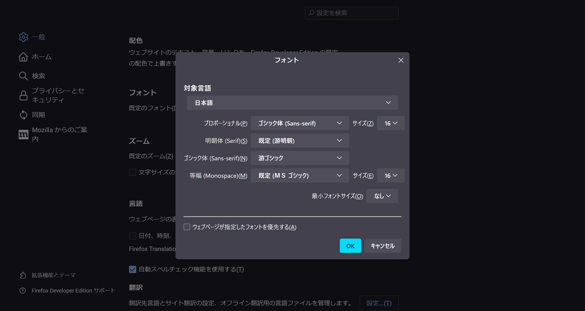

2023年10月7日ごろから、Twitter（X）ですべてのツイート（ポスト）に［さらに表示］が出てしまうバグが発生しています。ツイートの文章が全部表示されていたとしても、あらゆるツイートに［さらに表示］が出てしまうため不便です。

この記事では、すべてのツイートに［さらに表示］が出る条件と解決策を紹介します。

## ［さらに表示］が出る条件

本来は、長いツイートの文章の一部が隠れていることを示すために、ツイートの最後に［さらに表示］が表示されます。

しかし、10月7日ごろから一部の環境でツイートの長さにかかわらず、すべてのツイートに［さらに表示］が出てしまっています。

この問題が発生する条件は次のとおりです。

- ブラウザーとしてFirefoxを使っている
- ブラウザーのフォントがメイリオになっている
- ツイートが英語以外で書かれている

## 解決策

この問題は、Firefoxの代わりにChromeを使うか、Firefoxのフォント設定を変更することで回避できます。

Firefoxの代わりにChromeを使う解決策は文字通りブラウザーを変えるだけなので、ここではフォント設定の変更方法を解説します。

フォントの変更方法には2つあるので、ご自身に合ったものを選んでください。

## 方法1：Firefox全体のフォントを変える

1つ目は、Firefox全体とすべてのWebページのフォントを変える方法です。

Firefoxの設定を開き、［一般］タブの［フォント］の［詳細設定］ボタンをクリックします。

ダイアログが表示されるので、［ゴシック体 (Sans-serif)］を［メイリオ］以外のフォントに変更します。また、必ず［ウェブページが指定したフォントを優先する］のチェックを外してください。



## 方法2：Twitterのフォントだけを変える

すべてのサイトのフォントが変わってしまうのが気になる場合は、Twitterのフォントだけを変更できます。

特定のページのフォントだけを変更するには、[Stylus](https://addons.mozilla.org/firefox/addon/styl-us/)という拡張機能をインストールする必要があります。

```css
* {
    font-family: "Yu Gothic", system-ui, -apple-system, BlinkMacSystemFont, sans-serif !important;
}
```

游ゴシック以外のフォントを使いたい場合は、``"Yu Gothic"``の部分を他のフォント名に変更してください。このとき、フォント名の前後に``"``をつけるのを忘れないでください。

たとえば、Noto Sans JPを使いたい場合は、次のように書きます。

```css
* {
    font-family: "Noto Sans JP", system-ui, -apple-system, BlinkMacSystemFont, sans-serif !important;
}
```
