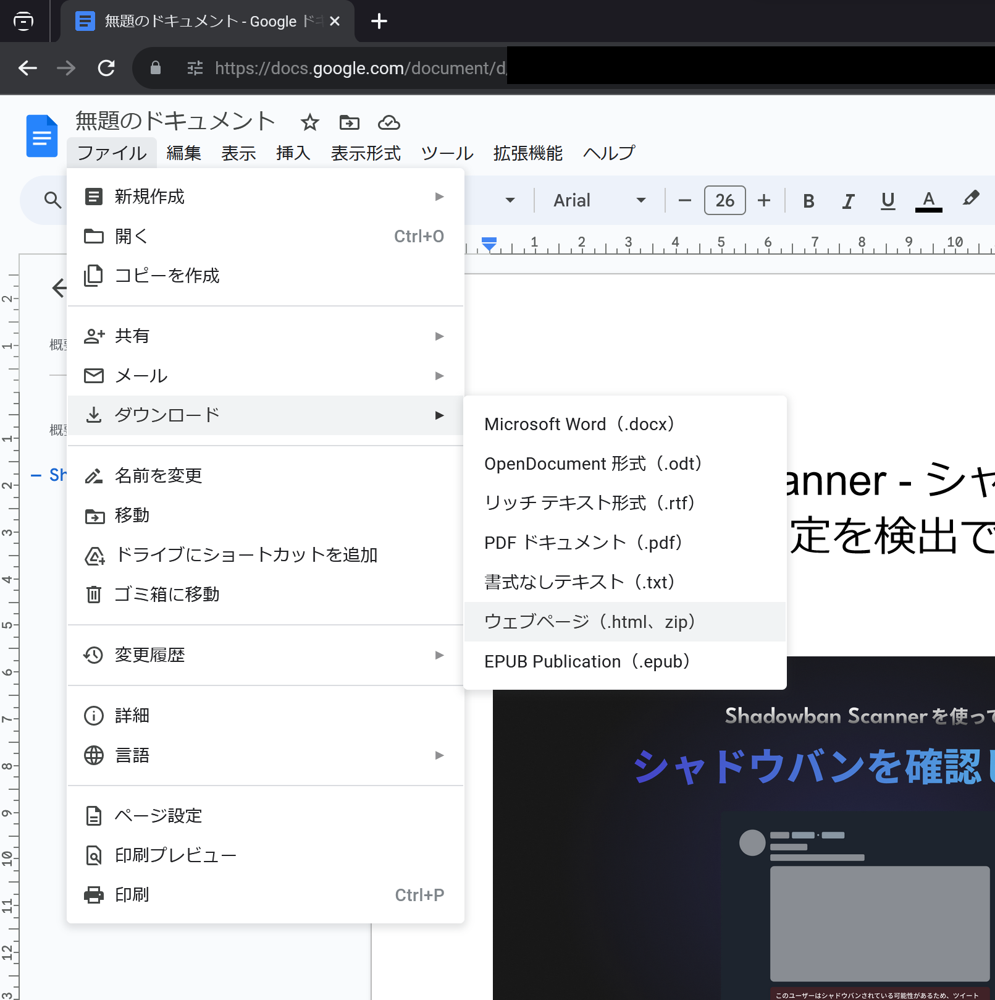
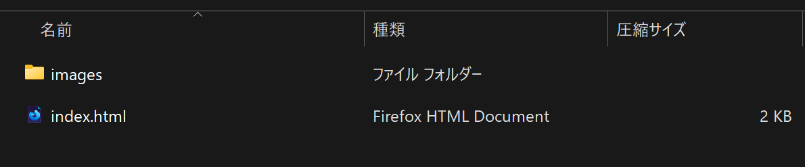
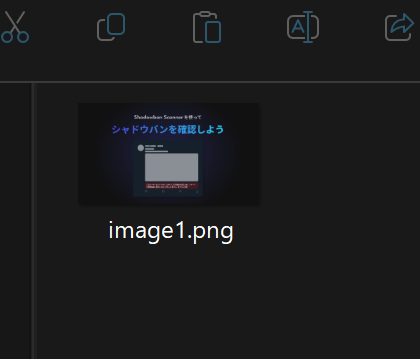
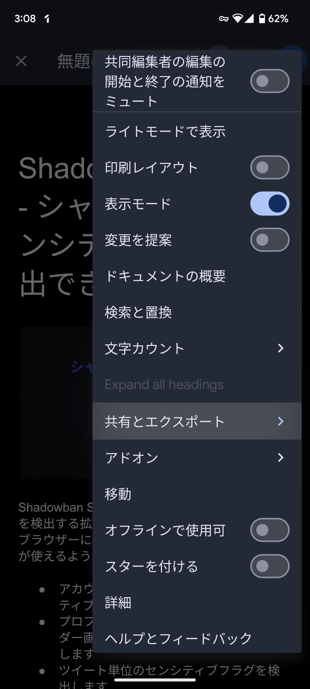
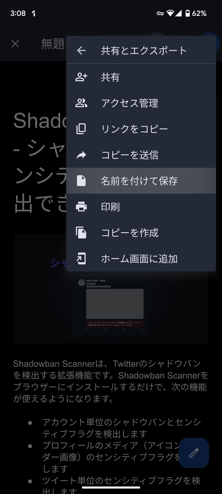
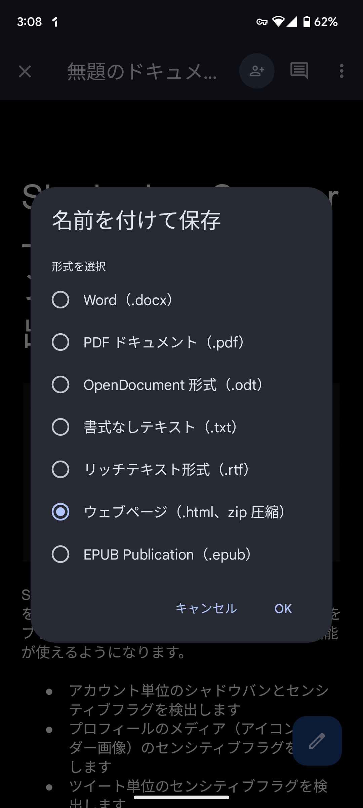
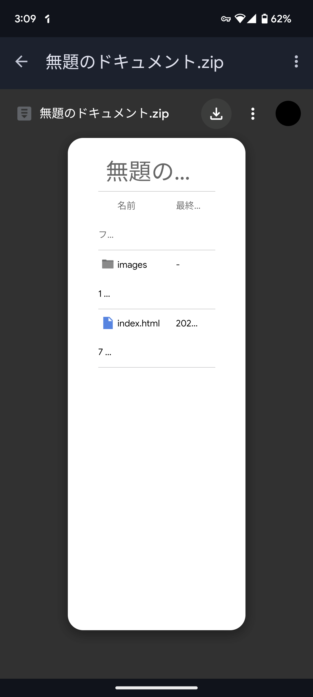

この記事では、[Googleドキュメント](https://www.google.com/intl/ja_jp/docs/about/)に挿入されている画像を高画質でダウンロードする方法について解説します。

## 画像をダウンロードする2つの方法の違い

Googleドキュメントから写真をダウンロードする方法は、主に2種類あります。

1つ目が、画像を一度Google Keepに保存し、Google Keepからダウンロードする方法です。2つ目が、Googleドキュメントのエクスポート機能を使う方法です。

1つ目のGoogle Keepに保存する方法は、一度Google Keepに保存するという手間がかかる上に、画質が劣化します。

ここでは、高画質で画像を保存できるエクスポート機能を使う方法について解説します。

## PCで画像をダウンロードする方法

PCのブラウザーからGoogleドキュメントの画像を保存するにはまず、保存したい画像が含まれるGoogleドキュメントを開きます。

次に、左上のメニューから［ファイル］>［ダウンロード］>［ウェブページ（.html、zip）］を選択します。

ZIPファイルがダウンロードされるので、解凍します。

解凍すると、``index.html``というファイルと、``images``というフォルダーが入っています。

``images``フォルダーを開くと、Googleドキュメントに挿入されていたすべての画像が入っています。

## スマホで画像をダウンロードする方法

スマホでダウンロードする場合も、PCとほぼ同じ方法を使えます。この記事ではAndroidスマホのGoogleドキュメントアプリを使っています。iPhoneでは操作方法が少し異なる可能性があります。

まず、画像を保存したいGoogleドキュメントを開きます。右上のメニューボタンから、［共有とエクスポート］を選択します。

続いて、［名前を付けて保存］を選択します。

ダイアログが表示されるので、［ウェブページ（.html、zip圧縮）］を選択します。

ZIPファイルのダウンロード画面が開くので、右上のメニューボタンの左隣にあるダウンロードアイコンをタップしてダウンロードします。

最後に、ダウンロードしたZIPファイルを任意のアプリで解凍します。解凍にはGoogle純正のファイルマネージャー「[Files by Google](https://play.google.com/store/apps/details?id=com.google.android.apps.nbu.files)」やサードパーティー製の「[WinZip](https://play.google.com/store/apps/details?id=com.winzip.android)」などを使うのがオススメです。

ZIPファイルを解凍したら、PCのときと同じように``images``フォルダーを開いて画像を確認します。

## まとめ

PCとスマホでGoogleドキュメントの画像を高画質でダウンロードする方法について解説しました。

Googleドキュメントのエクスポート機能を使えば、画像を一度Google Keepに保存する手間が省けますし、画質も劣化しません。ぜひ、この記事を参考にしてみてください。
