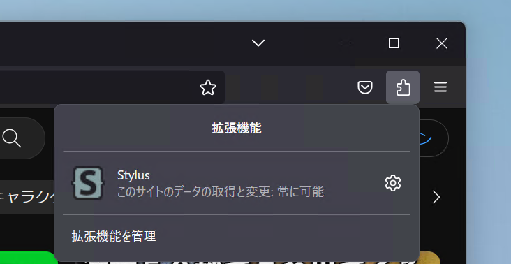
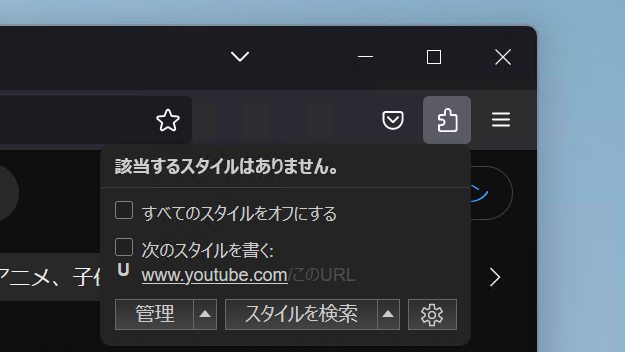
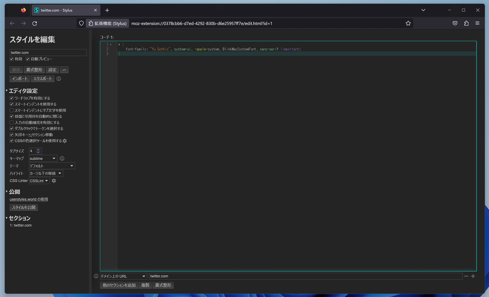

import ArticleCard from "@components/ArticleCard.astro";

YouTubeですべてのコメントに［続きを読む］が出てしまうバグが発生しています。コメントの文章が全部表示されていたとしても、あらゆるコメントに［続きを読む］が出てしまうため不便です。

この記事では、すべてのコメントに［続きを読む］が出る条件と解決策を紹介します。

## ［続きを読む］が出る条件

本来は、長いコメントの文章の一部が隠れていることを示すために、コメントの最後に［続きを読む］が表示されます。

しかし、一部の環境でコメントの長さにかかわらず、すべてのコメントに［続きを読む］が出てしまっています。

この問題が発生する条件は次のとおりです。

- ブラウザーとしてFirefoxを使っている
- ブラウザーのフォントがメイリオになっている
- コメントが英語以外で書かれている

## 解決策

この問題は、Firefoxの代わりにChromeを使うか、Firefoxのフォント設定を変更することで回避できます。

フォントの変更方法には2つあるので、ご自身に合ったものを選んでください。

### 方法1：Chromeを使う

Firefoxの代わりにChromeを使う解決策は、文字通りブラウザーを変えるだけです。ここでは詳しい手順は解説しません。

### 方法2：Firefox全体のフォントを変える

フォントの変更方法の1つ目は、Firefox全体とすべてのWebページのフォントを変える方法です。

Firefoxの設定を開き、［一般］タブの［フォント］の［詳細設定］ボタンをクリックします。

ダイアログが表示されるので、［ゴシック体 (Sans-serif)］を **［メイリオ］以外** のフォントに変更します。また、**必ず［ウェブページが指定したフォントを優先する］のチェックを外してください**。


### 方法3：YouTubeのフォントだけを変える

すべてのサイトのフォントが変わってしまうのが気になる場合は、YouTubeのフォントだけを変更できます。

特定のページのフォントだけを変更するには、[Stylus](https://addons.mozilla.org/firefox/addon/styl-us/)という拡張機能をインストールする必要があります。

StylusをFirefoxにインストールしたら、ツールバーの拡張機能マークからStylusを選択し、設定画面を開きます。



Stylusの設定画面が開いたら、［www .youtube .com］という文字列がハイライトされるようにマウスホバーします。このとき、［このURL］という部分はハイライトされないようにしてください。



スタイルの編集画面が表示されるので、次のテキストをコピーして貼り付けます。貼り付けたら、Ctrl+Sキーを押して保存します。



```css
* {
    font-family: "Yu Gothic", system-ui, -apple-system, BlinkMacSystemFont, sans-serif !important;
}
```

游ゴシック以外のフォントを使いたい場合は、``"Yu Gothic"``の部分を他のフォント名に変更してください。このとき、フォント名の前後に``"``をつけるのを忘れないでください。

たとえば、Noto Sans JPを使いたい場合は、次のように書きます。

```css
* {
    font-family: "Noto Sans JP", system-ui, -apple-system, BlinkMacSystemFont, sans-serif !important;
}
```

もしYouTube全体ではなくコメント欄のフォントだけを変更したい場合は、次のように書きます。ただし、こちらの方法はYouTubeの仕様変更によって動作しなくなる可能性があります。

```css
.style-scope.ytd-comment-view-model {
    font-family: "Yu Gothic", system-ui, -apple-system, BlinkMacSystemFont, sans-serif !important;
}
```

:::note[2024年3月29日更新]
最近のYouTubeの仕様変更に合わせて、コメント欄のフォントだけを変更する場合のコードを更新しました。
:::

## まとめ

YouTubeの［続きを読む］が出るバグは、Firefoxのフォント設定が原因で発生しています。このバグは、YouTubeで使用されるフォントを変更することで回避できます。

また、類似の問題はTwitterでも発生しており、この問題も同様の方法で回避できます。Twitterについては、こちらの記事で解説しています。

<ArticleCard link="/article/2023/10/24/fix-twitter-read-more-button/"/>
