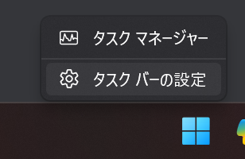
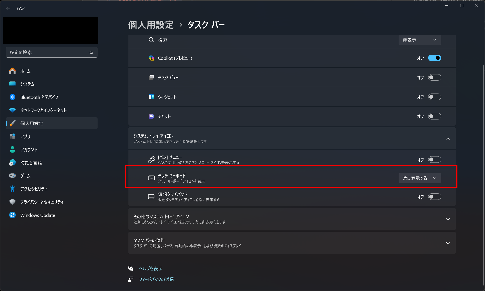
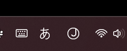
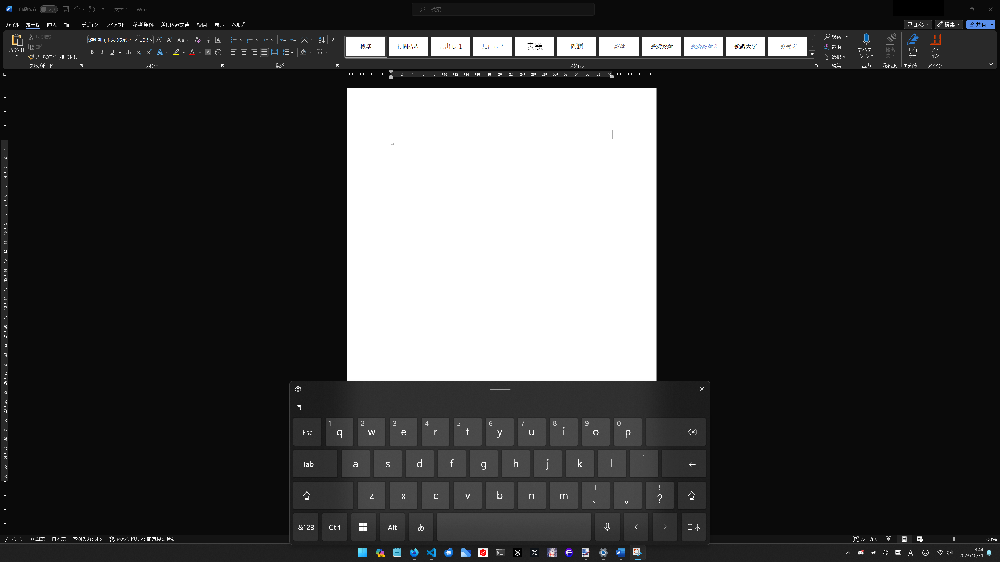
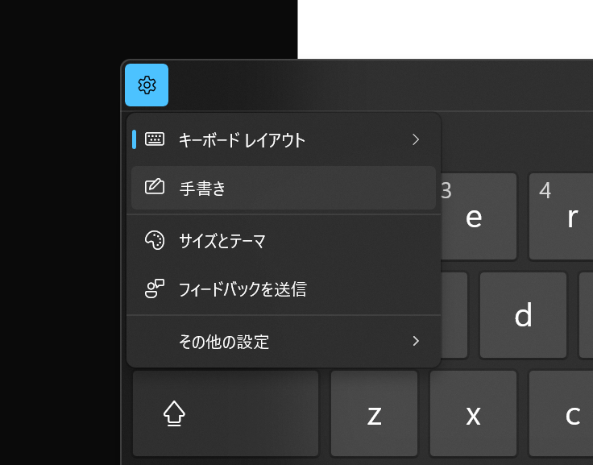
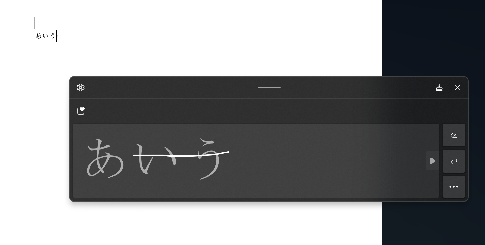

この記事では、Windows 11で液タブ・板タブを使って手書き入力をする方法を紹介します。

この方法を使うと、ペンやマウスを使って自由に文字を書き、それをキーボード入力と同じようにテキストへ変換できます。

## 前提条件

この記事では、Windows 11を前提として解説します。Windows 10では試せていませんが、おそらく同じような方法を使えると思います。

デバイスがタッチパネルを搭載している必要はなく、ノートパソコンでも、デスクトップPCでも問題ありません。また、外付けのペンタブか、（Surface Proのような）タブレットPCかも問いません。

とにかく、ペン入力でもマウスでも、線を引けるデバイスがあればOKです。

## 手書き入力を有効にする

Windows 11で手書き入力を有効にするにはまず、タスクバーの何もないところを右クリックし、［タスクバーの設定］をクリックします。

設定アプリが開くので、［システムトレイアイコン］の［タッチキーボード］を［常に表示する］に設定します。

すると、タスクバーにタッチキーボードのアイコンが表示されるようになります。これで、手書き入力の準備が整いました。

## 手書き入力の使い方

タスクバーに表示されたタッチキーボードのアイコンをクリックすると、タッチキーボードが表示されます。画像では例としてWordを表示していますが、他のソフトでも大丈夫です。

次に、表示されたタッチキーボードの左上の歯車アイコンをクリックし、［手書き］を選択します。

キャンバスが表示されるので、ペンやマウスで自由に文字を書きます。書いた文字は、キーボード入力と同じようにテキストへ変換されます。入力を始める前に、テキストを入力したい場所にカーソルがあることを確認してください。どこにもカーソルがない場合は、テキストに変換されません。

入力したテキストの削除や改行は、物理的なキーボードかタッチキーボードのボタンから実行できます。また、変換済みのテキストに横線を引くことでも削除できます。

## まとめ

この記事では、Windows 11で液タブ・板タブを使って手書き入力をする方法を紹介しました。この方法を使えば、タッチパネルがなくても線を引ける何らかのデバイスさえあれば、Windowsの標準機能だけで手書き入力ができます。

タスクバーに表示されるタッチキーボードのアイコンを消したい場合は、アイコンを表示するときと同様の手順で、［常に表示する］を［常にオフ］か［キーボードが接続されていない場合］に設定してください。
