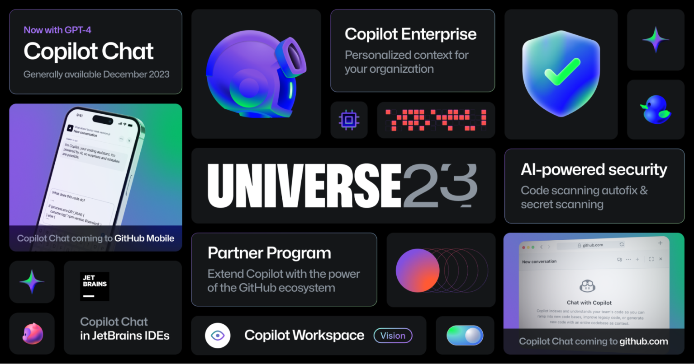

2023年11月9日に実施されたGitHub Universe 2023の内容をまとめました。この記事の内容は、公式発表資料をもとにしています。

- [Universe 2023: CopilotがGitHubをAIを駆使した開発者プラットフォームへと変貌させる - GitHubブログ](https://github.blog/jp/2023-11-09-universe-2023-copilot-transforms-github-into-the-ai-powered-developer-platform/)

*[https://github.blog/jp/2023-11-09-universe-2023-copilot-transforms-github-into-the-ai-powered-developer-platform/](https://github.blog/jp/2023-11-09-universe-2023-copilot-transforms-github-into-the-ai-powered-developer-platform/)より*

## GitHub Copilot Chatの一般提供

12月から既存のGitHub Copilotプランの一部として、GitHub Copilot Chatの一般提供が開始されます。また、いくつかの新機能も実装されます。

- Copilot ChatがGPT-4ベースに
- コードをコンテキストとして使用してガイダンスとコード生成ができるように
- インラインで特定の行についてのチャット
- GitHub Copilotにスラッシュコマンドが実装
- クリックするだけで提案やPull Requestのレビュー内容を修正したりできるスマートアクション
- JetBrainsへのCopilot Chatの導入

## GitHub Copilot ChatがWebとモバイルアプリに登場

GitHub Copilot ChatがGitHub.comとGitHubのモバイルアプリから使えるようになります。これによって、コードエディターとCLIでGitHub Copilot、そしてGitHub.comとモバイルアプリでGitHub
Copilot Chatが使えるようになります。

これらの新機能は[ウェイトリスト](https://github.com/features/preview)が用意されています。

## GitHub Copilot Enterprise

GitHub Copilot Enterpriseでは、コードベース全体のコンテキストをパーソナライズできます。Copilot ChatをGitHub上のリポジトリーに接続すると、Copilot Enterpriseがコードベースの理解やドキュメントの検索などを手伝ってくれます。

また、内部コードやプライベートリポジトリーにもとづく提案なども可能です。

GitHub Copilot Enterpriseは、2024年2月から1ユーザあたり月額$39で提供予定です。

## GitHub Copilotパートナープログラム

GitHub Copilotをサードパーティーのサービスと統合できるプラグイン機能が提供されます。GitHub Copilotパートナープログラムは25社以上を最初のパートナーとして開始予定です。

## AIを使ったGitHub Advanced Security

GitHub CopilotにLLMベースの脆弱性防止システムを適用することで、Copilotの提案がより安全になります。また、GitHub Copilot Chatは自然言語で脆弱性の仕組みを説明できます。GitHub Advanced Securityに、コードの脆弱性やシークレットを検出して修正するAIを実装中のようです。

コードスキャニングの自動修正では、Pull RequestでJavaScriptとTypeScript用のCodeQLを直接使って、AIが生成した修正を提案します。

## GitHub Copilot Workspace

Copilot WorkspaceでIssueを開くと、意図した変更を実装するためのプランが、GPT-4を使って自動的に提案されます。Copilot Workspaceでコードをビルド、実行、テストでき、エラーは自動で修正されます。2024年に提供予定です。
