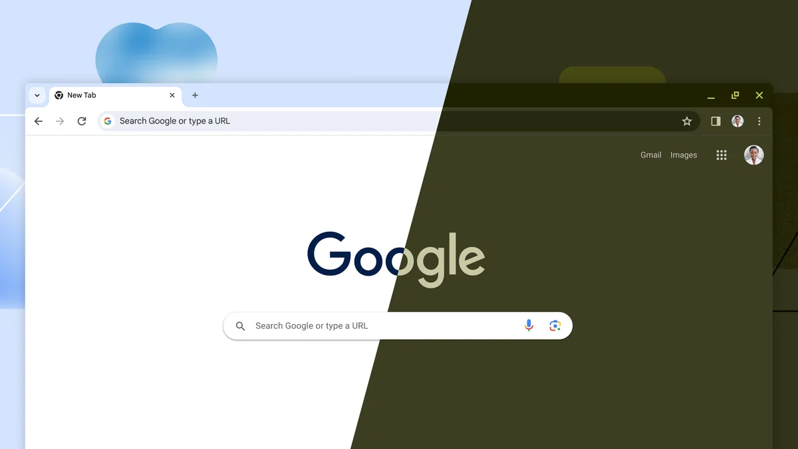
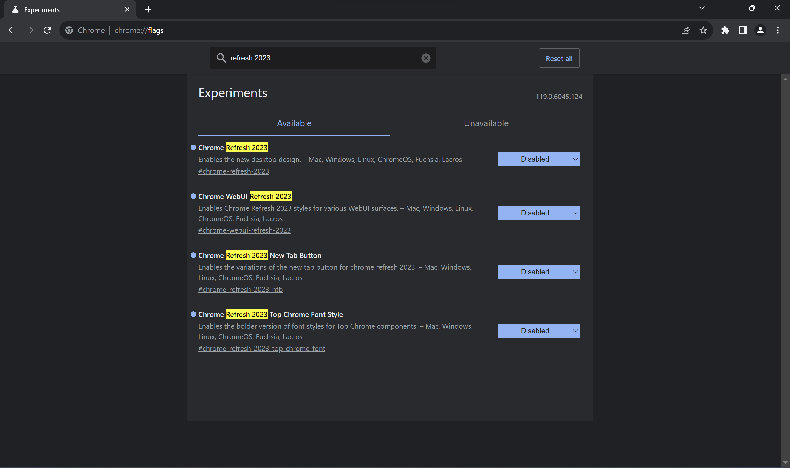

2023年9月にリリースされた[Google Chrome](https://www.google.com/chrome/) 117では、Chromeの15周年を記念してUIのデザインが変更されました。

この記事では、変更されたデザインを元に戻す方法を解説します。

## Chrome Refresh 2023とは？

*[https://blog.google/products/chrome/google-chrome-new-features-redesign-2023/](https://blog.google/products/chrome/google-chrome-new-features-redesign-2023/)より*

[今回のデザイン変更](https://blog.google/products/chrome/google-chrome-new-features-redesign-2023/)は、「Chrome Refresh 2023」と呼ばれています。Google Chromeのリリース15周年を記念して、5年ぶりにデザインが大幅に変更されました。[前回のデザイン変更](https://blog.google/products/chrome/chromes-turning-10-heres-whats-new/)は、リリース10周年記念のChrome 69でした。実に5年ぶりのデザイン変更となっています。

Chrome Refresh 2023では、それまでのMaterial Designから、Android 12以降で採用されている「[Material You（Material Design 3）](https://m3.material.io/)」デザインシステムに更新されました。全体的に角が丸みを帯び、選択した色がさまざまな場所で使われるようになっています。

## デザインを元に戻す方法

Chrome Refresh 2023は、5年間ほとんど変わっていなかったデザインをより近代的なものに作り直すアップデートです。

しかし、この新しいデザインを気に入らない場合は、以前のデザインに戻す方法が存在しています。

:::danger
この記事で紹介する方法は、Chromeの内部フラグを変更するものです。予期しない動作やバグに遭遇する可能性があり、この方法が将来的に使えなくなる可能性もあります。実際に試す際は自己責任でお願いします。
:::

まず、Chromeを開きます。次に、アドレスバーに「``chrome://flags``」と入力してアクセスします。内部フラグの一覧が表示されるので、検索ボックスに「refresh 2023」と入力してください。

次のフラグをすべて、［Disabled］に変更します。すべて変更したら、画面下部に表示される［Relaunch］ボタンをクリックしてChromeを再起動します。

- Chrome Refresh 2023
- Chrome WebUI Refresh 2023
- Chrome Refresh 2023 New Tab Button
- Chrome Refresh 2023 Top Chrome Font Style

## 変更を取り消す方法

Chrome Refresh 2023を無効化したものの、やっぱり新しいデザインを使いたいという場合は、［Disabled］にしたフラグを［Default］に戻してください。

## まとめ

Chrome Refresh 2023は、Chromeの15周年を記念して行われた大規模なデザイン変更です。この新しいデザインを気に入らない場合は、Chromeの内部フラグを変更することで元のデザインに戻せます。
