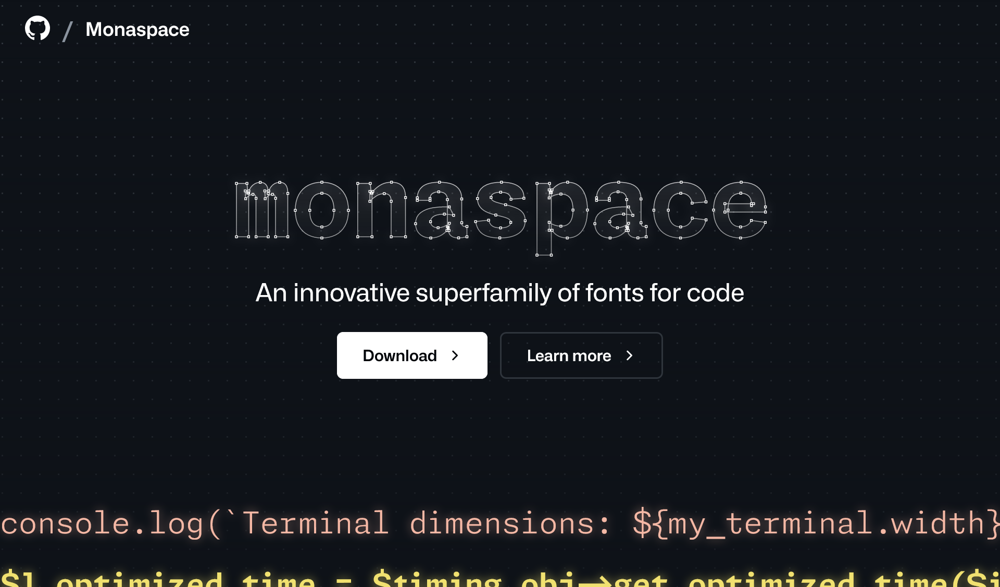
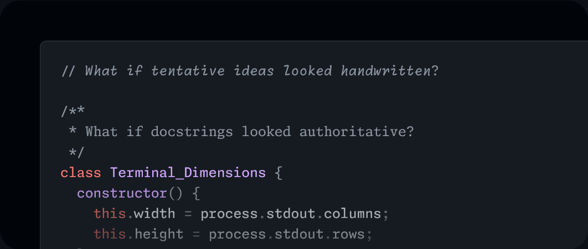
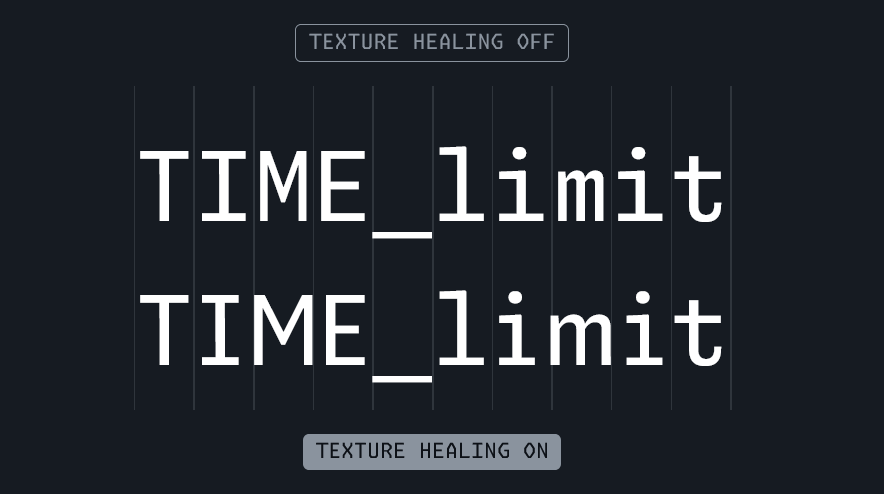
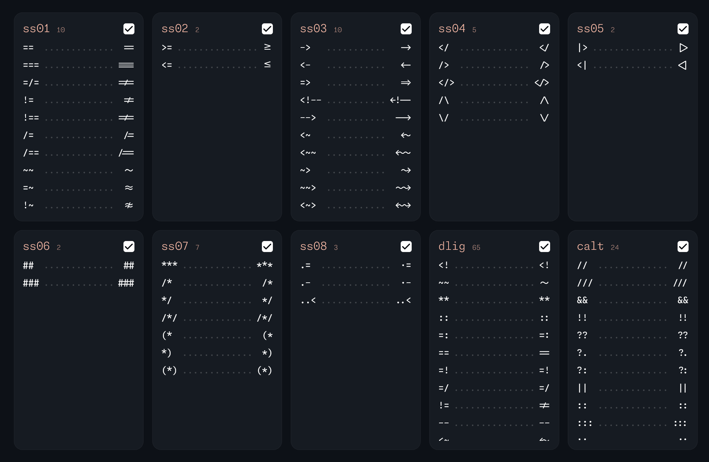

[GitHub Next](https://githubnext.com/)が、「An innovative superfamily of fonts for code（コード用フォントの革新的なスーパーファミリー）」と主張する、新しいコーディングフォント「[Monaspace](https://monaspace.githubnext.com/)」を発表しました。GitHub Nextはソフトウェア開発の未来を探求する、GitHubの研究チームです。


*[Monaspace公式サイト](https://monaspace.githubnext.com/)より*

Monaspaceファミリーは等幅フォントで、それぞれ見た目の異なる次の5つのフォントで構成されています。

- Neon
- Argon
- Xenon
- Radon
- Krypton

## Monaspaceの特徴

### 混植対応

Monaspaceファミリーのフォント同士は、互いに自然に混植できるように設計されています。


*[Monaspace公式サイト](https://monaspace.githubnext.com/)より*

通常、等幅フォントはそれぞれ異なるメトリックを使用するため、複数のフォントを混在させることができません。

しかし、Monaspace同士は自然に組み合わせて使用できるようになっています。

### テクスチャーヒーリング

等幅フォントには、テキストの一部の領域が密になっていたり、逆に空白があったりするという問題があります。これは、幅の狭い文字も広い文字も、すべてを同じ幅で表示するという等幅フォントの性質上、避けられない問題です。

Monaspaceでは、等幅フォントの密度を均一にし、プロポーショナルフォントに近づける新しい技術「テクスチャーヒーリング」を採用しています。

画像は、テクスチャーヒーリングが無効な場合（上）と有効な場合（下）の比較です。テクスチャーヒーリングを有効にすると、``i``がより引き締まった見た目になり、``m``がよりゆったりとした見た目になっています。


*[Monaspace公式サイト](https://monaspace.githubnext.com/)より*

通常、等幅フォントでは、すべての文字を同じ幅にするために``1``や``i``は余白が多く見え、``m``や``w``などはゆがんで見えます。

テクスチャーヒーリングは、筆記体フォントやアラビア語のフォントで利用されている、OpenTypeの「contextual alternates」機能を使用しています。幅の狭い文字は空白の一部を譲るバージョンと交換され、幅の広い文字は枠ぎりぎりまで広がるバージョンと交換されます。

VS Codeでテクスチャーヒーリングとコード合字（リガチャ）を有効にするには、``settings.json``に次の設定を追加します。

```json
  "editor.fontLigatures": true,
```

### 可変フォント（バリアブルフォント）対応

Monaspaceは、可変フォント（バリアブルフォント）に対応しています。可変フォントは、フォントの太さや幅、傾きなどを、1つのフォントファイルで表現できる技術です。

Monaspaceでは、フォントの太さを200〜800、傾斜軸を0°〜-11°、幅を100〜125の範囲で、任意の値に設定できます。

### コード合字（リガチャ）

Monaspaceでは、コード合字（リガチャ）をサポートしています。合字は、特定の文字の組み合わせのときに、より見やすい見た目に置き換える機能です。


*[Monaspace公式サイト](https://monaspace.githubnext.com/)より*

Monaspaceでは、合字を細かく調整できるようになっています。どの合字を有効にして、どの合字を無効にするかの設定のコードは、[Monaspace公式サイト](https://monaspace.githubnext.com/)で取得できます。使いたい合字にチェックを入れて、生成されたコードをコピーしてください。

### オープンソース

Monaspaceは、オープンソースです。GitHubでソースコードが[公開](https://github.com/githubnext/monaspace)されています。

## ダウンロード方法

Monaspaceフォントファミリーは、公式GitHubリポジトリーからダウンロードできます。

- [githubnext/monaspace: An innovative superfamily of fonts for code](https://github.com/githubnext/monaspace#monaspace)

## VS Codeでの設定方法

VS CodeでMonaspaceを使用するには、次の手順で設定します。

まず、Monaspaceをダウンロードし、インストールします。

次に、VS Codeの設定を変更します。たとえば、英数記号にMonaspace Neonを使用し、それ以外にはNoto Sans JPを使いたい場合、次のように設定します。

```json
    "editor.fontFamily": "'Monaspace Neon Var', 'Noto Sans JP', monospace",
```

これは、可変フォントを利用した場合の設定です。可変フォントではなく通常のフォント（.otf形式）をインストールした場合は、次のようになります。

```json
    "editor.fontFamily": "'Monaspace Neon', 'Noto Sans JP', monospace",
```

また、テクスチャーヒーリングとコード合字（リガチャ）を有効にするには、``settings.json``に次の設定を追加します。

```json
  "editor.fontLigatures": true,
```

フォントの太さを変更したい場合は、次の設定を追加します。私のお気に入りは360ですが、この数字を大きくすると太く、小さくすると細くなります。

```json
    "editor.fontWeight": "360",
```

:::note
VS Codeを起動している状態でフォントをインストールした場合は、VS Codeを再起動しないとフォントが反映されません。コマンドパレットから［ウィンドウの再読み込み］をするのではなく、VS Codeをきちんと終了してから再起動してください。
:::

## まとめ

GitHub Nextが開発した、新しいコーディングフォント「Monaspace」を紹介しました。

Monaspaceは、等幅フォントの問題を解決するために、新しい技術を採用しています。混植対応、テクスチャーヒーリング、可変フォント対応、コード合字（リガチャ）など、コーディングフォントとしては画期的な機能を備えています。

Monaspaceは、オープンソースで公開されています。GitHubからダウンロードできるので、興味のある方はぜひチェックしてみてください。
