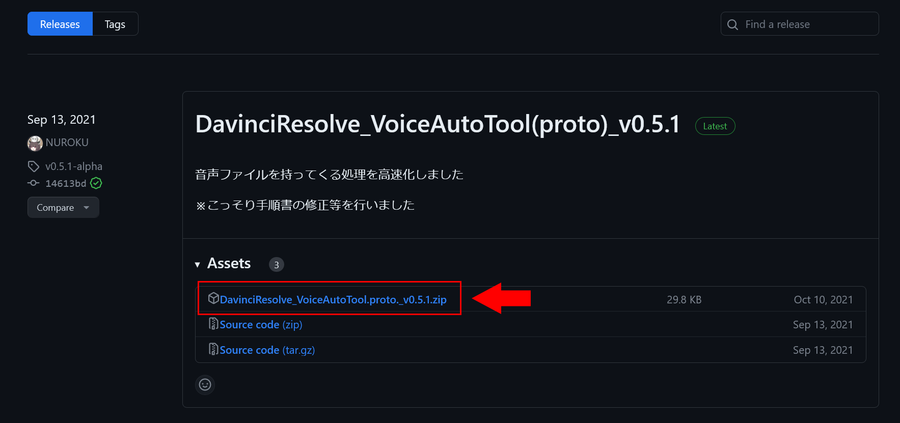
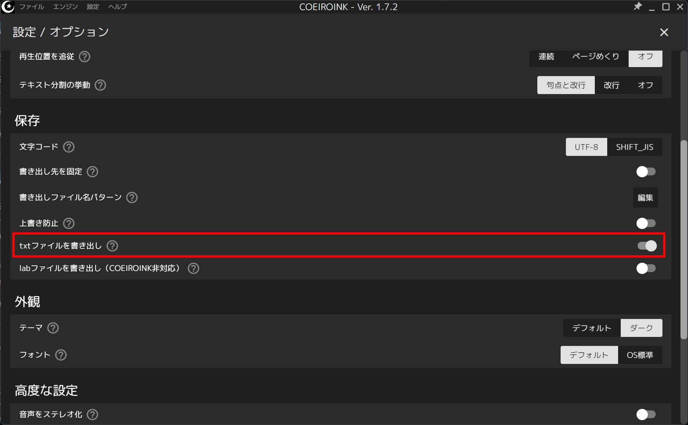
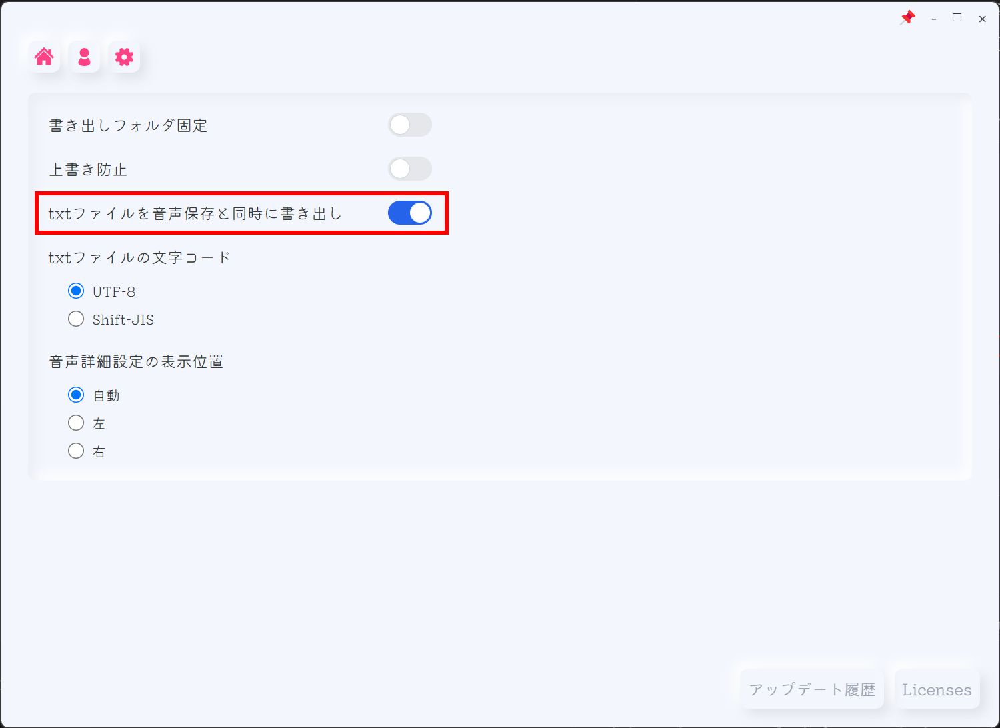

この記事では、DaVinci ResolveでVOICEVOXやCOEIROINKを使った動画編集を効率化できる「VoiceAutoTool」というスクリプトを紹介します。このスクリプトを使うと、音声の配置や字幕の入力を自動化できます。

## DaVinci Resolveとは？

[DaVinci Resolve](https://www.blackmagicdesign.com/jp/products/davinciresolve)は、[Blackmagic Design](https://www.blackmagicdesign.com/jp/)が開発している統合型の動画編集ソフトです。編集、カラーコレクション、VFX、モーショングラフィックス、オーディオポストプロダクションなどがこれ1つでできます。基本的な機能はすべて無料で使えます。

## VOICEVOXとは？

VOICEVOXは無料の音声合成ソフトです。VOICEVOXの「ずんだもん」を使った動画は、根強い人気があります。

## VoiceAutoToolとは？

[VoiceAutoTool](https://github.com/NUROKU/DavinciResolve_VoiceAutoTool)は、DaVinci Resolveで合成音声を使った動画編集を効率化できるスクリプトです。合成音声の音声ファイルをトラックに自動で配置したり、自動で字幕を生成したりできます。

通常は[VOICEVOX](https://voicevox.hiroshiba.jp/)や[COEIROINK](https://coeiroink.com/)で合成音声を作り、それをDaVinci Resolveに読み込んで、手作業で字幕を入力する必要があります。とくに字幕の入力は、音声合成ソフトに入力したテキストをコピペするだけとはいえ、数が多ければ大変です。また、音声とタイミングを合わせる必要があります。

VoiceAutoToolを使うとこれらの作業を自動化し、効率的に素早く動画を作れます。

## VoiceAutoToolのインストール方法

:::note info
この記事では、Windowsでのインストール方法を説明します。VoiceAutoToolがMacでも動作するかどうかは不明です。
:::

VoiceAutoToolをインストールするにはまず、配布ページにアクセスします。

- [GitHub - NUROKU/DavinciResolve_VoiceAutoTool](https://github.com/NUROKU/DavinciResolve_VoiceAutoTool/releases)

配布ページにアクセスしたら、［``DavinciResolve_VoiceAutoTool.proto._v0.5.1.zip``］をクリックしてダウンロードし、解凍します。

*[https://github.com/NUROKU/DavinciResolve_VoiceAutoTool/releases](https://github.com/NUROKU/DavinciResolve_VoiceAutoTool/releases)より*

解凍したフォルダーのうち、``VoiceAutoTool``フォルダーを、フォルダーのまま、``C:\ProgramData\Blackmagic Design\DaVinci Resolve\Fusion\Scripts\Comp``にコピーします。

次に、``Lua``フォルダーを同様に、``C:\ProgramData\Blackmagic Design\DaVinci Resolve\Fusion\Modules``にコピーします。

最後に、``VoiceAutoTool_Config``フォルダーを``C:\ProgramData\Blackmagic Design\DaVinci Resolve\Fusion\Config``にコピーします。

これで、VoiceAutoToolのインストールは完了です。

## 音声合成ソフトの設定

VoiceAutoToolを使うには、音声合成ソフト側の設定が必要です。VoiceAutoToolでは、使用したい「音声ファイル」と「音声をテキスト化したテキストファイル」が同じフォルダーに入っている必要があります。また、これらは拡張子を除き、同じファイル名である必要があります。

COEIROINK v1とVOICEVOXでは、ツールバーの［設定］>［オプション］から設定画面を開きます。［保存］セクションの［txtファイルを書き出し］をオンにします。

COEIROINK v2では、左上の歯車マークから［オプション］を開き、［txtファイルを音声保存と同時に書き出し］をオンにします。

また、COEIROINK v1、COEIROINK v2、VOICEVOXのいずれの場合でも、音声を書き出す際は繋げて書き出さずに、1つのセリフが1つの音声ファイルになるようにします。

## 使い方

VoiceAutoToolを使うには、まずDaVinci Resolveを起動し、編集したいプロジェクトを開きます。

ツールバーから、［ワークスペース］>［スクリプト］>［Comp］>［VoiceAutoTool］>［AutoTool_Config］を開きます。

VoiceAutoToolの設定画面が開いたら、［VOICEFOLDER_PATH］に音声とテキストが入ったフォルダーのパスを入力し、［保存］をクリックします。保存したら設定画面を閉じて大丈夫です。

なお、指定したフォルダーに音声合成ソフトの音声ファイルとテキストファイル以外が入っていると、字幕を生成するときにエラーになります。**音声ファイルとテキストファイルだけが入っている**状態にしてください。

### 音声の自動配置

音声ファイルをタイムラインに自動で配置するには、ツールバーから、［ワークスペース］>［スクリプト］>［Comp］>［VoiceAutoTool］>［AutoTool_MoveSound］をクリックします。

すると、タイムラインのA1（1番上の音声トラック）に音声ファイルが自動で配置されます。配置するトラックは選べないようなので、自動で配置されたあとに手動で移動する必要があります。

### 字幕の自動生成

まず、ツールバーから［ワークスペース］>［スクリプト］>［Comp］>［VoiceAutoTool］>［AutoTool_Config］を開きます。

設定の［INDEX_AUDIO］に、音声合成ソフトの音声ファイルが配置されているトラックの番号を入力します。A1トラックなら1、A2トラックなら2…というように入力します。入力したら［保存］をクリックして設定画面を閉じます。

字幕を自動で生成するには、ツールバーから、［ワークスペース］>［スクリプト］>［Comp］>［VoiceAutoTool］>［AutoTool_CreateSrt］をクリックします。

しばらく待つと、メディアプールに字幕のsrtファイルが生成されます。生成されたsrtファイルをタイムラインにドラッグ＆ドロップすると、生成された字幕を利用できます。

5分の長さでセリフが31個ある動画で試したところ、字幕の生成には5分程度かかりました。パソコンの性能や動画の長さ、セリフの数によっては、さらに時間がかかる可能性があります。しかし、手作業で字幕を入力するよりはずっと早いです。待っている間に別の作業ができますし。

なお、字幕はsrt形式でしか生成できないようです。VoiceAutoToolと同じ方が開発した「[VoiceAutoTools_python](https://github.com/NUROKU/DavinciResolve_VoiceAutoTools_python)」では、Text+形式で字幕を作れるようですが、こちらは試していません。

## まとめ

この記事では、DaVinci Resolveで合成音声を使った動画編集を効率化できる「VoiceAutoTool」というスクリプトを紹介しました。このスクリプトを使うと、音声の配置や字幕の入力を自動化できます。
